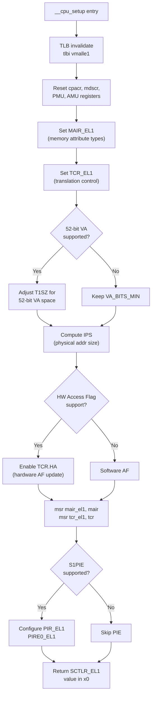

# Phase 3: CPU Setup — `__cpu_setup`

**Source:** `arch/arm64/mm/proc.S` starting at line 483

## What Happens

`__cpu_setup` configures the CPU's MMU-related control registers **without actually turning the MMU on**. It sets up the translation scheme so that when `__enable_mmu` later writes `SCTLR_EL1`, everything is already in place.

Called from `primary_entry` (head.S line 128):
```asm
bl  __cpu_setup          ; initialise processor
b   __primary_switch     ; → enable MMU
```

## Registers Configured

| Register | Purpose | Set By |
|----------|---------|--------|
| `MAIR_EL1` | Defines memory attribute types (Normal, Device, etc.) | `__cpu_setup` |
| `TCR_EL1` | Controls translation: page size, VA bits, cacheability | `__cpu_setup` |
| `TCR2_EL1` | Extended translation control (if supported) | `__cpu_setup` |
| `PIR_EL1` / `PIRE0_EL1` | Permission Indirection (if S1PIE supported) | `__cpu_setup` |
| `SCTLR_EL1` | System control (MMU enable, cache enable) | **returned in `x0`**, written later |

## Code Overview

```asm
SYM_FUNC_START(__cpu_setup)
    tlbi  vmalle1            ; Invalidate entire TLB
    dsb   nsh                ; Wait for TLB invalidation

    msr   cpacr_el1, xzr     ; Reset coprocessor access
    ...                       ; Reset debug/PMU registers

    ; --- Set default register values ---
    mov_q mair, MAIR_EL1_SET
    mov_q tcr, TCR_T0SZ(...) | TCR_T1SZ(...) | TCR_CACHE_FLAGS | ...
    mov   tcr2, xzr

    ; --- Adjust TCR for hardware features ---
    ; 52-bit VA, IPS, HAFDBS, etc.
    ...

    msr   mair_el1, mair     ; Write MAIR
    msr   tcr_el1, tcr       ; Write TCR

    ; --- PIE (Permission Indirection) if supported ---
    ...

    ; --- Return SCTLR value ---
    mov_q x0, INIT_SCTLR_EL1_MMU_ON
    ret                       ; x0 = desired SCTLR_EL1
SYM_FUNC_END(__cpu_setup)
```

## Flow Diagram



## Detailed Sub-Documents

| Document | Covers |
|----------|--------|
| [01_TCR_EL1.md](01_TCR_EL1.md) | Translation Control Register — all fields |
| [02_MAIR_EL1.md](02_MAIR_EL1.md) | Memory Attribute Indirection Register — attribute encoding |

## Key Takeaway

`__cpu_setup` tells the MMU hardware "here's how to translate addresses" — page size, virtual address width, physical address range, cache attributes for page table walks, etc. But the MMU stays **off**. The actual enable happens in `__enable_mmu` (Phase 4). The desired `SCTLR_EL1` value (with MMU-enable bit set) is returned in `x0` for `__enable_mmu` to write.
