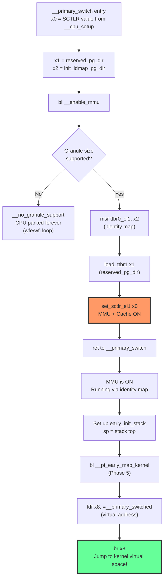

# Phase 4: Enable MMU — `__enable_mmu` & `__primary_switch`

**Source:** `arch/arm64/kernel/head.S` lines 445–473 (`__enable_mmu`), 508–523 (`__primary_switch`)

## What Happens

After `__cpu_setup` configured the translation control registers (TCR, MAIR) and returned the desired `SCTLR_EL1` value in `x0`, execution flows to `__primary_switch`, which calls `__enable_mmu`. This is the **critical transition** from physical addressing to virtual addressing.

## Call Chain

```
primary_entry
  └── __cpu_setup            ; returns SCTLR_EL1 in x0
  └── __primary_switch       ; orchestrates the MMU enable
        ├── __enable_mmu     ; writes TTBR0/TTBR1, sets SCTLR_EL1.M
        ├── __pi_early_map_kernel  ; maps the kernel (Phase 5)
        └── br __primary_switched  ; jumps to virtual address (Phase 6)
```

## `__primary_switch` (the orchestrator)

```asm
SYM_FUNC_START_LOCAL(__primary_switch)
    adrp    x1, reserved_pg_dir          ; x1 = TTBR1 (empty, placeholder)
    adrp    x2, __pi_init_idmap_pg_dir   ; x2 = TTBR0 (identity map)
    bl      __enable_mmu                 ; TURN ON THE MMU
    ;; --- MMU is now ON, running via identity map (TTBR0) ---

    adrp    x1, early_init_stack         ; set up a real stack
    mov     sp, x1
    mov     x29, xzr                     ; frame pointer = NULL
    mov     x0, x20                      ; boot status
    mov     x1, x21                      ; FDT pointer
    bl      __pi_early_map_kernel        ; map kernel into init_pg_dir

    ldr     x8, =__primary_switched      ; load virtual address
    adrp    x0, KERNEL_START             ; __pa(KERNEL_START)
    br      x8                           ; jump to kernel virtual address!
SYM_FUNC_END(__primary_switch)
```

## `__enable_mmu` (the actual enable)

```asm
SYM_FUNC_START(__enable_mmu)
    ; 1. Verify page granule is supported
    mrs     x3, ID_AA64MMFR0_EL1
    ubfx    x3, x3, #ID_AA64MMFR0_EL1_TGRAN_SHIFT, 4
    cmp     x3, #ID_AA64MMFR0_EL1_TGRAN_SUPPORTED_MIN
    b.lt    __no_granule_support          ; park CPU if unsupported
    cmp     x3, #ID_AA64MMFR0_EL1_TGRAN_SUPPORTED_MAX
    b.gt    __no_granule_support

    ; 2. Load page table base registers
    phys_to_ttbr x2, x2
    msr     ttbr0_el1, x2                ; identity map page table
    load_ttbr1 x1, x1, x3               ; kernel page table

    ; 3. Enable MMU
    set_sctlr_el1 x0                     ; write SCTLR_EL1 (M=1, C=1, I=1)

    ret                                  ; return still works because
                                         ; we're identity-mapped!
SYM_FUNC_END(__enable_mmu)
```

## Why This Works: The Identity Map Trick

```
BEFORE __enable_mmu:
  PC = 0x4080_0100          (physical)
  Instructions at 0x4080_0100 (physical memory)

__enable_mmu writes SCTLR_EL1.M = 1

AFTER __enable_mmu:
  PC = 0x4080_0100          (now treated as VIRTUAL)
  TTBR0 translates: VA 0x4080_0100 → PA 0x4080_0100  ✓ SAME!
  Execution continues seamlessly
```

The identity map ensures `VA == PA` for the boot code region. Without this, the CPU would fetch the next instruction from a virtual address that doesn't map to the right physical location → immediate translation fault.

## Flow Diagram



## TTBR0 vs TTBR1

| Register | Points To | VA Range | Purpose |
|----------|-----------|----------|---------|
| `TTBR0_EL1` | `init_idmap_pg_dir` | `0x0000_...` (low) | Identity map: VA=PA for boot code |
| `TTBR1_EL1` | `reserved_pg_dir` (initially) | `0xFFFF_...` (high) | Kernel space (empty at this point) |

After `__pi_early_map_kernel` runs, TTBR1 is switched to `init_pg_dir` with the kernel mapped at its link address (`0xFFFF_8000_...`).

## Detailed Sub-Documents

| Document | Covers |
|----------|--------|
| [01_TTBR_Setup.md](01_TTBR_Setup.md) | TTBR0/TTBR1 configuration and page table base registers |
| [02_Init_Kernel_EL.md](02_Init_Kernel_EL.md) | Exception level initialization (EL2→EL1 transition) |

## Key Takeaway

`__enable_mmu` is deceptively simple — just write three registers. The complexity is in the **setup** (Phases 1–3) that makes this safe, and the **identity map** that prevents the PC from becoming invalid the instant the MMU turns on. After this point, the CPU sees virtual addresses, and the kernel must maintain page tables to keep running.
