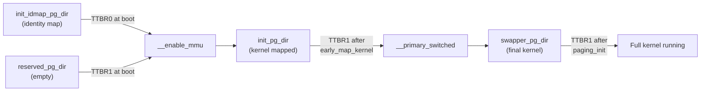

# TTBR0 & TTBR1 — Translation Table Base Registers

**Source:** `arch/arm64/kernel/head.S` lines 460–468

## Purpose

ARM64 has **two** page table base registers, each pointing to an independent set of page tables that cover different halves of the virtual address space:

- **TTBR0_EL1**: Translates the **lower** VA range — used for user-space (and identity map during boot)
- **TTBR1_EL1**: Translates the **upper** VA range — used for the kernel

## Virtual Address Space Split

```
64-bit Virtual Address Space:

0x0000_0000_0000_0000  ┬──────────────────────┐
                       │    TTBR0 region       │
                       │    (user space)        │
0x0000_FFFF_FFFF_FFFF  ┴──────────────────────┘
                           ↕ unmapped gap
                       (fault on access)
0xFFFF_0000_0000_0000  ┬──────────────────────┐
                       │    TTBR1 region       │
                       │    (kernel space)      │
0xFFFF_FFFF_FFFF_FFFF  ┴──────────────────────┘

Selection rule:
  VA[63] == 0  →  Use TTBR0_EL1
  VA[63] == 1  →  Use TTBR1_EL1
```

The hardware selects which TTBR to use based on the top bit(s) of the virtual address. No software intervention needed.

## Boot-Time TTBR Configuration

### At `__enable_mmu`

```asm
msr  ttbr0_el1, x2    ; x2 = init_idmap_pg_dir (identity map)
load_ttbr1 x1, x1, x3 ; x1 = reserved_pg_dir (empty)
```

| Register | Value | Contents |
|----------|-------|----------|
| `TTBR0_EL1` | `init_idmap_pg_dir` | Identity map: maps boot code PA=VA |
| `TTBR1_EL1` | `reserved_pg_dir` | Empty — all accesses to 0xFFFF... fault |

### After `early_map_kernel`

TTBR1 is switched to `init_pg_dir` which maps the kernel at its linked VA:

| Register | Value | Contents |
|----------|-------|----------|
| `TTBR0_EL1` | `init_idmap_pg_dir` | Still the identity map |
| `TTBR1_EL1` | `init_pg_dir` | Kernel image mapped at 0xFFFF... |

### After `paging_init` (Phase 9)

TTBR1 is switched to the final `swapper_pg_dir`:

| Register | Value | Contents |
|----------|-------|----------|
| `TTBR0_EL1` | (per-process) | User-space page tables |
| `TTBR1_EL1` | `swapper_pg_dir` | Final kernel page tables with linear map |

## Page Table Directory Lifecycle



## TTBR Register Format

```
TTBR_EL1 (64 bits):
┌────────────────────────────────────┬──────────────┐
│     BADDR (bits 47:1)              │  CnP (bit 0) │
│     Base address of page table     │  Common not   │
│     (aligned to table size)        │  Private      │
└────────────────────────────────────┴──────────────┘
```

- **BADDR**: Physical address of the level-0 (PGD) page table. Must be naturally aligned to the table size (4KB for 4KB granule).
- **CnP**: If set, indicates the same page tables are shared across CPUs. Allows TLB sharing between cores.

The `phys_to_ttbr` macro converts a raw physical address to the TTBR format.

## Why Two TTBRs?

The two-TTBR design provides **hardware-enforced kernel/user separation**:

1. **No TLB flushes on syscall**: When transitioning from user to kernel mode, the kernel's page tables (TTBR1) are always active — no need to switch page tables.

2. **Per-process isolation**: On context switch, only TTBR0 changes (to the new process's page tables). TTBR1 (kernel) stays the same.

3. **Simple address check**: `VA[63] == 1` means kernel; hardware does this check in zero cycles.

4. **KPTI (Meltdown mitigation)**: TTBR0 can be loaded with a minimal "trampoline" page table that maps only the kernel entry/exit code, reducing kernel exposure to speculative reads.

## Key Takeaway

TTBR0 and TTBR1 divide the virtual address space in half. During boot, TTBR0 holds the identity map (making the MMU enable safe) and TTBR1 starts empty, then gets populated with kernel mappings. The page table backing TTBR1 evolves through three stages: `reserved_pg_dir` → `init_pg_dir` → `swapper_pg_dir`.
