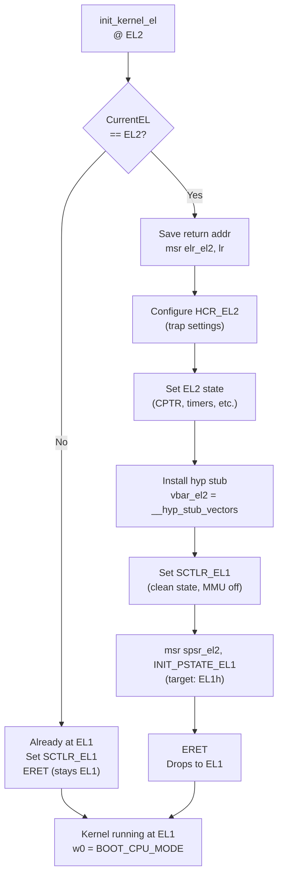

# Init Kernel EL — Exception Level Transition

**Source:** `arch/arm64/kernel/head.S` lines 262–340 (`init_kernel_el`)

## Purpose

ARM64 CPUs support multiple Exception Levels (privilege levels). The bootloader may start the kernel at EL2 (hypervisor) or EL1 (kernel). `init_kernel_el` normalizes the execution state so the kernel ends up running at EL1 in a known configuration.

## Exception Levels

```
EL3  ─── Secure Monitor (firmware, e.g., ARM Trusted Firmware)
EL2  ─── Hypervisor     (KVM, or just a stub during boot)
EL1  ─── Kernel         (where Linux runs)
EL0  ─── User space     (applications)
```

## When Called

`init_kernel_el` is called **twice** during boot:

1. **Early call** (from `record_mmu_state`, before MMU): Sets endianness, records boot EL. `x0 = 0` (MMU was off).
2. **Late call** (from `__primary_switched`, after MMU): `x0 = boot_mode` (MMU on). This call does the full EL2→EL1 drop via `finalise_el2`.

Actually, the function is called from `__primary_switched` via `set_cpu_boot_mode_flag` and `finalise_el2`. The direct `init_kernel_el` is called early from the boot path.

## Code Flow

```asm
SYM_FUNC_START(init_kernel_el)
    mrs     x1, CurrentEL
    cmp     x1, #CurrentEL_EL2
    b.eq    init_el2            ; booted at EL2

init_el1:
    ; Already at EL1 — just set clean state
    mov_q   x0, INIT_SCTLR_EL1_MMU_OFF
    msr     sctlr_el1, x0      ; known SCTLR state
    isb
    mov     w0, #BOOT_CPU_MODE_EL1
    eret                         ; "return" to EL1

init_el2:
    ; At EL2 — configure EL2 then drop to EL1
    msr     elr_el2, lr         ; return address for ERET

    ; Clean hyp code from cache if MMU was on
    cbz     x0, 0f
    ; ... dcache_clean_poc ...
    msr     sctlr_el2, INIT_SCTLR_EL2_MMU_OFF
0:
    ; Configure EL2 state
    init_el2_hcr                ; HCR_EL2: trap config
    init_el2_state              ; CPTR, CNTHCTL, etc.

    ; Install hypervisor stub vectors
    adr_l   x0, __hyp_stub_vectors
    msr     vbar_el2, x0

    ; Set clean SCTLR_EL1
    mov_q   x1, INIT_SCTLR_EL1_MMU_OFF
    msr     sctlr_el1, x1

    ; Prepare ERET to EL1
    mov     x0, #INIT_PSTATE_EL1
    msr     spsr_el2, x0        ; target EL1h mode
    mov     w0, #BOOT_CPU_MODE_EL2
    eret                         ; drop from EL2 → EL1
SYM_FUNC_END(init_kernel_el)
```

## EL2 → EL1 Transition via ERET



## Key Registers Configured

| Register | Set To | Purpose |
|----------|--------|---------|
| `HCR_EL2` | `HCR_HOST_NVHE_FLAGS` | Configures which operations trap to EL2 |
| `VBAR_EL2` | `__hyp_stub_vectors` | Minimal hypervisor vectors (for later KVM use) |
| `SCTLR_EL1` | `INIT_SCTLR_EL1_MMU_OFF` | Clean EL1 state with MMU disabled |
| `SPSR_EL2` | `INIT_PSTATE_EL1` | Target state after ERET (EL1h, interrupts masked) |
| `ELR_EL2` | `lr` | Address to resume at after ERET |

## VHE (Virtual Host Extensions)

If E2H is set in HCR_EL2, the CPU supports VHE — the kernel runs at EL2 but uses EL1 register aliases. In this case:
- `SCTLR_EL12` is used instead of `SCTLR_EL1`
- `BOOT_CPU_FLAG_E2H` is set in the boot mode flags
- The kernel effectively runs at EL2 while thinking it's at EL1

## Boot Mode Tracking

The return value `w0` (stored in `x20` by `primary_entry`) records how the CPU booted:

```c
#define BOOT_CPU_MODE_EL1  0x0e11
#define BOOT_CPU_MODE_EL2  0x0e12
#define BOOT_CPU_FLAG_E2H  (1 << 32)  // in upper 32 bits of x0
```

This is used later by `finalise_el2` (called from `__primary_switched`) to complete the EL2 configuration if the kernel booted at EL2.

## Key Takeaway

`init_kernel_el` ensures the kernel starts at EL1 in a clean, known state regardless of what the bootloader did. If the CPU entered at EL2, it configures minimal EL2 trapping infrastructure (the "hyp stub") and uses `ERET` to drop to EL1. The hyp stub remains available for later KVM use.
