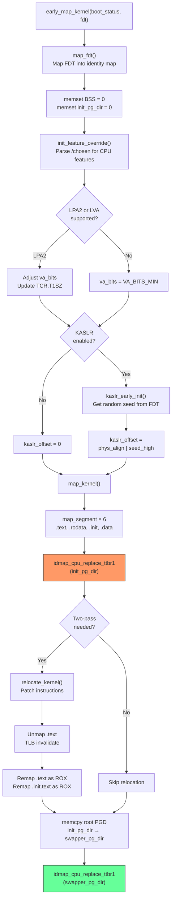

# Phase 5: Map Kernel — `early_map_kernel` & `map_kernel`

**Source:** `arch/arm64/kernel/pi/map_kernel.c`

## What Happens

After `__enable_mmu` (Phase 4), the CPU is running with the MMU on via the identity map (TTBR0). The kernel image is not yet mapped at its proper virtual address (`0xFFFF_8000_...`). `early_map_kernel` creates page table entries in `init_pg_dir` to map the kernel at its link address, applies KASLR randomization, and switches TTBR1 to `init_pg_dir`.

## Call Chain

```
__primary_switch
  └── __enable_mmu           ; MMU on, identity mapped via TTBR0
  └── __pi_early_map_kernel  ; ← THIS PHASE
        ├── map_fdt()         ; Map FDT into identity map
        ├── memset BSS        ; Clear BSS + init_pg_dir
        ├── init_feature_override()  ; Parse CPU overrides
        ├── kaslr_early_init()       ; Generate KASLR offset
        ├── remap_idmap_for_lpa2()   ; (if LPA2)
        └── map_kernel()
              ├── map_segment() ×6   ; Map .text, .rodata, .init, .data
              ├── idmap_cpu_replace_ttbr1(init_pg_dir)
              ├── relocate_kernel()  ; Apply relocations (if KASLR)
              ├── remap .text as ROX ; Two-pass: RW → ROX
              ├── memcpy → swapper_pg_dir  ; Copy root PGD
              └── idmap_cpu_replace_ttbr1(swapper_pg_dir)
```

## Kernel Segments Mapped

`map_kernel` creates 6 segment mappings in `init_pg_dir`:

| Segment | Range | Protection | Contiguous? |
|---------|-------|------------|-------------|
| `.head.text` | `_text` → `_stext` | `PAGE_KERNEL` (RW, NX) | No |
| `.text` | `_stext` → `_etext` | `PAGE_KERNEL_ROX` (RO, exec) | Yes (if !twopass) |
| `.rodata` | `__start_rodata` → `__inittext_begin` | `PAGE_KERNEL` (RW, NX) | No |
| `.init.text` | `__inittext_begin` → `__inittext_end` | `PAGE_KERNEL_ROX` | No |
| `.init.data` | `__initdata_begin` → `__initdata_end` | `PAGE_KERNEL` (RW, NX) | No |
| `.data`+`.bss` | `_data` → `_end` | `PAGE_KERNEL` (RW, NX) | Yes |

## Two-Pass Mapping

When `CONFIG_RELOCATABLE` is enabled (or SCS patching is needed):

**Pass 1**: Map everything as `PAGE_KERNEL` (RW) — allows relocation writes:
```
.text mapped as RW → relocate_kernel() patches instructions in place
```

**Pass 2**: Remap `.text` and `.init.text` as `PAGE_KERNEL_ROX` (read-only, executable):
```
Unmap .text → TLB invalidate → remap as ROX
```

This avoids having to allocate new page table pages for the second pass — the existing tables are reused.

## Flow Diagram



## KASLR (Kernel Address Space Layout Randomization)

```c
kaslr_offset |= kaslr_seed & ~(MIN_KIMG_ALIGN - 1);
va_base = KIMAGE_VADDR + kaslr_offset;
```

- The low bits of `kaslr_offset` come from the physical placement (to maintain 2MB alignment for block descriptors)
- The high bits come from the FDT's `/chosen/kaslr-seed` property
- The result shifts the kernel's virtual address by a random amount

## Page Table Directory Transition

```
BEFORE early_map_kernel:
  TTBR1 → reserved_pg_dir (empty, all access faults)

DURING map_kernel (first switch):
  TTBR1 → init_pg_dir (kernel image mapped)

AFTER map_kernel (final switch):
  TTBR1 → swapper_pg_dir (copy of init_pg_dir root PGD)
```

Note: `swapper_pg_dir` gets only the **root page** (PGD level) copied. The lower-level tables (PUD, PMD, PTE) are shared with `init_pg_dir` — they're not copied. This means `swapper_pg_dir` and `init_pg_dir` share the same physical page tables below the PGD level.

## Detailed Sub-Documents

| Document | Covers |
|----------|--------|
| [01_Early_Map_Kernel.md](01_Early_Map_Kernel.md) | `early_map_kernel()` — the entry point with KASLR and feature detection |
| [02_Map_Kernel_Segments.md](02_Map_Kernel_Segments.md) | `map_kernel()` — segment mapping, two-pass, and the PGD copy |
| [03_KASLR.md](03_KASLR.md) | Kernel Address Space Layout Randomization |

## Key Takeaway

`early_map_kernel` bridges the gap between "running on identity map only" and "running at the kernel's proper virtual address." It creates the first real kernel page tables in `init_pg_dir`, handles KASLR randomization, applies relocations, sets proper permissions (ROX for text, RW for data), and finally installs `swapper_pg_dir` as the kernel's TTBR1. After this, `__primary_switch` can jump to `__primary_switched` at a kernel virtual address.
