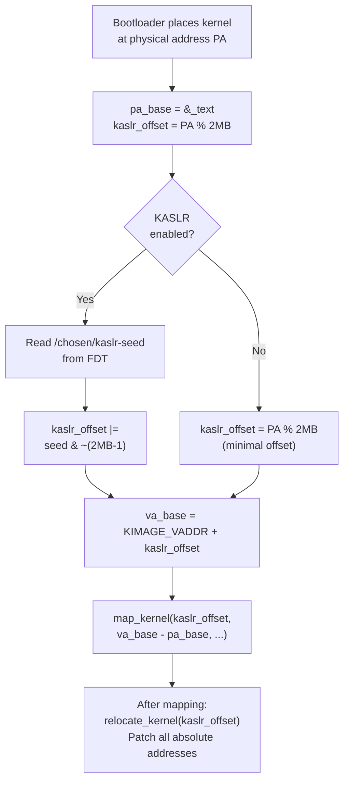

# KASLR — Kernel Address Space Layout Randomization

**Source:** `arch/arm64/kernel/pi/map_kernel.c` lines 260–277, `arch/arm64/kernel/pi/kaslr_early.c`

## Purpose

KASLR randomizes the virtual address at which the kernel is loaded, making it harder for attackers to predict kernel code and data locations. On ARM64, the physical placement is decided by the bootloader, but the **virtual placement** is randomized by the kernel itself during early boot.

## How the Offset is Computed

```c
u64 pa_base = (u64)&_text;
u64 kaslr_offset = pa_base % MIN_KIMG_ALIGN;  // low bits from physical

if (IS_ENABLED(CONFIG_RANDOMIZE_BASE)) {
    u64 kaslr_seed = kaslr_early_init(fdt_mapped, chosen);
    kaslr_offset |= kaslr_seed & ~(MIN_KIMG_ALIGN - 1);  // high bits from seed
}

va_base = KIMAGE_VADDR + kaslr_offset;
```

### Two Sources of Randomness

```
kaslr_offset:
┌────────────────────────────────┬───────────────────────┐
│  High bits: from kaslr_seed    │  Low bits: from PA    │
│  (random, from FDT or RNG)     │  (pa_base % 2MB)      │
└────────────────────────────────┴───────────────────────┘
```

- **Low bits** (`pa_base % MIN_KIMG_ALIGN`): These come from the physical placement decided by the bootloader. They ensure the virtual mapping maintains 2MB alignment compatibility for block descriptors.
- **High bits** (`kaslr_seed & ~(MIN_KIMG_ALIGN - 1)`): These come from a random seed, typically provided by the bootloader in the FDT `/chosen/kaslr-seed` property.

## The Seed

```c
// From /chosen node in FDT:
// kaslr-seed = <0xDEAD_BEEF_CAFE_1234>;  (64-bit random value)
```

The bootloader (e.g., U-Boot, UEFI) generates a random seed and places it in the device tree. The kernel reads it during `early_map_kernel`.

## Effect on Address Layout

```
Without KASLR:
  KIMAGE_VADDR = 0xFFFF_8000_1000_0000
  Kernel .text at 0xFFFF_8000_1000_0000  (always the same)

With KASLR (example):
  kaslr_offset = 0x0000_0000_3E40_0000
  Kernel .text at 0xFFFF_8000_4E40_0000  (random each boot)
```

## MIN_KIMG_ALIGN

```c
#define MIN_KIMG_ALIGN  SZ_2M  // 2MB
```

The kernel image must be aligned to 2MB to use PMD-level block descriptors (which are more efficient than 4KB PTE mappings). KASLR preserves this alignment.

## Non-Global Mappings

```c
if (kaslr_seed && kaslr_requires_kpti())
    arm64_use_ng_mappings = ng_mappings_allowed();
```

When KASLR is enabled with KPTI (Kernel Page Table Isolation, for Meltdown mitigation), kernel mappings use the **nG (non-Global) bit**. This means kernel TLB entries are tagged with the ASID and flushed on context switch, preventing user-space from speculatively accessing kernel mappings through stale TLB entries.

Some older CPUs (Cavium ThunderX) have errata that prevent using non-global mappings, so this is checked.

## Relocation

After KASLR shifts the kernel's virtual address, all absolute address references in the kernel binary need to be updated:

```c
if (IS_ENABLED(CONFIG_RELOCATABLE))
    relocate_kernel(kaslr_offset);
```

This patches:
- Function pointers
- Global variable addresses
- Jump table entries
- Any other absolute relocations recorded in the `.rela.dyn` section

## KASLR Entropy

The randomization is limited by the virtual address space layout:

```
Available space: KIMAGE_VADDR to MODULES_END
Alignment: 2MB granularity
Typical entropy: ~15-20 bits (depending on VA_BITS config)
```

## Diagram



## Key Takeaway

KASLR on ARM64 is a first-class feature baked into the early boot path. The random offset is applied before any kernel page tables are created, so the kernel is mapped at its randomized address from the start. The two-pass mapping in `map_kernel()` exists partly to support this — code must be writable to apply relocations before being locked down as read-only+executable.
