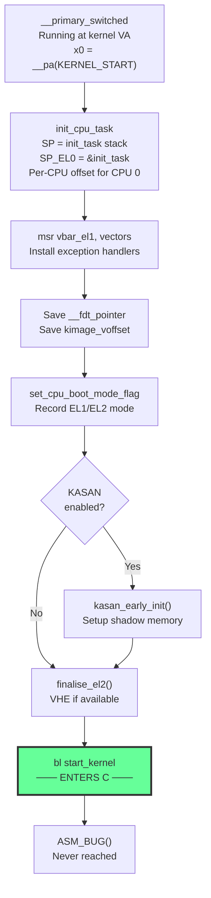

# Phase 6: `__primary_switched` — Transition to C

**Source:** `arch/arm64/kernel/head.S` lines 220–248

## What Happens

`__primary_switched` is the **first code to run at the kernel's proper virtual address**. It sets up the C runtime environment (stack, task struct, per-CPU data, exception vectors) and then calls `start_kernel()` — the C entry point of the entire Linux kernel.

## Context When Entered

| State | Value |
|-------|-------|
| MMU | ON |
| TTBR1 | `swapper_pg_dir` (kernel mapped at link address) |
| TTBR0 | `init_idmap_pg_dir` (identity map, still active) |
| PC | Kernel virtual address (0xFFFF...) |
| `x0` | `__pa(KERNEL_START)` — physical address of kernel |
| `x20` | Boot CPU mode (EL1 or EL2) |
| `x21` | FDT physical address |
| Stack | `early_init_stack` (from `__primary_switch`) |

## Code Walkthrough

### 1. Initialize CPU Task

```asm
adr_l   x4, init_task
init_cpu_task x4, x5, x6
```

The `init_cpu_task` macro:
- Sets `SP_EL0 = &init_task` (current task pointer)
- Sets `SP = init_task.stack + THREAD_SIZE - PT_REGS_SIZE` (kernel stack top, leaving room for `pt_regs`)
- Initializes the stack frame with a terminal frame marker
- Loads the Shadow Call Stack (SCS) pointer
- Sets the per-CPU offset for CPU 0

### 2. Install Exception Vectors

```asm
adr_l   x8, vectors
msr     vbar_el1, x8
isb
```

`VBAR_EL1` (Vector Base Address Register) is set to the kernel's exception vector table. From this point, any exception (page fault, syscall, interrupt) is handled by the kernel's vector table.

### 3. Save Global Variables

```asm
str_l   x21, __fdt_pointer, x5      // FDT physical address
adrp    x4, _text
sub     x4, x4, x0                  // _text(virtual) - _text(physical)
str_l   x4, kimage_voffset, x5      // kernel VA-to-PA offset
```

- `__fdt_pointer`: Saved so `setup_arch()` can find the device tree later
- `kimage_voffset`: The difference between kernel virtual and physical addresses. Used throughout the kernel for `__pa()` / `__va()` conversions on kernel image addresses.

### 4. Record Boot Mode

```asm
mov     x0, x20
bl      set_cpu_boot_mode_flag       // store EL1 or EL2 mode
```

### 5. KASAN Early Init (if enabled)

```asm
#if defined(CONFIG_KASAN_GENERIC) || defined(CONFIG_KASAN_SW_TAGS)
bl      kasan_early_init
#endif
```

Initializes the Kernel Address Sanitizer shadow memory mapping.

### 6. Finalize EL2

```asm
mov     x0, x20
bl      finalise_el2                 // configure VHE if possible
```

If the CPU booted at EL2 and supports VHE (Virtualization Host Extensions), this switches the kernel to run at EL2 with EL1 register aliasing.

### 7. Enter C — `start_kernel()`

```asm
bl      start_kernel
ASM_BUG()                           // should never return
```

This is the **last assembly instruction** in the normal boot path. `start_kernel()` (in `init/main.c`) takes over and never returns.

## Flow Diagram



## `init_cpu_task` Macro Detail

```asm
.macro init_cpu_task tsk, tmp1, tmp2
    msr     sp_el0, \tsk           // current = init_task

    ldr     \tmp1, [\tsk, #TSK_STACK]
    add     sp, \tmp1, #THREAD_SIZE
    sub     sp, sp, #PT_REGS_SIZE  // leave room for pt_regs at stack top

    // Create terminal stack frame
    stp     xzr, xzr, [sp, #S_STACKFRAME]
    mov     \tmp1, #FRAME_META_TYPE_FINAL
    str     \tmp1, [sp, #S_STACKFRAME_TYPE]
    add     x29, sp, #S_STACKFRAME // frame pointer

    scs_load_current               // shadow call stack

    // Per-CPU setup
    adr_l   \tmp1, __per_cpu_offset
    ldr     w\tmp2, [\tsk, #TSK_TI_CPU]
    ldr     \tmp1, [\tmp1, \tmp2, lsl #3]
    set_this_cpu_offset \tmp1      // TPIDR_EL1 = per-CPU base
.endm
```

### Stack Layout After init_cpu_task

```
init_task.stack + THREAD_SIZE:
    ┌─────────────────────┐ ← original stack top
    │     pt_regs          │ ← reserved for exception entry
    │     (sizeof pt_regs) │
    ├─────────────────────┤ ← SP after init_cpu_task
    │     stackframe       │ ← x29 points here
    │     (type = FINAL)   │
    ├─────────────────────┤
    │                     │
    │   Available stack   │
    │   (grows down)      │
    │                     │
    └─────────────────────┘ ← init_task.stack
```

## Detailed Sub-Documents

| Document | Covers |
|----------|--------|
| [01_Init_CPU_Task.md](01_Init_CPU_Task.md) | `init_cpu_task` macro — stack, per-CPU, and SCS setup |
| [02_Transition_To_C.md](02_Transition_To_C.md) | The `start_kernel()` call and what changes |

## Key Takeaway

`__primary_switched` is the bridge between assembly boot and C kernel. It sets up the minimal C runtime: a proper stack (from `init_task`), exception vectors, per-CPU data, and the virtual-to-physical offset. After this, all further initialization happens in C, starting with `start_kernel()`.
