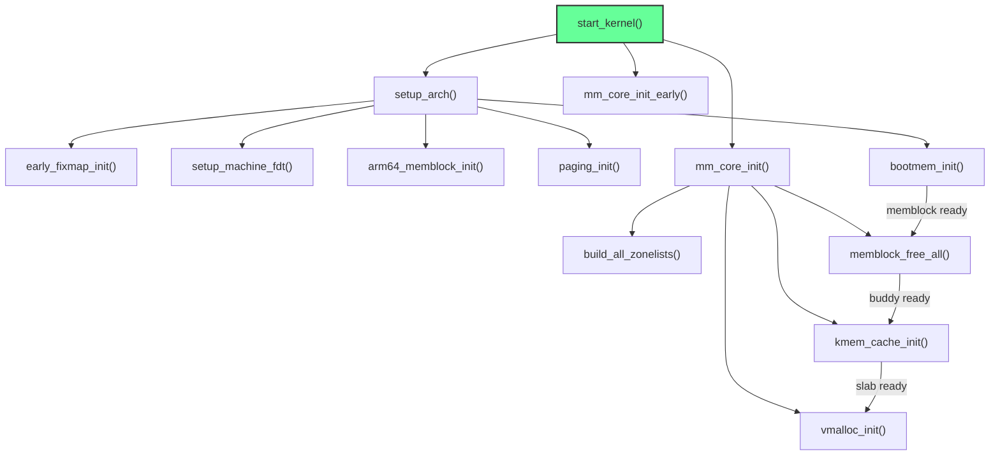

# Transition to C — `start_kernel()`

**Source:** `init/main.c`, `arch/arm64/kernel/head.S` line 247

## The Final Assembly Instruction

```asm
bl  start_kernel
ASM_BUG()           // unreachable — start_kernel never returns
```

This `bl` (branch with link) is the **last assembly instruction** in the normal boot path. From this point, everything is C.

## What Changes at This Boundary

| Aspect | Before (Assembly) | After (C) |
|--------|-------------------|-----------|
| Language | ARM64 assembly | C |
| Memory allocator | None (static pages, bump alloc) | memblock → buddy → slab |
| Page tables | `init_pg_dir`/`swapper_pg_dir` (kernel only) | Full: linear map, vmalloc, fixmap, modules |
| Task | `init_task` (manually set up) | `init_task` (full scheduler context) |
| Interrupts | Masked | Eventually enabled |
| Exception handling | `vectors` installed, but no handlers | Full fault handlers, IRQ dispatching |

## `start_kernel()` Memory-Related Calls

The key memory initialization calls in `start_kernel()` (from `init/main.c`):

```c
asmlinkage __visible __init __no_sanitize_address
__no_sanitize_thread __no_sanitize_memory
void start_kernel(void)
{
    // ... early setup ...

    setup_arch(&command_line);     // Phase 7: arch-specific memory init
                                   //   → early_fixmap_init
                                   //   → setup_machine_fdt
                                   //   → arm64_memblock_init  (Phase 8)
                                   //   → paging_init          (Phase 9)
                                   //   → bootmem_init         (Phase 10)

    mm_core_init_early();          // Early mm subsystem init

    // ... more subsystem init ...

    mm_core_init();                // Phase 11: Full mm init
                                   //   → build_all_zonelists
                                   //   → memblock_free_all    (memblock → buddy)
                                   //   → kmem_cache_init      (Phase 12: SLAB)
                                   //   → vmalloc_init         (Phase 13: vmalloc)

    // ... rest of kernel init ...
    // → rest_init() → kernel_init() → /sbin/init
}
```

## The Memory Initialization Sequence



## What `start_kernel()` Has Available

When `start_kernel()` begins executing, it has:

1. **Kernel image mapped** at its link address via `swapper_pg_dir`
2. **A stack** (`init_task.stack`)
3. **`current`** = `init_task`
4. **Per-CPU data** for CPU 0
5. **Exception vectors** installed
6. **FDT pointer** saved in `__fdt_pointer`
7. **Physical-to-virtual offset** saved in `kimage_voffset`

What it does NOT have yet:
- No dynamic memory allocator
- No linear map (only kernel image is mapped)
- No device mappings
- No interrupt handling
- No filesystem

## Key Takeaway

The `bl start_kernel` call transitions from the assembly boot world to the C kernel initialization. Everything before this point was about getting to a state where C code can run. Everything after is about building the full kernel subsystems. The memory system evolves from "kernel image only" to "full virtual memory with buddy, slab, and vmalloc" through Phases 7–13.
