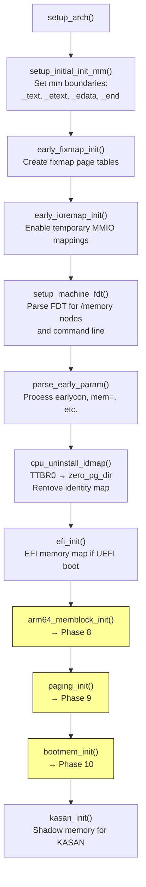

# Phase 7: `setup_arch()` — Architecture-Specific Memory Init

**Source:** `arch/arm64/kernel/setup.c` lines 282–370

## What Happens

`setup_arch()` is the ARM64-specific initialization called from `start_kernel()`. It's the **coordinator** for all architecture-specific memory setup: parsing the device tree for memory information, building the memblock allocator, creating the final page tables (linear map), and initializing the zone-based memory model.

## Call Sequence (Memory-Related)

```c
void __init setup_arch(char **cmdline_p)
{
    setup_initial_init_mm(_text, _etext, _edata, _end);

    early_fixmap_init();          // Set up fixmap page tables
    early_ioremap_init();         // Enable early MMIO mappings

    setup_machine_fdt(__fdt_pointer);  // Parse FDT, find memory

    parse_early_param();          // Process kernel command line

    cpu_uninstall_idmap();        // Remove identity map from TTBR0

    efi_init();                   // EFI memory map (if applicable)

    arm64_memblock_init();        // Phase 8: Build memblock
    paging_init();                // Phase 9: Create linear map
    bootmem_init();               // Phase 10: Zones and pages
}
```

## Flow Diagram



## Detailed Sub-Documents

| Document | Covers |
|----------|--------|
| [01_Early_Fixmap.md](01_Early_Fixmap.md) | `early_fixmap_init()` — fixmap page table setup |
| [02_Setup_Machine_FDT.md](02_Setup_Machine_FDT.md) | `setup_machine_fdt()` — FDT parsing for memory info |

## Key Steps Explained

### `setup_initial_init_mm`

```c
setup_initial_init_mm(_text, _etext, _edata, _end);
```

Sets the `init_mm` (kernel memory descriptor) boundaries:
- `start_code = _text`
- `end_code = _etext`
- `end_data = _edata`
- `brk = _end`

`init_mm` is the memory descriptor for the kernel itself, used by all kernel threads.

### `cpu_uninstall_idmap`

```c
cpu_uninstall_idmap();
```

Switches TTBR0 from the identity map to `reserved_pg_dir` (a page table that generates faults for all accesses). The identity map is no longer needed — the kernel is now running entirely through TTBR1. Setting TTBR0 to an empty table prevents speculative fetches from creating unwanted TLB entries.

### `efi_init`

If the system booted via UEFI, `efi_init()` processes the EFI memory map, which provides more precise memory region information than the device tree alone.

## Memory State at Each Point

| After... | Mapped | Allocator |
|----------|--------|-----------|
| `early_fixmap_init` | kernel image + fixmap slots | None |
| `setup_machine_fdt` | + FDT (via early ioremap) | None |
| `arm64_memblock_init` | same mappings | memblock (knows all RAM) |
| `paging_init` | + **linear map** (all RAM) | memblock |
| `bootmem_init` | same | memblock + zone/page structs ready |

## Key Takeaway

`setup_arch()` is the bridge between "just the kernel image is mapped" and "all physical RAM is mapped and managed." It orchestrates three major phases: memblock construction (Phase 8), linear map creation (Phase 9), and zone/page initialization (Phase 10). After `setup_arch()` returns, the memory subsystem has all the information it needs, but the buddy allocator isn't active yet — that happens in `mm_core_init()` (Phase 11).
