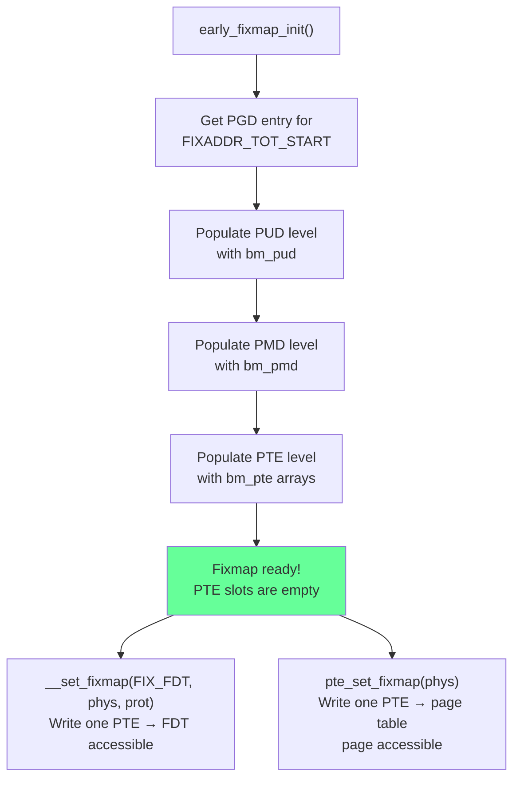

# `early_fixmap_init()` — Fixmap Page Table Setup

**Source:** `arch/arm64/mm/fixmap.c` lines 104–113

## Purpose

The fixmap is a region of **compile-time-known virtual addresses** that can be mapped to arbitrary physical addresses at runtime. `early_fixmap_init()` creates the page table infrastructure for this region, allowing the kernel to temporarily map physical pages (like the FDT, or page table pages during construction) before the full memory system is available.

## Why Fixmap Exists

At this point in boot:
- Only the kernel image is mapped (via `swapper_pg_dir`)
- There's **no dynamic allocator** and **no linear map**
- But we need to access things like the FDT (at an arbitrary physical address) or MMIO registers

The fixmap solves this by pre-building a page table hierarchy with **empty leaf (PTE) entries**. To "map" a physical page, the kernel just fills in one PTE — no allocation needed.

## How It Works

```
Kernel Virtual Address Space (high region):
                    ┌─────────────────────┐
                    │                     │
                    │   FIXADDR_TOP       │
                    ├─────────────────────┤
                    │  FIX_FDT            │ → can point to FDT physical addr
                    │  FIX_EARLYCON       │ → can point to serial port MMIO
                    │  FIX_BTMAP_*        │ → early ioremap slots (7 × 256KB)
                    │  FIX_PTE/PMD/PUD... │ → temp map page table pages
                    ├─────────────────────┤
                    │  FIXADDR_TOT_START  │
                    └─────────────────────┘
```

Each `FIX_*` index maps to a fixed virtual address:
```c
#define __fix_to_virt(x)  (FIXADDR_TOP - ((x) << PAGE_SHIFT))
```

## Static Page Tables

```c
static pte_t bm_pte[NR_BM_PTE_TABLES][PTRS_PER_PTE] __page_aligned_bss;
static pmd_t bm_pmd[PTRS_PER_PMD] __page_aligned_bss;
static pud_t bm_pud[PTRS_PER_PUD] __page_aligned_bss;
```

These are **statically allocated** in BSS — no dynamic memory needed. `early_fixmap_init()` wires them into `swapper_pg_dir`:

```c
void __init early_fixmap_init(void)
{
    unsigned long addr = FIXADDR_TOT_START;
    unsigned long end = FIXADDR_TOP;

    pgd_t *pgdp = pgd_offset_k(addr);
    p4d_t *p4dp = p4d_offset_kimg(pgdp, addr);

    early_fixmap_init_pud(p4dp, addr, end);
}
```

This walks down the page table levels, populating each with the static arrays:
```
swapper_pg_dir[PGD_index] → bm_pud → bm_pmd → bm_pte[0..N]
```

## Using the Fixmap

After `early_fixmap_init()`, any code can map a physical address into the fixmap:

```c
// Map a physical address at a fixed virtual address
void __set_fixmap(enum fixed_addresses idx, phys_addr_t phys, pgprot_t flags)
{
    pte_t *ptep = fixmap_pte(__fix_to_virt(idx));

    if (pgprot_val(flags))
        __set_pte(ptep, pfn_pte(phys >> PAGE_SHIFT, flags));
    else
        __pte_clear(&init_mm, addr, ptep);  // unmap
}
```

No allocation, no locks (at this stage) — just write one PTE.

## Fixmap Slots

| Slot | Purpose |
|------|---------|
| `FIX_FDT` | Map the Flattened Device Tree |
| `FIX_EARLYCON_MEM_BASE` | Map early console MMIO |
| `FIX_BTMAP_BEGIN..END` | 7 × 256KB early ioremap slots |
| `FIX_PTE/PMD/PUD/P4D/PGD` | Temporary mapping of page table pages during `paging_init` |
| `FIX_ENTRY_TRAMP_*` | KPTI trampoline pages |

## Used During `paging_init` (Phase 9)

The `FIX_PTE`, `FIX_PMD`, etc. slots are critical during `paging_init`:

```c
// In mmu.c: pte_set_fixmap(addr) maps a PTE page via fixmap
static inline pte_t *pte_set_fixmap(phys_addr_t addr)
{
    __set_fixmap(FIX_PTE, addr, PAGE_KERNEL);
    return (pte_t *)__fix_to_virt(FIX_PTE);
}
```

When creating the linear map, the kernel allocates physical pages for page tables via memblock, but can't access them through the linear map (which doesn't exist yet!). So it temporarily maps each page table page into the fixmap to fill it in.

## Diagram



## Key Takeaway

The fixmap is a pre-built page table with empty leaf entries. It provides a way to temporarily map arbitrary physical addresses at known virtual addresses without needing a memory allocator. It's essential for bootstrapping: the kernel uses it to read the FDT, access MMIO, and — crucially — build the very page tables that will eventually map all of physical memory.
