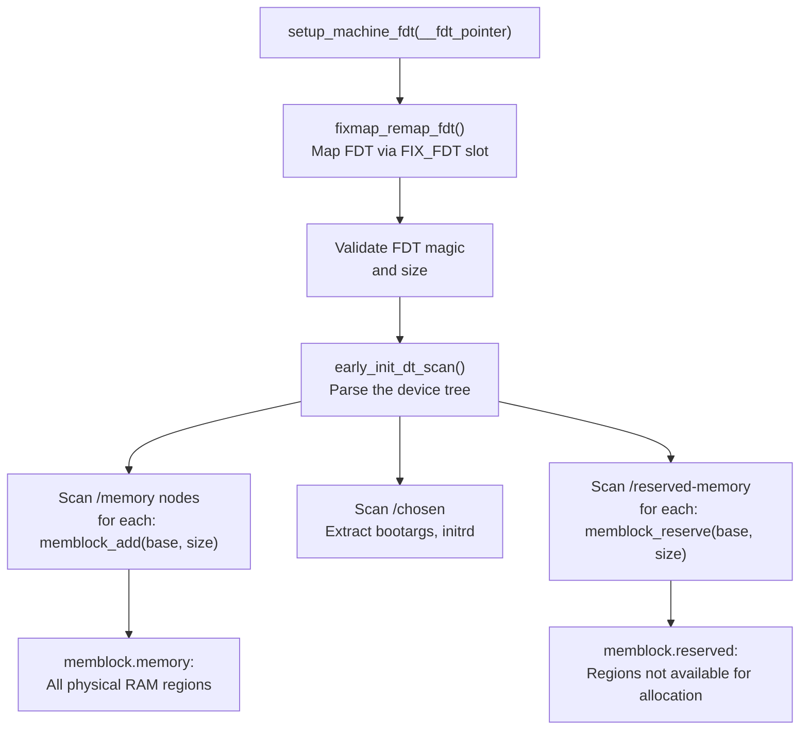

# `setup_machine_fdt()` — FDT Parsing for Memory Info

**Source:** `arch/arm64/kernel/setup.c`, `drivers/of/fdt.c`

## Purpose

`setup_machine_fdt()` maps the Flattened Device Tree (FDT) into the kernel's virtual address space via the fixmap, validates it, and extracts critical boot information — most importantly the **memory regions** and the kernel **command line**.

## What It Extracts

| Information | FDT Node | Used By |
|-------------|----------|---------|
| Memory regions | `/memory@*` | `arm64_memblock_init()` — defines what RAM exists |
| Command line | `/chosen/bootargs` | `parse_early_param()` — kernel parameters |
| initrd location | `/chosen/linux,initrd-*` | Locating the initial ramdisk |
| stdout path | `/chosen/stdout-path` | Early console setup |

## How FDT Mapping Works

The FDT is in physical memory (placed by the bootloader), but we don't have a linear map yet. The fixmap provides a temporary mapping:

```c
void *dt_virt = fixmap_remap_fdt(dt_phys, &size, PAGE_KERNEL);
```

This maps up to `MAX_FDT_SIZE` (2MB) starting from the FDT physical address into the `FIX_FDT` virtual address range.

## Memory Discovery Flow



## Memory Node Example

```dts
/ {
    memory@40000000 {
        device_type = "memory";
        reg = <0x00 0x40000000 0x00 0x80000000>;  // 2GB at 0x4000_0000
    };

    memory@100000000 {
        device_type = "memory";
        reg = <0x01 0x00000000 0x01 0x00000000>;  // 4GB at 0x1_0000_0000
    };

    reserved-memory {
        #address-cells = <2>;
        #size-cells = <2>;
        ranges;

        firmware@40000000 {
            reg = <0x00 0x40000000 0x00 0x00100000>;  // 1MB reserved
            no-map;
        };
    };
};
```

Each `/memory` node results in a `memblock_add()` call; each `/reserved-memory` child results in `memblock_reserve()` or marking as nomap.

## Key Functions Called

```c
void __init setup_machine_fdt(phys_addr_t dt_phys)
{
    void *dt_virt = fixmap_remap_fdt(dt_phys, &size, PAGE_KERNEL);

    if (!dt_virt || !early_init_dt_verify(dt_virt)) {
        // FDT invalid — try to continue with minimal config
        return;
    }

    early_init_dt_scan(dt_virt);
    // → early_init_dt_scan_chosen()  — command line, initrd
    // → early_init_dt_scan_memory()  — memory nodes → memblock_add()

    name = of_flat_dt_get_machine_name();
    pr_info("Machine model: %s\n", name);
}
```

## Memblock Population

After `setup_machine_fdt()` completes, the memblock allocator knows about all physical RAM (but hasn't reserved kernel/FDT/initrd regions yet — that's `arm64_memblock_init()`'s job).

```
memblock.memory:
  [0x4000_0000 - 0xBFFF_FFFF]  2GB
  [0x1_0000_0000 - 0x1_FFFF_FFFF]  4GB

memblock.reserved:
  [0x4000_0000 - 0x400F_FFFF]  1MB firmware
  (more added by arm64_memblock_init)
```

## Key Takeaway

`setup_machine_fdt()` is how the kernel discovers **what physical memory exists**. The bootloader passes the FDT physical address; the kernel maps it via fixmap and parses the `/memory` nodes to populate memblock. This is the foundation for all subsequent memory initialization — without this, the kernel wouldn't know how much RAM it has or where it is.
