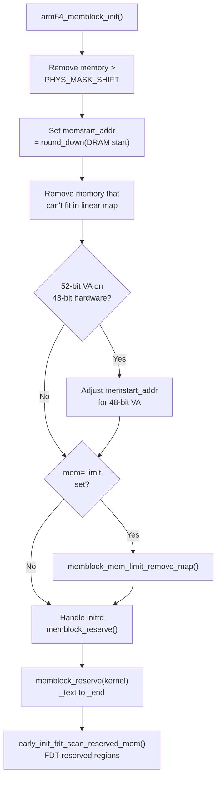

# Phase 8: Memblock — The Early Memory Allocator

**Source:** `arch/arm64/mm/init.c` lines 193–298, `mm/memblock.c`

## What Happens

`arm64_memblock_init()` builds a complete picture of physical memory: what exists, what's reserved, and what's available for the kernel to use. Memblock is the **first real memory allocator** — it tracks memory regions using simple sorted arrays and allows allocations before the buddy system exists.

## When Called

```
start_kernel()
  └── setup_arch()
        └── arm64_memblock_init()     ← HERE
```

After `setup_machine_fdt()` has parsed the FDT and called `memblock_add()` for each `/memory` node.

## What `arm64_memblock_init()` Does

### 1. Trim Memory to Physical Address Limits

```c
memblock_remove(1ULL << PHYS_MASK_SHIFT, ULLONG_MAX);
```

Remove any memory beyond the CPU's physical address capability.

### 2. Set `memstart_addr`

```c
memstart_addr = round_down(memblock_start_of_DRAM(), ARM64_MEMSTART_ALIGN);
```

`memstart_addr` is the base physical address of RAM, aligned to a large boundary. The linear map formula is:
```
virtual = physical - memstart_addr + PAGE_OFFSET
```

### 3. Trim Memory to Linear Map Size

```c
s64 linear_region_size = PAGE_END - _PAGE_OFFSET(vabits_actual);
memblock_remove(max_t(u64, memstart_addr + linear_region_size,
                __pa_symbol(_end)), ULLONG_MAX);
```

Physical memory that can't fit in the kernel's linear map region is removed. With 48-bit VA, the linear map is 128TB or 256TB.

### 4. Apply `mem=` Command Line Limit

```c
if (memory_limit != PHYS_ADDR_MAX)
    memblock_mem_limit_remove_map(memory_limit);
```

The `mem=` kernel parameter artificially limits usable memory.

### 5. Handle initrd

```c
if (IS_ENABLED(CONFIG_BLK_DEV_INITRD) && phys_initrd_size) {
    memblock_add(base, size);         // ensure it's in memory map
    memblock_reserve(base, size);     // mark as reserved
}
```

### 6. Reserve Kernel Image

```c
memblock_reserve(__pa_symbol(_text), _end - _text);
```

The kernel's own code and data must not be allocated to anyone else.

### 7. Reserve FDT Memory Regions

```c
early_init_fdt_scan_reserved_mem();
```

Processes `/reserved-memory` nodes and `/memreserve/` entries from the FDT.

## Flow Diagram



## Detailed Sub-Documents

| Document | Covers |
|----------|--------|
| [01_Memblock_Subsystem.md](01_Memblock_Subsystem.md) | The memblock allocator internals — data structures and API |
| [02_ARM64_Memblock_Init.md](02_ARM64_Memblock_Init.md) | `arm64_memblock_init()` — step-by-step walkthrough |

## Memblock State After This Phase

```
memblock.memory (all physical RAM):
  [0x4000_0000 — 0xBFFF_FFFF]  2GB
  [0x1_0000_0000 — 0x1_FFFF_FFFF]  4GB

memblock.reserved (not available for allocation):
  [0x4000_0000 — 0x400F_FFFF]  1MB firmware (from FDT)
  [0x4100_0000 — 0x4280_0000]  ~24MB kernel image
  [0x4400_0000 — 0x4500_0000]  ~16MB initrd
  ... more from FDT /reserved-memory ...
```

## Key Takeaway

`arm64_memblock_init()` transforms the raw "here's what RAM exists" info from the FDT into a complete memory inventory: what's available and what's off-limits. After this function, `memblock_alloc()` can be used to allocate physical memory — which is exactly what `paging_init()` (Phase 9) needs to allocate page table pages for the linear map.
