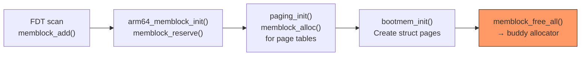

# Memblock Subsystem — The Early Memory Allocator

**Source:** `mm/memblock.c`, `include/linux/memblock.h`

## Purpose

Memblock is a simple, early-boot memory allocator that manages physical memory using sorted arrays of regions. It exists because the buddy allocator (the kernel's main allocator) requires infrastructure (page structs, zones) that doesn't exist yet during early boot.

## Data Structures

```c
struct memblock {
    bool bottom_up;                      // allocation direction
    phys_addr_t current_limit;           // max allocatable address
    struct memblock_type memory;         // all physical RAM
    struct memblock_type reserved;       // reserved/in-use regions
};
```

```c
struct memblock_type {
    unsigned long cnt;                   // number of regions
    unsigned long max;                   // allocated array size
    phys_addr_t total_size;              // sum of all region sizes
    struct memblock_region *regions;     // sorted array of regions
    char *name;                          // "memory" or "reserved"
};
```

```c
struct memblock_region {
    phys_addr_t base;                    // start physical address
    phys_addr_t size;                    // region size
    enum memblock_flags flags;           // MEMBLOCK_NONE, NOMAP, etc.
    int nid;                             // NUMA node ID
};
```

## Two Lists: Memory and Reserved

```
memblock.memory:     All physical RAM that exists
┌──────────┬──────────┬──────────┐
│ region 0 │ region 1 │ region 2 │  (sorted by base address)
│ base,size│ base,size│ base,size│
└──────────┴──────────┴──────────┘

memblock.reserved:   Regions that cannot be allocated
┌──────────┬──────────┬──────────┐
│ kernel   │ FDT      │ initrd   │  (sorted by base address)
│ base,size│ base,size│ base,size│
└──────────┴──────────┴──────────┘

Available = memory - reserved
```

Allocation works by scanning `memory` regions and finding space that doesn't overlap with any `reserved` region.

## Core API

### Adding/Removing Memory

```c
memblock_add(base, size);        // Add RAM region to memory list
memblock_remove(base, size);     // Remove from memory list
memblock_reserve(base, size);    // Mark as reserved (in use)
memblock_free(base, size);       // Remove from reserved list (make available)
```

### Allocating Memory

```c
// Allocate size bytes aligned to align, from any available memory
void *memblock_alloc(phys_addr_t size, phys_addr_t align);

// Allocate within a specific address range
void *memblock_alloc_range(phys_addr_t size, phys_addr_t align,
                           phys_addr_t start, phys_addr_t end);

// Allocate on a specific NUMA node
void *memblock_alloc_node(phys_addr_t size, phys_addr_t align, int nid);
```

All allocation functions:
1. Scan `memory` regions for a free block of the right size/alignment
2. Check it doesn't overlap any `reserved` region
3. Add the allocation to `reserved`
4. Return the physical address (or virtual via `__va()`)

### Querying

```c
memblock_start_of_DRAM();        // base of first memory region
memblock_end_of_DRAM();          // end of last memory region
memblock_phys_mem_size();        // total RAM
memblock_is_reserved(addr);      // check if addr is reserved
memblock_is_memory(addr);        // check if addr is RAM
```

## Allocation Strategy

```c
struct memblock {
    bool bottom_up;     // direction of allocation
};
```

- **Top-down** (default): Allocate from the highest available address. This pushes early allocations to high memory, leaving low memory for DMA devices.
- **Bottom-up**: Allocate from the lowest address. Used in some configurations.

## Region Merging

When adjacent regions are added, memblock automatically merges them:

```
Before: [0x4000_0000, 0x1000]  [0x4000_1000, 0x1000]
After:  [0x4000_0000, 0x2000]
```

## Array Growth

Initially, the region arrays are statically allocated:

```c
static struct memblock_region memblock_memory_init_regions[INIT_MEMBLOCK_REGIONS];
static struct memblock_region memblock_reserved_init_regions[INIT_MEMBLOCK_RESERVED_REGIONS];
```

`INIT_MEMBLOCK_REGIONS` is typically 128. If more regions are needed, `memblock_double_array()` allocates a larger array via memblock itself (meta-allocation!). This can only happen after `memblock_allow_resize()` is called (during `paging_init`).

## Lifecycle



After `memblock_free_all()` (Phase 11), all non-reserved memblock memory is handed to the buddy allocator as free pages. Memblock's job is done.

## Flags

```c
enum memblock_flags {
    MEMBLOCK_NONE       = 0x0,    // Normal memory
    MEMBLOCK_HOTPLUG    = 0x1,    // Hotpluggable
    MEMBLOCK_MIRROR     = 0x2,    // Mirrored
    MEMBLOCK_NOMAP      = 0x4,    // Don't add to linear map
    MEMBLOCK_DRIVER_MANAGED = 0x8, // Driver managed
    MEMBLOCK_RSRV_NOINIT = 0x10,  // Don't initialize (reserved)
};
```

`MEMBLOCK_NOMAP` is important: some reserved memory regions (firmware, trust zones) should not be mapped into the kernel's linear map at all.

## Key Takeaway

Memblock is a glorified sorted-array allocator. It's simple by design — its only job is to survive long enough for the buddy allocator to take over. It tracks "what RAM exists" (memory) and "what's already in use" (reserved), and allocates from the difference. It's used extensively during boot to allocate page table pages, per-CPU areas, and other early structures.
