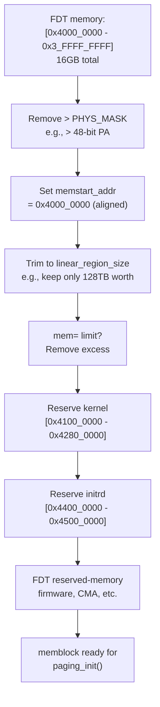

# `arm64_memblock_init()` — Step-by-Step

**Source:** `arch/arm64/mm/init.c` lines 193–298

## Purpose

This function takes the raw memory information from the FDT (Phase 7) and refines it: removing memory that can't be mapped, setting the physical-to-virtual base address, reserving the kernel image and initrd, and processing reserved memory regions from the device tree.

## Step-by-Step Walkthrough

### Step 1: Calculate Linear Region Size

```c
s64 linear_region_size = PAGE_END - _PAGE_OFFSET(vabits_actual);
```

The linear map occupies a portion of the kernel virtual address space. With 48-bit VA:
```
PAGE_OFFSET = 0xFFFF_0000_0000_0000  (or similar, depends on config)
PAGE_END    = 0xFFFF_8000_0000_0000
linear_region_size = 128 TB
```

### Step 2: KVM nVHE 52-bit Workaround

```c
if (IS_ENABLED(CONFIG_KVM) && vabits_actual == 52 &&
    is_hyp_mode_available() && !is_kernel_in_hyp_mode()) {
    linear_region_size = min_t(u64, linear_region_size, BIT(51));
}
```

With KVM in nVHE mode, the hypervisor's identity map may conflict with the kernel's linear map above 51 bits. Cap to 51 bits.

### Step 3: Remove Unsupported Physical Memory

```c
memblock_remove(1ULL << PHYS_MASK_SHIFT, ULLONG_MAX);
```

If the device tree describes memory above the CPU's physical address capability, remove it.

### Step 4: Set `memstart_addr`

```c
memstart_addr = round_down(memblock_start_of_DRAM(), ARM64_MEMSTART_ALIGN);
```

`memstart_addr` anchors the linear map:
```
__phys_to_virt(phys) = phys - memstart_addr + PAGE_OFFSET
__virt_to_phys(virt) = virt - PAGE_OFFSET + memstart_addr
```

`ARM64_MEMSTART_ALIGN` is typically 1GB (to allow 1GB block mapping in PUD level).

### Step 5: Trim to Linear Map

```c
memblock_remove(max_t(u64, memstart_addr + linear_region_size,
                __pa_symbol(_end)), ULLONG_MAX);
```

Remove any memory above the linear map range. But ensure the kernel image itself is never removed.

If memory is below the range:
```c
if (memstart_addr + linear_region_size < memblock_end_of_DRAM()) {
    memstart_addr = round_up(memblock_end_of_DRAM() - linear_region_size,
                             ARM64_MEMSTART_ALIGN);
    memblock_remove(0, memstart_addr);
}
```

### Step 6: 52-bit VA on 48-bit Hardware

```c
if (IS_ENABLED(CONFIG_ARM64_VA_BITS_52) && (vabits_actual != 52))
    memstart_addr -= _PAGE_OFFSET(vabits_actual) - _PAGE_OFFSET(52);
```

If the kernel was compiled for 52-bit VA but running on 48-bit hardware, adjust `memstart_addr` so the linear map formula still works within the smaller VA space.

### Step 7: Apply `mem=` Limit

```c
if (memory_limit != PHYS_ADDR_MAX) {
    memblock_mem_limit_remove_map(memory_limit);
    memblock_add(__pa_symbol(_text), (resource_size_t)(_end - _text));
}
```

If the user passed `mem=512M`, only keep that much memory. Always keep the kernel image itself.

### Step 8: Handle initrd

```c
if (IS_ENABLED(CONFIG_BLK_DEV_INITRD) && phys_initrd_size) {
    phys_addr_t base = phys_initrd_start & PAGE_MASK;
    resource_size_t size = ...;

    // Verify initrd fits in linear map
    if (base >= memblock_start_of_DRAM() &&
        base + size <= memblock_start_of_DRAM() + linear_region_size) {
        memblock_add(base, size);
        memblock_reserve(base, size);
    }
}
```

Ensure the initrd is within the linear map and reserve it.

### Step 9: Reserve Kernel Image

```c
memblock_reserve(__pa_symbol(_text), _end - _text);
```

The kernel's code and data must not be used for allocations.

### Step 10: Process FDT Reserved Regions

```c
early_init_fdt_scan_reserved_mem();
```

Scans the FDT for:
- `/memreserve/` entries (firmware-specified reservations)
- `/reserved-memory` node children (CMA, DMA pools, firmware regions)

## Diagram: Memory Trimming



## Final `memstart_addr` and Linear Map

```
memstart_addr = 0x4000_0000

Linear map formula:
  VA = PA - 0x4000_0000 + PAGE_OFFSET
  PA = VA - PAGE_OFFSET + 0x4000_0000

Example (4KB page, 48-bit VA):
  PA 0x4000_0000 → VA 0xFFFF_0000_0000_0000
  PA 0x4000_1000 → VA 0xFFFF_0000_0000_1000
  PA 0xBFFF_FFFF → VA 0xFFFF_0000_7FFF_FFFF
```

## Key Takeaway

`arm64_memblock_init()` is a filtering and reservation pass. It takes the "all RAM" list from the FDT, removes memory that can't be mapped, calculates the physical-to-virtual base offset, and marks critical regions (kernel, initrd, firmware) as reserved. After this, memblock is fully populated and ready for the heavy lifting of `paging_init()`.
