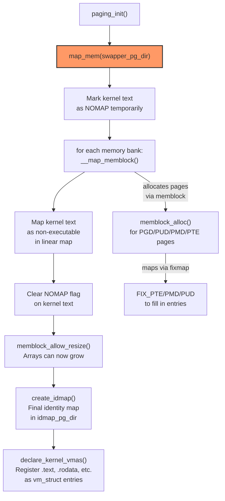

# Phase 9: `paging_init()` — Creating the Linear Map

**Source:** `arch/arm64/mm/mmu.c` lines 1420–1430

## What Happens

`paging_init()` creates the **linear map** — a direct mapping of all physical RAM into a contiguous region of kernel virtual address space. This is the most critical page table setup in the entire boot: after this, the kernel can access any physical address simply by adding an offset.

## Call Chain

```
start_kernel()
  └── setup_arch()
        └── arm64_memblock_init()  // Phase 8: know what RAM exists
        └── paging_init()          // ← THIS PHASE
              ├── map_mem(swapper_pg_dir)  // Create linear map
              ├── memblock_allow_resize()  // Allow memblock array growth
              ├── create_idmap()           // Create final identity map
              └── declare_kernel_vmas()    // Register kernel VMAs
```

## `paging_init()` Code

```c
void __init paging_init(void)
{
    map_mem(swapper_pg_dir);      // THE BIG ONE
    memblock_allow_resize();      // memblock arrays can now grow
    create_idmap();               // final identity map in idmap_pg_dir
    declare_kernel_vmas();        // register kernel segments as VMAs
}
```

## The Linear Map

```
Physical Memory:
0x4000_0000  ┌──────────────┐
             │    RAM       │
0xBFFF_FFFF  └──────────────┘
0x1_0000_0000┌──────────────┐
             │    RAM       │
0x1_FFFF_FFFF└──────────────┘

         │ linear map (PA + offset = VA)
         ▼

Kernel Virtual Space (TTBR1):
PAGE_OFFSET  ┌──────────────┐
             │  Linear Map  │  VA = PA - memstart_addr + PAGE_OFFSET
             │  (all RAM)   │
             └──────────────┘
```

The formula:
```c
#define __phys_to_virt(x) ((x) - memstart_addr + PAGE_OFFSET)
#define __virt_to_phys(x) ((x) - PAGE_OFFSET + memstart_addr)
```

## `map_mem()` — The Heavy Lifter

```c
static void __init map_mem(pgd_t *pgdp)
{
    phys_addr_t kernel_start = __pa_symbol(_text);
    phys_addr_t kernel_end = __pa_symbol(__init_begin);

    // Temporarily hide kernel text/rodata from linear mapping
    memblock_mark_nomap(kernel_start, kernel_end - kernel_start);

    // Map ALL memory banks
    for_each_mem_range(i, &start, &end) {
        __map_memblock(pgdp, start, end,
                       pgprot_tagged(PAGE_KERNEL), flags);
    }

    // Map kernel text separately (non-executable in linear map)
    __map_memblock(pgdp, kernel_start, kernel_end,
                   PAGE_KERNEL, NO_CONT_MAPPINGS);

    memblock_clear_nomap(kernel_start, kernel_end - kernel_start);
}
```

### Why Hide the Kernel Text?

The kernel `.text` section is already mapped executable at its link address (via the kernel image mapping). The linear map provides a second mapping of the same physical pages. Having two executable mappings of the same code creates a security risk (W^X violations). So the linear map's copy is mapped as **non-executable** (`PAGE_KERNEL` instead of `PAGE_KERNEL_EXEC`).

## Flow Diagram



## Page Table Allocation During `map_mem`

`map_mem` → `__map_memblock` → `__create_pgd_mapping` → `alloc_init_pud` → `alloc_init_pmd` → `alloc_init_pte`

At each level, if a table page is needed:

1. **Allocate** a physical page via `memblock_phys_alloc(PAGE_SIZE, PAGE_SIZE)`
2. **Map** it temporarily into the fixmap (`pte_set_fixmap`, `pmd_set_fixmap`, etc.)
3. **Fill** in the entries
4. **Unmap** from fixmap (`pte_clear_fixmap`)

The fixmap trick is necessary because the linear map doesn't exist yet — we're building it! We can't access physical memory through the linear map while creating the linear map.

## Block Mappings for Performance

Where possible, `map_mem` creates **block descriptors** instead of full page table entries:

| Level | Block Size | When Used |
|-------|-----------|-----------|
| PUD | 1GB | When 1GB-aligned region ≥ 1GB |
| PMD | 2MB | When 2MB-aligned region ≥ 2MB |
| PTE | 4KB | When not aligned or `NO_BLOCK_MAPPINGS` |

Block mappings are much more efficient:
- 1GB block = 1 PUD entry instead of 512 PMD entries × 512 PTE entries
- Fewer TLB entries needed, better TLB hit rate

## Detailed Sub-Documents

| Document | Covers |
|----------|--------|
| [01_Map_Mem.md](01_Map_Mem.md) | `map_mem()` — linear map creation details |
| [02_Page_Table_Lifecycle.md](02_Page_Table_Lifecycle.md) | Page table directory lifecycle: init_pg_dir → swapper_pg_dir |

## After `paging_init()`

| What | State |
|------|-------|
| Linear map | All RAM mapped in `swapper_pg_dir` |
| `__va()` / `__pa()` | Now work for any physical RAM address |
| Identity map | Final version in `idmap_pg_dir` |
| Kernel VMAs | Registered for vmalloc tracking |
| memblock | Can resize its arrays (they're in the linear map now) |

## Key Takeaway

`paging_init()` is the pivotal moment where the kernel goes from "I can only access my own image" to "I can access all of physical memory." The linear map it creates is the backbone of kernel memory access — `__va()`, `page_address()`, `phys_to_virt()` all depend on it. The clever use of fixmap slots to build page tables that can't yet be accessed through the linear map is a beautiful bootstrap trick.
