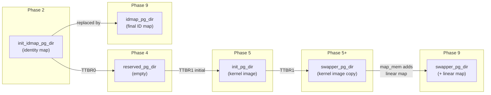

# Page Table Directory Lifecycle

**Source:** Various — `arch/arm64/kernel/head.S`, `arch/arm64/kernel/pi/map_kernel.c`, `arch/arm64/mm/mmu.c`

## Overview

The kernel uses **four different page table directories** during boot. Each serves a specific purpose and is replaced when no longer needed.

## Timeline



## Directory Details

### 1. `init_idmap_pg_dir` — Early Identity Map

| Property | Value |
|----------|-------|
| Created by | `create_init_idmap()` in `map_range.c` |
| TTBR | TTBR0_EL1 (Phase 2–7) |
| Maps | Boot code: PA = VA |
| Lifetime | Boot until `cpu_uninstall_idmap()` in `setup_arch()` |
| Allocation | Static, in kernel image BSS |

Purpose: Allows MMU enable without changing the instruction stream address.

### 2. `reserved_pg_dir` — Empty Fault Page Table

| Property | Value |
|----------|-------|
| Created by | Never populated — zeroed BSS |
| TTBR | TTBR1 initially (Phase 4), TTBR0 after `cpu_uninstall_idmap()` |
| Maps | Nothing — all accesses fault |
| Lifetime | Entire kernel lifetime |
| Allocation | Static, in kernel image BSS |

Purpose: A "null" page table. When TTBR0 points here, all user-space accesses fault. Used by KPTI and when the identity map is no longer needed.

### 3. `init_pg_dir` — Temporary Kernel Image Map

| Property | Value |
|----------|-------|
| Created by | `map_kernel()` in `map_kernel.c` |
| TTBR | TTBR1 briefly (Phase 5) |
| Maps | Kernel image segments at their link address |
| Lifetime | Short — replaced by `swapper_pg_dir` in same function |
| Allocation | Static, in kernel image (between `__init_end` and `_end` area) |

Purpose: Intermediate step. The root PGD page is copied to `swapper_pg_dir`. After the copy, `init_pg_dir` is just a memory region whose **sub-pages** (PUD, PMD, PTE) are still referenced by `swapper_pg_dir`.

### 4. `swapper_pg_dir` — The Final Kernel Page Table

| Property | Value |
|----------|-------|
| Created by | `map_kernel()` copies PGD from `init_pg_dir`; `paging_init()` adds linear map |
| TTBR | TTBR1 for the entire running kernel |
| Maps | Kernel image + **all physical RAM** (linear map) + fixmap |
| Lifetime | Entire kernel lifetime |
| Allocation | Static, in kernel image BSS |

Purpose: The permanent kernel page table. All kernel threads share this. User processes have their own TTBR0 page table but always use `swapper_pg_dir` for TTBR1.

### 5. `idmap_pg_dir` — Final Identity Map

| Property | Value |
|----------|-------|
| Created by | `create_idmap()` in `paging_init()` |
| TTBR | TTBR0 during CPU suspend/resume, secondary CPU boot |
| Maps | `.idmap.text` section: PA = VA |
| Lifetime | Entire kernel lifetime |
| Allocation | Static, in kernel image BSS |

Purpose: Replaces `init_idmap_pg_dir`. Used whenever the kernel needs to run identity-mapped code (CPU hotplug, suspend, kexec).

## Memory Layout

```
Kernel Image Layout (physical):

┌─────────────────────┐
│ _text               │
│ .text, .rodata      │
│ .init               │
│ _data, .bss         │
├─────────────────────┤
│ swapper_pg_dir      │  1 page (PGD)
│ reserved_pg_dir     │  1 page (zeroed)
│ idmap_pg_dir        │  few pages
├─────────────────────┤
│ init_pg_dir         │  several pages (PGD + PUD + PMD + PTE)
│ init_idmap_pg_dir   │  several pages
├─────────────────────┤
│ _end                │
└─────────────────────┘
```

## Shared Sub-Tables

When `map_kernel()` does:
```c
memcpy(swapper_pg_dir + va_offset, init_pg_dir, PAGE_SIZE);
```

Only the root PGD (one page) is copied. The lower-level tables are shared:

```
swapper_pg_dir (PGD)  ──→  PUD pages ──→  PMD pages ──→  PTE pages
                            (in init_pg_dir memory region)
```

Later, `paging_init()` adds more entries to `swapper_pg_dir` for the linear map, using newly allocated memblock pages.

## Key Takeaway

The page table lifecycle reflects the boot's increasing capabilities: from identity-map-only (assembly), to kernel-image-only (early C), to everything-mapped (full kernel). Each directory serves a narrow purpose and is replaced when a more capable one is ready. `swapper_pg_dir` is the final, permanent kernel page table that persists for the lifetime of the system.
