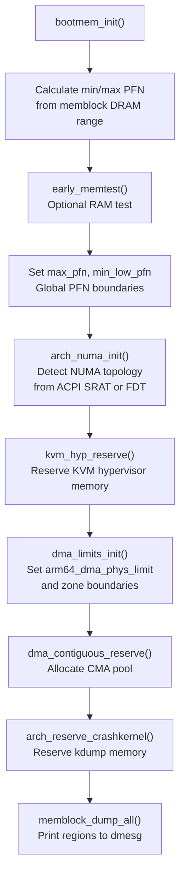

# Phase 10: `bootmem_init()` — Zones, NUMA, and DMA Limits

**Source:** `arch/arm64/mm/init.c` lines 300–330

## What Happens

`bootmem_init()` sets up the memory management **metadata**: NUMA node topology, DMA zone boundaries, CMA (Contiguous Memory Allocator) reservations, and crash kernel reservations. After this, the kernel knows not just where memory is, but how it's organized for allocation.

## Call Chain

```
start_kernel()
  └── setup_arch()
        └── arm64_memblock_init()  // Phase 8
        └── paging_init()          // Phase 9
        └── bootmem_init()         // ← THIS PHASE
```

## Code

```c
void __init bootmem_init(void)
{
    unsigned long min, max;

    min = PFN_UP(memblock_start_of_DRAM());
    max = PFN_DOWN(memblock_end_of_DRAM());

    early_memtest(min << PAGE_SHIFT, max << PAGE_SHIFT);

    max_pfn = max_low_pfn = max;
    min_low_pfn = min;

    arch_numa_init();          // Detect NUMA topology

    kvm_hyp_reserve();         // Reserve memory for KVM hypervisor
    dma_limits_init();         // Determine DMA-capable address range

    dma_contiguous_reserve(arm64_dma_phys_limit);  // CMA pool

    arch_reserve_crashkernel();  // Reserve crashkernel memory

    memblock_dump_all();       // Debug: print all memblock regions
}
```

## Flow Diagram



## Key Concepts

### Page Frame Numbers (PFNs)

```c
min = PFN_UP(memblock_start_of_DRAM());    // first usable page
max = PFN_DOWN(memblock_end_of_DRAM());     // last usable page

max_pfn = max;      // highest page frame number
min_low_pfn = min;  // lowest page frame number
```

PFN = physical address ÷ PAGE_SIZE. Used throughout the memory subsystem as a compact page identifier.

### NUMA Initialization

```c
arch_numa_init();
```

Discovers the NUMA topology:
- On ACPI systems: reads the SRAT (System Resource Affinity Table)
- On DT systems: reads `/memory` node `numa-node-id` properties
- Assigns each memory region to a NUMA node
- Calls `free_area_init()` which creates `struct page` for every physical page

### DMA Zones

```c
dma_limits_init();
```

ARM64 defines up to 3 zones:

| Zone | Address Range | Purpose |
|------|---------------|---------|
| `ZONE_DMA` | 0 — `arm64_dma_phys_limit` (usually 4GB) | 32-bit DMA devices |
| `ZONE_DMA32` | 0 — 4GB | 32-bit DMA (if distinct from ZONE_DMA) |
| `ZONE_NORMAL` | Above DMA limits | General-purpose allocation |

`arm64_dma_phys_limit` is determined by scanning the device tree or ACPI for the most restrictive DMA mask among all devices.

### CMA (Contiguous Memory Allocator)

```c
dma_contiguous_reserve(arm64_dma_phys_limit);
```

Reserves a large contiguous block of memory (typically 32MB or per `cma=` parameter) within the DMA zone. CMA pages are available for normal allocation but can be migrated away when a device needs a large contiguous DMA buffer.

### Crash Kernel

```c
arch_reserve_crashkernel();
```

If `crashkernel=` is on the command line, reserves memory for the kdump crash kernel. This memory is held aside so that if the main kernel panics, the crash kernel can boot and capture a memory dump.

## Detailed Sub-Documents

| Document | Covers |
|----------|--------|
| [01_NUMA_Zones.md](01_NUMA_Zones.md) | NUMA topology detection and zone setup |
| [02_DMA_CMA.md](02_DMA_CMA.md) | DMA limits and CMA pool reservation |

## State After `bootmem_init()`

| What | State |
|------|-------|
| `max_pfn` / `min_low_pfn` | Set (global PFN range) |
| NUMA nodes | Detected and memory assigned |
| Zones | Boundaries defined (DMA, DMA32, NORMAL) |
| `struct page` array | Allocated (via `free_area_init`) |
| CMA pool | Reserved in memblock |
| Crash kernel | Reserved (if configured) |

But: **The buddy allocator is NOT active yet.** Zones exist and struct pages are allocated, but they're not populated with free pages. That happens in `mm_core_init()` (Phase 11).

## Key Takeaway

`bootmem_init()` builds the organizational structure for the memory subsystem: NUMA nodes, zones, `struct page` arrays, and DMA/CMA reservations. It's the metadata layer between raw memblock regions and the full buddy allocator. After this, `setup_arch()` returns to `start_kernel()`, and the final mm initialization happens in `mm_core_init()`.
