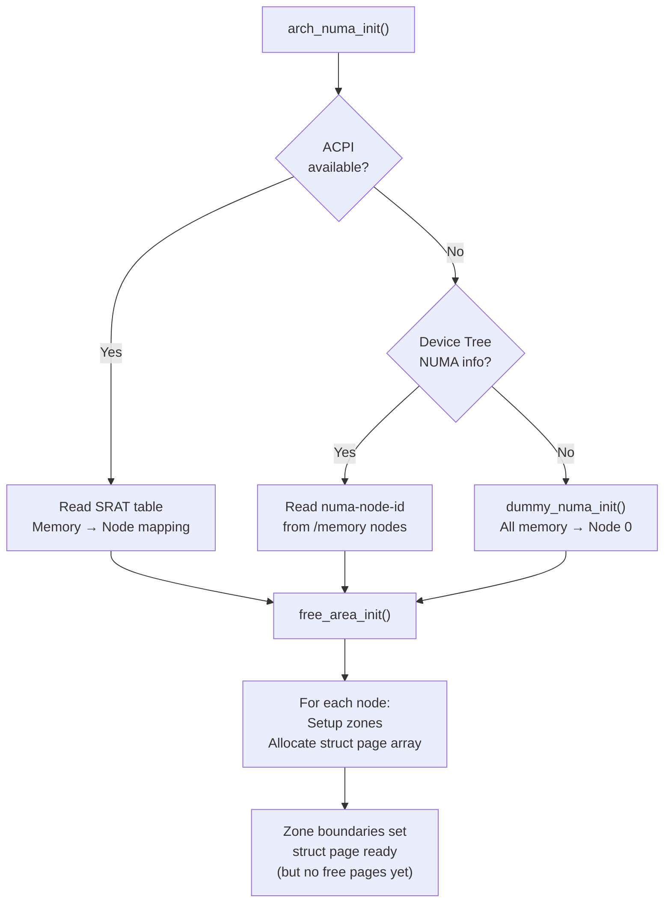

# NUMA Topology and Zone Setup

**Source:** `arch/arm64/mm/numa.c`, `mm/mm_init.c`

## NUMA on ARM64

NUMA (Non-Uniform Memory Access) means different CPUs have different latencies to different memory regions. On ARM64 servers, this is common — each CPU socket has local memory that's faster to access than remote memory.

## Detection

```c
void __init arch_numa_init(void)
{
    if (!acpi_disabled && !numa_init(arm64_acpi_numa_init))
        return;

    if (acpi_disabled && !numa_init(of_numa_init))
        return;

    numa_init(dummy_numa_init);  // fallback: single node
}
```

### ACPI Path (servers)

Reads SRAT (System Resource Affinity Table):
- Memory affinity: which physical address ranges belong to which NUMA node
- CPU affinity: which CPUs belong to which NUMA node

### Device Tree Path (embedded/SoC)

Reads `numa-node-id` properties from `/memory` and `/cpus` nodes:
```dts
memory@40000000 {
    numa-node-id = <0>;
    reg = <0x00 0x40000000 0x00 0x80000000>;
};
memory@100000000 {
    numa-node-id = <1>;
    reg = <0x01 0x00000000 0x01 0x00000000>;
};
```

### Fallback (UMA)

If no NUMA info is found, all memory goes to node 0 (Uniform Memory Access).

## `free_area_init()` — Struct Page Allocation

Called indirectly through NUMA init, `free_area_init()` creates the `struct page` array — one entry per physical page:

```c
// mm/mm_init.c
void __init free_area_init(unsigned long *max_zone_pfn)
{
    // For each NUMA node
    for_each_node(nid) {
        // For each zone in the node
        for (zone_type = 0; zone_type < MAX_NR_ZONES; zone_type++) {
            // Calculate zone boundaries
            // Allocate struct page array
            // Initialize zone data structures
        }
    }
}
```

### Struct Page

Every physical page frame has a `struct page` (64 bytes):

```c
struct page {
    unsigned long flags;        // page state flags
    union {
        struct {                // used by page cache
            struct list_head lru;
            struct address_space *mapping;
            pgoff_t index;
        };
        struct {                // used by slab allocator
            struct kmem_cache *slab_cache;
            void *freelist;
        };
        struct {                // used by compound pages
            unsigned long compound_head;
        };
    };
    atomic_t _refcount;
    atomic_t _mapcount;
};
```

For 4GB of RAM: 1,048,576 pages × 64 bytes = **64MB** of struct page metadata.

## Zone Organization

```
NUMA Node 0:                    NUMA Node 1:
┌──────────────────┐            ┌──────────────────┐
│ ZONE_DMA         │            │                  │
│ [0 — 4GB)        │            │                  │
├──────────────────┤            │ ZONE_NORMAL      │
│ ZONE_NORMAL      │            │ [4GB — 8GB)      │
│ [4GB — 6GB)      │            │                  │
└──────────────────┘            └──────────────────┘
```

Each zone tracks:
```c
struct zone {
    unsigned long _watermark[NR_WMARK];  // min/low/high watermarks
    struct free_area free_area[NR_PAGE_ORDERS];  // buddy free lists
    unsigned long nr_reserved_highatomic;
    long lowmem_reserve[MAX_NR_ZONES];
    struct pglist_data *zone_pgdat;     // parent node
    // ...
};
```

## Zone Boundaries on ARM64

```c
void __init dma_limits_init(void)
{
    // Scan device tree for dma-ranges
    // Set arm64_dma_phys_limit based on most restrictive device

    // Typically:
    // ZONE_DMA:    0 — 1GB  (for devices with 30-bit DMA)
    // ZONE_DMA32:  0 — 4GB  (for devices with 32-bit DMA)
    // ZONE_NORMAL: 4GB+     (general purpose)
}
```

## Diagram



## Key Takeaway

NUMA initialization assigns physical memory regions to nodes and sets up zone boundaries based on DMA constraints. `free_area_init()` allocates the `struct page` array — the per-page metadata that the buddy allocator needs. After this, the zone framework exists but is empty; free pages are added in `memblock_free_all()` (Phase 11).
