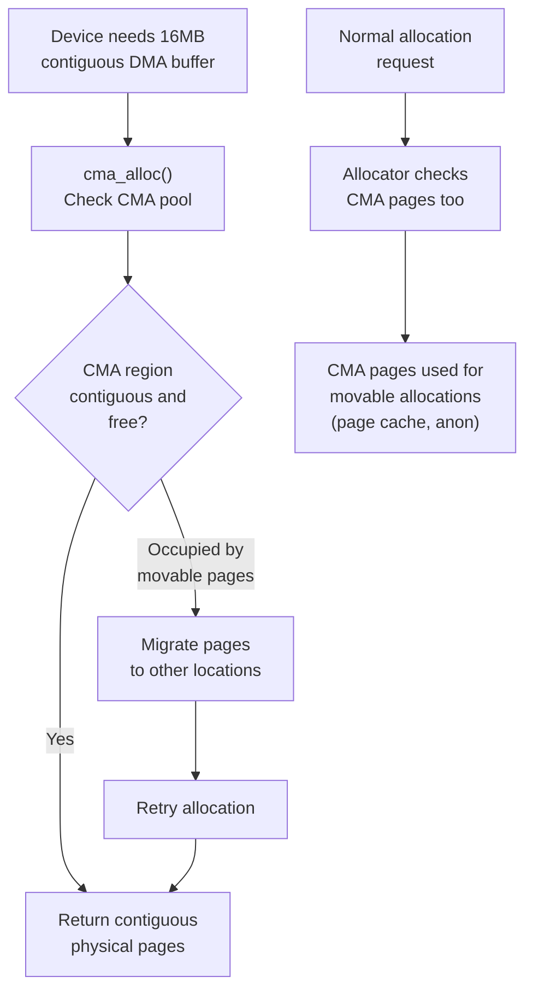

# DMA Limits and CMA Pool

**Source:** `arch/arm64/mm/init.c`, `kernel/dma/contiguous.c`

## DMA Constraints on ARM64

Not all devices can access all physical memory. A device with a 32-bit DMA address bus can only access memory below 4GB. The kernel must ensure DMA buffers are allocated from reachable memory.

## `dma_limits_init()`

Determines `arm64_dma_phys_limit` — the highest physical address accessible by the most constrained DMA device:

```c
// Simplified logic:
arm64_dma_phys_limit = min(
    device_tree_dma_limit,  // from dma-ranges in FDT
    PHYS_ADDR_MAX           // default: no limit
);
```

This limit defines zone boundaries:

```
Physical Address:
0x0000_0000  ┌────────────────────┐
             │ ZONE_DMA           │  ← arm64_dma_phys_limit (e.g., 1GB)
             │ 0 — 1GB            │     (if devices need 30-bit DMA)
0x4000_0000  ├────────────────────┤
             │ ZONE_DMA32         │
             │ 1GB — 4GB          │
0x1_0000_0000├────────────────────┤
             │ ZONE_NORMAL        │
             │ 4GB — max          │
             └────────────────────┘
```

## CMA (Contiguous Memory Allocator)

### The Problem

Some devices (GPU, camera, video decoder) need **large, physically contiguous** buffers (e.g., 16MB for a framebuffer). The buddy allocator can only guarantee contiguous allocation up to `2^(MAX_PAGE_ORDER) × PAGE_SIZE` (typically 4MB). Beyond that, allocation may fail due to fragmentation.

### The Solution

CMA reserves a large contiguous region at boot time. Pages in this region are:
- **Available for normal allocation** (movable pages like page cache, anonymous memory)
- **Reclaimable on demand**: When a device needs a contiguous buffer, CMA migrates existing pages out and returns the contiguous block

### Reservation

```c
dma_contiguous_reserve(arm64_dma_phys_limit);
```

This reserves a CMA pool (default size from `CMA_SIZE_MBYTES` or `cma=` parameter) within the DMA-accessible range:

```c
// kernel/dma/contiguous.c
void __init dma_contiguous_reserve(phys_addr_t limit)
{
    phys_addr_t size = size_cmdline ?: CMA_SIZE_MBYTES * SZ_1M;

    // Reserve from memblock within the DMA limit
    memblock_phys_alloc_range(size, alignment, 0, limit);
}
```

### CMA Allocation Flow



## DMA Zone Fallback

When allocating memory for DMA:

```c
// Allocation prefers ZONE_DMA, falls back to ZONE_DMA32, then ZONE_NORMAL
gfp_t gfp = GFP_DMA;  // allocate from ZONE_DMA

// Zone fallback list:
// ZONE_DMA → (fail) → error
// ZONE_DMA32 → ZONE_DMA → (fail) → error
// ZONE_NORMAL → ZONE_DMA32 → ZONE_DMA → (fail) → error
```

## Crash Kernel

```c
arch_reserve_crashkernel();
```

If `crashkernel=256M` is on the command line:

```
Physical Memory:
┌──────────────────────┐
│ Regular kernel       │
├──────────────────────┤
│ CRASH KERNEL         │  256MB reserved
│ (reserved, unused    │  Only used if main kernel panics
│  until panic)        │  kdump boots from here
├──────────────────────┤
│ Regular kernel       │
└──────────────────────┘
```

The crash kernel memory is reserved in memblock and not given to the buddy allocator. The kexec system call loads a crash kernel into this region. On panic, the crash kernel boots and writes `/proc/vmcore` for post-mortem analysis.

## Key Takeaway

DMA limits and CMA solve the problem of hardware constraints meeting software flexibility. Zones partition memory by accessibility (what devices can reach it), and CMA provides large contiguous allocations by reserving memory that's dual-purposed: available for normal use but reclaimable for DMA. These reservations happen during `bootmem_init()` before the buddy allocator starts.
