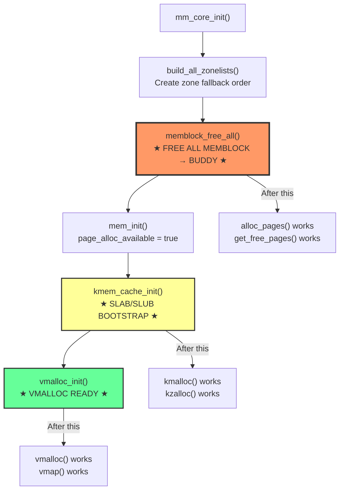

# Phase 11: `mm_core_init()` — Full Memory Subsystem Activation

**Source:** `mm/mm_init.c` lines 2724–2780

## What Happens

`mm_core_init()` is the final coordinator that activates the **full memory allocation stack**. It transitions from memblock (the simple early allocator) to the three-tier production system: buddy allocator (page-level), SLAB/SLUB (object-level), and vmalloc (virtual contiguous).

## When Called

```
start_kernel()
  └── setup_arch()           // Phases 7-10: memblock, paging, zones
  └── mm_core_init_early()   // hugetlb, free_area_init
  └── ...                    // other subsystem init
  └── mm_core_init()         // ← THIS PHASE: activate everything
```

## Code

```c
void __init mm_core_init(void)
{
    arch_mm_preinit();                // ARM64: swiotlb init
    init_zero_page_pfn();             // Set up zero page

    build_all_zonelists(NULL);        // Build zone fallback lists
    page_alloc_init_cpuhp();          // CPU hotplug for page allocator

    // ... debugging/hardening init ...

    memblock_free_all();              // ★ MEMBLOCK → BUDDY TRANSITION ★
    mem_init();                       // Arch-specific post-buddy init
    kmem_cache_init();                // ★ SLAB/SLUB INIT (Phase 12) ★

    // ... page_ext, kmemleak, ptlock ...

    vmalloc_init();                   // ★ VMALLOC INIT (Phase 13) ★

    // ... pti, kmsan, execmem ...
}
```

## Flow Diagram



## The Three Key Transitions

### 1. `memblock_free_all()` — Birth of the Buddy Allocator

```c
void __init memblock_free_all(void)
{
    // For every non-reserved memblock region:
    //   Convert to struct page
    //   Add to buddy allocator free lists

    pages = free_low_memory_core_early();
    totalram_pages_add(pages);
}
```

This walks every memblock memory region, and for each non-reserved page:
1. Looks up its `struct page` (allocated in Phase 10)
2. Sets page flags and refcount
3. Calls `__free_pages()` to add it to the buddy allocator's free lists

After this, `alloc_pages()` / `__get_free_pages()` work.

### 2. `kmem_cache_init()` — SLAB/SLUB Bootstrap (Phase 12)

Creates the initial slab caches for small allocations. After this, `kmalloc()` / `kzalloc()` work.

### 3. `vmalloc_init()` — Virtual Contiguous Allocator (Phase 13)

Initializes the vmalloc address space manager. After this, `vmalloc()` / `vmap()` work.

## `build_all_zonelists()` — Zone Fallback

Creates a fallback order for each zone, so that if allocation from the preferred zone fails, the allocator tries other zones:

```
Node 0, ZONE_NORMAL fallback:
  1. Node 0, ZONE_NORMAL
  2. Node 0, ZONE_DMA32
  3. Node 0, ZONE_DMA
  4. Node 1, ZONE_NORMAL  (remote NUMA node)
  5. Node 1, ZONE_DMA32
  6. Node 1, ZONE_DMA
```

The ordering prioritizes:
1. Same node (locality)
2. Higher zones before lower (DMA zones are precious)
3. Remote nodes as last resort

## Allocator Evolution Timeline

```mermaid
flowchart LR
    A["No allocator\n(assembly, Phase 1-4)"] --> B["Static bump\n(map_kernel, Phase 5)"]
    B --> C["memblock\n(Phase 8-10)"]
    C --> D["memblock_free_all()"]
    D --> E["Buddy allocator\n(page-level)"]
    E --> F["kmem_cache_init()"]
    F --> G["SLAB/SLUB\n(object-level)"]
    G --> H["vmalloc_init()"]
    H --> I["vmalloc\n(virtual contiguous)"]

    style D fill:#f96
    style F fill:#ff9
    style H fill:#6f9
```



## Detailed Sub-Documents

| Document | Covers |
|----------|--------|
| [01_Memblock_Free_All.md](01_Memblock_Free_All.md) | The memblock → buddy transition |
| [02_Buddy_Allocator.md](02_Buddy_Allocator.md) | Buddy system: free lists, splitting, coalescing |
| [03_Build_Zonelists.md](03_Build_Zonelists.md) | Zone fallback list construction |

## State After `mm_core_init()`

The full memory allocation stack is operational:

| Allocator | API | Granularity | Use Case |
|-----------|-----|-------------|----------|
| Buddy | `alloc_pages()`, `__get_free_pages()` | Pages (4KB, 8KB, ..., 4MB) | Page tables, large buffers |
| SLAB/SLUB | `kmalloc()`, `kmem_cache_alloc()` | Objects (8B — 8KB+) | Kernel data structures |
| vmalloc | `vmalloc()`, `vmap()` | Virtually contiguous | Module loading, large non-contiguous buffers |
| CMA | `cma_alloc()` | Large contiguous | DMA buffers |

## Key Takeaway

`mm_core_init()` is the grand activation ceremony for the memory subsystem. It fires up the three production allocators in dependency order: buddy first (needs only zones and struct pages), then SLAB (needs buddy for backing pages), then vmalloc (needs SLAB for metadata). After this function, the kernel has a full, production-quality memory management system.
