# `memblock_free_all()` — Memblock to Buddy Transition

**Source:** `mm/memblock.c`

## Purpose

`memblock_free_all()` is the moment the memblock allocator hands all unreserved memory to the buddy allocator. After this call, memblock is effectively retired and the buddy system becomes the primary page allocator.

## How It Works

```c
void __init memblock_free_all(void)
{
    unsigned long pages;

    pages = free_low_memory_core_early();
    totalram_pages_add(pages);

    // memblock is done; buddy allocator is now active
}
```

### `free_low_memory_core_early()`

```c
static unsigned long __init free_low_memory_core_early(void)
{
    unsigned long count = 0;
    phys_addr_t start, end;
    u64 i;

    memblock_clear_hotplug(0, -1);

    // Iterate over every non-reserved memory region
    for_each_free_mem_range(i, NUMA_NO_NODE, MEMBLOCK_NONE, &start, &end, NULL) {
        count += __free_memory_core(start, end);
    }

    return count;
}
```

### The Key: `for_each_free_mem_range`

This iterator walks `memblock.memory` and subtracts `memblock.reserved`, yielding only the free ranges:

```
memblock.memory:
  [0x4000_0000 — 0xBFFF_FFFF]

memblock.reserved:
  [0x4100_0000 — 0x4280_0000]  (kernel)
  [0x4400_0000 — 0x4500_0000]  (initrd)

Free ranges yielded:
  [0x4000_0000 — 0x40FF_FFFF]  (before kernel)
  [0x4280_0000 — 0x43FF_FFFF]  (between kernel and initrd)
  [0x4500_0000 — 0xBFFF_FFFF]  (after initrd)
```

### `__free_memory_core()`

For each free range, hands pages to the buddy allocator:

```c
static unsigned long __init __free_memory_core(phys_addr_t start, phys_addr_t end)
{
    unsigned long start_pfn = PFN_UP(start);
    unsigned long end_pfn = PFN_DOWN(end);

    // Hand pages to the buddy in MAX_PAGE_ORDER chunks
    return __free_pages_memory(start_pfn, end_pfn);
}
```

This calls `__free_pages()` on each page, which adds it to the appropriate buddy free list.

## The Buddy Free List

After `memblock_free_all()`, the buddy allocator's free lists look like:

```
Zone NORMAL free_area:
  order 0  (4KB):   [list of single pages]
  order 1  (8KB):   [list of 2-page blocks]
  order 2  (16KB):  [list of 4-page blocks]
  ...
  order 10 (4MB):   [list of 1024-page blocks]  ← MAX_PAGE_ORDER

Most pages end up at higher orders because they're freed
in large contiguous blocks from memblock.
```

## Flow Diagram

```mermaid
flowchart TD
    A["memblock_free_all()"] --> B["free_low_memory_core_early()"]
    B --> C["for_each_free_mem_range\n(memory - reserved)"]
    C --> D["For each free range:\n__free_memory_core()"]
    D --> E["Convert to PFN range\nstart_pfn → end_pfn"]
    E --> F["__free_pages() for each\ngroup of pages"]
    F --> G["Pages added to buddy\nfree_area[order] lists"]
    G --> H["totalram_pages updated\nBuddy allocator ACTIVE"]

    style H fill:#6f9,stroke:#333,stroke-width:3px
```



## What Stays Reserved

Pages in `memblock.reserved` are **not** freed to buddy:

| Reserved Region | Why |
|----------------|-----|
| Kernel image (`_text` — `_end`) | The running kernel! |
| Page tables (`swapper_pg_dir` sub-tables) | Active page tables |
| initrd | Needed to mount rootfs |
| FDT | May still be referenced |
| struct page array | Buddy needs this metadata |
| Per-CPU areas | CPU-local data |
| CMA pool | Managed separately |
| Crash kernel | Reserved for kdump |

These remain as `PageReserved` pages and are never returned to the buddy allocator (unless explicitly freed later, e.g., `free_initmem()` frees `.init` sections after boot).

## Key Takeaway

`memblock_free_all()` is the grand handoff: every page that memblock considers "free" (in `memory` but not in `reserved`) is given to the buddy allocator. This is a one-way transition — after this, `memblock_alloc()` is no longer used for regular allocations, and `alloc_pages()` / `__get_free_pages()` become the primary page allocation interface. The buddy allocator starts life with free lists populated by large contiguous blocks, maximizing the chance of satisfying high-order allocations.
