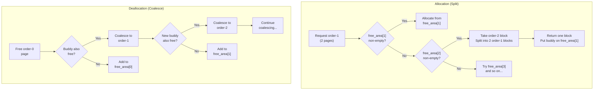

# Buddy Allocator — Page-Level Memory Management

**Source:** `mm/page_alloc.c`

## Purpose

The buddy allocator is the kernel's **primary page allocator**. It manages free physical pages using a "buddy system" that efficiently handles allocation and deallocation while minimizing external fragmentation through splitting and coalescing.

## Core Concept

Pages are organized into blocks of power-of-2 sizes (orders):

```
Order 0:  1 page   (4KB)
Order 1:  2 pages  (8KB)
Order 2:  4 pages  (16KB)
Order 3:  8 pages  (32KB)
...
Order 10: 1024 pages (4MB) = MAX_PAGE_ORDER
```

Each zone maintains a `free_area` array — one free list per order:

```c
struct zone {
    struct free_area free_area[MAX_PAGE_ORDER + 1];
};

struct free_area {
    struct list_head free_list[MIGRATE_TYPES];
    unsigned long nr_free;
};
```

## Allocation: Splitting

When allocating order-N pages:
1. Check `free_area[N]` — if a block is available, use it
2. If empty, check `free_area[N+1]` — split a larger block:
   - Take one 2×N block
   - Use one N-block for the allocation
   - Put the other N-block (the "buddy") on `free_area[N]`
3. Continue up to `free_area[MAX_PAGE_ORDER]`

```
Request: 1 page (order 0)
Available: 1 block at order 2 (4 pages)

free_area[2]: [████]     → Split
free_area[1]: [██]       → Split buddy added
free_area[0]: [█] + [█]  → One allocated, one buddy added

Result: 1 page allocated, 1+2 pages on free lists
```

## Deallocation: Coalescing

When freeing a page, check if its buddy is also free:
1. Find the buddy: `buddy_pfn = pfn ^ (1 << order)`
2. If buddy is free and same order, coalesce:
   - Remove buddy from free list
   - Merge into order+1 block
   - Repeat at higher order

```
Free page at PFN 0x100 (order 0):
  Buddy = PFN 0x101
  0x101 is free? YES → coalesce to order 1 at PFN 0x100
  Buddy = PFN 0x102 (order 1)
  0x102 is free? YES → coalesce to order 2 at PFN 0x100
  Buddy = PFN 0x104 (order 2)
  0x104 is free? NO → stop

Result: order-2 block added to free_area[2]
```

## Migration Types

Each free list is further split by migration type to reduce fragmentation:

```c
enum migratetype {
    MIGRATE_UNMOVABLE,    // kernel data, page tables
    MIGRATE_MOVABLE,      // user pages, page cache
    MIGRATE_RECLAIMABLE,  // slab caches, dentries
    MIGRATE_PCPTYPES,     // per-CPU page lists boundary
    MIGRATE_HIGHATOMIC,   // emergency reserves
    MIGRATE_CMA,          // CMA pool pages
    MIGRATE_ISOLATE,      // hot-remove isolation
};
```

By grouping pages by mobility, the allocator keeps unmovable pages separate from movable pages, preventing unmovable allocations from fragmenting regions that could otherwise be compacted.

## Per-CPU Page Lists (PCP)

For single-page allocations (the most common case), each CPU has a local cache:

```c
struct per_cpu_pages {
    int count;          // number of pages in list
    int high;           // high watermark
    int batch;          // refill/drain batch size
    struct list_head lists[NR_PCP_LISTS];
};
```

- **Allocation**: Take from PCP list (no zone lock needed!)
- **Free**: Return to PCP list
- **Overflow**: Drain batch pages back to zone free list
- **Underflow**: Refill batch pages from zone free list

This eliminates lock contention for the common case.

## Allocation API

```c
// Allocate 2^order contiguous pages
struct page *alloc_pages(gfp_t gfp, unsigned int order);

// Allocate and return virtual address
unsigned long __get_free_pages(gfp_t gfp, unsigned int order);

// Allocate a single page
struct page *alloc_page(gfp_t gfp);

// Free pages
void __free_pages(struct page *page, unsigned int order);
void free_pages(unsigned long addr, unsigned int order);
```

## GFP Flags

```c
GFP_KERNEL    // Normal kernel allocation, can sleep
GFP_ATOMIC    // Cannot sleep (interrupt context)
GFP_DMA       // Allocate from ZONE_DMA
GFP_DMA32     // Allocate from ZONE_DMA32
GFP_HIGHUSER  // User page, can be in high memory
__GFP_ZERO    // Zero the allocated pages
__GFP_COMP    // Create compound page
```

## Diagram: Buddy Split and Coalesce



## Key Takeaway

The buddy allocator provides O(log N) allocation and deallocation of physically contiguous page blocks. Its power-of-2 splitting/coalescing naturally prevents external fragmentation (for aligned requests), and migration types + per-CPU lists optimize for the common allocation patterns. It becomes active after `memblock_free_all()` populates its free lists.
