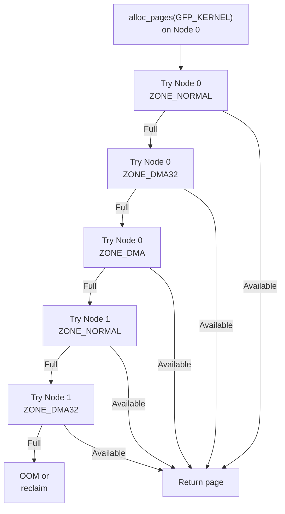

# `build_all_zonelists()` — Zone Fallback Lists

**Source:** `mm/mm_init.c`

## Purpose

`build_all_zonelists()` creates ordered fallback lists for each NUMA node and zone. When an allocation from the preferred zone on the local node fails, the allocator follows the fallback list to try other zones and remote nodes.

## What It Does

For each node, build a `zonelist` — an ordered array of `(node, zone)` pairs sorted by preference:

```c
struct zonelist {
    struct zoneref _zonerefs[MAX_ZONES_PER_ZONELIST + 1];
};

struct zoneref {
    struct zone *zone;
    int zone_idx;   // ZONE_DMA, ZONE_DMA32, ZONE_NORMAL
};
```

## Fallback Order

The default ordering follows the **node distance** (NUMA topology) and **zone type**:

```
For Node 0, requesting from ZONE_NORMAL:

Preference Order:
  1. Node 0, ZONE_NORMAL    ← local, preferred zone
  2. Node 0, ZONE_DMA32     ← local, lower zone
  3. Node 0, ZONE_DMA       ← local, lowest zone
  4. Node 1, ZONE_NORMAL    ← remote, preferred zone
  5. Node 1, ZONE_DMA32     ← remote, lower zone
  6. Node 1, ZONE_DMA       ← remote, lowest zone
```

The principle: **local memory at a lower zone > remote memory at the preferred zone**.

## Two Zonelists Per Node

```c
enum {
    ZONELIST_FALLBACK,    // Normal fallback: try all nodes
    ZONELIST_NOFALLBACK,  // Only try local node (for __GFP_THISNODE)
    MAX_ZONELISTS
};
```

- `ZONELIST_FALLBACK`: Full cross-node fallback (normal allocations)
- `ZONELIST_NOFALLBACK`: Only the local node (for NUMA-pinned allocations)

## NUMA Distance

NUMA distances determine the fallback order for remote nodes:

```
      Node 0   Node 1   Node 2   Node 3
Node 0   10      20       30       30
Node 1   20      10       30       30
Node 2   30      30       10       20
Node 3   30      30       20       10

For Node 0: fallback order = Node 0, Node 1, Node 2, Node 3
(Node 1 is closer than Node 2/3)
```

Distance values from ACPI SLIT (System Locality Information Table) or device tree.

## Diagram



## Key Takeaway

Zone fallback lists implement the memory allocation policy: prefer local over remote, prefer higher zones over DMA zones, and exhaust all options before triggering OOM. This is built once during `mm_core_init()` and used for every page allocation for the lifetime of the kernel.
