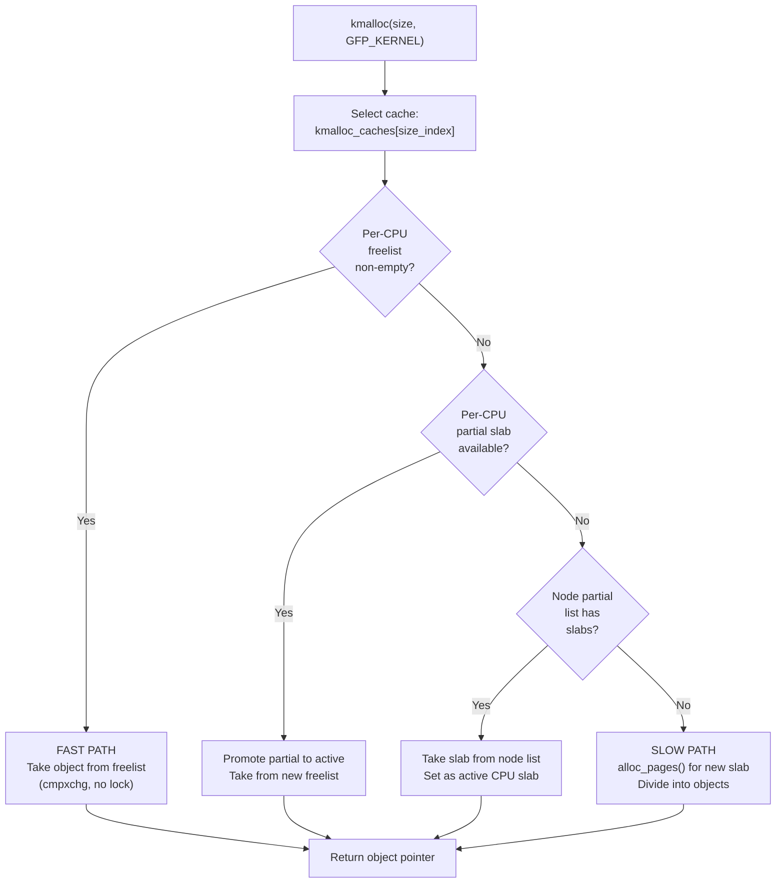

# Phase 12: SLAB/SLUB — Object-Level Memory Allocator

**Source:** `mm/slub.c`, `mm/slab_common.c`

## What Happens

`kmem_cache_init()` bootstraps the SLUB allocator (Linux's default slab allocator). After this, `kmalloc()` / `kzalloc()` work — the most commonly used kernel allocation functions.

## Why SLUB Exists

The buddy allocator deals in pages (4KB minimum). But most kernel allocations are much smaller:
- `struct inode`: ~600 bytes
- `struct task_struct`: ~7KB
- `struct dentry`: ~200 bytes
- `struct sk_buff`: ~256 bytes

Allocating a full page for a 200-byte object wastes 94% of the memory. SLUB subdivides pages into fixed-size objects.

## Core Concepts

### Slab Cache

A `struct kmem_cache` manages objects of one size:

```c
struct kmem_cache {
    const char *name;           // "dentry", "inode_cache", etc.
    unsigned int size;          // object size (including alignment)
    unsigned int object_size;   // requested size
    unsigned int offset;        // free pointer offset
    struct kmem_cache_cpu __percpu *cpu_slab;   // per-CPU slab
    struct kmem_cache_node *node[MAX_NUMNODES]; // per-node partial lists
    unsigned int min_partial;
    gfp_t allocflags;
    // ...
};
```

### Slab Page

A slab page (or compound page) contains multiple fixed-size objects:

```
One slab page (4KB) for 256-byte objects:
┌────────┬────────┬────────┬────────┬────────┬────────┬────────┬────────┐
│ obj 0  │ obj 1  │ obj 2  │ obj 3  │ obj 4  │ obj 5  │ obj 6  │ obj 7  │
│ 256B   │ 256B   │ 256B   │ 256B   │ 256B   │ 256B   │ 256B   │ 256B   │
└────────┴────────┴────────┴────────┴────────┴────────┴────────┴────────┘
         ▲ free    ▲ alloc   ▲ free   ▲ alloc   ▲ free
```

Free objects are linked via a freelist pointer stored inside the free object itself.

### Per-CPU Slabs

Each CPU has a "current" slab for fast, lockless allocation:

```c
struct kmem_cache_cpu {
    union {
        struct {
            void **freelist;      // pointer to next free object
            unsigned long tid;    // transaction ID (for cmpxchg)
        };
    };
    struct slab *slab;           // current slab page
    struct slab *partial;        // local partial slab list
};
```

Allocation fast path (no locks):
1. Read `freelist` from per-CPU slab
2. If non-NULL, take the object, advance freelist (cmpxchg)
3. If NULL, try partial list or allocate new slab page

## `kmem_cache_init()` Bootstrap

```c
void __init kmem_cache_init(void)
{
    // 1. Bootstrap: create the first kmem_cache using static storage
    //    (can't kmalloc a kmem_cache before kmalloc works!)

    // 2. Create kmem_cache for 'struct kmem_cache' itself
    kmem_cache = create_boot_cache(kmem_cache, "kmem_cache",
                                   sizeof(struct kmem_cache), ...);

    // 3. Create kmalloc caches for each size class
    create_kmalloc_caches();
}
```

### The Bootstrap Problem

To create a slab cache, you need `kmalloc()`. But `kmalloc()` needs slab caches. Solution: use a **statically allocated** `struct kmem_cache` for the initial bootstrap, then replace it with a properly allocated one.

### kmalloc Size Classes

```c
// Standard kmalloc caches:
//   kmalloc-8, kmalloc-16, kmalloc-32, kmalloc-64,
//   kmalloc-96, kmalloc-128, kmalloc-192, kmalloc-256,
//   kmalloc-512, kmalloc-1k, kmalloc-2k, kmalloc-4k, kmalloc-8k

// Size class selection:
kmalloc(17)    → kmalloc-32   (next power-of-2 cache)
kmalloc(100)   → kmalloc-128
kmalloc(1000)  → kmalloc-1k
kmalloc(5000)  → kmalloc-8k
kmalloc(9000)  → falls back to alloc_pages()
```

## Allocation Flow



## Deallocation Flow

```c
kfree(ptr);
// or
kmem_cache_free(cache, ptr);
```

1. Find the slab page from the pointer (via `virt_to_slab()`)
2. Find the kmem_cache from the slab
3. Fast path: Add object back to per-CPU freelist
4. If slab becomes completely free, may return to buddy

## Detailed Sub-Documents

| Document | Covers |
|----------|--------|
| [01_Kmem_Cache_Init.md](01_Kmem_Cache_Init.md) | Bootstrap sequence and kmalloc cache creation |

## Object Layout

```
Object in SLUB (with debugging disabled):
┌──────────────────────┐
│     User Data         │  ← returned pointer
│     (object_size)     │
├──────────────────────┤
│  [alignment padding]  │  (if needed)
├──────────────────────┤
│  Free Pointer         │  (only when object is free)
│  (or overlaps user    │
│   data area)          │
└──────────────────────┘

With SLUB_DEBUG:
┌──────────────────────┐
│  Red Zone (before)    │  detect underflow
├──────────────────────┤
│     User Data         │
├──────────────────────┤
│  Red Zone (after)     │  detect overflow
├──────────────────────┤
│  Free Pointer         │
├──────────────────────┤
│  Tracking Info        │  alloc/free caller, PID
└──────────────────────┘
```

## Key Takeaway

SLUB turns pages into pools of same-sized objects, making small allocations efficient. Its per-CPU freelist design eliminates lock contention for the fast path (the common case). The bootstrap uses static storage to solve the chicken-and-egg problem of needing `kmalloc()` to create the allocator itself. After `kmem_cache_init()`, the kernel's most important allocation interface — `kmalloc()` — is operational.
