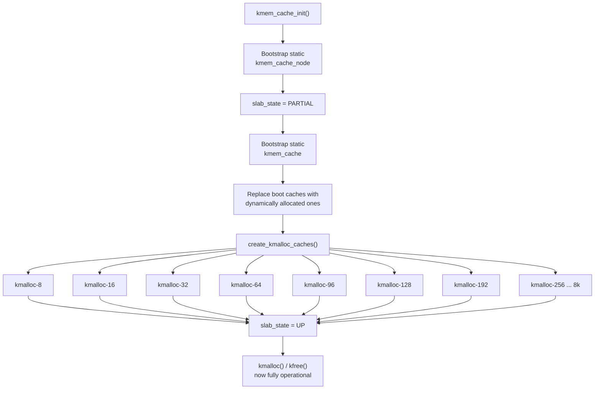

# `kmem_cache_init()` Bootstrap & kmalloc Caches

**Source:** `mm/slub.c`, `mm/slab_common.c`

## Purpose

This function solves the bootstrapping problem and creates all standard kmalloc caches. After it returns, `kmalloc()` / `kfree()` are fully operational.

## The Bootstrap Problem

```
To allocate memory:  need kmalloc()
To use kmalloc():    need a kmem_cache (slab cache)
To create a cache:   need kmalloc() to allocate struct kmem_cache
                     ↑ circular dependency!
```

### Solution: Static Boot Cache

```c
// Statically allocated in mm/slub.c:
static struct kmem_cache boot_kmem_cache;
static struct kmem_cache boot_kmem_cache_node;

void __init kmem_cache_init(void)
{
    // Step 1: Manually initialize the static kmem_cache
    // for "struct kmem_cache_node" (needed by all caches)
    __kmem_cache_bootstrap(&boot_kmem_cache_node,
                           sizeof(struct kmem_cache_node));

    // Step 2: Initialize the static kmem_cache
    // for "struct kmem_cache" itself
    __kmem_cache_bootstrap(&boot_kmem_cache,
                           sizeof(struct kmem_cache));

    // Now kmem_cache_alloc() works!

    // Step 3: Create proper dynamically-allocated copies
    // of the two bootstrap caches
    kmem_cache = kmem_cache_create("kmem_cache",
                    sizeof(struct kmem_cache), ...);
    kmem_cache_node = kmem_cache_create("kmem_cache_node",
                    sizeof(struct kmem_cache_node), ...);

    // Step 4: Create all kmalloc caches
    create_kmalloc_caches();

    // Step 5: Register with sysfs for /sys/kernel/slab/
    slab_state = UP;
}
```

## kmalloc Cache Table

```c
struct kmem_cache *kmalloc_caches[NR_KMALLOC_TYPES][KMALLOC_SHIFT_HIGH + 1];

// Index 0: size 0 (NULL)
// Index 3: size 8
// Index 4: size 16
// Index 5: size 32
// ...
// Index 13: size 8192
```

### Cache Types

```c
enum kmalloc_cache_type {
    KMALLOC_NORMAL,      // GFP_KERNEL
    KMALLOC_DMA,         // GFP_DMA
    KMALLOC_CGROUP,      // cgroup-accounted
    KMALLOC_RECLAIM,     // reclaimable
};
```

### Size Selection

```c
static __always_inline unsigned int kmalloc_index(size_t size)
{
    if (size <=   8) return 3;   // kmalloc-8
    if (size <=  16) return 4;   // kmalloc-16
    if (size <=  32) return 5;   // kmalloc-32
    if (size <=  64) return 6;   // kmalloc-64
    if (size <=  96) return 1;   // kmalloc-96  (non-power-of-2!)
    if (size <= 128) return 7;   // kmalloc-128
    if (size <= 192) return 2;   // kmalloc-192 (non-power-of-2!)
    if (size <= 256) return 8;   // kmalloc-256
    // ... powers of 2 up to KMALLOC_MAX_SIZE
}
```

Note: 96 and 192 are special non-power-of-2 caches to reduce waste for common sizes.

## Slab State Machine

```c
enum slab_state {
    DOWN,       // No slab allocator yet
    PARTIAL,    // kmem_cache_node works (bootstrap stage 1)
    UP,         // All caches created, sysfs registered
    FULL,       // sysfs fully initialized
};
```

The state gates what operations are permitted during bootstrap.

## Diagram



## After Bootstrap: Creating Custom Caches

Once `kmem_cache_init()` completes, subsystems create their own caches:

```c
// Examples from various subsystems:
kmem_cache_create("dentry",    sizeof(struct dentry),    ...);
kmem_cache_create("inode_cache", sizeof(struct inode),   ...);
kmem_cache_create("task_struct", sizeof(struct task_struct), ...);
kmem_cache_create("mm_struct",   sizeof(struct mm_struct), ...);
kmem_cache_create("vm_area_struct", sizeof(struct vm_area_struct), ...);
```

Each cache is optimized for its specific object size with appropriate alignment and flags.

## Key Takeaway

The SLUB bootstrap is a carefully staged process: start with static storage, create the cache-of-caches, then build all standard kmalloc caches. The two non-power-of-2 sizes (96, 192) reduce internal fragmentation for common allocation sizes. After this initialization, the kernel has its full `kmalloc()` API available — the workhorse allocation function used by virtually every subsystem.
