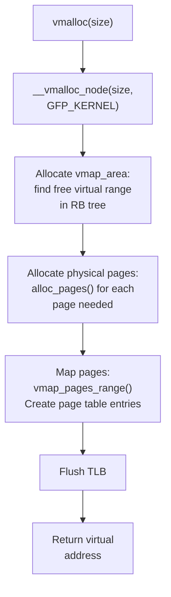

# Phase 13: vmalloc — Virtual Contiguous Memory Allocator

**Source:** `mm/vmalloc.c`

## What Happens

`vmalloc_init()` initializes the vmalloc subsystem — the allocator for **virtually contiguous but physically discontiguous** memory regions. After this, `vmalloc()`, `vmap()`, `ioremap()`, and module loading all work.

## Why vmalloc Exists

```
Buddy allocator (kmalloc for large):   vmalloc:
  Physical: contiguous ✓                Physical: scattered pages ✓
  Virtual:  contiguous ✓                Virtual:  contiguous ✓

  Problem: Hard to find large           Advantage: Any free pages work,
  contiguous physical blocks             just map them contiguously
  after system runs a while              in virtual address space
```

Use cases:
- **Module loading**: Kernel modules need large contiguous virtual regions
- **Large buffers**: When contiguous physical memory isn't needed
- **ioremap()**: Mapping device MMIO regions
- **vmap()**: Mapping arbitrary physical pages into contiguous virtual space

## vmalloc Address Space (ARM64)

```
ARM64 kernel virtual address space:

0xFFFF_8000_0000_0000 ┬─────────────────────┐
                      │  Linear map          │  (direct physical mapping)
                      │  (memblock region)   │
                      ├─────────────────────┤
                      │  vmalloc region      │  ← VMALLOC_START to VMALLOC_END
                      │  (dynamic mapping)   │     Managed by vmalloc subsystem
                      ├─────────────────────┤
                      │  fixmap              │
                      ├─────────────────────┤
                      │  PCI I/O             │
                      ├─────────────────────┤
                      │  modules             │
0xFFFF_FFFF_FFFF_FFFF ┴─────────────────────┘
```

## Core Data Structures

### `struct vmap_area`

Each vmalloc allocation is tracked by a `vmap_area`:

```c
struct vmap_area {
    unsigned long va_start;     // virtual start address
    unsigned long va_end;       // virtual end address
    struct rb_node rb_node;     // red-black tree node (for fast lookup)
    struct list_head list;      // linked list
    union {
        unsigned long subtree_max_size; // free area: largest gap in subtree
        struct vm_struct *vm;           // busy area: allocation metadata
    };
};
```

### `struct vm_struct`

Higher-level allocation descriptor:

```c
struct vm_struct {
    void *addr;              // virtual address
    unsigned long size;      // size including guard page
    unsigned long flags;     // VM_ALLOC, VM_IOREMAP, etc.
    struct page **pages;     // array of physical pages
    unsigned int nr_pages;   // number of pages
    phys_addr_t phys_addr;   // for ioremap: physical address
};
```

### Free Space Management

Free virtual address ranges are tracked in a **red-black tree** sorted by address, with each node augmented with `subtree_max_size` for fast best-fit searching:

```
                      [gap: 64KB]
                     /           \
            [gap: 16KB]        [gap: 128KB]
            /        \         /          \
      [gap: 4KB]  [gap: 8KB] [gap: 32KB] [gap: 256KB]

Looking for 20KB?
  → Root subtree_max_size covers it
  → Navigate to find best fit: 32KB gap
```

## `vmalloc_init()`

```c
void __init vmalloc_init(void)
{
    // 1. Initialize per-CPU vmap_block freelists
    //    (for small vmalloc allocations)

    // 2. Process early boot vmap_areas
    //    (created before vmalloc_init by ioremap, etc.)
    //    Move them from a temporary list to the main RB tree

    // 3. Set vmallocinfo ready for /proc/vmallocinfo
}
```

## Allocation Flow: `vmalloc(size)`



### Step by Step:

1. **Find virtual space**: Search the free vmap_area RB tree for a gap ≥ size + guard page
2. **Allocate pages**: Call `alloc_pages()` for each page (pages need NOT be contiguous)
3. **Map pages**: Walk the kernel page tables and create PTE entries mapping virtual → physical
4. **Guard page**: One unmapped page after each allocation to catch overflows

```
vmalloc(12KB) → 3 pages needed:

Virtual:    [ page A | page B | page C | GUARD ]
                ↓         ↓         ↓
Physical:   [ 0x1000 ] [ 0x5000 ] [ 0x9000 ]
               (scattered physical pages)
```

## `vfree()` — Deallocation

```c
void vfree(const void *addr)
{
    // 1. Find vmap_area by address (RB tree lookup)
    // 2. Unmap: clear page table entries
    // 3. TLB flush (may be lazy/batched)
    // 4. Free physical pages back to buddy
    // 5. Free vmap_area back to free tree
}
```

TLB flushing is expensive, so vfree uses **lazy TLB flushing** — accumulates unmaps and flushes in batches.

## `ioremap()` — Device Memory Mapping

```c
void __iomem *ioremap(phys_addr_t phys, size_t size)
{
    // Same virtual space allocation as vmalloc
    // But NO physical page allocation
    // Maps the given physical address directly
    // Uses device memory attributes (uncacheable)
}
```

## Performance Considerations

| Feature | kmalloc | vmalloc |
|---------|---------|---------|
| Physical contiguity | Yes | No |
| TLB pressure | Low (linear map) | Higher (individual mappings) |
| Max size | Limited by fragmentation | Limited by virtual space |
| Speed | Faster | Slower (page table setup) |
| DMA-safe | Yes | Generally no |

## Key Takeaway

vmalloc completes the kernel's memory allocation stack. It provides large, virtually contiguous allocations without requiring physical contiguity — essential for kernel modules, large buffers, and device mappings. With `vmalloc_init()`, the last major memory subsystem is online, and the kernel's full memory management infrastructure is operational:

```
Assembly:        No allocator (manual page tables)
Early boot:      memblock (simple, sequential)
After mm_init:   buddy (pages) + SLUB (objects) + vmalloc (virtual)
                 ↑ Full allocator stack — ready for the rest of init
```
