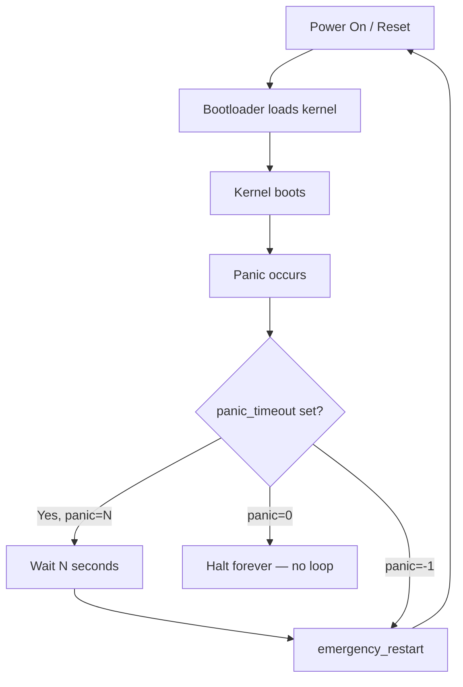
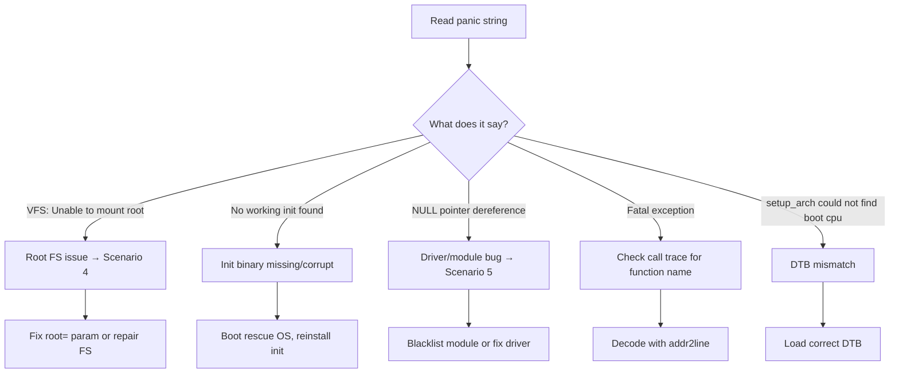

# Scenario 1: Continuous Reboot Loop

## Symptom
The system boots, hits a kernel panic, reboots, and panics again — stuck in an infinite reboot loop.
You may see a brief flash of text on screen before it resets, or the serial console shows repeating panic messages.

---

## What's Happening Internally



### Why it reboots instead of halting:
```c
// kernel/panic.c — inside panic()
if (panic_timeout > 0) {
    pr_emerg("Rebooting in %d seconds..\n", panic_timeout);
    for (i = 0; i < panic_timeout * 1000; i += PANIC_TIMER_STEP)
        mdelay(PANIC_TIMER_STEP);
}
if (panic_timeout != 0) {
    emergency_restart();    // <<< THIS causes the reboot
    // panic_timeout > 0: reboot after delay
    // panic_timeout < 0: reboot immediately (panic=-1)
}
// panic_timeout == 0: fall through to infinite loop (halt)
```

### Hardware watchdog can also cause reboot:
```
// If a hardware watchdog timer (WDT) is enabled and the kernel panics
// without kicking the WDT, the WDT expires and resets the board.
// This happens even if panic_timeout=0 (halt)!
```

---

## Common Causes

### 1. Kernel module crash during init
```
[    3.456789] BUG: unable to handle kernel NULL pointer dereference
[    3.456790] IP: my_driver_init+0x42/0x100 [my_driver]
[    3.456791] ... (oops)
[    3.456792] Kernel panic - not syncing: Fatal exception
```
**Root cause**: A module loaded via `/etc/modules` or initrd crashes on every boot.

### 2. init process cannot start
```
[    5.123456] Kernel panic - not syncing: No working init found.
               Try passing init= option to kernel.
               See Linux Documentation/admin-guide/init.rst for guidance.
```
**Root cause**: `/sbin/init`, `/bin/init`, `/bin/sh` — none found or all corrupt.

### 3. Root filesystem corruption
```
[    4.567890] EXT4-fs error: unable to read superblock
[    4.567891] Kernel panic - not syncing: VFS: Unable to mount root fs on unknown-block(179,2)
```
**Root cause**: Filesystem corrupted, wrong `root=` parameter, missing driver.

### 4. Memory corruption during boot
```
[    2.345678] Unable to handle kernel paging request at virtual address ffff0000deadbeef
[    2.345679] Kernel panic - not syncing: Fatal exception
```
**Root cause**: Bad RAM, incorrect DTB memory nodes, kernel image corruption.

### 5. DTB / Device Tree mismatch
```
[    0.000000] Error: FDT: unrecognized/unsupported machine
[    0.000000] Kernel panic - not syncing: setup_arch(): could not find boot cpu
```
**Root cause**: Wrong DTB loaded for this board.

---

## How to Debug

### Step 1: Break the reboot loop
You need to **stop the reboot** so you can read the panic message.

#### Method A: Change boot parameter
```bash
# In U-Boot:
setenv bootargs "console=ttyS0,115200 panic=0 ${bootargs}"
# panic=0 → halt instead of reboot

# In GRUB:
# Press 'e' at boot menu, add panic=0 to linux line
```

#### Method B: Interrupt at bootloader
```bash
# Most bootloaders have a key to stop autoboot
# U-Boot: press any key during "Hit any key to stop autoboot"
# GRUB: hold Shift during POST
```

#### Method C: Disable hardware watchdog
```bash
# If hardware WDT is resetting the board:
# In U-Boot:
setenv bootargs "nowatchdog ${bootargs}"

# Or disable in DTB:
# watchdog { status = "disabled"; };
```

### Step 2: Capture the panic message
```bash
# Serial console (best for embedded ARM64)
console=ttyS0,115200 earlyprintk earlycon

# After adding panic=0, the system will halt at the panic
# and you can read the full message on serial console
```

### Step 3: Identify the cause from the message



### Step 4: Apply fixes

#### Fix: Module causing crash
```bash
# Boot with module blacklisted
setenv bootargs "modprobe.blacklist=my_driver ${bootargs}"

# Or if in initrd, rebuild initrd without the module:
# (from rescue OS)
echo "blacklist my_driver" >> /etc/modprobe.d/blacklist.conf
update-initramfs -u
```

#### Fix: init binary missing
```bash
# Boot with alternative init
setenv bootargs "init=/bin/bash ${bootargs}"

# Then from bash shell, fix the init binary:
mount -o remount,rw /
apt install --reinstall systemd-sysv
# or
cp /backup/sbin/init /sbin/init
```

#### Fix: Wrong root= parameter
```bash
# List available block devices from U-Boot or rescue shell
ls /dev/mmc*
ls /dev/sd*
blkid

# Fix root= in bootloader
setenv bootargs "root=/dev/mmcblk0p2 rootfstype=ext4 ${bootargs}"
```

#### Fix: Hardware watchdog causing reset
```bash
# Temporarily disable WDT to debug
# In U-Boot:
fdt set /watchdog status disabled

# Or in kernel config:
# CONFIG_WATCHDOG=n (for debug only!)
```

### Step 5: Verify fix
```bash
# Boot with fix applied
# If it boots successfully, make the fix permanent:

# For U-Boot:
saveenv

# For GRUB:
vi /etc/default/grub
update-grub
```

---

## Prevention

| Prevention | How |
|------------|-----|
| Set `panic=0` in production (embedded) | Halt instead of reboot loop — allows debug |
| Enable pstore/ramoops | Preserves crash log across reboots |
| Limit reboot attempts | Use bootloader boot count (U-Boot `bootcount`) |
| Serial console logging | Always pipe serial to a log server |
| Test modules individually | Load one at a time, verify stability |

### U-Boot Boot Counter (prevent infinite loop):
```bash
# U-Boot environment:
setenv bootlimit 3                    # max 3 boot attempts
setenv altbootcmd "run recovery"      # fallback after 3 failures
setenv bootcount 0
saveenv
```

---

## Quick Reference

| Item | Value |
|------|-------|
| **Symptom** | System reboots repeatedly, never reaches login |
| **Key log** | `Kernel panic - not syncing: ...` repeated in serial log |
| **First action** | Add `panic=0` to stop the loop |
| **Debug tool** | Serial console + `earlyprintk` |
| **Common causes** | Bad module, missing init, wrong root=, WDT, DTB mismatch |
