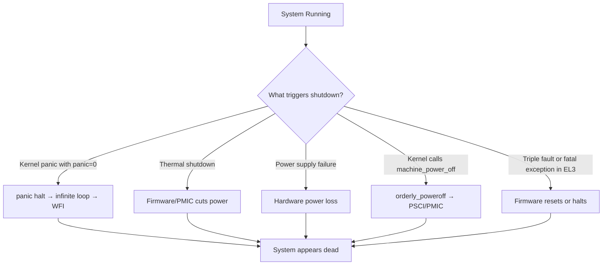
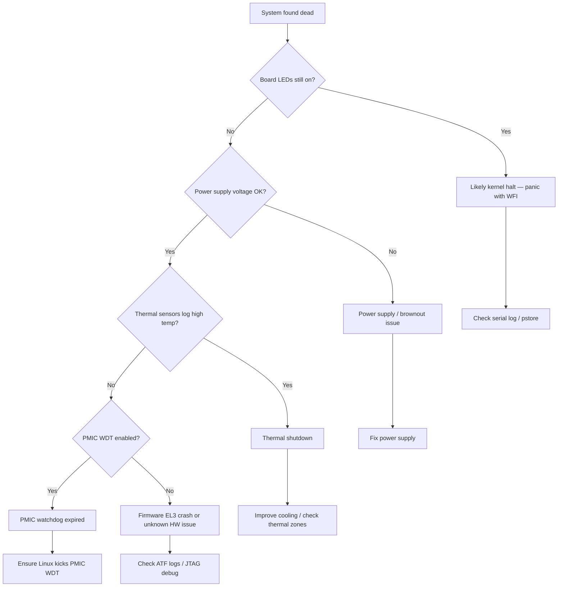

# Scenario 2: System Fully Shuts Down (Unexpected Power Off)

## Symptom
The system suddenly powers off during operation or during boot. No panic message is visible. The system does NOT reboot — it is completely dead until manually power-cycled.

---

## What's Happening Internally



### Kernel halt path (panic with timeout=0):
```c
// kernel/panic.c — end of panic()
// When panic_timeout == 0:
pr_emerg("---[ end Kernel panic ]---\n");
local_irq_enable();
for (;;) {
    // ARM64: WFI = Wait For Interrupt
    // CPU enters low-power state, appears "dead"
    // Only NMI or external reset can wake it
    asm volatile("wfi" ::: "memory");
}
```

### PSCI power off (ARM64 standard):
```c
// drivers/firmware/psci/psci.c
static void psci_sys_poweroff(void)
{
    invoke_psci_fn(PSCI_0_2_FN_SYSTEM_OFF, 0, 0, 0);
    // Calls ARM Trusted Firmware (ATF) at EL3
    // ATF talks to PMIC to cut power
}
```

---

## Common Causes

### 1. Thermal Shutdown
The SoC temperature exceeds the critical threshold. The thermal framework shuts down the system.

```
[  120.456789] thermal thermal_zone0: critical temperature reached (105 C), shutting down
[  120.456790] reboot: SYSTEM POWER OFF
```

**Code path:**
```
thermal_zone_device_update()                [drivers/thermal/thermal_core.c]
 └─► handle_critical_trips()
      └─► if (tz->temperature >= trip_temp)
           └─► orderly_poweroff(true)        [kernel/reboot.c]
                └─► run_cmd("/sbin/poweroff")
                     └─► kernel_power_off()
                          └─► machine_power_off()
                               └─► psci_sys_poweroff()  [ARM64]
```

### 2. Power Supply Failure / Brownout
- Voltage drops below SoC minimum operating voltage
- No kernel log — hardware cuts out instantly
- Common on battery-powered or USB-powered boards

### 3. Kernel panic with halt (panic=0)
- System hits a panic, halts with `wfi` instruction
- Looks like "dead" — no display, no serial output, no response
- Difference from real power-off: board LEDs may still be on

### 4. Firmware/EL3 Fatal Error
- ARM Trusted Firmware (ATF) or secure monitor hits a fatal error
- EL3 code cannot call Linux panic() — it just halts or resets
- No kernel log at all

### 5. PMIC Watchdog
- Some boards have a PMIC (Power Management IC) watchdog
- If Linux doesn't kick the PMIC WDT, PMIC cuts power
- Different from CPU watchdog — this cuts actual power rails

### 6. OOM Killer → init killed → panic → halt
```
[  300.123456] Out of memory: Killed process 1 (systemd) total-vm:131072kB
[  300.123457] Kernel panic - not syncing: Attempted to kill init! exitcode=0x00000009
```
If `panic=0`, system halts after this.

---

## How to Debug

### Step 1: Determine if it's a kernel panic or hardware power-off



### Step 2: Check for stored panic logs
```bash
# After manually powering back on:

# 1. Check pstore
ls /sys/fs/pstore/
cat /sys/fs/pstore/dmesg-ramoops-0

# 2. Check systemd journal (if filesystem survived)
journalctl -b -1    # previous boot log
journalctl --list-boots

# 3. Check /var/log/kern.log or /var/log/syslog
grep -i "panic\|oops\|thermal\|power" /var/log/kern.log
```

### Step 3: Check thermal
```bash
# Read current thermal zones
cat /sys/class/thermal/thermal_zone*/type
cat /sys/class/thermal/thermal_zone*/temp

# Check thermal trip points
cat /sys/class/thermal/thermal_zone0/trip_point_*_temp
cat /sys/class/thermal/thermal_zone0/trip_point_*_type
# "critical" type = shutdown threshold

# Monitor in real-time
watch -n 1 "cat /sys/class/thermal/thermal_zone*/temp"
```

### Step 4: Check power supply
```bash
# For USB-powered boards (RPi, etc.):
# Look for undervoltage warnings
dmesg | grep -i "under-voltage\|undervolt\|brownout"

# Raspberry Pi specific:
vcgencmd get_throttled
# Bit 0: under-voltage detected
# Bit 16: under-voltage has occurred since last reboot

# Check PMIC status (if accessible via sysfs)
ls /sys/class/regulator/
cat /sys/class/regulator/regulator.*/microvolts
```

### Step 5: Check if PMIC WDT is the cause
```bash
# Check PMIC watchdog status in DTB
dtc -I dtb -O dts /boot/dtb | grep -A 5 "watchdog"

# Check if the PMIC WDT driver is loaded
lsmod | grep -i "wdt\|watchdog\|pmic"
ls /dev/watchdog*

# If PMIC WDT exists, ensure it's being kicked
cat /sys/class/watchdog/watchdog*/state
cat /sys/class/watchdog/watchdog*/timeout
```

---

## Fixes

### Fix: Thermal shutdown
```bash
# 1. Increase critical temperature threshold (if safe for hardware!)
# In DTB:
# thermal-zones {
#     cpu-thermal {
#         trips {
#             cpu_crit: cpu-crit {
#                 temperature = <110000>;  /* raise from 105°C to 110°C */
#                 type = "critical";
#             };
#         };
#     };
# };

# 2. Better: Improve cooling
# - Add heatsink
# - Add fan (active cooling)
# - Reduce CPU frequency: echo 1000000 > /sys/devices/system/cpu/cpu0/cpufreq/scaling_max_freq

# 3. Enable thermal throttling before shutdown
# In DTB, add a "passive" trip point BELOW critical:
# cpu_alert: cpu-alert {
#     temperature = <85000>;
#     type = "passive";    /* throttle CPU before shutdown */
# };
```

### Fix: Power supply
```bash
# Use a proper power supply rated for the board
# RPi 4: requires 5V 3A USB-C
# Most ARM64 dev boards: 12V 2A barrel jack

# Add capacitors / use regulated supply
# Avoid long USB cables (voltage drop)
```

### Fix: PMIC watchdog
```bash
# Option 1: Kick the PMIC WDT from userspace
# Install watchdog daemon
apt install watchdog
# Configure /etc/watchdog.conf
# watchdog-device = /dev/watchdog0

# Option 2: Disable PMIC WDT in DTB (development only!)
# pmic-watchdog { status = "disabled"; };
```

### Fix: Kernel panic causing halt
```bash
# Change panic=0 to panic=10 so it reboots instead of halting
# At least you can collect logs on next boot

# Better: Enable kdump so it captures a crash dump before rebooting
# Boot param: crashkernel=256M panic=10
```

### Fix: EL3/ATF crash
```bash
# Update ARM Trusted Firmware (ATF) to latest version
# Check ATF build options:
# - DEBUG=1 for debug build with logging
# - LOG_LEVEL=40 for verbose output
# - CRASH_REPORTING=1 for crash reports

# ATF logs appear on UART before Linux boots
# Use JTAG/SWD debugger for post-mortem if no UART
```

---

## Prevention Checklist

| Check | Action |
|-------|--------|
| Thermal monitoring | Set up thermal throttling (passive trip) before critical shutdown |
| Power supply | Use rated supply, avoid USB cables for high-power boards |
| PMIC WDT | Run watchdog daemon or disable WDT if not needed |
| pstore/ramoops | Enable to capture panic logs across power cycles |
| Serial console | Always connected to log server in development |
| panic= setting | Use `panic=10` (reboot after 10s) instead of `panic=0` (halt) |
| kdump | Enable for post-mortem analysis |
| UPS / battery backup | For critical systems, prevent power loss |

---

## Quick Reference

| Item | Value |
|------|-------|
| **Symptom** | System dead, no response, must power-cycle |
| **Key difference from reboot loop** | System does NOT come back on its own |
| **First action** | Check if LEDs are on (kernel halt) vs off (power loss) |
| **Debug tool** | pstore, serial log, thermal sysfs, PMIC registers |
| **Common causes** | Thermal, power supply, PMIC WDT, panic halt, EL3 crash |
