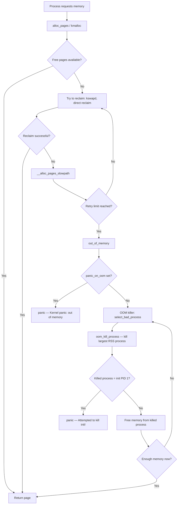
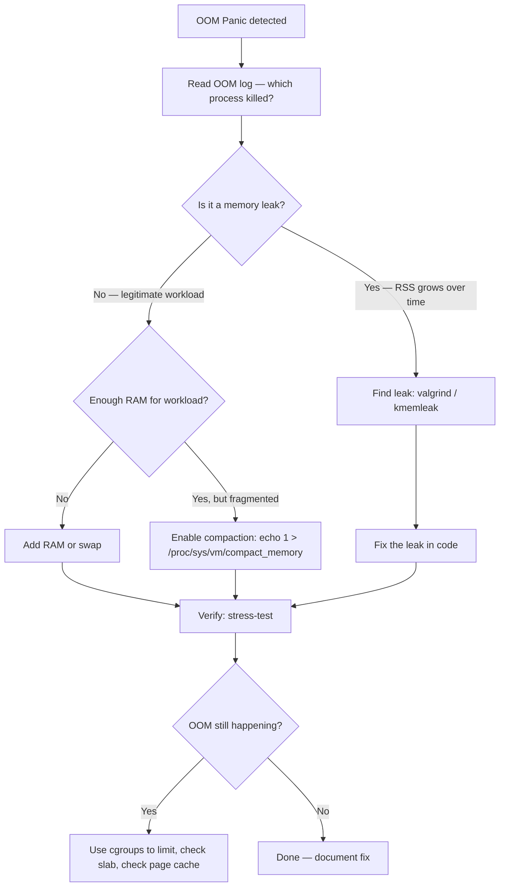

# Scenario 3: Out-of-Memory (OOM) Panic

## Symptom
The system runs out of physical memory. The OOM killer starts killing processes. If it kills PID 1 (init/systemd) or if `panic_on_oom` is set, the kernel panics.

Typical console output:
```
[  456.789012] Out of memory: Killed process 3421 (my_app) total-vm:2097152kB, anon-rss:1048576kB
[  456.789013] oom_reaper: reaped process 3421 (my_app), now anon-rss:0kB
[  457.123456] Out of memory: Killed process 1 (systemd) total-vm:131072kB
[  457.123457] Kernel panic - not syncing: Attempted to kill init! exitcode=0x00000009
```

---

## What's Happening Internally

### OOM Kill → Panic Flow


### Code Path — Page Allocation Failure

```
alloc_pages(gfp, order)                     [mm/page_alloc.c]
 └─► __alloc_pages(gfp, order, ...)
      └─► __alloc_pages_slowpath()
           ├─► wake_all_kswapds()           // wake background reclaimers
           ├─► __alloc_pages_direct_reclaim()
           │    └─► try_to_free_pages()     // shrink caches, swap out
           ├─► __alloc_pages_direct_compact() // try memory compaction
           └─► __alloc_pages_may_oom()
                └─► out_of_memory()          [mm/oom_kill.c]
                     ├─► if (sysctl_panic_on_oom)
                     │    └─► panic("Out of memory: %s\n", ...);
                     └─► select_bad_process()
                          └─► oom_kill_process()
                               └─► do_send_sig_info(SIGKILL, ...)
```

### OOM Killer Selection — `select_bad_process()`

```c
// mm/oom_kill.c
static struct task_struct *select_bad_process(struct oom_control *oc)
{
    struct task_struct *p;

    for_each_process(p) {
        // Skip kernel threads, already-dying processes
        if (oom_unkillable_task(p))
            continue;

        // Calculate "badness" score
        unsigned long points = oom_badness(p, oc->totalpages);

        // Higher score = more likely to be killed
        // Score based on: RSS + swap usage + oom_score_adj
        if (points > oc->chosen_points) {
            oc->chosen = p;
            oc->chosen_points = points;
        }
    }
    return oc->chosen;
}
```

### `oom_badness()` — How Score is Calculated

```c
// mm/oom_kill.c
long oom_badness(struct task_struct *p, unsigned long totalpages)
{
    long points;
    long adj;

    // Start with RSS (Resident Set Size) + swap usage
    points = get_mm_rss(p->mm) +     // pages in RAM
             get_mm_counter(p->mm, MM_SWAPENTS) +  // pages in swap
             mm_pgtables_bytes(p->mm) / PAGE_SIZE;  // page table pages

    // Apply oom_score_adj (-1000 to +1000)
    adj = (long)p->signal->oom_score_adj;

    // adj = -1000 means "never kill this process" (OOM_SCORE_ADJ_MIN)
    if (adj == OOM_SCORE_ADJ_MIN)
        return LONG_MIN;    // effectively unkillable

    // Scale adjustment proportionally
    // adj = +1000 means "kill this first" (OOM_SCORE_ADJ_MAX)
    adj *= totalpages / 1000;
    points += adj;

    return points > 0 ? points : 1;
}
```

---

## OOM Log Message Explained

```
[  456.789012] my_app invoked oom-killer: gfp_mask=0x100cca(GFP_HIGHUSER_MOVABLE), order=0, oom_score_adj=0
[  456.789013] CPU: 2 PID: 3421 Comm: my_app Not tainted 6.1.0 #1
[  456.789014] Hardware name: ...
[  456.789015] Call trace:
[  456.789016]  dump_backtrace+0x0/0x1c0
[  456.789017]  ...
[  456.789018]  out_of_memory+0x1a4/0x530
[  456.789019]  __alloc_pages_slowpath+0xb94/0xc78
[  456.789020]  __alloc_pages+0x234/0x278
[  456.789021]  ...
[  456.789022] Mem-Info:
[  456.789023] active_anon:125000 inactive_anon:3000 isolated_anon:0
[  456.789024]  active_file:500 inactive_file:200 isolated_file:0
[  456.789025]  unevictable:0 dirty:5 writeback:0
[  456.789026]  slab_reclaimable:1200 slab_unreclaimable:8500
[  456.789027]  mapped:800 shmem:100 pagetables:3000
[  456.789028]  free:128 free_pcp:32 free_cma:0
[  456.789029]
[  456.789030] Node 0 Normal free:512kB min:2048kB low:4096kB high:6144kB
[  456.789031]    active_anon:500000kB inactive_anon:12000kB
[  456.789032]    ...
[  456.789033]
[  456.789034] [ pid ]   uid  tgid total_vm      rss pgtables_bytes swapents oom_score_adj name
[  456.789035] [ 1234]     0  1234   131072     8500       532480        0             0  systemd
[  456.789036] [ 3421]  1000  3421  2097152  1048576     16777216        0             0  my_app
[  456.789037]
[  456.789038] oom-kill:constraint=CONSTRAINT_NONE,nodemask=(null),
               task=my_app,pid=3421,uid=1000
[  456.789039] Out of memory: Killed process 3421 (my_app) total-vm:2097152kB,
               anon-rss:1048576kB, file-rss:0kB, shmem-rss:0kB, UID:1000
               pgtables:16777216 bytes
```

### Key Fields:
| Field | Meaning |
|-------|---------|
| `gfp_mask=0x100cca` | Allocation flags (what type of memory was requested) |
| `order=0` | Single page (4KB) was requested |
| `free:128` | Only 128 pages (512KB) free — nearly zero! |
| `min:2048kB` | Watermark minimum — below this triggers OOM |
| `total_vm` | Total virtual memory of process (in pages) |
| `rss` | Resident Set Size — actual physical pages used |
| `oom_score_adj` | User-set priority (-1000 = never kill, +1000 = kill first) |

---

## How to Debug

### Step 1: Confirm it's OOM
```bash
# Check dmesg for OOM messages
dmesg | grep -i "out of memory\|oom\|killed process"

# Check systemd journal
journalctl -k | grep -i oom

# Check /var/log/kern.log
grep -i "oom" /var/log/kern.log
```

### Step 2: Find what consumed all memory
```bash
# Current memory usage
free -h
cat /proc/meminfo

# Per-process memory (sorted by RSS)
ps aux --sort=-%mem | head -20

# Detailed per-process
smem -r -s rss | tail -20

# Slab memory (kernel allocations)
cat /proc/slabinfo | sort -k 3 -n -r | head -20
# Or
slabtop -o

# Check for memory leaks — track over time
watch -n 5 "free -h && echo '---' && ps aux --sort=-%mem | head -5"
```

### Step 3: Check OOM score of processes
```bash
# For each process, check its OOM score
for pid in $(ls /proc/ | grep '^[0-9]'); do
    if [ -f /proc/$pid/oom_score ]; then
        echo "PID=$pid SCORE=$(cat /proc/$pid/oom_score) ADJ=$(cat /proc/$pid/oom_score_adj) CMD=$(cat /proc/$pid/cmdline 2>/dev/null | tr '\0' ' ')"
    fi
done 2>/dev/null | sort -t= -k3 -n -r | head -20
```

### Step 4: Check memory watermarks
```bash
# Zone watermarks
cat /proc/zoneinfo | grep -E "Node|zone|min|low|high|free"

# If free < min for any zone, OOM is imminent
# Watermarks (in pages):
#   high > low > min
#   free < min → OOM killer triggers
```

---

## Fixes

### Fix 1: Protect critical processes (init, systemd)
```bash
# Set oom_score_adj = -1000 for critical processes (never kill)
echo -1000 > /proc/1/oom_score_adj              # protect init/systemd
echo -1000 > /proc/$(pidof sshd)/oom_score_adj  # protect sshd

# In systemd unit file:
# [Service]
# OOMScoreAdjust=-1000
```

### Fix 2: Add swap space
```bash
# Create a swap file
fallocate -l 2G /swapfile
chmod 600 /swapfile
mkswap /swapfile
swapon /swapfile

# Make permanent
echo '/swapfile none swap sw 0 0' >> /etc/fstab

# Check swap is active
free -h
```

### Fix 3: Tune OOM behavior
```bash
# Don't panic on OOM — just let OOM killer do its job
echo 0 > /proc/sys/vm/panic_on_oom

# Values:
# 0 = OOM killer picks a process (default)
# 1 = panic on OOM (embedded systems that should never OOM)
# 2 = panic on OOM always (even if cgroup-constrained)

# Overcommit settings
echo 2 > /proc/sys/vm/overcommit_memory     # strict accounting
echo 80 > /proc/sys/vm/overcommit_ratio      # allow 80% of RAM + swap

# Values for overcommit_memory:
# 0 = heuristic (default, allows moderate overcommit)
# 1 = always allow (never fail malloc — dangerous!)
# 2 = strict — limit to swap + ratio% of RAM
```

### Fix 4: Use cgroups to limit memory per service
```bash
# Systemd cgroup (per service)
# In /etc/systemd/system/my_app.service:
# [Service]
# MemoryMax=512M
# MemoryHigh=400M

systemctl daemon-reload
systemctl restart my_app

# Or manual cgroup v2:
mkdir -p /sys/fs/cgroup/my_app
echo 536870912 > /sys/fs/cgroup/my_app/memory.max   # 512MB
echo $PID > /sys/fs/cgroup/my_app/cgroup.procs
```

### Fix 5: Fix the memory leak
```bash
# Use valgrind to find leaks (userspace)
valgrind --leak-check=full --show-reachable=yes ./my_app

# Use kmemleak to find kernel memory leaks
echo scan > /sys/kernel/debug/kmemleak
cat /sys/kernel/debug/kmemleak

# Use /proc/slab_allocators for per-caller slab tracking
# (requires CONFIG_DEBUG_SLAB=y)
```

### Fix 6: Increase physical RAM (if possible)
```bash
# For VMs: increase RAM in hypervisor config
# For embedded: check if DTB reports all available RAM
dtc -I dtb -O dts /boot/dtb | grep -A 5 "memory@"
# Ensure reg = covers all physical RAM
```

---

## OOM Debug Flow



---

## Quick Reference

| Item | Value |
|------|-------|
| **Symptom** | System slows down, processes killed, may panic |
| **Key log** | `Out of memory: Killed process ...` |
| **Panic trigger** | `panic_on_oom=1` or init process killed |
| **First action** | Check `dmesg \| grep oom`, check `free -h` |
| **Common causes** | Memory leak, insufficient RAM, no swap, runaway process |
| **Key files** | `/proc/meminfo`, `/proc/zoneinfo`, `/proc/<pid>/oom_score` |
| **Key sysctl** | `vm.panic_on_oom`, `vm.overcommit_memory`, `vm.overcommit_ratio` |
