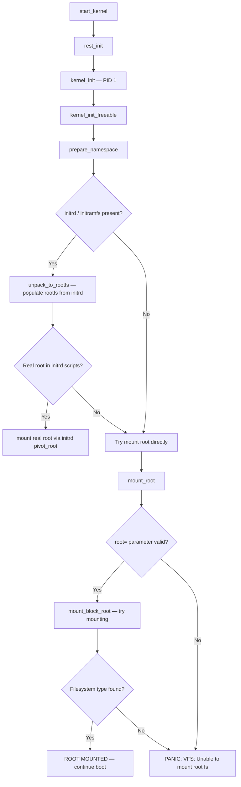

# Scenario 4: Root Filesystem Panic (VFS: Unable to mount root fs)

## Symptom
The kernel boots, initializes hardware, but cannot mount the root filesystem. This is a **hard panic** — the kernel cannot continue without a root filesystem.

```
[    5.678901] VFS: Cannot open root device "mmcblk0p2" or unknown-block(0,0): error -6
[    5.678902] Please append a correct "root=" boot option; here are the available partitions:
[    5.678903] b300      15273984 mmcblk0
[    5.678904]  driver: mmcblk
[    5.678905]   b301          8192 mmcblk0p1 00000000-01
[    5.678906]   b302      15263744 mmcblk0p2 00000000-02
[    5.678907] Kernel panic - not syncing: VFS: Unable to mount root fs on unknown-block(0,0)
```

---

## What's Happening Internally

### Root Mount Sequence



### Code Path

```
kernel_init()                                [init/main.c]
 └─► kernel_init_freeable()
      └─► prepare_namespace()                [init/do_mounts.c]
           ├─► wait_for_device_probe()       // wait for storage drivers
           ├─► md_run_setup()                // software RAID
           ├─► if (saved_root_name[0])
           │    └─► mount_root()             [init/do_mounts.c]
           │         └─► mount_block_root()
           │              ├─► do_mount_root()
           │              │    └─► init_mount(root_device_name, "/root", fs, ...)
           │              │         └─► vfs_kern_mount()
           │              │              └─► mount_fs()   // calls fs->mount()
           │              └─► if (err)
           │                   └─► panic("VFS: Unable to mount root fs on %s", ...)
           └─► init_mount(".", "/", NULL, MS_MOVE, NULL)
```

### `mount_block_root()` — What It Tries

```c
// init/do_mounts.c
void __init mount_block_root(char *name, int flags)
{
    struct page *page = alloc_page(GFP_KERNEL);
    char *fs_names = page_address(page);

    // Get list of compiled-in filesystem types
    // e.g., "ext4\0xfs\0btrfs\0vfat\0squashfs\0"
    get_fs_names(fs_names);

    // Try each filesystem type
    for (p = fs_names; *p; p += strlen(p) + 1) {
        int err = do_mount_root(name, p, flags, root_mount_data);

        switch (err) {
        case 0:
            return;   // SUCCESS — root mounted
        case -EACCES:
        case -EINVAL:
            continue; // wrong fs type, try next
        }
    }

    // All filesystem types failed
    // Print available partitions to help user
    printk_all_partitions();

    panic("VFS: Unable to mount root fs on %s", name);
}
```

---

## Common Causes

### 1. Wrong `root=` boot parameter
```bash
# Kernel was told: root=/dev/sda1
# But actual device is: /dev/mmcblk0p2
# Result: "Cannot open root device 'sda1'"
```

### 2. Missing storage driver in kernel/initrd
```bash
# SD/eMMC driver (sdhci) not compiled in kernel
# NVMe driver not in initrd
# Result: device node never appears → "unknown-block(0,0)"
```

### 3. Filesystem module not compiled in
```bash
# Root is ext4, but CONFIG_EXT4_FS is not set (or is a module not in initrd)
# Result: kernel tries all compiled-in fs types, none match
```

### 4. Corrupted filesystem
```bash
# Superblock corrupted, journal corrupted
# ext4_fill_super() returns error
```

### 5. Missing or corrupt initrd/initramfs
```bash
# Bootloader loads wrong initrd or initrd is truncated
# initrd scripts fail to find/mount real root
```

### 6. Timing — storage device not ready yet
```bash
# Slow USB/NFS/iSCSI — device not enumerated when mount_root runs
# Need: rootwait or rootdelay=N
```

---

## How to Debug

### Step 1: Read the panic message carefully


### Step 2: Check from bootloader
```bash
# U-Boot: examine current boot args
printenv bootargs
# Look for root= parameter

# List available block devices (if U-Boot supports it)
mmc list
mmc part
ls mmc 0:2 /          # try to list files on partition

# GRUB: press 'e' at boot menu, check linux line for root=
```

### Step 3: Boot with alternative root or shell
```bash
# Boot to shell (bypass root mount)
# Add to kernel command line:
init=/bin/sh

# Or use a rescue initrd:
# In U-Boot:
setenv bootargs "root=/dev/ram0 rdinit=/bin/sh"
```

### Step 4: From rescue shell, investigate
```bash
# List all block devices
cat /proc/partitions
ls -la /dev/mmc* /dev/sd* /dev/nvme* 2>/dev/null

# Check what filesystems are supported
cat /proc/filesystems

# Try manual mount
mount -t ext4 /dev/mmcblk0p2 /mnt
# If this fails, the error message tells you exactly what's wrong

# Check filesystem health
fsck.ext4 -n /dev/mmcblk0p2    # -n = read-only check
```

### Step 5: Check if storage driver is loaded
```bash
# From rescue shell / initrd:
lsmod | grep -i "mmc\|sdhci\|nvme\|ahci\|sd_mod"

# Check kernel config
zcat /proc/config.gz | grep -i "MMC\|SDHCI\|EXT4\|XFS"
# CONFIG_MMC=y         ← compiled in (good)
# CONFIG_MMC=m         ← module (must be in initrd)
# # CONFIG_MMC is not set  ← MISSING (bad)
```

---

## Fixes

### Fix 1: Correct the `root=` parameter
```bash
# U-Boot:
setenv bootargs "root=/dev/mmcblk0p2 rootfstype=ext4 rootwait console=ttyS0,115200"
saveenv
boot

# GRUB (/etc/default/grub):
GRUB_CMDLINE_LINUX="root=/dev/sda2 rootfstype=ext4"
# Then: update-grub

# Use UUID (more reliable than device names):
root=UUID=a1b2c3d4-e5f6-7890-abcd-ef1234567890
# Find UUID: blkid /dev/mmcblk0p2
```

### Fix 2: Add `rootwait` for slow devices
```bash
# rootwait: wait indefinitely for root device to appear
setenv bootargs "root=/dev/mmcblk0p2 rootwait ${bootargs}"

# rootdelay=N: wait N seconds
setenv bootargs "root=/dev/mmcblk0p2 rootdelay=5 ${bootargs}"
```

### Fix 3: Rebuild kernel with correct drivers
```bash
# Enable storage driver:
# make menuconfig
# Device Drivers → MMC/SD/SDIO → SDHCI → (your controller)
# Set to =y (built-in) for rootfs driver, not =m (module)

# Enable filesystem:
# File Systems → Ext4 → set to =y

# Rebuild
make -j$(nproc) Image dtbs modules
```

### Fix 4: Rebuild initrd with correct modules
```bash
# Debian/Ubuntu:
update-initramfs -u -k $(uname -r)

# Or manually add modules to initrd:
echo "sdhci_pltfm" >> /etc/initramfs-tools/modules
echo "sdhci_of_arasan" >> /etc/initramfs-tools/modules
update-initramfs -u

# Fedora/RHEL:
dracut --force --add-drivers "sdhci ahci ext4"
```

### Fix 5: Repair corrupted filesystem
```bash
# Boot from USB/NFS rescue system, then:
fsck.ext4 -y /dev/mmcblk0p2       # auto-fix errors
# WARNING: -y answers yes to all — may lose some data

# If superblock is corrupt, try backup superblock:
fsck.ext4 -b 32768 /dev/mmcblk0p2

# List backup superblocks:
mke2fs -n /dev/mmcblk0p2           # dry-run shows superblock locations

# If filesystem is beyond repair:
# Backup what you can, reformat
mount -o ro /dev/mmcblk0p2 /mnt    # try read-only mount
cp -a /mnt/* /backup/
mkfs.ext4 /dev/mmcblk0p2
```

### Fix 6: Rebuild initramfs / initrd
```bash
# If initrd is missing or corrupt:
# Boot rescue system, chroot into root fs:
mount /dev/mmcblk0p2 /mnt
mount --bind /dev /mnt/dev
mount --bind /proc /mnt/proc
mount --bind /sys /mnt/sys
chroot /mnt

# Rebuild initrd
update-initramfs -u -k $(ls /lib/modules/)
# Or
dracut --force

exit
umount -R /mnt
```

---

## Diagnostic Checklist


---

## Quick Reference

| Item | Value |
|------|-------|
| **Symptom** | `VFS: Unable to mount root fs on unknown-block(0,0)` |
| **Panic string** | `Kernel panic - not syncing: VFS: Unable to mount root fs` |
| **First action** | Check `root=` boot parameter |
| **Key boot params** | `root=`, `rootfstype=`, `rootwait`, `rootdelay=` |
| **Common causes** | Wrong root=, missing driver, missing FS module, corruption |
| **Key files** | `init/do_mounts.c`, `/proc/partitions`, `/proc/filesystems` |
