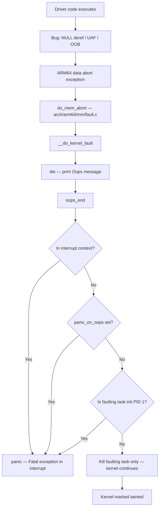
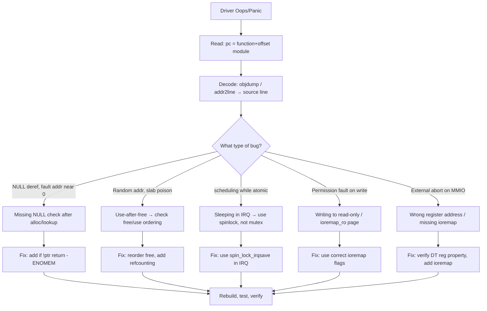

# Scenario 5: Driver / Module Panic

## Symptom
A kernel module (driver) triggers a NULL pointer dereference, use-after-free, or other fatal bug. The kernel Oops escalates to a panic, crashing the system.

```
[   12.345678] Unable to handle kernel NULL pointer dereference at virtual address 0000000000000048
[   12.345679] Mem abort info:
[   12.345680]   ESR = 0x96000005
[   12.345681]   EC = 0x25: DABT (current EL), IL = 32 bits
[   12.345682]   SET = 0, FnV = 0
[   12.345683]   EA = 0, S1PTW = 0
[   12.345684]   FSC = 0x05: level 1 translation fault
[   12.345685] Data abort info:
[   12.345686]   ISV = 0, ISS = 0x00000005
[   12.345687]   CM = 0, WnR = 0
[   12.345688] [0000000000000048] kernel address but not vmalloc range
[   12.345689] Internal error: Oops: 96000005 [#1] PREEMPT SMP
[   12.345690] Modules linked in: my_net_driver(+) i2c_dev spidev
[   12.345691] CPU: 1 PID: 245 Comm: modprobe Not tainted 6.1.0 #1
[   12.345692] Hardware name: My Board (DT)
[   12.345693] pstate: 60400005 (nZCv daif +PAN -UAO -TCO -DIT)
[   12.345694] pc : my_net_driver_probe+0xd8/0x200 [my_net_driver]
[   12.345695] lr : my_net_driver_probe+0xc4/0x200 [my_net_driver]
[   12.345696] sp : ffff80000a1cbb80
[   12.345697] x29: ffff80000a1cbb80 x28: ffff000004a00000 x27: 0000000000000000
[   12.345698] ...
[   12.345699] Call trace:
[   12.345700]  my_net_driver_probe+0xd8/0x200 [my_net_driver]
[   12.345701]  platform_probe+0x68/0xc8
[   12.345702]  really_probe+0xc0/0x2e0
[   12.345703]  __driver_probe_device+0x78/0xe0
[   12.345704]  driver_probe_device+0xd8/0x15c
[   12.345705]  ...
[   12.345706] Code: f9400c00 b4000060 f9402400 14000003 (f9402408)
[   12.345707] ---[ end trace 0000000000000000 ]---
[   12.345708] Kernel panic - not syncing: Fatal exception
```

---

## What's Happening Internally

### Oops → Panic Escalation Flow



### Code Path — ARM64 Fault Handling

```
Exception taken (data abort EL1)
 └─► el1h_64_sync_handler()             [arch/arm64/kernel/entry-common.c]
      └─► el1_abort()
           └─► do_mem_abort()            [arch/arm64/mm/fault.c]
                └─► do_page_fault()       // if user address
                └─► __do_kernel_fault()   // if kernel address
                     └─► die()            [arch/arm64/kernel/traps.c]
                          ├─► show_regs()  // print registers
                          ├─► dump_backtrace() // print call trace
                          ├─► dump_instr()  // print faulting instruction
                          └─► oops_end()
                               ├─► if (in_interrupt() || panic_on_oops)
                               │    └─► panic("Fatal exception")
                               └─► make_task_dead(SIGSEGV)
```

### ARM64 ESR (Exception Syndrome Register) Decoding

```
ESR = 0x96000005
      ││││││││
      ││││└└└└─ ISS (Instruction Specific Syndrome)
      ││││       FSC = 0x05 → level 1 translation fault
      ││││                    (page table entry missing at PUD level)
      │││└───── S1PTW = 0 → not a stage 1 page table walk fault
      ││└────── EA = 0 → not an external abort
      │└─────── IL = 1 → 32-bit instruction
      └──────── EC = 0x25 → Data Abort from current EL (kernel)
```

| EC Value | Meaning |
|----------|---------|
| `0x20` | Instruction Abort from lower EL (user) |
| `0x21` | Instruction Abort from current EL (kernel) |
| `0x24` | Data Abort from lower EL (user) |
| `0x25` | Data Abort from current EL (kernel) — **most common for driver bugs** |
| `0x2F` | SError (System Error — hardware) |
| `0x00` | Unknown exception |

| FSC Value | Meaning |
|-----------|---------|
| `0x04` | Level 0 translation fault (PGD missing) |
| `0x05` | Level 1 translation fault (PUD missing) |
| `0x06` | Level 2 translation fault (PMD missing) |
| `0x07` | Level 3 translation fault (PTE missing) — **NULL pointer** |
| `0x09` | Level 1 access flag fault |
| `0x0D` | Level 1 permission fault |
| `0x0F` | Level 3 permission fault — **write to read-only page** |
| `0x10` | Synchronous external abort |
| `0x21` | Alignment fault |

---

## Common Driver Bug Types

### 1. NULL Pointer Dereference
```c
// Bug: probe function doesn't check return value
static int my_driver_probe(struct platform_device *pdev)
{
    struct my_data *data = devm_kzalloc(&pdev->dev, sizeof(*data), GFP_KERNEL);
    // BUG: data could be NULL if allocation fails
    data->reg_base = devm_ioremap_resource(&pdev->dev, res);  // CRASH at data+0x48
}
```
**Fault address**: Usually a small offset from 0x0 (e.g., `0x48` = struct member offset)

### 2. Use-After-Free (UAF)
```c
// Bug: using memory after it was freed
static void my_driver_remove(struct platform_device *pdev)
{
    struct my_data *data = platform_get_drvdata(pdev);
    kfree(data);
    // BUG: accessing freed memory
    pr_info("removed: %s\n", data->name);  // CRASH: data is freed
}
```
**Fault address**: Random-looking address (freed slab memory, possibly overwritten)

### 3. Buffer Overflow / Out-of-Bounds
```c
// Bug: writing past array end
static irqreturn_t my_irq_handler(int irq, void *dev_id)
{
    struct my_data *data = dev_id;
    // BUG: index not bounds-checked
    data->buffer[data->index++] = readl(data->reg_base + REG_DATA);
    // If index > buffer_size → corrupts adjacent memory
}
```

### 4. Incorrect Register Access / MMIO
```c
// Bug: accessing unmapped or wrong MMIO register
static int my_driver_probe(struct platform_device *pdev)
{
    // BUG: forgot to call ioremap / devm_ioremap
    void __iomem *base = NULL;
    writel(0x1, base + 0x10);   // CRASH: NULL + 0x10 = 0x10
}
```

### 5. Deadlock in Interrupt Context
```c
// Bug: sleeping function called from interrupt handler
static irqreturn_t my_irq_handler(int irq, void *dev_id)
{
    // BUG: mutex_lock can sleep — not allowed in IRQ context
    mutex_lock(&my_mutex);  // CRASH: BUG: scheduling while atomic
    // ...
}
```

### 6. Race Condition
```c
// Bug: shared data accessed without locking
// Thread 1: kfree(data);
// Thread 2: data->field = 42;  // CRASH: UAF due to race
```

---

## How to Debug

### Step 1: Identify the faulting module
```bash
# From the Oops message:
# "Modules linked in: my_net_driver(+) i2c_dev spidev"
# The (+) means my_net_driver was being loaded when it crashed

# "pc : my_net_driver_probe+0xd8/0x200 [my_net_driver]"
# This tells you: function my_net_driver_probe, offset 0xd8
```

### Step 2: Decode the crash address
```bash
# Method 1: objdump the module
objdump -dS my_net_driver.ko | grep -A 5 "my_net_driver_probe+0xd8"

# Method 2: addr2line (needs module with debug info)
addr2line -e my_net_driver.ko -f 0xd8
# Or relative to .text section:
# (look up .text offset from readelf -S my_net_driver.ko)

# Method 3: gdb
gdb my_net_driver.ko
(gdb) list *my_net_driver_probe+0xd8

# Method 4: Use decode_stacktrace.sh
echo "my_net_driver_probe+0xd8/0x200 [my_net_driver]" | \
    ./scripts/decode_stacktrace.sh vmlinux /lib/modules/$(uname -r)/
```

### Step 3: Analyze the fault type
```bash
# From ESR:
# EC = 0x25 → Data Abort from kernel
# FSC = 0x05 → Level 1 translation fault

# Fault address tells you what pointer was bad:
# [0000000000000048] → NULL pointer + offset 0x48
#   → some struct's member at offset 0x48 was accessed via NULL pointer

# Find which struct member is at offset 0x48:
# Use pahole or manual counting:
pahole -C my_data my_net_driver.ko
# Or:
# offsetof(struct my_data, reg_base) == 0x48
```

### Step 4: Reproduce and add debug
```bash
# Enable dynamic debug for the module
echo "module my_net_driver +p" > /sys/kernel/debug/dynamic_debug/control

# Load with verbose logging
modprobe my_net_driver dyndbg=+p

# Add KASAN (Kernel Address Sanitizer) for UAF/OOB detection
# Kernel config: CONFIG_KASAN=y
# Provides detailed "use-after-free" / "out-of-bounds" reports

# Add lockdep for deadlock detection
# Kernel config: CONFIG_PROVE_LOCKING=y
# Reports potential deadlocks before they happen
```

---

## Debug Flow



---

## Fixes

### Fix 1: Blacklist the module (immediate workaround)
```bash
# Prevent module from loading
echo "blacklist my_net_driver" >> /etc/modprobe.d/blacklist.conf
update-initramfs -u    # if module is in initrd

# Or via boot parameter:
modprobe.blacklist=my_net_driver
```

### Fix 2: Fix NULL pointer dereference
```c
// Before (buggy):
data->reg_base = devm_ioremap_resource(&pdev->dev, res);

// After (fixed):
struct my_data *data = devm_kzalloc(&pdev->dev, sizeof(*data), GFP_KERNEL);
if (!data)
    return -ENOMEM;   // ← add NULL check

data->reg_base = devm_ioremap_resource(&pdev->dev, res);
if (IS_ERR(data->reg_base))
    return PTR_ERR(data->reg_base);  // ← add error check
```

### Fix 3: Fix use-after-free
```c
// Before (buggy):
kfree(data);
pr_info("removed: %s\n", data->name);  // UAF!

// After (fixed):
pr_info("removed: %s\n", data->name);  // use BEFORE free
kfree(data);

// Better: use devm_* managed resources — auto-freed in correct order
```

### Fix 4: Fix sleeping in interrupt context
```c
// Before (buggy — mutex can sleep):
static irqreturn_t my_irq_handler(int irq, void *dev_id)
{
    mutex_lock(&my_mutex);

// After (fixed — spinlock is IRQ-safe):
static irqreturn_t my_irq_handler(int irq, void *dev_id)
{
    unsigned long flags;
    spin_lock_irqsave(&my_lock, flags);
    // ... do work ...
    spin_unlock_irqrestore(&my_lock, flags);
}

// Or better: use threaded IRQ handler (can sleep):
request_threaded_irq(irq, NULL, my_thread_handler,
    IRQF_ONESHOT, "my_driver", data);
```

### Fix 5: Use kernel debug features
```bash
# Build kernel with debug options:
CONFIG_DEBUG_INFO=y           # debug symbols in vmlinux
CONFIG_KASAN=y                # Address Sanitizer (detects UAF, OOB)
CONFIG_UBSAN=y                # Undefined Behavior Sanitizer
CONFIG_PROVE_LOCKING=y        # Lockdep (deadlock detection)
CONFIG_DEBUG_OBJECTS=y         # Track object lifecycle
CONFIG_SLUB_DEBUG=y            # Slab debug (poison freed memory)
CONFIG_STACKTRACE=y            # Stack traces in reports

# Runtime slab debug:
# Boot param: slub_debug=FZPU
# F = sanity checks, Z = red zones, P = poisoning, U = user tracking
```

---

## Key Debugging Tools Reference

| Tool | Purpose | When to Use |
|------|---------|-------------|
| `objdump -dS module.ko` | Disassemble + source | Decode crash offset to source line |
| `addr2line -e vmlinux` | Address → file:line | Decode addresses from call trace |
| `pahole -C struct_name` | Struct layout + offsets | Find which member at fault offset |
| `gdb vmlinux` | Interactive debugging | `list *function+0xoffset` |
| KASAN | Detect UAF, OOB, double-free | Build-time config, runtime reports |
| lockdep | Detect deadlocks | Build-time config, warns before crash |
| `ftrace` | Trace function calls | `trace-cmd record -p function_graph` |
| `/sys/kernel/debug/dynamic_debug/` | Per-module debug prints | Enable `pr_debug()` at runtime |

---

## Quick Reference

| Item | Value |
|------|-------|
| **Symptom** | Oops with call trace pointing into a module |
| **Key log line** | `pc : my_driver_func+0xNN/0xMM [my_driver]` |
| **First action** | Identify faulting module from `Modules linked in:` |
| **Decode** | `objdump -dS module.ko`, find offset |
| **Common causes** | NULL deref, UAF, sleeping in IRQ, missing ioremap, race |
| **Immediate fix** | Blacklist module: `modprobe.blacklist=my_driver` |
| **Proper fix** | Fix the bug in driver source, rebuild module |
| **Key kernel configs** | `KASAN`, `PROVE_LOCKING`, `DEBUG_INFO`, `SLUB_DEBUG` |
