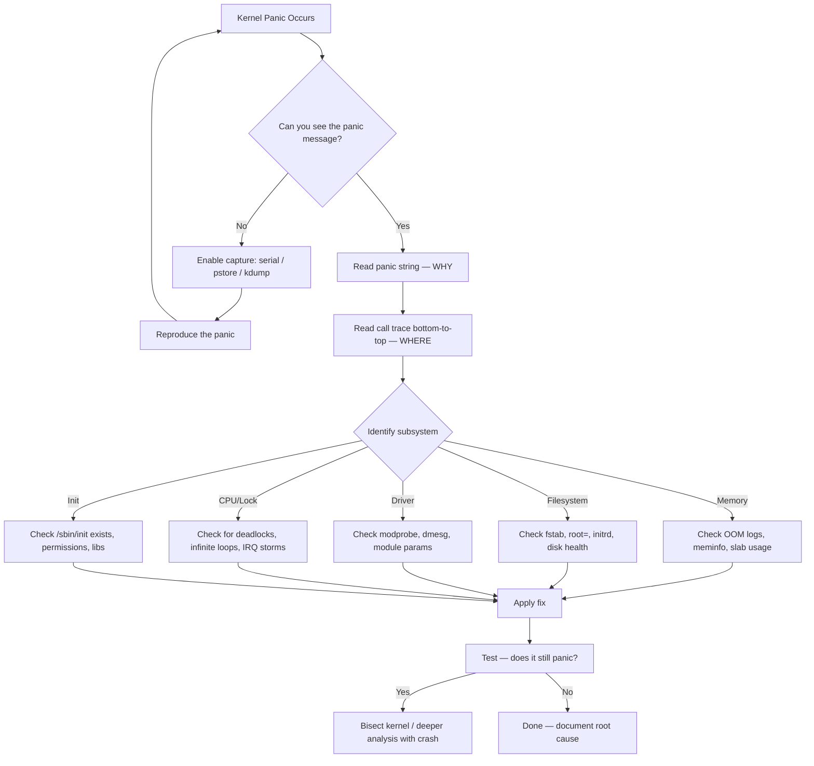

# Kernel Panic — In-Depth Guide

## What is a Kernel Panic?

A kernel panic is the Linux kernel's **last resort** when it encounters a fatal error from which it cannot safely recover. It is the equivalent of a Blue Screen of Death (BSOD) on Windows.

When a panic occurs, the kernel:
1. Stops all CPUs
2. Prints a stack trace + register dump to the console
3. Optionally triggers a crash dump (kdump)
4. Halts or reboots the system

---

## How a Kernel Panic is Triggered

### Source Code Flow

```
panic(fmt, ...)                              [kernel/panic.c]
 ├─► console_verbose()                       // force all printk to console
 ├─► pr_emerg("Kernel panic - not syncing: %s\n", buf)
 ├─► kmsg_dump(KMSG_DUMP_PANIC)              // dump kernel log ring buffer
 ├─► bust_spinlocks(1)                       // force console output even if locked
 ├─► dump_stack()                            // print stack trace
 │    └─► show_stack()                       [arch/arm64/kernel/traps.c]
 │         └─► dump_backtrace()
 │              └─► unwind_start/next        // walk stack frames
 ├─► crash_smp_send_stop()                   // stop all other CPUs
 ├─► __crash_kexec(NULL)                     // if kdump configured, jump to crash kernel
 ├─► panic_notifier_list callbacks           // notify registered panic handlers
 ├─► console_flush_on_panic()               // flush console buffers
 └─► reboot or halt
      ├─► if (panic_timeout > 0)  → emergency_restart()
      ├─► if (panic_timeout == 0) → infinite loop (halt)
      └─► if (panic_timeout < 0)  → emergency_restart() immediately
```

### `panic()` Function — Detailed Code Walkthrough

```c
// kernel/panic.c
void panic(const char *fmt, ...)
{
    static char buf[1024];
    va_list args;
    long i, i_next = 0, len;
    int state = 0;
    int old_cpu, this_cpu;

    // ─── Step 1: Disable preemption, get CPU id ───
    this_cpu = raw_smp_processor_id();
    old_cpu  = atomic_cmpxchg(&panic_cpu, PANIC_CPU_INVALID, this_cpu);

    if (old_cpu != PANIC_CPU_INVALID && old_cpu != this_cpu)
        panic_smp_self_stop();  // another CPU already panicking, stop this one

    console_verbose();          // force all printk to console
    bust_spinlocks(1);          // break any spinlocks held on console

    // ─── Step 2: Format and print the panic message ───
    va_start(args, fmt);
    len = vscnprintf(buf, sizeof(buf), fmt, args);
    va_end(args);

    pr_emerg("Kernel panic - not syncing: %s\n", buf);

    // ─── Step 3: Dump kernel log buffer ───
    kmsg_dump(KMSG_DUMP_PANIC);

    // ─── Step 4: Print stack trace ───
    dump_stack();

    // ─── Step 5: Stop all other CPUs ───
    crash_smp_send_stop();

    // ─── Step 6: Attempt kdump (crash kernel) ───
    if (!_crash_kexec_post_notifiers)
        __crash_kexec(NULL);    // jump to crash kernel if configured

    // ─── Step 7: Run panic notifier chain ───
    atomic_notifier_call_chain(&panic_notifier_list, 0, buf);

    // ─── Step 8: Flush console ───
    console_flush_on_panic(CONSOLE_FLUSH_PENDING);

    // ─── Step 9: Reboot or halt ───
    if (panic_timeout > 0) {
        pr_emerg("Rebooting in %d seconds..\n", panic_timeout);
        for (i = 0; i < panic_timeout * 1000; i += PANIC_TIMER_STEP)
            mdelay(PANIC_TIMER_STEP);
    }
    if (panic_timeout != 0) {
        emergency_restart();    // attempt reboot
    }

    // If we get here, halt forever
    pr_emerg("---[ end Kernel panic - not syncing: %s ]---\n", buf);
    local_irq_enable();         // allow NMI watchdog to trigger
    for (;;) {
        wfi();                  // ARM64: Wait For Interrupt (low power halt)
    }
}
```

---

## Kernel Panic Message Anatomy

```
[  234.567890] Kernel panic - not syncing: VFS: Unable to mount root fs on unknown-block(0,0)
[  234.567891] CPU: 0 PID: 1 Comm: swapper/0 Not tainted 6.1.0 #1
[  234.567892] Hardware name: QEMU Virtual Machine (DT)
[  234.567893] Call trace:
[  234.567894]  dump_backtrace+0x0/0x1c0
[  234.567895]  show_stack+0x18/0x24
[  234.567896]  dump_stack_lvl+0x68/0x84
[  234.567897]  dump_stack+0x18/0x24
[  234.567898]  panic+0x16c/0x348
[  234.567899]  mount_block_root+0x1d4/0x260
[  234.567900]  prepare_namespace+0x130/0x170
[  234.567901]  kernel_init_freeable+0x240/0x278
[  234.567902]  kernel_init+0x20/0x1a8
[  234.567903]  ret_from_fork+0x10/0x20
[  234.567904] ---[ end Kernel panic - not syncing: ... ]---
```

### How to Read Each Field

| Field | Meaning |
|-------|---------|
| `[  234.567890]` | Timestamp — seconds since boot |
| `Kernel panic - not syncing:` | The panic reason string |
| `VFS: Unable to mount root fs` | **The actual error** — most important line |
| `CPU: 0` | Which CPU triggered the panic |
| `PID: 1` | Which process was running (PID 1 = init/swapper) |
| `Comm: swapper/0` | Process name |
| `Not tainted` | Kernel is clean (no proprietary/out-of-tree modules) |
| `6.1.0 #1` | Kernel version and build number |
| `Call trace:` | Stack backtrace — read **bottom to top** for call order |
| `function+0x1d4/0x260` | `function_name + offset_into_function / total_function_size` |

### Tainted Kernel Flags
If the kernel says `Tainted: G  W  O`, each letter means:
| Flag | Meaning |
|------|---------|
| `P` | Proprietary module loaded |
| `G` | All modules are GPL-compatible |
| `F` | Module force-loaded |
| `O` | Out-of-tree module loaded |
| `E` | Unsigned module loaded |
| `W` | Warning (WARN_ON) triggered previously |
| `D` | Kernel died (Oops before this) |

---

## Types of Kernel Panics

### 1. Hard Panic — `panic()`
- Kernel explicitly calls `panic()` — fatal, unrecoverable
- Examples: no root filesystem, out of memory during boot, corrupted page tables
- System **halts or reboots** immediately

### 2. Oops (Soft Panic)
- Kernel detects an error but tries to continue (kills the faulting process)
- If the faulting process is PID 0/1 or is in an interrupt context → escalates to hard panic
- Controlled by `/proc/sys/kernel/panic_on_oops`

```c
// kernel/panic.c
void oops_end(unsigned long flags, struct pt_regs *regs, int signr)
{
    // If in interrupt or critical section → can't recover
    if (in_interrupt())
        panic("Fatal exception in interrupt");

    // If init process died → system can't continue
    if (panic_on_oops)
        panic("Fatal exception");

    // Otherwise, kill the faulting process and continue
    if (signr)
        make_task_dead(signr);
}
```

### Oops Message Example (ARM64):
```
[  45.123456] Unable to handle kernel NULL pointer dereference at virtual address 0000000000000000
[  45.123457] Mem abort info:
[  45.123458]   ESR = 0x96000004
[  45.123459]   EC = 0x25: DABT (current EL), IL = 32 bits
[  45.123460]   SET = 0, FnV = 0
[  45.123461]   EA = 0, S1PTW = 0
[  45.123462]   FSC = 0x04: level 0 translation fault
[  45.123463] Data abort info:
[  45.123464]   ISV = 0, ISS = 0x00000004, ISS2 = 0x00000000
[  45.123465]   CM = 0, WnR = 0, TnD = 0, TagAccess = 0
[  45.123466]   GCS = 0, Overlay = 0, DirtyBit = 0, Xs = 0
[  45.123467] [0000000000000000] user address but active_mm is swapper
[  45.123468] Internal error: Oops: 96000004 [#1] PREEMPT SMP
```

### ARM64-Specific Fields:
| Field | Meaning |
|-------|---------|
| `ESR` | Exception Syndrome Register — encodes the fault type |
| `EC = 0x25` | Exception Class: Data Abort from current EL |
| `FSC = 0x04` | Fault Status Code: level 0 translation fault (page table missing) |
| `WnR = 0` | Write-not-Read: 0 = read fault, 1 = write fault |
| `[#1]` | Oops count (#1 = first oops) |

### 3. BUG() / BUG_ON()
- Developer-placed assertions — if condition is true, triggers Oops

```c
// Example in kernel code
void some_function(struct page *page)
{
    BUG_ON(!page);            // crash if page is NULL
    BUG_ON(PageSlab(page));   // crash if page belongs to slab
}
```

### 4. Watchdog Panic
- **Soft lockup**: CPU stuck in kernel for >20s (no scheduling)
- **Hard lockup**: CPU stuck, no interrupts for >10s
- **RCU stall**: RCU grace period not completing

```
[  120.000000] watchdog: BUG: soft lockup - CPU#2 stuck for 22s! [kworker/2:1:156]
[  120.000001] CPU: 2 PID: 156 Comm: kworker/2:1 Not tainted 6.1.0 #1
```

---

## Key Kernel Panic Sources in Code

| Source File | Function | Panic Trigger |
|-------------|----------|---------------|
| `kernel/panic.c` | `panic()` | Generic fatal error |
| `mm/oom_kill.c` | `out_of_memory()` | OOM with `panic_on_oom=1` |
| `arch/arm64/mm/fault.c` | `die()` → `oops_end()` | Unhandled page fault in kernel |
| `arch/arm64/kernel/traps.c` | `die()` | Undefined instruction, alignment fault |
| `fs/namespace.c` | `mount_root()` | Cannot mount root filesystem |
| `init/main.c` | `kernel_init()` | Cannot execute `/sbin/init` |
| `kernel/watchdog.c` | `watchdog_timer_fn()` | CPU soft/hard lockup |
| `kernel/rcu/tree_stall.h` | `rcu_check_gp_kthread_starvation()` | RCU stall |
| `mm/page_alloc.c` | `out_of_memory()` | No free pages left |

---

## Kernel Panic Configuration

### Boot Parameters (set in bootloader / GRUB / U-Boot)
| Parameter | Effect |
|-----------|--------|
| `panic=N` | Reboot N seconds after panic (0 = halt forever) |
| `panic=-1` | Reboot immediately after panic |
| `panic_on_oops=1` | Convert every Oops to a hard panic |
| `panic_on_warn=1` | Convert every WARN() to a panic |
| `oops=panic` | Same as `panic_on_oops=1` |
| `crashkernel=256M` | Reserve memory for kdump crash kernel |
| `hung_task_panic=1` | Panic on hung task detection |
| `softlockup_panic=1` | Panic on soft lockup |

### Runtime Sysctl
```bash
# Reboot 10 seconds after panic
echo 10 > /proc/sys/kernel/panic

# Panic on OOM (out of memory)
echo 1 > /proc/sys/vm/panic_on_oom

# Panic on Oops
echo 1 > /proc/sys/kernel/panic_on_oops

# Soft lockup panic
echo 1 > /proc/sys/kernel/softlockup_panic

# Hung task panic (default timeout 120s)
echo 1 > /proc/sys/kernel/hung_task_panic
echo 120 > /proc/sys/kernel/hung_task_timeout_secs
```

---

## How to Capture Panic Information

### Method 1: Serial Console (most reliable)
```bash
# Add to kernel command line (U-Boot / GRUB)
console=ttyS0,115200 earlyprintk=serial

# Or for ARM64 PL011 UART:
console=ttyAMA0,115200 earlycon=pl011,0x09000000
```
- Works even when framebuffer/display driver crashes
- Connect via: `minicom -D /dev/ttyUSB0 -b 115200`

### Method 2: Pstore (Persistent Store)
```bash
# Survives reboot — stored in RAM, flash, or EFI variables
# After reboot:
ls /sys/fs/pstore/
cat /sys/fs/pstore/dmesg-ramoops-0     # last kernel log before crash
cat /sys/fs/pstore/console-ramoops-0   # last console output

# Enable in kernel config:
# CONFIG_PSTORE=y
# CONFIG_PSTORE_RAM=y (ramoops backend)
# Boot param: ramoops.mem_address=0x...  ramoops.mem_size=0x200000
```

### Method 3: Kdump (Full Crash Dump)
```bash
# 1. Reserve crash kernel memory at boot
#    Boot param: crashkernel=256M

# 2. Install tools
apt install kdump-tools crash kexec-tools

# 3. Enable kdump
systemctl enable kdump

# 4. After panic, system boots crash kernel → dumps memory to disk
#    Default location: /var/crash/

# 5. Analyze with crash tool
crash /usr/lib/debug/boot/vmlinux-$(uname -r) /var/crash/202604161234/vmcore

# crash> bt          # backtrace
# crash> log         # kernel log
# crash> ps          # process list at crash time
# crash> vm          # virtual memory info
# crash> kmem -s     # slab cache info
```

### Method 4: Netconsole (Remote Logging)
```bash
# Send kernel logs to remote syslog server
modprobe netconsole netconsole=@10.0.0.1/eth0,6666@10.0.0.2/aa:bb:cc:dd:ee:ff

# On remote machine:
nc -u -l 6666
```

---

## Debugging Flow



### Decoding Addresses from Call Trace
```bash
# Method 1: addr2line (need vmlinux with debug info)
addr2line -e vmlinux -f 0xffffff80081234ab

# Method 2: decode_stacktrace.sh (from kernel source)
./scripts/decode_stacktrace.sh vmlinux < panic.log

# Method 3: gdb
gdb vmlinux
(gdb) list *mount_block_root+0x1d4

# Method 4: objdump
objdump -d -S vmlinux | grep -A 20 "mount_block_root"
```

---

## See Also — 5 Real-World Scenarios
- [01_Scenario_Continuous_Reboot.md](01_Scenario_Continuous_Reboot.md) — System keeps rebooting in a loop
- [02_Scenario_Full_Shutdown.md](02_Scenario_Full_Shutdown.md) — System powers off unexpectedly
- [03_Scenario_OOM_Panic.md](03_Scenario_OOM_Panic.md) — Out of memory kills the system
- [04_Scenario_RootFS_Panic.md](04_Scenario_RootFS_Panic.md) — Cannot mount root filesystem
- [05_Scenario_Driver_Panic.md](05_Scenario_Driver_Panic.md) — Driver bug crashes the kernel
