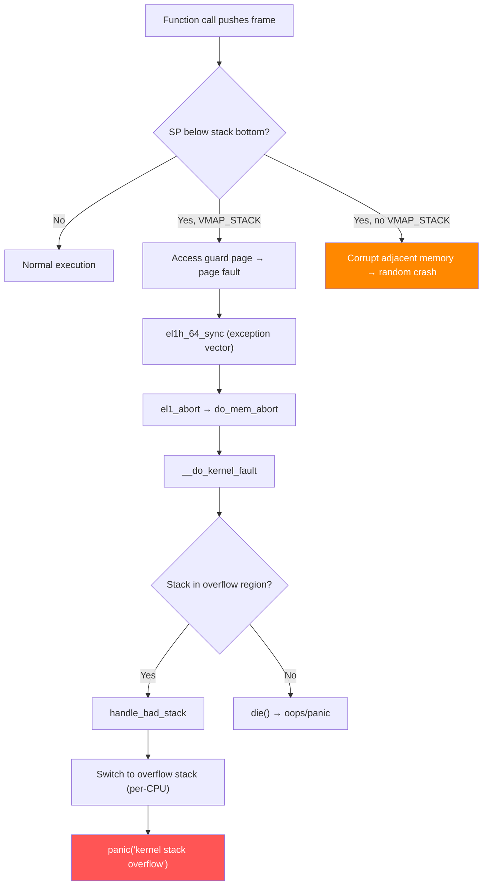

# Scenario 1: Kernel Stack Overflow

## Symptom

```
[ 1842.657321] Kernel panic - not syncing: kernel stack overflow
[ 1842.657348] CPU: 2 PID: 4891 Comm: my_worker Tainted: G        W         6.8.0 #1
[ 1842.657355] Hardware name: ARM Platform (DT)
[ 1842.657399] Call trace:
[ 1842.657401]  dump_backtrace+0x0/0x1b8
[ 1842.657409]  show_stack+0x24/0x30
[ 1842.657412]  dump_stack_lvl+0x60/0x80
[ 1842.657418]  panic+0x168/0x360
[ 1842.657425]  handle_bad_stack+0x34/0x48
[ 1842.657432]  __bad_stack+0x8/0xc
[ 1842.657441]  recursive_work_handler+0x128/0x150 [buggy_mod]
[ 1842.657448]  recursive_work_handler+0x128/0x150 [buggy_mod]
[ 1842.657454]  recursive_work_handler+0x128/0x150 [buggy_mod]
[ 1842.657461]  recursive_work_handler+0x128/0x150 [buggy_mod]
[ 1842.657467]  ... (repeating frames) ...
```

### How to Recognize
- Message: `kernel stack overflow` or `Insufficient stack space`
- Call trace shows **repeated function frames** (unbounded recursion)
- Or call trace is **extremely deep** (hundreds of frames)
- Fault address is near the bottom of the stack (guard page hit)
- `handle_bad_stack` / `__bad_stack` in the trace

---

## Background: Kernel Stack on ARM64

### Stack Size
```
CONFIG_THREAD_SIZE = 16384  (16 KB, default on ARM64)

// arch/arm64/include/asm/thread_info.h
#ifdef CONFIG_VMAP_STACK
#define THREAD_SIZE	16384   // 4 pages of 4KB
#endif
```

### Stack Layout (grows downward on ARM64)
```
                    ┌───────────────────┐  high address
                    │   thread_info     │  ← task_thread_info(task)
                    │ (struct stored at │
                    │  top of stack)    │
                    ├───────────────────┤
                    │                   │
                    │    Usable stack   │  ← ~14 KB usable
                    │   (grows down)   │
                    │                   │
                    │         ▼         │
                    ├───────────────────┤
                    │   Stack canary    │  ← CONFIG_STACKPROTECTOR
                    ├───────────────────┤
        SP when     │  current frame    │  ← SP register points here
        overflow ─► ├───────────────────┤
                    │   GUARD PAGE      │  ← CONFIG_VMAP_STACK (unmapped)
                    ├───────────────────┤
                    │                   │  any access here = fault
                    └───────────────────┘  low address
```

### Guard Page (VMAP_STACK)
```c
// kernel/fork.c — alloc_thread_stack_node()
static int alloc_thread_stack_node(struct task_struct *tsk, int node)
{
    // With VMAP_STACK: uses __vmalloc_node_range() which places
    // unmapped guard pages above and below the stack.
    // Any overflow hits the guard → immediate page fault → die()

    void *stack = __vmalloc_node_range(THREAD_SIZE, THREAD_ALIGN,
                    VMALLOC_START, VMALLOC_END,
                    THREADINFO_GFP, PAGE_KERNEL, 0,
                    node, __builtin_return_address(0));
    // Guard pages are automatically placed by vmalloc
}
```

### Stack Canary
```c
// kernel/fork.c — dup_task_struct()
tsk->stack_canary = get_random_canary();

// Compiler inserts check at function return:
//   if (current->stack_canary != __stack_chk_guard)
//       __stack_chk_fail();
```

---

## Code Flow: What Happens on Stack Overflow



### The Overflow Stack Switch
```c
// arch/arm64/kernel/entry.S — __bad_stack:
// When SP is in the guard page, we can't even use the current stack!
// ARM64 switches to a per-CPU overflow stack:
//   overflow_stack[cpu] — a small emergency stack for printing the panic

DEFINE_PER_CPU(unsigned long [OVERFLOW_STACK_SIZE/sizeof(long)], overflow_stack)
    __aligned(16);
```

### handle_bad_stack()
```c
// arch/arm64/kernel/traps.c
asmlinkage void noinstr handle_bad_stack(struct pt_regs *regs)
{
    unsigned long tsk_stk = (unsigned long)current->stack;
    unsigned long irq_stk = (unsigned long)this_cpu_read(irq_stack_ptr);
    unsigned long ovf_stk = (unsigned long)this_cpu_ptr(overflow_stack);

    console_verbose();
    pr_emerg("Insufficient stack space to handle exception!\n");
    pr_emerg("Task stack:     [0x%016lx..0x%016lx]\n",
        tsk_stk, tsk_stk + THREAD_SIZE);
    pr_emerg("IRQ stack:      [0x%016lx..0x%016lx]\n",
        irq_stk, irq_stk + THREAD_SIZE);
    pr_emerg("Overflow stack: [0x%016lx..0x%016lx]\n",
        ovf_stk, ovf_stk + OVERFLOW_STACK_SIZE);

    __show_regs(regs);
    panic("kernel stack overflow");
}
```

---

## Common Causes

### 1. Unbounded Recursion
```c
/* BUG: infinite recursion */
void process_node(struct node *n) {
    if (!n) return;
    process_node(n->child);  // What if child points back to parent?
}

/* Circular linked list → stack overflow */
struct node {
    struct node *child;
};
// A->child = B, B->child = C, C->child = A  ← BOOM
```

### 2. Deep Call Chains (Legitimate but Too Deep)
```
filesystem_write()
 └─ vfs_write()
     └─ ext4_file_write_iter()
         └─ generic_file_write_iter()
             └─ dm_make_request()          // device mapper
                 └─ dm_crypt_map()         // encryption
                     └─ bcache_request()   // block cache
                         └─ nvme_submit()  // NVMe driver
                             └─ ... (IRQ → softirq → more frames)
```
Each layer adds 100–500 bytes → storage stacking exceeds 16 KB.

### 3. Large Stack Allocations
```c
void my_function(void) {
    char buffer[8192];        // 8 KB on a 16 KB stack! NEVER do this.
    struct big_struct s;      // sizeof = 4096? Also bad.
    // Even one level of nesting = overflow
}
```

### 4. Interrupt Nesting on Small Stack
```
task context → 4 KB used
  └─ IRQ fires → push ~2 KB
      └─ softirq runs → push ~3 KB
          └─ timer callback → push ~2 KB
              └─ network rx → push ~3 KB
                  └─ OVERFLOW! (4+2+3+2+3 = 14 KB, approaching 16 KB)
```
ARM64 has a separate IRQ stack to mitigate this, but not all paths use it.

### 5. Stack-Heavy Filesystem/Crypto Chains
```
Filesystem → dm-crypt → dm-raid → bcache → actual block device
Each layer: 500–2000 bytes of stack per frame
5–8 layers = 8–16 KB consumed
```

---

## Debugging Steps

### Step 1: Identify the Repeating Pattern
```
Call trace:
  recursive_work_handler+0x128/0x150 [buggy_mod]   ← same function!
  recursive_work_handler+0x128/0x150 [buggy_mod]   ← repeating
  recursive_work_handler+0x128/0x150 [buggy_mod]
```
**Unbounded recursion** → fix the recursion termination condition.

### Step 2: Check for Large Stack Variables
```bash
# Compile-time check: functions using most stack
make W=1 2>&1 | grep "stack frame size"

# Or use checkstack.pl:
objdump -d vmlinux | scripts/checkstack.pl arm64

# Output:
# 0xffffff8008123456 my_bad_function [vmlinux]:  4096
# 0xffffff8008234567 another_func [vmlinux]:     2048
```

### Step 3: Use KASAN_STACK (stack out-of-bounds)
```bash
CONFIG_KASAN=y
CONFIG_KASAN_STACK=y   # detects out-of-bounds stack access
```

### Step 4: Analyze with `crash` Tool
```bash
crash vmlinux vmcore

crash> bt            # backtrace — count frames
crash> bt -f         # with frame details — see SP values
crash> task -R stack  # show stack boundaries
crash> rd <sp> 64    # raw dump of stack memory
```

### Step 5: Check Stack Usage at Runtime
```bash
# Enable stack depth tracking:
CONFIG_DEBUG_STACK_USAGE=y

# Then check:
cat /proc/<pid>/stack    # current kernel stack
echo t > /proc/sysrq-trigger   # dump ALL task stacks
```

### Step 6: Ftrace — Stack Tracer
```bash
echo 1 > /proc/sys/kernel/stack_tracer_enabled

# After running workload:
cat /sys/kernel/debug/tracing/stack_max_size
cat /sys/kernel/debug/tracing/stack_trace
```
This reports the deepest stack usage seen and which call chain caused it.

---

## Fixes

| Cause | Fix |
|-------|-----|
| Unbounded recursion | Add depth limit or convert to iterative with explicit stack |
| Circular data structure | Validate pointers; use `visited` flags or cycle detection |
| Large stack variables | Use `kmalloc()` / `kvmalloc()` for buffers > 256 bytes |
| Deep call chains | Reduce layering, use `workqueue` to break chains |
| Interrupt nesting | Ensure ARM64 separate IRQ stack (`CONFIG_IRQ_STACKS=y`) |

### Fix Example: Convert Recursion to Iteration
```c
/* BEFORE: recursive — can overflow */
void process_tree(struct node *root) {
    if (!root) return;
    do_work(root);
    process_tree(root->left);
    process_tree(root->right);
}

/* AFTER: iterative with explicit stack */
void process_tree(struct node *root) {
    struct node **stack;
    int top = 0;

    stack = kmalloc_array(MAX_DEPTH, sizeof(*stack), GFP_KERNEL);
    if (!stack) return;

    stack[top++] = root;
    while (top > 0) {
        struct node *n = stack[--top];
        if (!n) continue;
        do_work(n);
        if (top < MAX_DEPTH - 1) {
            stack[top++] = n->right;
            stack[top++] = n->left;
        }
    }
    kfree(stack);
}
```

### Fix Example: Replace Stack Buffer with Heap
```c
/* BEFORE: 4KB on stack — DANGEROUS */
void parse_data(void) {
    char buf[4096];
    // ...
}

/* AFTER: heap allocation */
void parse_data(void) {
    char *buf = kmalloc(4096, GFP_KERNEL);
    if (!buf) return -ENOMEM;
    // ...
    kfree(buf);
}
```

---

## Quick Reference

| Item | Value |
|------|-------|
| Default stack size | 16 KB (ARM64) |
| Guard page | `CONFIG_VMAP_STACK=y` (enabled by default) |
| Canary | `CONFIG_STACKPROTECTOR_STRONG=y` |
| Detection | `handle_bad_stack()` in `arch/arm64/kernel/traps.c` |
| Stack check tool | `scripts/checkstack.pl` |
| Runtime tracer | `/proc/sys/kernel/stack_tracer_enabled` |
| Max recommended alloc | ≤256 bytes on stack; larger → `kmalloc` |
| Emergency stack | `overflow_stack` (per-CPU, ~4 KB) |
