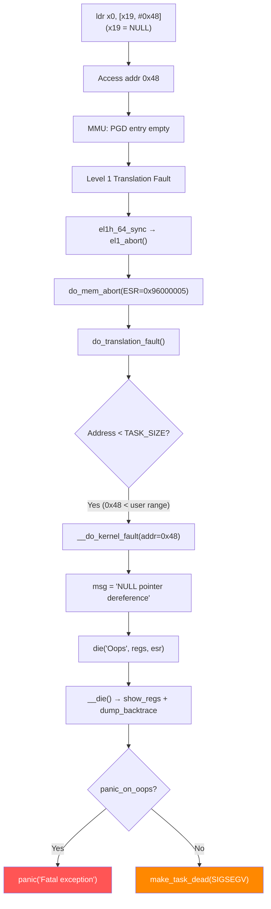

# Scenario 2: NULL Pointer Dereference

## Symptom

```
[ 2104.891237] Unable to handle kernel NULL pointer dereference at virtual address 0000000000000048
[ 2104.891248] Mem abort info:
[ 2104.891250]   ESR = 0x0000000096000005
[ 2104.891253]   EC = 0x25: DABT (current EL), IL = 32 bits
[ 2104.891256]   SET = 0, FnV = 0
[ 2104.891258]   EA = 0, S1PTW = 0
[ 2104.891260]   FSC = 0x05: level 1 translation fault
[ 2104.891263] Data abort info:
[ 2104.891264]   ISV = 0, ISS = 0x00000005, ISS2 = 0x00000000
[ 2104.891266]   CM = 0, WnR = 0
[ 2104.891268] [0000000000000048] address between user and kernel address ranges
[ 2104.891279] Internal error: Oops: 0000000096000005 [#1] PREEMPT SMP
[ 2104.891285] CPU: 3 PID: 1892 Comm: my_app Tainted: G           O      6.8.0 #1
[ 2104.891293] pstate: 60400009 (nZCv daif +PAN -UAO -TCO -DIT -SSBS BTYPE=--)
[ 2104.891298] pc : my_driver_read+0x4c/0x120 [buggy_mod]
[ 2104.891305] lr : vfs_read+0xbc/0x2e0
[ 2104.891312] sp : ffff80001234bcc0
[ 2104.891315] x29: ffff80001234bcc0 x28: ffff000012345000
[ 2104.891320] x27: 0000000000000000 x26: 0000000000000100
[ 2104.891324] x25: ffff000087654320 x24: 0000000000000001
[ 2104.891328] x23: 0000000000000048 x22: 0000000000000000
[ 2104.891332] x21: ffff000012340000 x20: 0000000000000000
[ 2104.891336] x19: 0000000000000000 x18: 0000000000000000
[ 2104.891340] ...
[ 2104.891345] Call trace:
[ 2104.891347]  my_driver_read+0x4c/0x120 [buggy_mod]
[ 2104.891352]  vfs_read+0xbc/0x2e0
[ 2104.891356]  ksys_read+0x78/0x110
[ 2104.891360]  __arm64_sys_read+0x24/0x30
[ 2104.891364]  invoke_syscall+0x50/0x120
[ 2104.891369]  el0_svc_common+0x48/0xf0
[ 2104.891373]  do_el0_svc+0x28/0x40
[ 2104.891376]  el0t_64_sync_handler+0x68/0xc0
[ 2104.891380]  el0t_64_sync+0x1a0/0x1a4
```

### How to Recognize
- **"Unable to handle kernel NULL pointer dereference at virtual address 0x0000...00XX"**
- Fault address is **small** (0x0 to ~0x1000) — it's NULL + a struct member offset
- ESR EC = `0x25` (DABT from current EL)
- FSC = translation fault (level 1, 2, or 3)
- One or more registers hold `0x0000000000000000`

---

## Background: Why NULL Access Crashes

### The NULL Page is Unmapped
```
ARM64 Virtual Address Space (48-bit, 4KB pages, 4-level):

0x0000_0000_0000_0000  ┌────────────────────────┐
                        │  NULL page (unmapped)   │  ← NO PTE exists
0x0000_0000_0000_1000  ├────────────────────────┤
                        │  User space             │
                        │  (mmap_min_addr=65536)  │
                        │                         │
0x0000_FFFF_FFFF_FFFF  ├────────────────────────┤
                        │  ... hole ...           │
0xFFFF_0000_0000_0000  ├────────────────────────┤
                        │  Kernel space           │
0xFFFF_FFFF_FFFF_FFFF  └────────────────────────┘
```

```c
// Access to address 0x0 → PGD entry for index 0 is empty
// → Level 1 translation fault (FSC=0x05)
// → do_page_fault() → __do_kernel_fault() → die()
```

### How NULL + Offset Works
```c
struct my_device {
    u32 flags;           // offset 0x00
    u32 status;          // offset 0x04
    void *buffer;        // offset 0x08
    struct list_head list; // offset 0x10
    // ...
    u64 stats;           // offset 0x48  ← !
};

struct my_device *dev = NULL;
u64 val = dev->stats;  // Access address: NULL + 0x48 = 0x48
                         // "NULL pointer dereference at 0x0000000000000048"
```

---

## Code Flow: Exception to Crash



### Key Code in fault.c
```c
// arch/arm64/mm/fault.c
static void __do_kernel_fault(unsigned long addr, unsigned long esr,
                              struct pt_regs *regs)
{
    const char *msg;

    msg = "paging request";

    if (addr < PAGE_SIZE)      // Small address = NULL + offset
        msg = "NULL pointer dereference";

    pr_alert("Unable to handle kernel %s at virtual address %016lx\n",
             msg, addr);

    // Show ESR decode, mem abort info
    mem_abort_decode(esr);
    show_pte(addr);

    die_kernel_fault(msg, addr, esr, regs);
}
```

### __do_kernel_fault → die_kernel_fault
```c
static void die_kernel_fault(const char *msg, unsigned long addr,
                             unsigned long esr, struct pt_regs *regs)
{
    bust_spinlocks(1);

    pr_alert("Unable to handle kernel %s at virtual address %016lx\n",
             msg, addr);

    mem_abort_decode(esr);
    show_pte(addr);
    die("Oops", regs, esr);
    bust_spinlocks(0);
    make_task_dead(SIGKILL);
}
```

---

## Common Causes

### 1. Uninitialized Pointer
```c
struct my_device *dev;         // NOT initialized = garbage/NULL
dev->buffer = kmalloc(4096, GFP_KERNEL);  // NULL deref
```

### 2. Failed Allocation Not Checked
```c
struct my_struct *p = kmalloc(sizeof(*p), GFP_KERNEL);
// Missing: if (!p) return -ENOMEM;
p->field = 42;  // if kmalloc returned NULL → crash
```

### 3. Resource Freed, Pointer Not Cleared
```c
void cleanup(struct my_device *dev) {
    kfree(dev->priv);
    // Missing: dev->priv = NULL;
}

void later_use(struct my_device *dev) {
    // dev->priv is now a dangling pointer
    // if it happens to be 0, or if memory was zeroed → NULL deref
    dev->priv->value = 10;
}
```

### 4. Race Condition: Check-Then-Use
```c
void work_handler(struct work_struct *work) {
    struct my_device *dev = container_of(work, struct my_device, work);

    if (dev->data) {         // ← Thread 1 checks: non-NULL
        // Thread 2 does: kfree(dev->data); dev->data = NULL;
        dev->data->count++;  // ← Thread 1: NULL deref!
    }
}
```

### 5. Incorrect Error Path
```c
int my_probe(struct platform_device *pdev) {
    struct my_device *dev;
    struct resource *res;

    res = platform_get_resource(pdev, IORESOURCE_MEM, 0);
    // res can be NULL if DT is wrong

    dev->base = devm_ioremap_resource(&pdev->dev, res);
    // If res is NULL → devm_ioremap_resource dereferences it → crash
}
```

### 6. Container-of on NULL list entry
```c
list_for_each_entry(pos, &my_list, list) {
    // If list is corrupted and contains a NULL next pointer:
    // container_of(NULL, struct my_struct, list) → negative offset
    // Access at (0x0 - offsetof(list)) → small negative address
}
```

---

## Debugging Steps

### Step 1: Decode the Fault Address
```
"NULL pointer dereference at virtual address 0000000000000048"

0x48 = offset into a struct accessed via NULL pointer
```

```bash
# Find which struct has a member at offset 0x48:
pahole -C "struct my_device" vmlinux
# or
crash vmlinux vmcore
crash> struct my_device
struct my_device {
    u32 flags;                 /*     0     4 */
    u32 status;                /*     4     4 */
    void *buffer;              /*     8     8 */
    struct list_head list;     /*    16    16 */
    ...
    u64 stats;                 /*    72     8 */  ← 72 = 0x48!
};
```

### Step 2: Identify the Faulting Instruction
```bash
# From oops: pc = my_driver_read+0x4c/0x120 [buggy_mod]
# Disassemble:
objdump -dS drivers/my_driver.ko | less
# Go to my_driver_read+0x4c

# Or with gdb:
gdb vmlinux
(gdb) list *my_driver_read+0x4c
```

### Step 3: Check Which Register Was NULL
```
From the oops:
x19: 0000000000000000   ← this is NULL!
x20: 0000000000000000
x23: 0000000000000048   ← this is the computed address (NULL + 0x48)

Faulting instruction was likely:
  ldr x0, [x19, #0x48]    // x19=NULL, offset=0x48 → access 0x48
```

### Step 4: Trace the NULL Origin
```bash
# Look at the call trace — who called the faulting function?
my_driver_read+0x4c/0x120 [buggy_mod]   ← crashed here
vfs_read+0xbc/0x2e0                       ← caller
ksys_read+0x78/0x110                      ← from syscall

# The NULL pointer was likely a parameter or a looked-up resource
# Check: where does my_driver_read get its device pointer?
```

### Step 5: Use KASAN for More Context
```bash
CONFIG_KASAN=y
# KASAN will catch NULL derefs early and print:
# BUG: KASAN: null-ptr-deref in my_driver_read+0x4c/0x120
# Read of size 8 at addr 0000000000000048 by task my_app/1892
```

### Step 6: Reproduce with Fault Injection
```bash
# Force allocation failures to trigger error paths:
echo 100 > /sys/kernel/debug/failslab/probability
echo 1 > /sys/kernel/debug/failslab/times
echo 1 > /proc/sys/vm/fault_around_bytes
```

---

## Fixes

| Cause | Fix |
|-------|-----|
| Unchecked `kmalloc` return | Always check: `if (!ptr) return -ENOMEM;` |
| Uninitialized pointer | Initialize to NULL; use `= NULL` in declarations |
| Race on pointer | Use `rcu_dereference()` / `rcu_assign_pointer()` or locks |
| Platform resource missing | Validate before use: `if (IS_ERR_OR_NULL(res))` |
| Freed pointer reuse | Set pointer to NULL after `kfree()` |

### Fix Example: Proper NULL Check
```c
/* BEFORE: no check */
static ssize_t my_read(struct file *f, char __user *buf, size_t len, loff_t *off) {
    struct my_device *dev = f->private_data;
    return dev->stats;  // dev might be NULL
}

/* AFTER: NULL check */
static ssize_t my_read(struct file *f, char __user *buf, size_t len, loff_t *off) {
    struct my_device *dev = f->private_data;
    if (!dev)
        return -ENODEV;
    return dev->stats;
}
```

### Fix Example: RCU-Protected Pointer Access
```c
/* BEFORE: racy read */
void read_data(struct my_device *dev) {
    struct data *d = dev->shared_data;
    if (d)
        use(d->value);  // race: d could be freed between check and use
}

/* AFTER: RCU-protected */
void read_data(struct my_device *dev) {
    struct data *d;

    rcu_read_lock();
    d = rcu_dereference(dev->shared_data);
    if (d)
        use(d->value);
    rcu_read_unlock();
}
```

---

## Quick Reference

| Item | Value |
|------|-------|
| Fault message | `Unable to handle kernel NULL pointer dereference` |
| Fault address | `0x0000...00XX` where XX = struct member offset |
| ESR EC | `0x25` — Data Abort from current EL |
| FSC | `0x05`–`0x07` — Translation fault (level 1–3) |
| Key function | `__do_kernel_fault()` in `arch/arm64/mm/fault.c` |
| NULL check threshold | `addr < PAGE_SIZE` (4096) → "NULL pointer deref" |
| Debug tools | `pahole`, `addr2line`, `gdb`, `objdump`, KASAN |
| Sysctl | `/proc/sys/vm/mmap_min_addr` (default 65536) |
