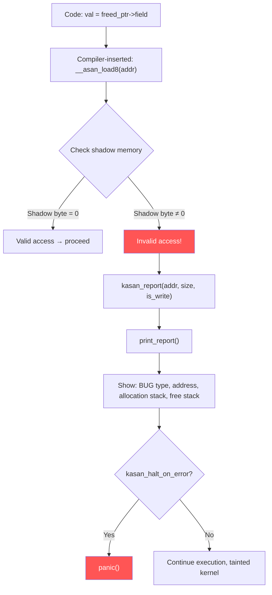

# Scenario 3: Use-After-Free (UAF)

## Symptom

### Without KASAN (silent corruption or random crash):
```
[ 3291.441022] Unable to handle kernel paging request at virtual address ffff0000deadbeef
[ 3291.441035] Mem abort info:
[ 3291.441037]   ESR = 0x0000000096000007
[ 3291.441040]   EC = 0x25: DABT (current EL), IL = 32 bits
[ 3291.441043]   SET = 0, FnV = 0
[ 3291.441045]   EA = 0, S1PTW = 0
[ 3291.441047]   FSC = 0x07: level 3 translation fault
[ 3291.441055] Internal error: Oops: 0000000096000007 [#1] PREEMPT SMP
[ 3291.441062] CPU: 1 PID: 2341 Comm: worker_thread Tainted: G    B      6.8.0 #1
[ 3291.441072] pc : process_request+0x88/0x1f0 [my_driver]
[ 3291.441082] Call trace:
[ 3291.441084]  process_request+0x88/0x1f0 [my_driver]
[ 3291.441090]  worker_thread_fn+0x54/0x100 [my_driver]
[ 3291.441095]  kthread+0x120/0x130
[ 3291.441100]  ret_from_fork+0x10/0x20
```

### With KASAN (precise detection):
```
[ 3291.441022] ==================================================================
[ 3291.441025] BUG: KASAN: slab-use-after-free in process_request+0x88/0x1f0 [my_driver]
[ 3291.441030] Read of size 8 at addr ffff000012345678 by task worker_thread/2341
[ 3291.441035]
[ 3291.441037] CPU: 1 PID: 2341 Comm: worker_thread Tainted: G    B      6.8.0 #1
[ 3291.441042] Call trace:
[ 3291.441044]  dump_backtrace+0x0/0x1b8
[ 3291.441050]  print_report+0xd4/0x5b0
[ 3291.441055]  kasan_report+0xa4/0xf0
[ 3291.441060]  __asan_load8+0x78/0xa0
[ 3291.441065]  process_request+0x88/0x1f0 [my_driver]
[ 3291.441070]  worker_thread_fn+0x54/0x100 [my_driver]
[ 3291.441075]
[ 3291.441077] Allocated by task 1892:
[ 3291.441080]  kasan_save_stack+0x28/0x50
[ 3291.441084]  kmalloc+0xb4/0x120
[ 3291.441088]  create_request+0x34/0x100 [my_driver]
[ 3291.441092]  my_driver_ioctl+0x78/0x200 [my_driver]
[ 3291.441096]  __arm64_sys_ioctl+0xa8/0xe0
[ 3291.441100]
[ 3291.441102] Freed by task 2100:
[ 3291.441104]  kasan_save_stack+0x28/0x50
[ 3291.441108]  kfree+0x80/0x120
[ 3291.441112]  destroy_request+0x2c/0x50 [my_driver]
[ 3291.441116]  timeout_handler+0x48/0x80 [my_driver]
[ 3291.441120]  call_timer_fn+0x128/0x3e0
[ 3291.441124]
[ 3291.441126] The buggy address belongs to the object at ffff000012345600
[ 3291.441129]  which belongs to the cache kmalloc-256 of size 256
[ 3291.441132] The buggy address is located 120 bytes inside of
[ 3291.441134]  freed 256-byte region [ffff000012345600, ffff000012345700)
[ 3291.441137] ==================================================================
```

### How to Recognize
- **With KASAN**: `BUG: KASAN: slab-use-after-free` — clearly identified
- **Without KASAN**: crash at seemingly valid kernel address; slab poison bytes (`6b6b6b6b`) visible in registers
- KASAN shows **who allocated** and **who freed** the object — invaluable
- Random crashes in different places — symptom of the same freed object being reused

---

## Background: SLUB Slab Allocator and Freed Memory

### What Happens When You `kfree()`
```c
// mm/slub.c — __slab_free()
static void __slab_free(struct kmem_cache *s, struct slab *slab,
                        void *head, void *tail, int cnt,
                        unsigned long addr)
{
    // Object is placed back on the freelist:
    // slab→freelist → freed_object → next_free → ...

    // With SLUB_DEBUG: object is poisoned
    // Before free:  [actual data ............]
    // After free:   [6b 6b 6b 6b 6b 6b 6b 6b ...]  (POISON_FREE = 0x6b)
}
```

### SLUB Debug Poison Patterns
```
┌──────────────────────────────────────────────────────┐
│ Poison Value │ Meaning                               │
├──────────────┼───────────────────────────────────────┤
│ 0x6b         │ POISON_FREE — object has been freed   │
│ 0x5a         │ POISON_INUSE — red zone active byte   │
│ 0xa5         │ Object padding (unused tail bytes)    │
│ 0xcc         │ SLUB: uninit. allocated (with debug)  │
│ 0xbb         │ POISON_END — end of object sentinel   │
└──────────────────────────────────────────────────────┘
```

### Object Lifecycle
```
     kmalloc(256)           kfree(ptr)            kmalloc(256) [reuse]
         │                      │                       │
    ┌────▼─────┐          ┌────▼──────┐          ┌────▼────────┐
    │ data ... │          │ 6b6b6b6b  │          │ NEW data    │
    │ data ... │          │ 6b6b6b6b  │          │ NEW data    │
    │ data ... │  ─────►  │ 6b6b6b6b  │  ─────►  │ NEW data    │
    │ data ... │          │ 6b6b6b6b  │          │ NEW data    │
    └──────────┘          └───────────┘          └─────────────┘
    ptr is valid          ptr is dangling        ptr is STALE
                          access → 6b6b... or   access → wrong data!
                          crash if page freed    (silent corruption)
```

---

## Code Flow: KASAN Detection



### KASAN Shadow Memory
```
                   Kernel Virtual Memory
    ┌─────────────────────────────────────────┐
    │ 8 bytes of kernel memory                │
    │ maps to 1 byte of shadow memory         │
    └─────────────────┬───────────────────────┘
                      │ shadow = addr >> 3 + KASAN_SHADOW_OFFSET
                      ▼
    ┌─────────────────────────────────────────┐
    │ Shadow byte:                            │
    │   0x00 = all 8 bytes accessible         │
    │   0x01-0x07 = first N bytes accessible  │
    │   0xFB = freed (KASAN_SLAB_FREE)        │
    │   0xFE = freed by kfree (KASAN_KMALLOC_ │
    │          FREE)                           │
    │   0xFC = red zone (KASAN_SLAB_REDZONE)  │
    └─────────────────────────────────────────┘
```

### How KASAN Tracks Alloc/Free
```c
// mm/kasan/common.c
void *__kasan_kmalloc(struct kmem_cache *cache, const void *object,
                      size_t size, gfp_t flags)
{
    // 1. Unpoison the allocated region in shadow memory
    kasan_unpoison(object, size, false);

    // 2. Poison red zones around it
    kasan_poison(object + size, cache->object_size - size,
                 KASAN_SLAB_REDZONE, false);

    // 3. Save allocation stack trace
    kasan_save_alloc_info(cache, object, flags);
}

bool __kasan_slab_free(struct kmem_cache *cache, void *object,
                       unsigned long ip)
{
    // 1. Check for double-free
    if (unlikely(kasan_check_slab_free(cache, object)))
        return true;  // double-free detected

    // 2. Poison entire object in shadow → future access = BUG
    kasan_poison(object, cache->object_size,
                 KASAN_SLAB_FREE, false);

    // 3. Save free stack trace
    kasan_save_free_info(cache, object);
}
```

---

## Common Causes

### 1. Timer/Workqueue Uses Freed Object
```c
struct my_request {
    struct timer_list timer;
    struct work_struct work;
    char *data;
};

void submit_request(struct my_request *req) {
    timer_setup(&req->timer, timeout_cb, 0);
    mod_timer(&req->timer, jiffies + HZ);
}

void cancel_request(struct my_request *req) {
    kfree(req);  // BUG: timer may still fire!
    // Timer fires → timeout_cb accesses freed req → UAF
}

/* FIX: */
void cancel_request(struct my_request *req) {
    del_timer_sync(&req->timer);  // wait for timer to finish
    kfree(req);
}
```

### 2. RCU Callback References Freed Object
```c
void remove_entry(struct my_entry *entry) {
    list_del_rcu(&entry->list);
    kfree(entry);  // BUG: RCU readers may still reference it
}

/* FIX: */
void remove_entry(struct my_entry *entry) {
    list_del_rcu(&entry->list);
    kfree_rcu(entry, rcu);  // Freed after grace period
}
```

### 3. Concurrent Access Without Locking
```c
/* Thread A: */
void disconnect(struct my_device *dev) {
    kfree(dev->priv);
    dev->priv = NULL;
}

/* Thread B (running concurrently): */
void do_io(struct my_device *dev) {
    // Race: dev->priv was just freed by Thread A
    dev->priv->buffer[0] = 0xFF;  // UAF!
}
```

### 4. Returning Pointer to Freed Stack/Slab
```c
struct data *get_data(void) {
    struct data *d = kmalloc(sizeof(*d), GFP_KERNEL);
    populate(d);
    kfree(d);
    return d;  // BUG: returning freed pointer
}
```

### 5. Destructor Called Twice (refcount bug)
```c
void release_dev(struct kref *kref) {
    struct my_device *dev = container_of(kref, struct my_device, kref);
    kfree(dev->resources);
    kfree(dev);
}

// If kref_put() called one too many times → double release
// Second call: dev is already freed → UAF in container_of
```

---

## Debugging Steps

### Step 1: Enable KASAN
```bash
# .config:
CONFIG_KASAN=y
CONFIG_KASAN_GENERIC=y      # comprehensive (slower)
# or
CONFIG_KASAN_SW_TAGS=y       # ARM64 MTE-based (faster)

# Boot and reproduce → KASAN prints alloc + free stacks
```

### Step 2: Read the KASAN Report
```
BUG: KASAN: slab-use-after-free in process_request+0x88/0x1f0

Allocated by task 1892:       ← WHO allocated the object
  create_request+0x34/0x100   ← Creation point

Freed by task 2100:           ← WHO freed the object
  destroy_request+0x2c/0x50   ← Free point
  timeout_handler+0x48/0x80   ← Called from timer

The buggy address is located 120 bytes inside of freed 256-byte region
```
**Key insight**: The timer handler freed it, but the worker thread still used it.

### Step 3: Without KASAN — Look for Poison Bytes
```
Registers at crash:
x19: 6b6b6b6b6b6b6b6b   ← POISON_FREE! This was a freed slab object
x20: 6b6b6b6b6b6b6b6b
```

### Step 4: Enable SLUB Debug
```bash
# Boot parameter:
slub_debug=FZPU             # F=sanity, Z=red zone, P=poison, U=track

# Or per-cache:
slub_debug=FZPU,kmalloc-256

# After crash, check:
cat /sys/kernel/slab/kmalloc-256/alloc_calls
cat /sys/kernel/slab/kmalloc-256/free_calls
```

### Step 5: Use KFENCE (lightweight, production-safe)
```bash
CONFIG_KFENCE=y
CONFIG_KFENCE_SAMPLE_INTERVAL=100  # ms between samples

# KFENCE catches ~1% of bugs probabilistically
# Much lower overhead than KASAN (< 1% vs 50%)
```

### Step 6: Crash Tool Analysis
```bash
crash vmlinux vmcore

crash> kmem ffff000012345678     # What slab is this address in?
CACHE             NAME                 OBJSIZE
ffff0000abcde000  kmalloc-256              256
  SLAB              TOTAL  ALLOCATED  FREE
  ffff7e0000048d00    32       28       4

crash> rd ffff000012345600 32    # Dump the freed object
ffff000012345600:  6b6b6b6b6b6b6b6b 6b6b6b6b6b6b6b6b  ← POISON
ffff000012345610:  6b6b6b6b6b6b6b6b 6b6b6b6b6b6b6b6b
```

---

## Fixes

| Cause | Fix |
|-------|-----|
| Timer accesses freed object | `del_timer_sync()` before `kfree()` |
| Workqueue accesses freed object | `cancel_work_sync()` before `kfree()` |
| RCU reader sees freed object | Use `kfree_rcu()` instead of `kfree()` |
| Refcount imbalance | Use `kref` properly; audit all `kref_get/put` |
| Missing lock | Add spinlock/mutex around alloc/free/access |
| Returned freed pointer | Don't free before return; use caller-frees pattern |

### Fix Example: Proper Teardown Order
```c
/* BEFORE: UAF — timer and workqueue use freed object */
void my_remove(struct my_device *dev) {
    kfree(dev->request);  // freed!
    // timer & workqueue still reference dev->request → UAF
}

/* AFTER: Cancel async work first, then free */
void my_remove(struct my_device *dev) {
    del_timer_sync(&dev->request->timer);
    cancel_work_sync(&dev->request->work);
    flush_workqueue(dev->wq);
    kfree(dev->request);
}
```

---

## Quick Reference

| Item | Value |
|------|-------|
| KASAN message | `BUG: KASAN: slab-use-after-free` |
| Poison byte (freed) | `0x6b` (POISON_FREE) |
| KASAN shadow (freed) | `0xFB` (KASAN_SLAB_FREE) |
| SLUB debug boot param | `slub_debug=FZPU` |
| Key KASAN config | `CONFIG_KASAN=y`, `CONFIG_KASAN_GENERIC=y` |
| Lightweight alternative | `CONFIG_KFENCE=y` (production-safe) |
| KASAN overhead | ~2× memory, ~50% CPU |
| KFENCE overhead | < 1% CPU |
| Key defense | `del_timer_sync()` + `cancel_work_sync()` before `kfree()` |
| RCU-safe free | `kfree_rcu(ptr, rcu_member)` |
