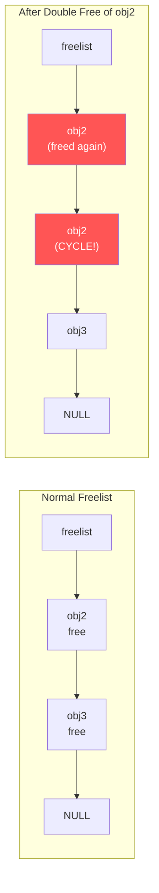

# Scenario 4: Double Free / Slab Corruption

## Symptom

### SLUB Double-Free Detection:
```
[ 4521.223401] =============================================================================
[ 4521.223408] BUG kmalloc-128 (Tainted: G           O     ): Object already free
[ 4521.223412] -----------------------------------------------------------------------------
[ 4521.223414]
[ 4521.223416] Disabling lock debugging due to kernel taint
[ 4521.223418] INFO: Slab 0xfffffc0000123400 objects=32 used=17 fp=0xffff000012345680
[ 4521.223425] INFO: Object 0xffff000012345680 @offset=1664 fp=0xffff000012345780
[ 4521.223432]
[ 4521.223434] Redzone  ffff000012345670: bb bb bb bb bb bb bb bb  ........
[ 4521.223440] Object   ffff000012345680: 6b 6b 6b 6b 6b 6b 6b 6b  kkkkkkkk
[ 4521.223446]          ffff000012345688: 6b 6b 6b 6b 6b 6b 6b 6b  kkkkkkkk
[ 4521.223451]                    ...
[ 4521.223453] Redzone  ffff000012345700: bb bb bb bb bb bb bb bb  ........
[ 4521.223458] Padding  ffff000012345740: 5a 5a 5a 5a 5a 5a 5a 5a  ZZZZZZZZ
[ 4521.223463]
[ 4521.223465] CPU: 2 PID: 3456 Comm: my_cleanup Tainted: G           O      6.8.0 #1
[ 4521.223472] Call trace:
[ 4521.223474]  dump_backtrace+0x0/0x1b8
[ 4521.223479]  show_stack+0x24/0x30
[ 4521.223483]  slab_err+0xb0/0xf0
[ 4521.223487]  free_debug_processing+0x23c/0x340
[ 4521.223492]  __slab_free+0x48/0x3e0
[ 4521.223496]  kfree+0x80/0x120
[ 4521.223500]  destroy_context+0x38/0x60 [my_driver]
[ 4521.223505]  cleanup_handler+0x64/0x90 [my_driver]
[ 4521.223510]  kthread+0x120/0x130
[ 4521.223514]  ret_from_fork+0x10/0x20
```

### With KASAN:
```
[ 4521.223401] ==================================================================
[ 4521.223404] BUG: KASAN: double-free in kfree+0x80/0x120
[ 4521.223408]
[ 4521.223410] Free of addr ffff000012345680 by task my_cleanup/3456
[ 4521.223414]
[ 4521.223416] CPU: 2 PID: 3456 Comm: my_cleanup Tainted: G    B      6.8.0 #1
[ 4521.223422] Call trace:
[ 4521.223424]  kasan_save_stack+0x28/0x50
[ 4521.223428]  kasan_save_free_info+0x38/0x60
[ 4521.223432]  __kasan_slab_free+0x100/0x170
[ 4521.223436]  kfree+0x80/0x120
[ 4521.223440]  destroy_context+0x38/0x60 [my_driver]
[ 4521.223445]
[ 4521.223447] Allocated by task 1200:
[ 4521.223449]  kmalloc+0xb4/0x120
[ 4521.223453]  create_context+0x28/0x80 [my_driver]
[ 4521.223457]
[ 4521.223459] Freed by task 2800:
[ 4521.223461]  kfree+0x80/0x120
[ 4521.223465]  release_context+0x40/0x60 [my_driver]
[ 4521.223469]  ioctl_handler+0x90/0x100 [my_driver]
[ 4521.223473] ==================================================================
```

### How to Recognize
- **`BUG kmalloc-NNN: Object already free`** (SLUB debug)
- **`BUG: KASAN: double-free`** (KASAN)
- Object contents show `6b 6b 6b 6b` (POISON_FREE) — already freed
- Red zones (`bb`) and padding (`5a`) intact but object is poison
- Freelist corruption: `fp=0x...` → corrupted chain

---

## Background: SLUB Freelist and Double-Free Mechanics

### SLUB Slab Structure
```
struct slab (one per page/page-group):
┌──────────────────────────────────────────────────────┐
│  Object 0  │  Object 1  │  Object 2  │  ...  │ Obj N│
└──────────────────────────────────────────────────────┘
     │              │             │
     ▼              ▼             ▼
┌─────────┐   ┌─────────┐   ┌─────────┐
│ In-use   │   │ FREE    │   │ FREE    │
│ (data)   │   │ fp → ─────► │ fp → NULL│
└─────────┘   └─────────┘   └─────────┘
                  ▲
                  │
           slab->freelist
```

### Normal Free vs Double Free
```
Normal free(obj1):
  freelist: obj1 → obj2 → obj3 → NULL

  kmalloc → returns obj1
  freelist: obj2 → obj3 → NULL    ✓ correct

Double free(obj2):
  freelist: obj2 → obj2 → obj3 → NULL    ← CYCLE!

  kmalloc → returns obj2
  freelist: obj2 → obj3 → NULL    ← obj2 still on freelist!

  kmalloc → returns obj2 AGAIN!
  Now TWO callers think they own obj2 → data corruption
```

### Freelist Corruption Diagram


---

## Code Flow: SLUB Free Path and Checks

```c
// mm/slub.c — kfree() → __slab_free() → free_debug_processing()

static noinline bool free_debug_processing(
    struct kmem_cache *s, struct slab *slab,
    void *head, void *tail, int *bulk_cnt,
    unsigned long addr)
{
    // 1. Check: is the object actually in this slab?
    if (!check_slab(s, slab))
        goto out;

    // 2. Check: is the object at a valid offset?
    if (!check_valid_pointer(s, slab, head))
        goto out;

    // 3. ★ THE DOUBLE-FREE CHECK ★
    // Check if object is already on the freelist
    if (on_freelist(s, slab, head)) {
        object_err(s, slab, head, "Object already free");
        goto out;  // BUG printed!
    }

    // 4. Check object poison (should still be valid data, not 0x6b)
    if (!check_object(s, slab, head, SLUB_RED_ACTIVE))
        goto out;

    // 5. All checks pass → actually free
    return true;

out:
    slab_fix(s, "Object at 0x%p not freed", head);
    return false;
}
```

### on_freelist() — Walking the Chain
```c
static int on_freelist(struct kmem_cache *s, struct slab *slab, void *search)
{
    int nr = 0;
    void *fp;
    void *object = NULL;
    int max_objects;

    fp = slab->freelist;
    while (fp && nr <= slab->objects) {
        if (fp == search)
            return 1;  // FOUND! Object is already free → double-free

        object = fp;
        fp = get_freepointer(s, object);
        nr++;
    }

    // Also detect corrupted freelist (cycle):
    if (nr > slab->objects) {
        slab_err(s, slab, "Freepointer corrupt");
        // Freelist has a cycle → corruption
    }

    return 0;
}
```

---

## Common Causes

### 1. Two Code Paths Both Free the Same Object
```c
int process(struct context *ctx) {
    int ret = do_work(ctx);
    if (ret < 0) {
        kfree(ctx);     // error path frees
        return ret;
    }
    submit(ctx);
    return 0;
}

void completion_handler(struct context *ctx) {
    // ... use result ...
    kfree(ctx);          // completion also frees
}

// If do_work() fails AND completion fires → double free
```

### 2. Refcount Underflow
```c
void put_resource(struct resource *r) {
    if (atomic_dec_and_test(&r->refcount)) {
        kfree(r);
    }
}

// If refcount starts at 1 and put_resource() is called twice:
// First call:  refcount 1→0, kfree()
// Second call: refcount 0→-1 (underflow), kfree() again!
```

### 3. Missing NULL After Free
```c
void cleanup(struct my_device *dev) {
    kfree(dev->buffer);
    // Missing: dev->buffer = NULL;
}

void shutdown(struct my_device *dev) {
    if (dev->buffer) {      // Still non-NULL (dangling)
        kfree(dev->buffer); // Double free!
    }
}
```

### 4. List Corruption Leading to Double Processing
```c
void flush_queue(struct list_head *queue) {
    struct request *req, *tmp;
    list_for_each_entry_safe(req, tmp, queue, list) {
        list_del(&req->list);
        kfree(req);
    }
}

// If called concurrently without locking:
// Both threads see the same entries → both free them
```

### 5. Error Rollback Frees + Final Cleanup Frees
```c
int init_device(struct my_device *dev) {
    dev->a = kmalloc(100, GFP_KERNEL);
    dev->b = kmalloc(200, GFP_KERNEL);
    if (!dev->b) {
        kfree(dev->a);   // rollback frees a
        return -ENOMEM;
    }
    dev->c = kmalloc(300, GFP_KERNEL);
    if (!dev->c) {
        kfree(dev->b);
        kfree(dev->a);   // rollback frees a again if labels wrong
        return -ENOMEM;
    }
    return 0;
}

void remove_device(struct my_device *dev) {
    kfree(dev->a);  // Double free if init failed and already freed!
    kfree(dev->b);
    kfree(dev->c);
}
```

---

## The Security Angle: Double-Free Exploitation

Double-free is a **critical security vulnerability** (CWE-415):

```
1. Attacker triggers double-free of object X
2. X goes on freelist twice
3. Attacker allocates → gets X
4. Someone else allocates → also gets X (same memory!)
5. Attacker writes to X → overwrites the other user's data
6. Can hijack function pointers, escalate privileges
```

This is why the kernel has multiple detection mechanisms:
- **SLUB_DEBUG** — checks freelist at free time
- **KASAN** — shadow memory detects freed access
- **KFENCE** — guard pages around sampled objects
- **hardened_usercopy** — prevents cross-slab copies

---

## Debugging Steps

### Step 1: Read the Error Message
```
BUG kmalloc-128: Object already free
INFO: Object 0xffff000012345680 @offset=1664

Call trace:
  kfree+0x80/0x120
  destroy_context+0x38/0x60 [my_driver]   ← THE SECOND FREE
  cleanup_handler+0x64/0x90 [my_driver]
```
This is the **second** `kfree()`. The first free was earlier.

### Step 2: Find the First Free
```bash
# With KASAN — shown in the report:
# "Freed by task 2800: release_context+0x40/0x60"

# Without KASAN — enable SLUB tracking:
slub_debug=U    # U = track alloc/free callers

# Check tracking:
cat /sys/kernel/slab/kmalloc-128/free_calls
# Shows all kfree callers and counts
```

### Step 3: Enable SLUB Debug at Boot
```bash
# Full debug:
slub_debug=FZPU

# F = Sanity checks (freelist integrity)
# Z = Red zones (detect buffer overflows into adjacent objects)
# P = Poison (fill freed objects with 0x6b, catch UAF)
# U = User tracking (record alloc/free callers)
```

### Step 4: Use `crash` Tool
```bash
crash vmlinux vmcore

crash> kmem -s kmalloc-128     # Slab cache summary
crash> kmem 0xffff000012345680 # Object details
crash> rd 0xffff000012345680 16 # Check if poisoned (6b6b6b6b)
```

### Step 5: Audit Code for Multiple Free Paths
```bash
# Find all kfree calls for the type:
grep -n "kfree.*ctx\|kfree.*context" drivers/my_driver/*.c

# Look for:
# 1. Error paths that free + normal path that also frees
# 2. Callbacks that free + explicit cleanup that frees
# 3. Missing NULL assignment after free
```

### Step 6: Use `refcount_t` Instead of `atomic_t`
```bash
# refcount_t has built-in underflow/overflow detection:
CONFIG_REFCOUNT_FULL=y  # (default on most configs)

# If refcount hits 0→-1:
# "refcount_t: underflow; use-after-free"
```

---

## Fixes

| Cause | Fix |
|-------|-----|
| Two paths both free | Unify to single owner; use `goto err_free` pattern |
| Refcount underflow | Use `refcount_t` (not `atomic_t`); audit all get/put |
| NULL not set after free | `kfree(p); p = NULL;` always |
| Racy list operations | Hold spinlock during list_del + kfree |
| Error rollback + final cleanup | Use `goto` unwinding pattern (standard kernel style) |

### Fix Example: Proper goto Unwinding
```c
/* BEFORE: error paths risk double-free */
int init_device(struct my_device *dev) {
    dev->a = kmalloc(100, GFP_KERNEL);
    if (!dev->a) return -ENOMEM;

    dev->b = kmalloc(200, GFP_KERNEL);
    if (!dev->b) {
        kfree(dev->a);
        return -ENOMEM;
    }

    dev->c = kmalloc(300, GFP_KERNEL);
    if (!dev->c) {
        kfree(dev->a); kfree(dev->b);
        return -ENOMEM;
    }
    return 0;
}

/* AFTER: goto unwinding — clean, safe, standard kernel pattern */
int init_device(struct my_device *dev) {
    dev->a = kmalloc(100, GFP_KERNEL);
    if (!dev->a)
        return -ENOMEM;

    dev->b = kmalloc(200, GFP_KERNEL);
    if (!dev->b)
        goto err_free_a;

    dev->c = kmalloc(300, GFP_KERNEL);
    if (!dev->c)
        goto err_free_b;

    return 0;

err_free_b:
    kfree(dev->b);
    dev->b = NULL;
err_free_a:
    kfree(dev->a);
    dev->a = NULL;
    return -ENOMEM;
}
```

### Fix Example: Use refcount_t
```c
/* BEFORE: atomic_t — no underflow protection */
struct my_obj {
    atomic_t refcount;
};
void put(struct my_obj *obj) {
    if (atomic_dec_and_test(&obj->refcount))
        kfree(obj);  // double-put → double-free
}

/* AFTER: refcount_t — saturates on underflow */
struct my_obj {
    refcount_t refcount;
};
void put(struct my_obj *obj) {
    if (refcount_dec_and_test(&obj->refcount))
        kfree(obj);
    // Second put: refcount_t detects underflow, warns, prevents free
}
```

---

## Freelist Corruption: The Deeper Problem

Double-free corrupts the SLUB freelist. Even worse, an attacker or buggy code can **overwrite the freelist pointer** stored inside a freed object:

```
Freed object layout (SLUB):
┌──────────────────────────────────────┐
│ fp (freelist next pointer)  │ 8 bytes│  ← if this gets corrupted...
├──────────────────────────────────────┤
│ 6b 6b 6b ... (poison)              │
└──────────────────────────────────────┘

If fp is overwritten with arbitrary address:
  kmalloc() follows corrupted fp → returns arbitrary address
  Caller writes to that address → ARBITRARY WRITE primitive
```

Mitigation: **CONFIG_SLAB_FREELIST_HARDENED=y** (XORs freelist pointers with a per-cache random cookie and the object address).

---

## Quick Reference

| Item | Value |
|------|-------|
| SLUB message | `BUG kmalloc-NNN: Object already free` |
| KASAN message | `BUG: KASAN: double-free` |
| Poison bytes | `0x6b` = freed, `0xbb` = redzone, `0x5a` = padding |
| SLUB debug param | `slub_debug=FZPU` |
| Key check function | `free_debug_processing()` in `mm/slub.c` |
| Freelist hardening | `CONFIG_SLAB_FREELIST_HARDENED=y` |
| Refcount safety | `refcount_t` (not `atomic_t`) |
| CWE | CWE-415 (Double Free) |
| Exploit risk | Critical — can lead to arbitrary write |
