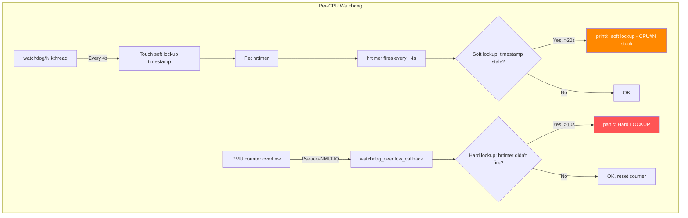

# Scenario 5: Hard Lockup

## Symptom

```
[ 8472.339120] watchdog: Watchdog detected hard LOCKUP on cpu 2
[ 8472.339125] Modules linked in: buggy_mod(O) dm_crypt xfs nfs [last unloaded: old_mod]
[ 8472.339145] CPU: 2 PID: 0 Comm: swapper/2 Tainted: G        W  O      6.8.0 #1
[ 8472.339150] Hardware name: ARM Platform (DT)
[ 8472.339155] pstate: 204000c9 (nzCv daIF +PAN -UAO -TCO -DIT -SSBS BTYPE=--)
[ 8472.339160] pc : _raw_spin_lock+0x34/0x60
[ 8472.339165] lr : my_irq_handler+0x48/0x100 [buggy_mod]
[ 8472.339170] sp : ffff800010003e80
[ 8472.339175] ...
[ 8472.339180] Call trace:
[ 8472.339182]  _raw_spin_lock+0x34/0x60
[ 8472.339186]  my_irq_handler+0x48/0x100 [buggy_mod]
[ 8472.339190]  __handle_irq_event_percpu+0x54/0x1c0
[ 8472.339194]  handle_irq_event+0x4c/0xb0
[ 8472.339198]  handle_fasteoi_irq+0xa4/0x180
[ 8472.339202]  generic_handle_domain_irq+0x30/0x50
[ 8472.339206]  gic_handle_irq+0x4c/0x110
[ 8472.339210]  call_on_irq_stack+0x28/0x50
[ 8472.339214]  do_interrupt_handler+0x50/0x88
[ 8472.339218]  el1_interrupt+0x34/0x68
[ 8472.339222]  el1h_64_irq_handler+0x18/0x24
[ 8472.339226]  el1h_64_irq+0x64/0x68
[ 8472.339230]  _raw_spin_lock+0x28/0x60           ← nested spin!
[ 8472.339234]  process_data+0x30/0x80 [buggy_mod]
[ 8472.339238]  my_workqueue_fn+0x44/0x70 [buggy_mod]
[ 8472.339242]  process_one_work+0x1a4/0x3c0
[ 8472.339246]  worker_thread+0x50/0x430
[ 8472.339250]  kthread+0x120/0x130
[ 8472.339254]  ret_from_fork+0x10/0x20
[ 8472.339260] Kernel panic - not syncing: Hard LOCKUP
```

### How to Recognize
- **`Watchdog detected hard LOCKUP on cpu N`**
- CPU has been stuck with **interrupts disabled** for > `watchdog_thresh` seconds (default 10s)
- PC is in a spin_lock → **deadlock in interrupt context**
- PID: 0 (`swapper/N`) means the CPU was in idle but can't schedule
- `pstate: ...daIF...` — **I flag set = IRQs masked**
- Call trace shows an **interrupt handler** that took a lock already held

---

## Background: The Watchdog Architecture

### Hard Lockup vs Soft Lockup

| Feature | Hard Lockup | Soft Lockup |
|---------|-------------|-------------|
| What's stuck | CPU with **IRQs disabled** | CPU with **preemption disabled** |
| Detection | NMI watchdog (PMU/perf) | Timer interrupt (hrtimer) |
| Threshold | `watchdog_thresh` (10s) | `2 × watchdog_thresh` (20s) |
| Can IRQs fire? | **No** — that's the problem | Yes — but scheduler can't run |
| Typical cause | Spinlock deadlock in IRQ context | Long spin_lock in process context |

### Hard Lockup Detection on ARM64
```
ARM64 does NOT have traditional NMI. Detection uses:

1. PMU-based watchdog (perf counter overflow → FIQ/pseudo-NMI)
   - CONFIG_HARDLOCKUP_DETECTOR_PERF=y
   - Uses performance monitor counter → generates FIQ on overflow
   - FIQ is not masked by regular IRQ disable (daif 'F' bit separate)

2. buddy CPU detection (some implementations)
   - CPU A monitors CPU B's heartbeat via shared memory

3. External watchdog timer (SP805, SBSA GWDT)
   - Hardware timer that resets system if not "pet" regularly
```

### Watchdog Architecture


### Key Insight: Why NMI/FIQ Detects Hard Lockup
```
Normal state:
  hrtimer → fires every ~4s → increments "hrtimer_interrupts"
  PMU overflow → checks if "hrtimer_interrupts" changed
  If yes → CPU is alive (IRQs working)

Hard lockup:
  CPU has IRQs disabled (spinlock with irqsave, etc.)
  hrtimer CANNOT fire → hrtimer_interrupts stays the same
  PMU overflow fires via FIQ (NOT masked by IRQ disable)
  PMU handler sees: hrtimer_interrupts unchanged for 10s
  → Hard lockup detected!
```

---

## Code Flow: Watchdog Detection

```c
// kernel/watchdog.c

// The hrtimer that fires periodically:
static enum hrtimer_restart watchdog_timer_fn(struct hrtimer *hrtimer)
{
    // 1. Increment counter (proves IRQs are working):
    __this_cpu_inc(hrtimer_interrupts);

    // 2. Check soft lockup (is watchdog kthread running?):
    // ... (see Scenario 6)

    return HRTIMER_RESTART;
}

// The NMI/PMU handler that detects hard lockup:
static void watchdog_overflow_callback(struct perf_event *event,
                                        struct perf_sample_data *data,
                                        struct pt_regs *regs)
{
    // This runs from FIQ/pseudo-NMI — even with IRQs disabled!

    if (__this_cpu_read(watchdog_nmi_touch))
        return;  // explicitly touched, skip check

    // Check: did hrtimer_interrupts change since last check?
    if (!is_hardlockup()) {
        __this_cpu_write(hrtimer_interrupts_saved,
                         __this_cpu_read(hrtimer_interrupts));
        return;  // hrtimer fired → CPU is alive
    }

    // ★ HARD LOCKUP DETECTED ★
    // hrtimer_interrupts hasn't changed → IRQs are stuck

    pr_emerg("Watchdog detected hard LOCKUP on cpu %d\n",
             smp_processor_id());
    print_modules();
    show_regs(regs);

    if (hardlockup_panic)
        nmi_panic(regs, "Hard LOCKUP");
}

// The check itself:
static bool is_hardlockup(void)
{
    unsigned long hrint = __this_cpu_read(hrtimer_interrupts);

    if (__this_cpu_read(hrtimer_interrupts_saved) == hrint)
        return true;   // hrtimer hasn't fired → IRQs stuck!

    return false;
}
```

---

## Common Causes

### 1. Spinlock Deadlock (Same Lock, IRQ + Process Context)
```c
static DEFINE_SPINLOCK(my_lock);

void process_data(void) {
    spin_lock(&my_lock);         // ← Takes lock in process context
    // ... do work ...
    spin_unlock(&my_lock);       // IRQ fires before unlock!
}

irqreturn_t my_irq_handler(int irq, void *data) {
    spin_lock(&my_lock);         // ← DEADLOCK! Same lock, same CPU
    // IRQs are disabled, so process_data's unlock will never run
    // → CPU stuck forever with IRQs off → HARD LOCKUP
    spin_unlock(&my_lock);
    return IRQ_HANDLED;
}
```

### 2. Nested Interrupt + Wrong Lock Type
```c
/* Using spin_lock() when spin_lock_irqsave() is needed: */

void task_fn(void) {
    spin_lock(&my_lock);       // ← IRQs NOT disabled!
    // IRQ fires on this CPU...
}

irqreturn_t irq_handler(...) {
    spin_lock(&my_lock);       // ← DEADLOCK on this CPU
    // ...
}

/* FIX: Use spin_lock_irqsave() in task context: */
void task_fn(void) {
    unsigned long flags;
    spin_lock_irqsave(&my_lock, flags);   // disables IRQs
    // Now safe — IRQ can't fire on this CPU
    spin_unlock_irqrestore(&my_lock, flags);
}
```

### 3. ABBA Deadlock with IRQs
```c
/* CPU 0:                         CPU 1:                    */
spin_lock_irqsave(&lock_A);      spin_lock_irqsave(&lock_B);
spin_lock(&lock_B);  /* waits */  spin_lock(&lock_A);  /* waits */
/* → Both CPUs stuck with IRQs disabled → HARD LOCKUP on both */
```

### 4. Infinite Loop with IRQs Disabled
```c
irqreturn_t my_irq_handler(int irq, void *data) {
    // Polling hardware register that never clears:
    while (readl(reg) & STATUS_BUSY)
        ;  // Hardware is dead → infinite poll → hard lockup

    return IRQ_HANDLED;
}
```

### 5. Firmware/SMC Call That Never Returns
```c
void my_driver_suspend(void) {
    local_irq_disable();

    // ARM64 SMC call into firmware/TrustZone:
    arm_smccc_smc(0xC4000001, 0, 0, 0, 0, 0, 0, 0, &res);
    // If firmware hangs → CPU never comes back
    // Watchdog detects hard lockup

    local_irq_enable();
}
```

---

## Debugging Steps

### Step 1: Read the Call Trace — Find the Lock
```
Call trace:
  _raw_spin_lock+0x34/0x60           ← spinning on lock
  my_irq_handler+0x48/0x100          ← in IRQ context!
  ...
  el1h_64_irq+0x64/0x68             ← IRQ entry
  _raw_spin_lock+0x28/0x60           ← process context held this lock!
  process_data+0x30/0x80
  my_workqueue_fn+0x44/0x70
```
**Diagnosis**: `process_data` held `my_lock` with `spin_lock()` (IRQs enabled). IRQ fired on same CPU → `my_irq_handler` tried to take same lock → deadlock.

### Step 2: Check pstate Flags
```
pstate: 204000c9 (nzCv daIF +PAN -UAO ...)
                       ^^
                       I = IRQ masked
                       F = FIQ masked

If I=1: IRQs are disabled on this CPU → confirms hard lockup scenario
```

### Step 3: Enable Lockdep
```bash
CONFIG_PROVE_LOCKING=y     # Lock dependency validator
CONFIG_LOCKDEP=y
CONFIG_DEBUG_LOCK_ALLOC=y

# Lockdep will warn about inconsistent lock ordering BEFORE deadlock:
# "WARNING: inconsistent lock state"
# "WARNING: possible circular locking dependency detected"
```

### Step 4: Use `crash` to Inspect Lock State
```bash
crash vmlinux vmcore

# Find the lock address from disassembly:
crash> dis _raw_spin_lock
# or
crash> struct spinlock_t <lock_addr>
  lock = {
    val = {
      counter = 1    # locked!
    }
  }
  owner = 0xffff000012340000   # who holds it

crash> struct task_struct.comm 0xffff000012340000
  comm = "my_workqueue_fn"     # process context held the lock
```

### Step 5: Check All CPU States
```bash
# From crash tool:
crash> bt -a     # backtrace all CPUs
crash> foreach bt   # same, different format

# Look for: multiple CPUs stuck in spin_lock
# This reveals ABBA deadlocks
```

### Step 6: Adjust Watchdog Parameters
```bash
# Increase threshold (debugging, not fixing):
echo 30 > /proc/sys/kernel/watchdog_thresh

# Disable hard lockup detector temporarily:
echo 0 > /proc/sys/kernel/nmi_watchdog

# Force panic on hard lockup:
echo 1 > /proc/sys/kernel/hardlockup_panic
# or boot: hardlockup_panic=1
```

---

## Fixes

| Cause | Fix |
|-------|-----|
| spin_lock in IRQ + process ctx | Use `spin_lock_irqsave()` in process context |
| ABBA deadlock | Enforce consistent lock ordering; use Lockdep |
| Infinite HW poll in IRQ | Add timeout: `readl_poll_timeout()` |
| Firmware hang | Add timeout to SMC calls; use watchdog |
| Unnecessary IRQ disable | Minimize `local_irq_disable()` duration |

### Fix Example: Use spin_lock_irqsave
```c
/* BEFORE: vulnerable to IRQ deadlock */
void process_data(struct my_dev *dev) {
    spin_lock(&dev->lock);
    update_state(dev);
    spin_unlock(&dev->lock);
}

irqreturn_t my_irq(int irq, void *data) {
    struct my_dev *dev = data;
    spin_lock(&dev->lock);     // DEADLOCK if same CPU
    read_hw_status(dev);
    spin_unlock(&dev->lock);
    return IRQ_HANDLED;
}

/* AFTER: IRQ-safe locking */
void process_data(struct my_dev *dev) {
    unsigned long flags;
    spin_lock_irqsave(&dev->lock, flags);   // disable IRQs
    update_state(dev);
    spin_unlock_irqrestore(&dev->lock, flags);
}

irqreturn_t my_irq(int irq, void *data) {
    struct my_dev *dev = data;
    spin_lock(&dev->lock);     // Safe — IRQs already off in IRQ ctx
    read_hw_status(dev);
    spin_unlock(&dev->lock);
    return IRQ_HANDLED;
}
```

### Fix Example: Hardware Poll with Timeout
```c
/* BEFORE: infinite poll */
irqreturn_t my_irq(int irq, void *data) {
    while (readl(dev->regs + STATUS) & BUSY)
        ;  // Forever if HW is dead
}

/* AFTER: bounded poll */
irqreturn_t my_irq(int irq, void *data) {
    u32 val;
    int ret;

    ret = readl_poll_timeout_atomic(dev->regs + STATUS, val,
                                    !(val & BUSY),
                                    1,        // delay_us
                                    1000);    // timeout_us (1ms)
    if (ret) {
        dev_err(dev->dev, "HW timeout in IRQ\n");
        return IRQ_NONE;
    }
    // ... handle IRQ ...
    return IRQ_HANDLED;
}
```

---

## Quick Reference

| Item | Value |
|------|-------|
| Message | `Watchdog detected hard LOCKUP on cpu N` |
| Threshold | `watchdog_thresh` (default 10s) |
| Detection | PMU/perf overflow → FIQ/pseudo-NMI |
| What's stuck | CPU with **IRQs disabled** |
| pstate indicator | `I` flag set (daIF) |
| Config | `CONFIG_HARDLOCKUP_DETECTOR_PERF=y` |
| Sysctl | `/proc/sys/kernel/nmi_watchdog` |
| Panic sysctl | `/proc/sys/kernel/hardlockup_panic` |
| Lock debug | `CONFIG_PROVE_LOCKING=y` (Lockdep) |
| #1 cause | `spin_lock()` shared between IRQ and process context |
| #1 fix | Use `spin_lock_irqsave()` in process context |
