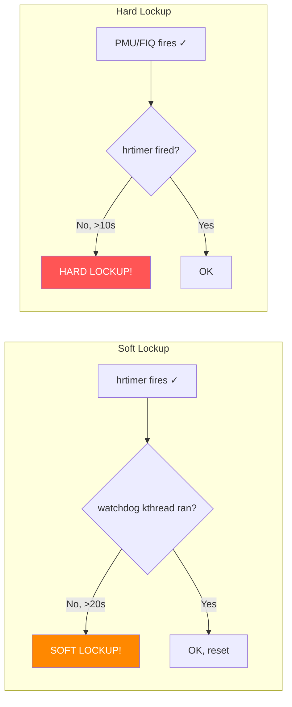

# Scenario 6: Soft Lockup

## Symptom

```
[ 6891.223401] watchdog: BUG: soft lockup - CPU#3 stuck for 23s! [my_worker:4521]
[ 6891.223410] Modules linked in: buggy_mod(O) dm_crypt xfs
[ 6891.223420] CPU: 3 PID: 4521 Comm: my_worker Tainted: G        W  O      6.8.0 #1
[ 6891.223425] Hardware name: ARM Platform (DT)
[ 6891.223430] pstate: 60400005 (nZCv daif +PAN -UAO -TCO -DIT -SSBS BTYPE=--)
[ 6891.223435] pc : copy_large_buffer+0x1c8/0x300 [buggy_mod]
[ 6891.223440] lr : copy_large_buffer+0x1c0/0x300 [buggy_mod]
[ 6891.223445] sp : ffff800012abce40
[ 6891.223448] ...
[ 6891.223455] Call trace:
[ 6891.223457]  copy_large_buffer+0x1c8/0x300 [buggy_mod]
[ 6891.223462]  do_heavy_work+0x64/0x100 [buggy_mod]
[ 6891.223467]  process_one_work+0x1a4/0x3c0
[ 6891.223471]  worker_thread+0x50/0x430
[ 6891.223475]  kthread+0x120/0x130
[ 6891.223479]  ret_from_fork+0x10/0x20
```

### How to Recognize
- **`BUG: soft lockup - CPU#N stuck for Xs!`** (X ≥ 2 × `watchdog_thresh`)
- Interrupts **ARE** working (timer fires to detect it)
- But the **scheduler hasn't run** on that CPU — watchdog kthread starved
- PID is a real task (not PID 0) — that task is monopolizing the CPU
- `pstate: ...daif...` — lowercase 'i' means IRQs are **enabled** (unlike hard lockup)
- PC is in a compute-heavy or long-running loop

---

## Background: Soft Lockup Detection

### How It Works
```
Per-CPU components:
1. watchdog/N kthread (SCHED_DEADLINE/highest priority)
   - When it runs: touches a timestamp → "I'm alive"

2. hrtimer (fires every watchdog_thresh / 5 ≈ 2s)
   - Checks: has watchdog/N kthread run recently?
   - If timestamp is stale (>20s old) → soft lockup!

Key insight:
- hrtimer fires from IRQ → proves IRQs work
- But watchdog kthread hasn't been scheduled → something is
  hogging the CPU with preemption disabled (or at higher priority)
```

### Timeline
```
Time 0s:   watchdog/3 runs → touch_softlockup_watchdog()
           soft_lockup_timestamp = now

Time 2s:   hrtimer fires → check: now - timestamp < 20s → OK
Time 4s:   hrtimer fires → check: now - timestamp < 20s → OK

           ... CPU 3 enters long spin_lock or busy loop ...
           watchdog/3 kthread cannot get scheduled

Time 20s:  hrtimer fires → check: now - timestamp > 20s!
           → "BUG: soft lockup - CPU#3 stuck for 22s!"
```

### Detection vs Hard Lockup


---

## Code Flow: Detection Internals

```c
// kernel/watchdog.c

// 1. The watchdog kthread — runs on each CPU
static int watchdog_fn(void *data)
{
    while (!kthread_should_stop()) {
        // Touch the soft lockup timestamp:
        __this_cpu_write(watchdog_touch_ts, get_timestamp());

        // Pet the hrtimer:
        set_current_state(TASK_INTERRUPTIBLE);
        schedule();  // Sleep until hrtimer wakes us
    }
    return 0;
}

// 2. The hrtimer — fires periodically from IRQ context
static enum hrtimer_restart watchdog_timer_fn(struct hrtimer *hrtimer)
{
    // This fires every watchdog_thresh/5 seconds

    // Bump the hrtimer_interrupts counter (for hard lockup detection):
    __this_cpu_inc(hrtimer_interrupts);

    // Wake up the watchdog kthread (so it can touch timestamp):
    wake_up_process(__this_cpu_read(watchdog_task));

    // ★ SOFT LOCKUP CHECK ★
    unsigned long touch_ts = __this_cpu_read(watchdog_touch_ts);
    unsigned long now = get_timestamp();
    unsigned long duration = now - touch_ts;

    if (unlikely(duration >= get_softlockup_thresh())) {
        // watchdog kthread hasn't run for >20 seconds!
        pr_emerg("BUG: soft lockup - CPU#%d stuck for %lus! [%s:%d]\n",
                 smp_processor_id(), duration,
                 current->comm, task_pid_nr(current));

        show_regs(regs);
        dump_stack();

        if (softlockup_panic)
            panic("softlockup: hung tasks");

        // Reset timestamp to avoid repeated warnings:
        __this_cpu_write(watchdog_touch_ts, now);
    }

    return HRTIMER_RESTART;
}

// The threshold:
static int get_softlockup_thresh(void)
{
    return watchdog_thresh * 2;  // default: 10 * 2 = 20 seconds
}
```

---

## Common Causes

### 1. Long spin_lock Hold (Preemption Disabled)
```c
void process_all_entries(struct my_device *dev) {
    struct entry *e;

    spin_lock(&dev->list_lock);
    list_for_each_entry(e, &dev->entries, list) {
        heavy_computation(e);  // Takes seconds per entry
        // spin_lock disables preemption → scheduler can't run
        // After 20s → soft lockup!
    }
    spin_unlock(&dev->list_lock);
}
```

### 2. Busy-Wait Loop Without Yielding
```c
void wait_for_hardware(struct my_device *dev) {
    // Polling without preemption point:
    while (!(readl(dev->status_reg) & READY_BIT))
        ;  // No cpu_relax(), no cond_resched()
    // → CPU monopolized → soft lockup
}
```

### 3. Preemption Disabled for Too Long
```c
void batch_process(void) {
    preempt_disable();

    for (int i = 0; i < 1000000; i++) {
        process_item(i);  // Each takes ~50µs → total = 50s!
    }

    preempt_enable();
    // → 50s with preemption off → soft lockup at 20s
}
```

### 4. Priority Inversion
```
High-priority RT task (SCHED_FIFO) spinning on CPU 3
  → Watchdog kthread (SCHED_DEADLINE) can't preempt on some configs
  → Soft lockup reported on CPU 3

Or: Highest-priority kthread in tight loop
  → No other thread gets to run
```

### 5. Excessive Interrupt Processing (Softirq Storm)
```
Network card generating thousands of IRQs/sec
  → ksoftirqd can't drain fast enough
  → Softirqs run in-line (from IRQ return path)
  → Each softirq batch runs for 2ms
  → Back-to-back softirqs → scheduler starved
  → Soft lockup after 20s
```

### 6. Kernel Debugging/Tracing Overhead
```bash
# Enabling heavy tracing:
echo function_graph > /sys/kernel/debug/tracing/current_tracer
echo 1 > /sys/kernel/debug/tracing/tracing_on
# → Tracing overhead slows everything → watchdog kthread delayed
# → False soft lockup report
```

---

## Debugging Steps

### Step 1: Read the Call Trace
```
pc : copy_large_buffer+0x1c8/0x300 [buggy_mod]

Call trace:
  copy_large_buffer+0x1c8/0x300     ← CPU is HERE
  do_heavy_work+0x64/0x100          ← called from here
  process_one_work+0x1a4/0x3c0      ← workqueue
```
**Key**: The PC tells you exactly where the CPU is stuck. Disassemble to find the loop.

### Step 2: Check pstate for IRQ State
```
pstate: 60400005 (nZCv daif ...)
                       ^^^^
Lowercase 'i' → IRQs enabled (this is soft lockup, not hard)
If 'I' uppercase → IRQs disabled → this would be a hard lockup
```

### Step 3: Identify the Preemption Disabler
```bash
# Is it a spinlock?
# Look for _raw_spin_lock in the call trace → yes, spinlock

# Is it explicit preempt_disable?
# Look for preempt_count in task_struct:
crash> struct task_struct.thread_info.preempt_count <pid>

# preempt_count bits:
# Bits 0-7:   preemption nesting depth
# Bits 8-15:  softirq nesting
# Bits 16-19: hardirq nesting
# Bit 20:     NMI
```

### Step 4: Ftrace — What Was Running?
```bash
# Before reproducing:
echo 1 > /sys/kernel/debug/tracing/events/sched/sched_switch/enable
echo 1 > /sys/kernel/debug/tracing/tracing_on

# After soft lockup:
cat /sys/kernel/debug/tracing/per_cpu/cpu3/trace

# Look for: long gap between sched_switch events on CPU 3
# If no sched_switch for 20s → confirms soft lockup
```

### Step 5: Check /proc/softirqs
```bash
# High softirq counts suggest softirq storm:
cat /proc/softirqs

# Compare two snapshots 1s apart:
watch -n 1 cat /proc/softirqs

# High NET_RX or TIMER counts → network or timer storm
```

### Step 6: Use `crash` Tool
```bash
crash vmlinux vmcore

crash> bt 4521          # Backtrace of stuck task
crash> task 4521        # Task details
crash> foreach bt       # All CPU backtraces
crash> runq             # Who's on each CPU's run queue?
```

---

## Fixes

| Cause | Fix |
|-------|-----|
| Long spin_lock hold | Break work into chunks; use `cond_resched_lock()` |
| Busy-wait loop | Use `cond_resched()` or `usleep_range()` |
| preempt_disable too long | Minimize critical section; batch with resched |
| Softirq storm | NAPI polling, interrupt coalescing, RPS |
| RT priority inversion | Use `SCHED_DEADLINE`; proper priority inheritance |
| False positive (debug) | Increase `watchdog_thresh` or touch watchdog |

### Fix Example: Add Rescheduling Points
```c
/* BEFORE: holds spinlock too long */
void process_all(struct my_device *dev) {
    struct entry *e;
    spin_lock(&dev->lock);
    list_for_each_entry(e, &dev->entries, list) {
        heavy_work(e);  // 20+ seconds total
    }
    spin_unlock(&dev->lock);
}

/* AFTER: periodic lock release + reschedule */
void process_all(struct my_device *dev) {
    struct entry *e;
    int count = 0;

    spin_lock(&dev->lock);
    list_for_each_entry(e, &dev->entries, list) {
        heavy_work(e);

        if (++count % 100 == 0) {
            spin_unlock(&dev->lock);
            cond_resched();         // Let scheduler run
            spin_lock(&dev->lock);
            // Note: must handle list modification during unlock
        }
    }
    spin_unlock(&dev->lock);
}
```

### Fix Example: Replace Busy-Wait with Sleep
```c
/* BEFORE: busy poll → soft lockup */
void wait_for_hw(struct my_device *dev) {
    while (!(readl(dev->status) & READY))
        cpu_relax();
}

/* AFTER: sleeping poll with timeout */
int wait_for_hw(struct my_device *dev) {
    u32 val;
    return readl_poll_timeout(dev->status, val,
                              val & READY,
                              100,          // sleep 100µs between polls
                              5000000);     // timeout 5s
    // Uses usleep_range() internally → allows scheduling
}
```

### Fix Example: Touch Watchdog for Known Long Operations
```c
/* For legitimately long operations (e.g., firmware update): */
void flash_firmware(struct my_device *dev) {
    int i;
    for (i = 0; i < num_blocks; i++) {
        write_block(dev, i);

        // Tell watchdog we're alive (not stuck):
        touch_softlockup_watchdog();

        // Also allow scheduling:
        cond_resched();
    }
}
```

---

## Soft Lockup vs Hard Lockup — Summary Comparison

```
                    Soft Lockup          Hard Lockup
                    ───────────          ───────────
IRQs working?       YES ✓                NO ✗
Timer fires?        YES ✓                NO ✗ (detected by NMI)
Scheduler runs?     NO ✗                 NO ✗
Detection by:       hrtimer callback     PMU/FIQ overflow
Threshold:          20s (2×thresh)       10s (thresh)
Typical PC:         spin_lock, loop      spin_lock in IRQ
pstate 'I' flag:    lowercase (enabled)  UPPERCASE (disabled)
Severity:           WARNING              PANIC
```

---

## Quick Reference

| Item | Value |
|------|-------|
| Message | `BUG: soft lockup - CPU#N stuck for Xs!` |
| Threshold | `2 × watchdog_thresh` (default 20s) |
| Detection | hrtimer callback checks watchdog kthread timestamp |
| What's stuck | Scheduler (preemption disabled or CPU monopolized) |
| IRQs | Working (that's how detection happens) |
| Config | `CONFIG_SOFTLOCKUP_DETECTOR=y` |
| Sysctl | `/proc/sys/kernel/watchdog_thresh` |
| Panic sysctl | `/proc/sys/kernel/softlockup_panic` |
| Force panic | `kernel.softlockup_panic=1` in boot params |
| Key API | `cond_resched()`, `touch_softlockup_watchdog()` |
| #1 cause | Long `spin_lock` hold in process context |
