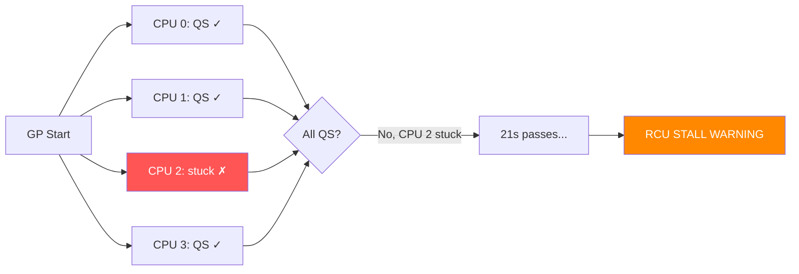

# Scenario 7: RCU Stall

## Symptom

```
[ 7234.567890] rcu: INFO: rcu_preempt detected stalls on CPUs/tasks:
[ 7234.567895] rcu:     2-...!: (1 GPs behind) idle=b9a/1/0x4000000000000000 softirq=12345/12345 fqs=2101
[ 7234.567902] rcu:     3-...!: (0 ticks this GP) idle=42e/1/0x4000000000000000 softirq=5678/5678 fqs=2101
[ 7234.567908] rcu:     (detected by 0, t=21003 jiffies, g=89012, q=0/47)
[ 7234.567912] Task dump for CPU 2:
[ 7234.567914] task:my_kthread      state:R  running task     stack:    0 pid: 3456 ppid:     2 flags:0x00000008
[ 7234.567920] Call trace:
[ 7234.567922]  copy_page+0x0/0x100
[ 7234.567926]  migrate_pages_batch+0x4c0/0x1100
[ 7234.567930]  migrate_pages+0x1dc/0x420
[ 7234.567934]  compact_zone+0x8f4/0x10f0
[ 7234.567938]  my_alloc_huge+0x134/0x200 [buggy_mod]
[ 7234.567945] Task dump for CPU 3:
[ 7234.567947] task:rcu_preempt     state:R  running task     stack:    0 pid:    15 ppid:     2 flags:0x00000008
[ 7234.567953] Call trace:
[ 7234.567955]  __schedule+0x3c0/0xbc0
[ 7234.567959]  schedule+0x60/0x100
[ 7234.567963]  schedule_timeout+0x188/0x200
[ 7234.567967]  rcu_gp_kthread+0x598/0xad0
[ 7234.567971]  kthread+0x120/0x130
[ 7234.567975]  ret_from_fork+0x10/0x20
```

### How to Recognize
- **`rcu: INFO: rcu_preempt detected stalls on CPUs/tasks`**
- Lists specific CPUs that haven't passed through a quiescent state
- Shows how many jiffies the grace period has been waiting (t=21003)
- Grace period number (`g=89012`) and quiescent state count (`q=0/47`)
- `fqs=2101` — number of forced quiescent state attempts
- Stuck CPUs usually in tight loops, long spin_locks, or disabled preemption

---

## Background: RCU (Read-Copy-Update) Fundamentals

### What is RCU?
```
RCU is a synchronization mechanism optimized for read-heavy workloads:
- Readers: zero-cost (no locks, no atomics, just rcu_read_lock/unlock)
- Writers: update a copy, then wait for all readers to finish (grace period)

The "grace period" is the time it takes for ALL CPUs to pass through
a "quiescent state" (context switch, idle, userspace return).
```

### Grace Period Mechanism
```
Writer calls synchronize_rcu() or call_rcu():

Time →
CPU 0: ──[rcu_read]──────QS──────────────────
CPU 1: ─────────[rcu_read]───QS──────────────
CPU 2: ──────────────────────────[rcu_read]─QS
CPU 3: ───QS─────────────────────────────────

         ▲ GP starts               ▲ GP ends (all CPUs passed QS)
         │                         │
         └── Writer waiting ───────┘

QS = Quiescent State (context switch, idle, return to userspace)
GP = Grace Period

If CPU 2 never reaches QS → grace period never completes → RCU STALL
```

### Grace Period Timeline


### What Prevents a Quiescent State?
```
A CPU must pass through ONE of these to complete its QS:
1. Context switch (schedule())
2. Return to idle (cpu_idle)
3. Return to userspace
4. Explicit cond_resched() / cond_resched_rcu()

These PREVENT a QS:
✗ preempt_disable() held for too long
✗ rcu_read_lock() held without unlocking (for RCU-preempt)
✗ Infinite loop without cond_resched()
✗ IRQ disabled for too long (for RCU-sched)
✗ Kernel running in tight loop without scheduling
```

---

## Code Flow: RCU Stall Detection

```c
// kernel/rcu/tree_stall.h

static void check_cpu_stall(struct rcu_data *rdp)
{
    unsigned long gs = rcu_state.gp_start;  // when GP started
    unsigned long gps = rcu_state.gp_seq;   // GP sequence number
    unsigned long j = jiffies;
    unsigned long js = READ_ONCE(rcu_state.jiffies_stall);

    // Has this CPU reported its quiescent state?
    if (rcu_gp_in_progress() &&
        time_after(j, js) &&
        !rcu_is_cpu_rrupt_from_idle()) {

        // ★ THIS CPU IS STALLING THE GRACE PERIOD ★
        print_cpu_stall(gps);
    }

    // Has ANY CPU been stalling too long? (detected by GP kthread)
    if (rcu_gp_in_progress() &&
        time_after(j, js + RCU_STALL_RAT_DELAY)) {

        print_other_cpu_stall(gs, gps);
    }
}

static void print_cpu_stall(unsigned long gps)
{
    pr_err("INFO: %s self-detected stall on CPU\n",
           rcu_state.name);

    // Print task info:
    print_cpu_stall_info(smp_processor_id());

    // Dump stack:
    dump_stack();

    // Force a quiescent state:
    rcu_force_quiescent_state();

    if (rcu_stall_is_suppressed())
        return;

    if (sysctl_panic_on_rcu_stall)
        panic("RCU Stall");
}
```

### RCU Stall Thresholds
```c
// kernel/rcu/tree.c
// Default stall timeout: 21 seconds (CONFIG_RCU_STALL_COMMON)

// Can be tuned:
// /sys/module/rcupdate/parameters/rcu_cpu_stall_timeout
// Default: 21 (seconds)

// Second warning after: 3 × timeout = 63 seconds
// Panic (if enabled): after stall timeout
```

---

## Common Causes

### 1. Long rcu_read_lock() Hold (RCU-Preempt)
```c
void my_reader(void) {
    rcu_read_lock();

    struct entry *e;
    list_for_each_entry_rcu(e, &my_list, list) {
        process_entry(e);  // If this takes 30+ seconds total
        // RCU grace period CANNOT complete!
    }

    rcu_read_unlock();
}
```

### 2. Tight Kernel Loop Without Rescheduling
```c
void my_kthread_fn(void *data) {
    while (!kthread_should_stop()) {
        do_work();  // No cond_resched(), no schedule()
        // This CPU never passes through quiescent state
        // → RCU stall after 21s
    }
}
```

### 3. Preemption Disabled for Extended Period
```c
void batch_operation(void) {
    preempt_disable();      // or spin_lock()

    for (int i = 0; i < huge_count; i++) {
        process(i);
    }

    preempt_enable();       // 30s later...
    // During those 30s, this CPU can't report RCU quiescent state
}
```

### 4. CPU Isolated / NOHZ_FULL Misconfiguration
```bash
# CPU isolated from scheduler but running kernel code:
isolcpus=2,3 nohz_full=2,3

# If a kernel thread runs on CPU 2 without rescheduling:
# → No tick → no quiescent state detection → RCU stall
```

### 5. Memory Pressure Causing Long Reclaim
```
kswapd or direct reclaim running for 30+ seconds
  → Trying to free pages
  → Each page takes time (writeback, etc.)
  → CPU doesn't schedule → RCU stall
```

### 6. Callback Flood (Too Many call_rcu() Callbacks)
```c
// Flooding RCU with callbacks:
for (int i = 0; i < 1000000; i++) {
    call_rcu(&obj[i]->rcu, my_callback);
}
// GP kthread overwhelmed processing callbacks
// New GPs delayed → existing readers timeout → stall
```

---

## Reading the Stall Message

```
rcu: INFO: rcu_preempt detected stalls on CPUs/tasks:
     ^^^^^^^^^^^^
     RCU flavor: rcu_preempt (preemptible RCU)
     Others: rcu_sched, rcu_bh

rcu: 2-...!: (1 GPs behind) idle=b9a/1/0x4000000000000000 softirq=12345/12345 fqs=2101
     ^  ^^^   ^^^^^^^^^^^^  ^^^^^^^^^^^^^^^^^^^^^^^^^^^^    ^^^^^^^^^^^^^^^^^^  ^^^^^^^^
     │  │     │              │                               │                  │
     │  │     │              │                               │                  Forced QS attempts
     │  │     │              │                               softirq count
     │  │     │              idle state/nesting
     │  │     This CPU is 1 grace period behind
     │  Stall flags: ! = not responded
     CPU number

rcu: (detected by 0, t=21003 jiffies, g=89012, q=0/47)
     ^^^^^^^^^^^^^^  ^^^^^^^^^^^^^^^  ^^^^^^^^  ^^^^^^
     Which CPU detected it          GP number   Quiescent states
     Time since GP start                        reported/needed
     21003 jiffies ≈ 21s
```

---

## Debugging Steps

### Step 1: Identify the Stalled CPU(s)
```
rcu: 2-...!: (1 GPs behind)
     ^
CPU 2 is stalling. Look at its task dump.
```

### Step 2: Read the Task Dump
```
Task dump for CPU 2:
task:my_kthread  state:R  running  pid:3456

Call trace:
  copy_page+0x0/0x100
  migrate_pages_batch+0x4c0/0x1100
  compact_zone+0x8f4/0x10f0
  my_alloc_huge+0x134/0x200 [buggy_mod]
```
**Diagnosis**: `my_alloc_huge` is doing memory compaction, which is taking too long.

### Step 3: Check if It's an rcu_read_lock Stall
```bash
# For RCU-preempt stalls, check if task is holding rcu_read_lock:
crash> struct task_struct.rcu_read_lock_nesting <task_addr>
# If > 0: task is inside rcu_read_lock section
```

### Step 4: Tune RCU Parameters
```bash
# Increase stall timeout (for debugging):
echo 60 > /sys/module/rcupdate/parameters/rcu_cpu_stall_timeout

# Suppress repeated warnings:
echo 1 > /sys/module/rcupdate/parameters/rcu_cpu_stall_suppress

# Force panic on stall (for kdump capture):
echo 1 > /sys/module/rcupdate/parameters/rcu_cpu_stall_ftrace_dump
kernel.panic_on_rcu_stall=1
```

### Step 5: Use Ftrace for RCU Events
```bash
echo 1 > /sys/kernel/debug/tracing/events/rcu/enable
cat /sys/kernel/debug/tracing/trace

# Key events:
# rcu_grace_period: start/end of grace periods
# rcu_quiescent_state_report: which CPUs reported
# rcu_stall_warning: when stall detected
```

### Step 6: Check /sys/kernel/debug/rcu
```bash
cat /sys/kernel/debug/rcu/rcu_preempt/rcudata
# Shows per-CPU RCU state:
#   completed GPs, quiescent state status, callback counts
```

---

## Fixes

| Cause | Fix |
|-------|-----|
| Long `rcu_read_lock` section | Break into smaller sections; rethink design |
| Tight loop without resched | Add `cond_resched()` or `cond_resched_rcu()` |
| preempt_disable too long | Reduce critical section; batch with resched |
| NOHZ_FULL CPU running kernel code | Add `rcu_read_lock()` / `rcu_read_unlock()` pair; ensure tick |
| Memory reclaim taking too long | Tune vm parameters; add `cond_resched()` in reclaim |
| call_rcu callback flood | Batch callbacks; use `synchronize_rcu()` periodically |

### Fix Example: Break Long RCU Read Section
```c
/* BEFORE: one giant RCU read section */
void scan_all_entries(void) {
    rcu_read_lock();
    list_for_each_entry_rcu(e, &big_list, list) {
        expensive_work(e);  // 30s total → RCU stall
    }
    rcu_read_unlock();
}

/* AFTER: chunked processing with periodic unlock */
void scan_all_entries(void) {
    struct entry *e;
    int count = 0;

    rcu_read_lock();
    list_for_each_entry_rcu(e, &big_list, list) {
        expensive_work(e);

        if (++count % 100 == 0) {
            rcu_read_unlock();
            cond_resched();       // Allow GP completion
            rcu_read_lock();
            // Note: list may have changed — need restart or cursor
        }
    }
    rcu_read_unlock();
}
```

### Fix Example: Add cond_resched to Kernel Thread
```c
/* BEFORE: tight loop, no scheduling point */
int my_kthread(void *data) {
    while (!kthread_should_stop()) {
        process_work();  // Never yields → RCU stall
    }
    return 0;
}

/* AFTER: explicit scheduling point */
int my_kthread(void *data) {
    while (!kthread_should_stop()) {
        process_work();
        cond_resched();  // Allow context switch → RCU can complete
    }
    return 0;
}
```

---

## RCU Flavors Reference

| Flavor | Reader API | Quiescent State | Typical Stall Cause |
|--------|-----------|-----------------|---------------------|
| `rcu_preempt` | `rcu_read_lock()` | Context switch or unlock | Long `rcu_read_lock` hold |
| `rcu_sched` | `preempt_disable()` or IRQ off | Context switch | Long preempt_disable |
| `rcu_bh` | `rcu_read_lock_bh()` | softirq completion | Long softirq execution |
| SRCU | `srcu_read_lock()` | Explicit unlock | Forgot `srcu_read_unlock()` |

---

## Quick Reference

| Item | Value |
|------|-------|
| Message | `rcu: INFO: rcu_preempt detected stalls on CPUs/tasks` |
| Default timeout | 21 seconds |
| Tuning | `/sys/module/rcupdate/parameters/rcu_cpu_stall_timeout` |
| Panic control | `kernel.panic_on_rcu_stall=1` |
| Key function | `check_cpu_stall()` in `kernel/rcu/tree_stall.h` |
| Config | `CONFIG_RCU_STALL_COMMON=y` |
| Ftrace events | `events/rcu/` |
| Debug info | `/sys/kernel/debug/rcu/rcu_preempt/rcudata` |
| #1 cause | CPU not passing quiescent state (no schedule/resched) |
| #1 fix | Add `cond_resched()` in long-running kernel code |
