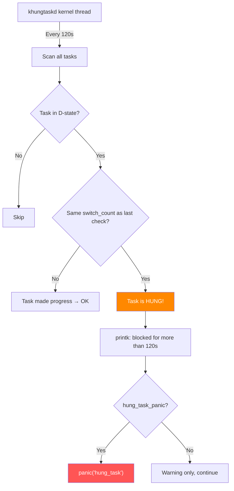

# Scenario 8: Hung Task

## Symptom

```
[ 9120.456789] INFO: task my_app:5678 blocked for more than 120 seconds.
[ 9120.456795]       Not tainted 6.8.0 #1
[ 9120.456798] "echo 0 > /proc/sys/kernel/hung_task_timeout_secs" disables this message.
[ 9120.456802] task:my_app         state:D stack:    0 pid: 5678 ppid:  1234 flags:0x00000001
[ 9120.456810] Call trace:
[ 9120.456812]  __switch_to+0xc0/0x120
[ 9120.456816]  __schedule+0x3c0/0xbc0
[ 9120.456820]  schedule+0x60/0x100
[ 9120.456824]  schedule_preempt_disabled+0x18/0x28
[ 9120.456828]  __mutex_lock.constprop.0+0x3fc/0x680
[ 9120.456832]  __mutex_lock_slowpath+0x18/0x28
[ 9120.456836]  mutex_lock+0x3c/0x50
[ 9120.456840]  my_driver_write+0x34/0x100 [buggy_mod]
[ 9120.456845]  vfs_write+0xbc/0x2e0
[ 9120.456849]  ksys_write+0x78/0x110
[ 9120.456853]  __arm64_sys_write+0x24/0x30
[ 9120.456857]  invoke_syscall+0x50/0x120
[ 9120.456861]  el0_svc_common+0x48/0xf0
[ 9120.456865]  do_el0_svc+0x28/0x40
[ 9120.456869]  el0t_64_sync_handler+0x68/0xc0
[ 9120.456873]  el0t_64_sync+0x1a0/0x1a4
```

### How to Recognize
- **`INFO: task <name>:<pid> blocked for more than 120 seconds`**
- Task state is **`D` (TASK_UNINTERRUPTIBLE)** — cannot be killed by signals
- The task is waiting for something (mutex, I/O, semaphore) that never completes
- Call trace shows `__schedule` → `mutex_lock` / `down()` / `wait_event` / `io_schedule`
- This is a **WARNING**, not a crash — but can escalate to panic with `hung_task_panic=1`
- Often indicates a **deadlock** or **stuck I/O path**

---

## Background: D-State and the Hung Task Detector

### Task States
```
State   Name                    Can be killed?   Signal?
─────   ─────────────────────   ──────────────   ───────
R       Running/Runnable        N/A              N/A
S       Sleeping (interruptible) Yes             Yes
D       Sleeping (UNINTERRUPTIBLE) NO!           Signals are QUEUED
T       Stopped (SIGSTOP)       Yes              SIGCONT
Z       Zombie                  N/A              N/A
I       Idle                    N/A              N/A
```

### Why D-State Exists
```
D-state is used when a task MUST complete a critical operation:
- Disk I/O in progress (can't cancel mid-write → filesystem corruption)
- Holding a mutex that protects shared state
- Waiting for hardware response

The kernel uses D-state to say:
"This task must NOT be interrupted — data integrity depends on it"

Problem: if the thing it's waiting for NEVER happens → task stuck forever
→ "blocked for more than 120 seconds" → unkillable process
```

### Hung Task Detector Architecture


---

## Code Flow: Hung Task Detection

```c
// kernel/hung_task.c

static int watchdog(void *dummy)
{
    set_user_nice(current, 0);

    for (;;) {
        // Sleep for hung_task_timeout_secs (default 120):
        unsigned long timeout = sysctl_hung_task_timeout_secs;

        if (timeout)
            schedule_timeout_interruptible(timeout * HZ);

        // Check all tasks:
        check_hung_uninterruptible_tasks(timeout);
    }
    return 0;
}

static void check_hung_uninterruptible_tasks(unsigned long timeout)
{
    int max_count = sysctl_hung_task_check_count;  // default: PID_MAX
    struct task_struct *g, *t;

    rcu_read_lock();
    for_each_process_thread(g, t) {
        if (!max_count--)
            goto unlock;

        if (t->state == TASK_UNINTERRUPTIBLE)
            check_hung_task(t, timeout);
    }
unlock:
    rcu_read_unlock();
}

static void check_hung_task(struct task_struct *t, unsigned long timeout)
{
    unsigned long switch_count = t->nvcsw + t->nivcsw;

    // Has the task's context switch count changed?
    if (switch_count != t->last_switch_count) {
        t->last_switch_count = switch_count;
        return;  // Task made progress → not hung
    }

    // ★ HUNG TASK DETECTED ★
    // Same switch_count → task hasn't been scheduled for timeout seconds

    // Check: has it been in D-state for the entire timeout?
    if (time_is_after_jiffies(t->last_switch_time + timeout * HZ))
        return;  // Not enough time yet

    pr_err("INFO: task %s:%d blocked for more than %ld seconds.\n",
           t->comm, t->pid, timeout);

    sched_show_task(t);     // Print task info + call trace
    debug_show_held_locks(t);  // Show locks held by this task

    if (sysctl_hung_task_panic) {
        trigger_all_cpu_backtrace();
        panic("hung_task: blocked tasks");
    }
}
```

### switch_count Tracking
```c
// The key insight: nvcsw + nivcsw
//   nvcsw  = number of voluntary context switches
//   nivcsw = number of involuntary context switches

// If NEITHER changes in 120 seconds:
//   → Task has been in D-state continuously
//   → Something it's waiting for hasn't happened
//   → HUNG!

// If either changes:
//   → Task woke up at least once → not hung (reset timer)
```

---

## Common Causes

### 1. Mutex Deadlock
```c
static DEFINE_MUTEX(lock_a);
static DEFINE_MUTEX(lock_b);

/* Thread 1: */
void func_1(void) {
    mutex_lock(&lock_a);
    /* ... */
    mutex_lock(&lock_b);  // Waits for Thread 2 to release B
    mutex_unlock(&lock_b);
    mutex_unlock(&lock_a);
}

/* Thread 2: */
void func_2(void) {
    mutex_lock(&lock_b);
    /* ... */
    mutex_lock(&lock_a);  // Waits for Thread 1 to release A → DEADLOCK
    mutex_unlock(&lock_a);
    mutex_unlock(&lock_b);
}
// Both tasks in D-state → both hung after 120s
```

### 2. I/O Path Stuck (Storage Device Not Responding)
```
Process calls write() → filesystem → block layer → SCSI → HBA driver

If the storage device hangs:
  → SCSI command timeout (30s default)
  → Error handler runs but can't recover
  → SCSI error handler retries
  → Eventually: task stuck in D-state waiting for I/O completion
  → "blocked for more than 120 seconds"
```

### 3. NFS/Network Filesystem Hang
```
Process calls stat() on NFS mount → sends RPC to server
NFS server is unreachable → RPC times out → retries (by default "hard" mount)
Hard mount: retries indefinitely → task stuck in D-state

# NFS mount options that cause this:
mount -t nfs server:/path /mnt -o hard
# Versus:
mount -t nfs server:/path /mnt -o soft,timeo=10,retrans=3
```

### 4. Waiting for Kernel Resource That's Never Released
```c
void my_driver_write(struct file *f, ...) {
    // Wait for firmware to acknowledge:
    wait_event(dev->wait_queue, dev->fw_ready);
    // If firmware crashes → dev->fw_ready never set → D-state forever
}
```

### 5. Filesystem Journal Contention
```
Multiple processes doing:
  ext4 → jbd2 journal transaction → wait for journal space

If journal is full and commit thread is stuck:
  → All writers block in D-state → mass hung tasks
```

### 6. Page Fault During Reclaim Deadlock
```
Process does page fault → needs memory
  → Enters direct reclaim (D-state: PF_MEMALLOC)
  → Tries to write dirty page → needs I/O
  → I/O needs memory → can't allocate (already in reclaim)
  → DEADLOCK → hung task
```

---

## Debugging Steps

### Step 1: Identify What the Task Is Waiting For
```
Call trace:
  __switch_to+0xc0/0x120
  __schedule+0x3c0/0xbc0
  schedule+0x60/0x100
  schedule_preempt_disabled+0x18/0x28
  __mutex_lock.constprop.0+0x3fc/0x680    ← waiting on mutex!
  __mutex_lock_slowpath+0x18/0x28
  mutex_lock+0x3c/0x50
  my_driver_write+0x34/0x100 [buggy_mod]  ← this function takes the mutex
```
**Diagnosis**: Task is blocked on `mutex_lock` in `my_driver_write`. Someone else holds this mutex.

### Step 2: Find Who Holds the Lock
```bash
# With lockdep (CONFIG_DEBUG_LOCK_ALLOC=y):
# The hung task report shows:
# "held locks: ... <lock_name> acquired at: ..."

# With crash tool:
crash> struct mutex <mutex_addr>
  owner = 0xffff000012340000   # task_struct of holder

crash> struct task_struct.comm 0xffff000012340000
  comm = "my_other_thread"

crash> bt 0xffff000012340000   # What is the holder doing?
```

### Step 3: Check for Deadlock
```bash
# Enable lockdep to detect deadlocks proactively:
CONFIG_PROVE_LOCKING=y
CONFIG_LOCKDEP=y

# Lockdep detects ABBA patterns at runtime:
# "WARNING: possible circular locking dependency detected"
# Shows the exact lock chain that causes deadlock
```

### Step 4: Check I/O State
```bash
# If blocked on I/O:
cat /proc/5678/io       # I/O statistics
cat /proc/5678/stack    # Kernel stack (similar to hung task dump)
cat /proc/5678/wchan    # What kernel function the task sleeps in

# Check block device:
cat /sys/block/sda/stat
cat /sys/block/sda/inflight   # pending I/O requests

# Check SCSI error handler:
cat /proc/scsi/scsi
dmesg | grep -i "scsi\|error\|timeout"
```

### Step 5: Check All D-State Processes
```bash
# Find all D-state processes:
ps aux | awk '$8 ~ /D/ { print }'

# Or from /proc:
for p in /proc/[0-9]*/status; do
    grep -l "State.*sleeping" "$p" 2>/dev/null
done

# With crash:
crash> ps -m           # show task states
crash> foreach D bt    # backtrace all D-state tasks
```

### Step 6: Use SysRq to Dump All Tasks
```bash
echo w > /proc/sysrq-trigger   # Show all D-state tasks + backtraces
dmesg | tail -200
```

---

## Fixes

| Cause | Fix |
|-------|-----|
| Mutex deadlock | Fix lock ordering; use `mutex_lock_interruptible()` |
| Storage device hung | SCSI timeout tuning; multipath failover |
| NFS hard mount | Use `soft` mount; add `timeo=` and `retrans=` |
| wait_event on missing wakeup | Use `wait_event_timeout()` or `_interruptible` |
| Journal contention | Tune `commit=` interval; larger journal |
| Reclaim deadlock | Use `GFP_NOFS` / `GFP_NOIO` in appropriate contexts |

### Fix Example: Use Timeout-Based Wait
```c
/* BEFORE: waits forever → hung task */
void my_write(struct my_device *dev) {
    wait_event(dev->wq, dev->fw_ready);
    do_write(dev);
}

/* AFTER: wait with timeout */
int my_write(struct my_device *dev) {
    int ret;

    ret = wait_event_timeout(dev->wq, dev->fw_ready,
                             msecs_to_jiffies(5000));  // 5s timeout
    if (ret == 0) {
        dev_err(dev->dev, "firmware not ready (timeout)\n");
        return -ETIMEDOUT;
    }

    do_write(dev);
    return 0;
}
```

### Fix Example: Interruptible Mutex
```c
/* BEFORE: uninterruptible mutex → can't kill blocked process */
void my_ioctl(struct my_device *dev) {
    mutex_lock(&dev->big_lock);
    do_work(dev);
    mutex_unlock(&dev->big_lock);
}

/* AFTER: interruptible → user can Ctrl+C */
int my_ioctl(struct my_device *dev) {
    if (mutex_lock_interruptible(&dev->big_lock))
        return -ERESTARTSYS;

    do_work(dev);
    mutex_unlock(&dev->big_lock);
    return 0;
}
```

### Fix Example: NFS Mount Options
```bash
# BEFORE: hard mount → hangs forever if server down
mount -t nfs server:/data /mnt

# AFTER: soft mount with timeouts
mount -t nfs server:/data /mnt -o soft,timeo=50,retrans=3,actimeo=30
# soft     = return error instead of hanging
# timeo=50 = 5 second timeout (in deciseconds)
# retrans=3 = retry 3 times before error
```

---

## TASK_KILLABLE: The Middle Ground

Linux added `TASK_KILLABLE` to solve the "unkillable D-state" problem:

```c
// TASK_KILLABLE = TASK_UNINTERRUPTIBLE | TASK_WAKEKILL
// → Task sleeps like D-state BUT can be killed by SIGKILL

/* Usage: */
mutex_lock_killable(&lock);          // wake on SIGKILL
wait_event_killable(wq, condition);  // wake on SIGKILL
down_killable(&sema);                // wake on SIGKILL

// The task won't respond to SIGINT/SIGTERM (data protection)
// But SIGKILL (kill -9) will wake it → prevents permanent hang
```

---

## Quick Reference

| Item | Value |
|------|-------|
| Message | `INFO: task <name>:<pid> blocked for more than 120 seconds` |
| Default timeout | 120 seconds |
| Tuning | `/proc/sys/kernel/hung_task_timeout_secs` (0 = disable) |
| Panic control | `/proc/sys/kernel/hung_task_panic` |
| Detector thread | `khungtaskd` |
| Config | `CONFIG_DETECT_HUNG_TASK=y` |
| Task state | `D` (TASK_UNINTERRUPTIBLE) |
| Key function | `check_hung_task()` in `kernel/hung_task.c` |
| Check mechanism | Compare `nvcsw + nivcsw` across intervals |
| SysRq dump | `echo w > /proc/sysrq-trigger` |
| #1 cause | Mutex deadlock or stuck I/O |
| #1 fix | Use timeout/interruptible/killable variants |
