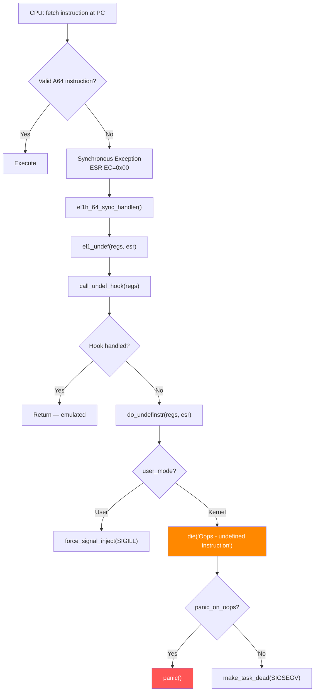

# Scenario 10: Undefined Instruction (UNDEF)

## Symptom

```
[ 14523.891234] Internal error: Oops - undefined instruction: 0000000002000000 [#1] PREEMPT SMP
[ 14523.891242] Modules linked in: buggy_mod(O) dm_crypt xfs
[ 14523.891250] CPU: 1 PID: 2345 Comm: insmod Tainted: G           O      6.8.0 #1
[ 14523.891255] Hardware name: ARM Platform (DT)
[ 14523.891260] pstate: 60400005 (nZCv daif +PAN -UAO -TCO -DIT -SSBS BTYPE=--)
[ 14523.891265] pc : buggy_init+0x24/0x60 [buggy_mod]
[ 14523.891270] lr : do_one_initcall+0x50/0x300
[ 14523.891275] sp : ffff80001234bc90
[ 14523.891278] ...
[ 14523.891290] Code: d2800000 f9000260 d503201f aa0003e1 (00000000)
[ 14523.891295]                                           ^^^^^^^^^^
[ 14523.891297]                                  faulting instruction = 0x00000000 = UDF #0
[ 14523.891302] Call trace:
[ 14523.891304]  buggy_init+0x24/0x60 [buggy_mod]
[ 14523.891309]  do_one_initcall+0x50/0x300
[ 14523.891313]  do_init_module+0x60/0x220
[ 14523.891317]  load_module+0x1d58/0x2120
[ 14523.891321]  __do_sys_finit_module+0xac/0x120
[ 14523.891325]  __arm64_sys_finit_module+0x24/0x30
[ 14523.891329]  invoke_syscall+0x50/0x120
[ 14523.891333]  el0_svc_common+0x48/0xf0
[ 14523.891337]  do_el0_svc+0x28/0x40
[ 14523.891341]  el0t_64_sync_handler+0x68/0xc0
[ 14523.891345]  el0t_64_sync+0x1a0/0x1a4
```

### How to Recognize
- **`Internal error: Oops - undefined instruction`**
- ESR EC = `0x00` (Unknown reason) or instruction decode fails
- `Code:` line shows the actual bytes at PC — look for `00000000` (UDF #0)
- Often during module load (`insmod`) or in corrupted code pages
- ARM64-specific: `BRK #0x800` for `BUG()` shows EC = `0x3C`, not undefined

---

## Background: How ARM64 Handles Undefined Instructions

### ARM64 Exception Handling
```
CPU fetches instruction at PC
  │
  ├─► Instruction is valid A64 → execute normally
  │
  └─► Instruction is NOT in instruction set
       │
       └─► Exception: Unknown Reason (EC=0x00) or
           Trapped instruction
           │
           └─► el1h_64_sync → el1_undef()
                │
                └─► do_undefinstr(regs)
```

### Exception Vector Path
```c
// arch/arm64/kernel/entry-common.c

static void noinstr el1h_64_sync_handler(struct pt_regs *regs)
{
    unsigned long esr = read_sysreg(esr_el1);

    switch (ESR_ELx_EC(esr)) {
    case ESR_ELx_EC_UNKNOWN:       // 0x00 — undefined instruction
        el1_undef(regs, esr);
        break;
    case ESR_ELx_EC_BRK64:         // 0x3C — BRK (BUG/WARN)
        el1_dbg(regs, esr);
        break;
    // ...
    }
}

static void el1_undef(struct pt_regs *regs, unsigned long esr)
{
    // Try registered undef hooks (some instructions are emulated):
    if (call_undef_hook(regs) == 0)
        return;  // Hook handled it (e.g., emulated instruction)

    // Not handled → crash:
    do_undefinstr(regs, esr);
}
```

### do_undefinstr()
```c
// arch/arm64/kernel/traps.c

void do_undefinstr(struct pt_regs *regs, unsigned long esr)
{
    // Try to handle via undef_hook (emulation, etc.):
    if (user_mode(regs)) {
        // Userspace → send SIGILL
        force_signal_inject(SIGILL, ILL_ILLOPC, regs->pc, esr);
        return;
    }

    // Kernel mode → die:
    die("Oops - undefined instruction", regs, esr);
}
```

### BUG() vs Undefined Instruction
```c
// BUG() on ARM64 uses BRK instruction, NOT an undefined instruction:

// include/asm-generic/bug.h + arch/arm64:
#define BUG() do {                          \
    __asm__ __volatile__("brk %0" :: "i"(BUG_BRK_IMM)); \
    unreachable();                          \
} while (0)

// BRK #0x800 → EC=0x3C (BRK64), NOT EC=0x00
// So BUG() is handled by el1_dbg() → bug_handler() → die()
// The message will be: "Oops - BUG" not "Oops - undefined instruction"
```

### ARM64 Instruction Encoding
```
A64 instructions are always 32 bits (4 bytes), aligned to 4 bytes.

Valid instruction: encoding matches an A64 instruction set entry
Invalid/undefined:
  - 0x00000000 = UDF #0 (explicitly undefined instruction)
  - Random bytes that don't match any encoding
  - T32 (Thumb) instructions in AArch64 mode
  - A32 (ARM32) instructions in AArch64 mode
```

---

## Code Flow: From Exception to Crash



---

## Common Causes

### 1. Corrupted Code Page (Memory Corruption)
```
A kernel code page gets corrupted by:
- DMA engine writing to wrong physical address
- Bit flip in DRAM holding .text section
- Buffer overflow corrupting adjacent .text

Result: valid instruction replaced with garbage
→ CPU executes garbage → undefined instruction

Symptom: crash location is in well-tested, stable code
(e.g., ext4_iget, schedule, etc.)
→ The CODE is fine, the MEMORY is corrupted
```

### 2. Wrong Architecture Module
```bash
# Loading a 32-bit ARM module on 64-bit ARM64 kernel:
insmod my_module_armv7.ko   # Compiled for ARMv7 (32-bit)

# The .text section contains Thumb2/ARM32 instructions
# ARM64 CPU sees them as undefined → crash

# Check module architecture:
file my_module.ko
# ELF 64-bit LSB relocatable, ARM aarch64   ← correct
# ELF 32-bit LSB relocatable, ARM           ← WRONG!
```

### 3. Module Built with Wrong Compiler/Config
```bash
# Module compiled with different config than running kernel:
# - Different CONFIG_ARM64_* features
# - Different FPU/SVE/SME settings
# - Mismatched struct layouts (CONFIG changes struct sizes)

# Module uses instruction not supported by CPU:
# e.g., SVE instruction on CPU without SVE
# or MTE instruction on non-MTE CPU
```

### 4. BUG()/BUG_ON() — Intentional Crash (Related)
```c
/* BUG() uses BRK instruction — technically not "undefined" but similar: */
void validate_state(struct my_device *dev) {
    BUG_ON(dev->state > MAX_STATE);
    // If condition true → BRK #0x800 → Oops - BUG
}

// Note: BRK is EC=0x3C, not EC=0x00
// But the user sees similar "Oops" message
```

### 5. Code Overwritten by Stack Overflow
```
If stack overflow (without VMAP_STACK guard):
→ Stack grows into .text or .data
→ Overwrites instructions
→ CPU executes garbage → undefined instruction

Call trace may be nonsensical (corrupted return addresses)
```

### 6. Jump to Invalid Address via Corrupted Function Pointer
```c
struct ops {
    int (*process)(void *data);
};

struct ops *my_ops;
// my_ops->process gets corrupted (UAF, overflow, etc.)
// Now points to: 0xffff000012345678 (middle of a data structure)
// CPU jumps there, tries to execute data as instructions → UNDEF
```

### 7. Module Versioning Mismatch
```bash
# Loading module built for different kernel version:
# struct layouts changed → function prologues/epilogues mismatch
# Jump table offsets wrong → jumping into middle of instructions

insmod my_module.ko
# "disagrees about version of symbol xxx"
# If forced: modprobe -f → undefined instruction possible
```

---

## Reading the Code Line

The oops message includes the actual bytes at PC:

```
Code: d2800000 f9000260 d503201f aa0003e1 (00000000)
      ^^^^^^^^ ^^^^^^^^ ^^^^^^^^ ^^^^^^^^  ^^^^^^^^^^
      PC-16    PC-12    PC-8     PC-4      PC (faulting)

Decode:
  d2800000 = mov x0, #0
  f9000260 = str x0, [x19, #0]
  d503201f = nop
  aa0003e1 = mov x1, x0
  00000000 = UDF #0  ← UNDEFINED! (the instruction at PC)
```

```bash
# Decode instructions:
echo "00000000" | xxd -r -p | \
  aarch64-linux-gnu-objdump -D -b binary -m aarch64 -

# Output:
#    0:   00000000    udf #0
```

---

## Debugging Steps

### Step 1: Check the Code Line in the Oops
```
Code: d2800000 f9000260 d503201f aa0003e1 (00000000)

The instruction in parentheses is the one that faulted.
0x00000000 = UDF #0 → this is an explicitly undefined encoding

Is this expected? (e.g., BUG() trigger) or unexpected?
If unexpected → code page is corrupted
```

### Step 2: Verify the Module/vmlinux
```bash
# Disassemble the faulting function:
objdump -dS buggy_mod.ko | grep -A20 "buggy_init"

# Compare: does the .text in the .ko file match the Code line?
# If objdump shows valid instructions but Code shows garbage
# → Memory was corrupted AFTER loading
```

### Step 3: Check Module Architecture
```bash
file buggy_mod.ko
# Must show: ELF 64-bit LSB relocatable, ARM aarch64

readelf -h buggy_mod.ko | grep Machine
# Machine: AArch64
```

### Step 4: Check for Memory Corruption
```bash
# If the crash is in a stable kernel function (not a module):
# The .text page is corrupted. Check:

# 1. EDAC errors:
dmesg | grep EDAC

# 2. Compare .text in memory vs vmlinux:
crash vmlinux vmcore
crash> rd <pc_address> 10     # actual memory
# Compare with:
objdump -d vmlinux | grep -A5 "<function>"
```

### Step 5: Check CPU Feature Flags
```bash
# Does the CPU support the instruction?
cat /proc/cpuinfo | grep Features

# Common missing features:
# - sve (Scalable Vector Extension)
# - atomics (LSE atomics)
# - sha3, sm3, sm4 (crypto extensions)
# - mte (Memory Tagging Extension)

# If module was compiled with -march=armv8.5-a+mte
# but CPU is ARMv8.0 → MTE instructions are undefined
```

### Step 6: Check Kernel Config Consistency
```bash
# Module must be built against same config:
diff /proc/config.gz <(gzip -d < /path/to/build/.config.gz)

# Key configs that affect instruction generation:
# CONFIG_ARM64_LSE_ATOMICS
# CONFIG_ARM64_USE_LSE_ATOMICS
# CONFIG_ARM64_SVE
# CONFIG_ARM64_MTE
```

---

## Fixes

| Cause | Fix |
|-------|-----|
| Corrupted code page | Check EDAC; run memtest; find DMA bug |
| Wrong architecture module | Rebuild for correct arch (`aarch64`) |
| CPU feature mismatch | Build with correct `-march=` / `-mcpu=` |
| Forced version mismatch | Rebuild module for running kernel version |
| Corrupted function pointer | Fix the corruption source (UAF, overflow) |
| BUG()/BUG_ON() triggered | Fix the assertion condition |

### Fix Example: Correct Module Build
```makefile
# BEFORE: building for wrong arch
ARCH ?= arm
CROSS_COMPILE ?= arm-linux-gnueabihf-

# AFTER: correct for ARM64
ARCH ?= arm64
CROSS_COMPILE ?= aarch64-linux-gnu-
KDIR ?= /lib/modules/$(shell uname -r)/build

all:
	$(MAKE) -C $(KDIR) M=$(PWD) ARCH=$(ARCH) \
		CROSS_COMPILE=$(CROSS_COMPILE) modules
```

### Fix Example: Safe Function Pointer Call
```c
/* BEFORE: direct call through possibly-corrupted pointer */
void dispatch(struct ops *ops, void *data) {
    ops->process(data);  // if ops->process is corrupt → UNDEF
}

/* AFTER: validate before call */
void dispatch(struct ops *ops, void *data) {
    if (!ops || !ops->process) {
        pr_err("invalid ops pointer\n");
        return;
    }

    // Optional: validate pointer is in kernel text:
    if (!kernel_text_address((unsigned long)ops->process)) {
        pr_err("ops->process points to non-text: %px\n", ops->process);
        return;
    }

    ops->process(data);
}
```

### Fix Example: CPU Feature Check in Module
```c
/* Check at module init if CPU supports required features: */
static int __init my_module_init(void)
{
    if (!system_supports_sve()) {
        pr_err("This module requires SVE support\n");
        return -ENODEV;
    }

    // ... init code using SVE instructions ...
    return 0;
}
```

---

## Undefined Instruction vs BRK (BUG) vs Other Traps

| Exception | EC | ARM64 Instruction | Kernel Message | Cause |
|-----------|------|-------------------|----------------|-------|
| Undefined | 0x00 | Any invalid encoding | `Oops - undefined instruction` | Bad code, corruption |
| BRK (BUG) | 0x3C | `BRK #0x800` | `Oops - BUG` | `BUG()` / `BUG_ON()` |
| BRK (WARN) | 0x3C | `BRK #0x800` | `WARNING` | `WARN()` / `WARN_ON()` |
| BRK (KASAN) | 0x3C | `BRK #0x900+` | `BUG: KASAN: ...` | KASAN error |
| BRK (UBSAN) | 0x3C | `BRK #0x5500+` | `UBSAN: ...` | Undefined behavior |
| SVC | 0x15 | `SVC #0` | N/A (syscall) | Normal syscall entry |
| HVC | 0x16 | `HVC #0` | N/A (hypervisor) | Hypervisor call |

---

## Quick Reference

| Item | Value |
|------|-------|
| Message | `Internal error: Oops - undefined instruction` |
| ESR EC | `0x00` (Unknown/Undefined) |
| Handler | `el1_undef()` → `do_undefinstr()` |
| Key file | `arch/arm64/kernel/traps.c` |
| Emulation hooks | `call_undef_hook()` — kernel can emulate some |
| `Code:` line | Shows raw instruction bytes at PC |
| UDF #0 encoding | `0x00000000` (explicitly undefined) |
| BUG() instruction | `BRK #0x800` (EC=0x3C, different from undef) |
| Module arch check | `file module.ko` or `readelf -h` |
| CPU features | `/proc/cpuinfo` → `Features` field |
| #1 cause | Code page corruption or wrong-arch module |
