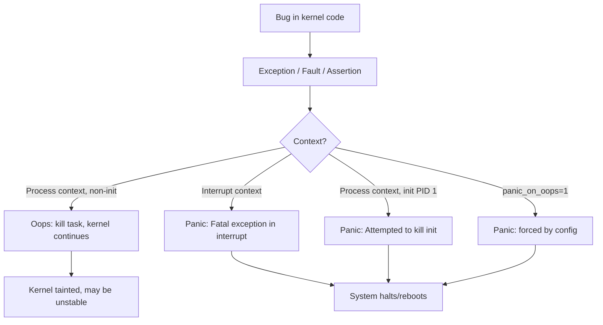
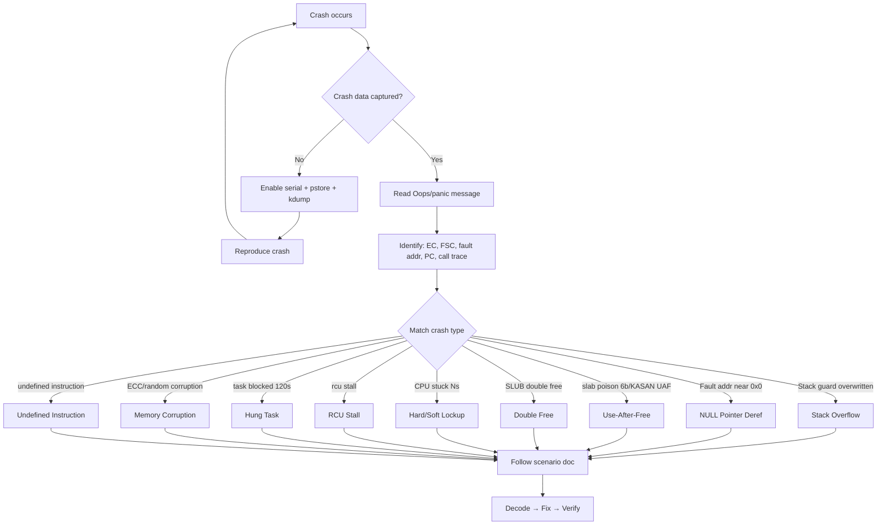

# Kernel Crash — In-Depth Guide

## What is a Kernel Crash?

A kernel crash is any event where the Linux kernel encounters an unrecoverable error during runtime, leading to system instability or a complete halt. While "kernel panic" is the final outcome, a **crash** is the broader category of bugs, faults, and exceptions that cause it.

### Crash vs Panic vs Oops

| Term | What It Is | Recoverable? |
|------|-----------|--------------|
| **Oops** | Kernel detected a fault, prints error, kills faulting task | Sometimes — if not in interrupt or init |
| **Crash** | The underlying bug/event (NULL deref, corruption, lockup, etc.) | Depends on context |
| **Panic** | Final kernel action — halt/reboot. The "end state" of a fatal crash | Never |
| **BUG()** | Developer assertion failed — triggers an Oops | Same as Oops |
| **WARN()** | Non-fatal warning — kernel continues but logs a trace | Yes — kernel continues |



---

## Crash Lifecycle — From Bug to System Death

```
BUG/FAULT occurs
 │
 ├─► ARM64 Exception Vector                 [arch/arm64/kernel/entry.S]
 │    └─► el1h_64_sync_handler()             [arch/arm64/kernel/entry-common.c]
 │         ├─► el1_abort()                   // data abort
 │         ├─► el1_ia()                      // instruction abort
 │         ├─► el1_undef()                   // undefined instruction
 │         ├─► el1_dbg()                     // debug exception
 │         └─► el1_inv()                     // invalid exception
 │
 ├─► Fault handler                           [arch/arm64/mm/fault.c]
 │    └─► do_mem_abort()
 │         ├─► do_page_fault()               // user address fault
 │         └─► __do_kernel_fault()           // kernel address fault
 │              └─► die()                    [arch/arm64/kernel/traps.c]
 │
 ├─► die()
 │    ├─► __die()
 │    │    ├─► show_regs(regs)               // dump all ARM64 registers
 │    │    ├─► dump_backtrace(regs)          // print call stack
 │    │    └─► dump_instr(regs)              // disassemble faulting instruction
 │    └─► oops_end()
 │         ├─► if fatal → panic("Fatal exception")
 │         └─► if survivable → make_task_dead(SIGSEGV)
 │
 └─► panic()                                 [kernel/panic.c]
      ├─► crash_smp_send_stop()              // stop all CPUs
      ├─► __crash_kexec()                    // kdump if configured
      ├─► console_flush_on_panic()
      └─► emergency_restart() or halt
```

---

## ARM64 Exception Syndrome Register (ESR_EL1) — Quick Decode

```
ESR = 0x96000005
      ││      ││
      ││      └└─ ISS: Instruction Specific Syndrome
      ││           FSC = 0x05 → level 1 translation fault
      └└───────── EC: Exception Class
                   0x25 → Data Abort from current EL (kernel)
```

| EC (hex) | Name | Common Cause |
|----------|------|-------------|
| `0x00` | Unknown | Uncategorized exception |
| `0x07` | SVE/SIMD/FP | Floating point disabled/fault |
| `0x0E` | Illegal state | PSTATE corruption |
| `0x21` | IABT (current EL) | Instruction abort in kernel — code page missing |
| `0x22` | PC alignment | PC not 4-byte aligned |
| **`0x25`** | **DABT (current EL)** | **Data abort in kernel — MOST COMMON crash** |
| `0x26` | SP alignment | Stack pointer misaligned |
| `0x2F` | SError | Async external abort (HW error, bus fault) |
| `0x3C` | BRK (AArch64) | BUG()/BUG_ON() triggered |

| FSC (Fault Status Code) | Meaning |
|--------------------------|---------|
| `0x04` | Level 0 translation fault (PGD missing) |
| `0x05` | Level 1 translation fault (PUD missing) |
| `0x06` | Level 2 translation fault (PMD missing) |
| `0x07` | Level 3 translation fault (PTE missing) — NULL ptr |
| `0x09`–`0x0B` | Access flag fault (level 1–3) |
| `0x0D`–`0x0F` | Permission fault (level 1–3) — write to RO page |
| `0x10` | Synchronous external abort (bus error) |
| `0x21` | Alignment fault |

---

## Crash Data Capture — Setup Guide

### 1. Serial Console (highest reliability)
```bash
# ARM64 UART:
console=ttyAMA0,115200 earlycon=pl011,0x09000000
# Generic:
console=ttyS0,115200 earlyprintk=serial
```

### 2. Pstore / Ramoops (survives reboot)
```bash
# Kernel config: CONFIG_PSTORE=y, CONFIG_PSTORE_RAM=y
# Boot params:
ramoops.mem_address=0x80000000 ramoops.mem_size=0x200000 ramoops.ecc=1

# After reboot:
cat /sys/fs/pstore/dmesg-ramoops-0
```

### 3. Kdump (full memory snapshot)
```bash
# Boot param: crashkernel=256M
# Install: apt install kdump-tools crash
# After crash: crash vmlinux /var/crash/vmcore
# Commands: bt, log, ps, vm, kmem -s, files, net
```

### 4. Kernel Debug Config Flags
```bash
CONFIG_DEBUG_INFO=y            # debug symbols in vmlinux
CONFIG_KASAN=y                 # Address Sanitizer (UAF, OOB)
CONFIG_UBSAN=y                 # Undefined Behavior Sanitizer
CONFIG_KCSAN=y                 # Concurrency Sanitizer (races)
CONFIG_KFENCE=y                # Lightweight memory error detector
CONFIG_PROVE_LOCKING=y         # Lockdep (deadlock detection)
CONFIG_DEBUG_OBJECTS=y          # Track object lifecycle
CONFIG_SLUB_DEBUG=y             # Slab debug (poison, red zones)
CONFIG_STACKPROTECTOR_STRONG=y # Stack canary overflow detection
CONFIG_VMAP_STACK=y             # Guard pages around kernel stacks
CONFIG_FTRACE=y                 # Function tracing
CONFIG_LOCKUP_DETECTOR=y       # Soft/hard lockup detection
CONFIG_DETECT_HUNG_TASK=y      # Hung task detection
CONFIG_RCU_STALL_COMMON=y     # RCU stall detection
```

---

## General Debugging Workflow



---

## Address Decoding Cheat Sheet

```bash
# 1. addr2line — address to source file:line
addr2line -e vmlinux -f 0xffffff80081234ab

# 2. decode_stacktrace.sh — full stack decode
./scripts/decode_stacktrace.sh vmlinux < oops.log

# 3. gdb — interactive
gdb vmlinux -ex "list *function_name+0xoffset"

# 4. objdump — disassemble module
objdump -dS drivers/net/my_driver.ko | less

# 5. pahole — struct layout (find member at offset)
pahole -C "struct sk_buff" vmlinux

# 6. crash tool — post-mortem
crash vmlinux /var/crash/vmcore
crash> bt           # backtrace
crash> log          # kernel log
crash> dis function # disassemble
crash> struct task_struct ffff... # inspect struct
```

---

## 10 Crash Scenarios

| # | Scenario | File | Key Symptom |
|---|----------|------|-------------|
| 1 | Stack Overflow | [01_Stack_Overflow.md](01_Stack_Overflow.md) | `Kernel stack overflow`, guard page hit |
| 2 | NULL Pointer Dereference | [02_NULL_Pointer_Deref.md](02_NULL_Pointer_Deref.md) | Fault address `0x0000...00XX` |
| 3 | Use-After-Free | [03_Use_After_Free.md](03_Use_After_Free.md) | KASAN: `use-after-free`, poison `6b6b6b6b` |
| 4 | Double Free / Slab Corruption | [04_Double_Free_Slab.md](04_Double_Free_Slab.md) | `SLUB: double free detected` |
| 5 | Hard Lockup | [05_Hard_Lockup.md](05_Hard_Lockup.md) | `Watchdog detected hard LOCKUP on cpu N` |
| 6 | Soft Lockup | [06_Soft_Lockup.md](06_Soft_Lockup.md) | `soft lockup - CPU#N stuck for 22s!` |
| 7 | RCU Stall | [07_RCU_Stall.md](07_RCU_Stall.md) | `rcu_preempt detected stalls on CPUs` |
| 8 | Hung Task | [08_Hung_Task.md](08_Hung_Task.md) | `task blocked for more than 120 seconds` |
| 9 | Memory Corruption / Bit Flip | [09_Memory_Corruption.md](09_Memory_Corruption.md) | Random crashes, EDAC errors, ECC |
| 10 | Undefined Instruction | [10_Undefined_Instruction.md](10_Undefined_Instruction.md) | `Oops - undefined instruction` |

---

## See Also
- [../02_KernelPanic/README.md](../02_KernelPanic/README.md) — Kernel Panic in-depth guide
- [../01_BootTime/README.md](../01_BootTime/README.md) — Memory subsystem boot initialization
