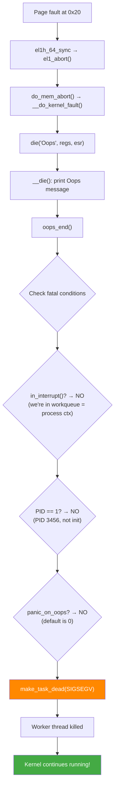

# Scenario 1: Page Fault in Process Context — The Survivable Oops

## Symptom

```
[ 4521.123456] Unable to handle kernel NULL pointer dereference at virtual address 0000000000000020
[ 4521.123462] Mem abort info:
[ 4521.123464]   ESR = 0x0000000096000006
[ 4521.123467]   EC = 0x25: DABT (current EL), IL = 32 bits
[ 4521.123470]   SET = 0, FnV = 0
[ 4521.123472]   EA = 0, S1PTW = 0
[ 4521.123474]   FSC = 0x06: level 2 translation fault
[ 4521.123480] Data abort info:
[ 4521.123482]   ISV = 0, ISS = 0x00000006, ISS2 = 0x00000000
[ 4521.123484]   CM = 0, WnR = 0
[ 4521.123487] [0000000000000020] address between user and kernel address ranges
[ 4521.123493] Internal error: Oops: 0000000096000006 [#1] PREEMPT SMP
[ 4521.123498] CPU: 2 PID: 3456 Comm: my_worker Tainted: G           O      6.8.0 #1
[ 4521.123505] Hardware name: ARM Platform (DT)
[ 4521.123510] pstate: 60400009 (nZCv daif +PAN -UAO -TCO -DIT -SSBS BTYPE=--)
[ 4521.123515] pc : my_driver_work+0x64/0x180 [my_module]
[ 4521.123520] lr : my_driver_work+0x58/0x180 [my_module]
[ 4521.123525] sp : ffff800012345c80
[ 4521.123528] x29: ffff800012345c80 x28: ffff000087654000
[ 4521.123532] x27: 0000000000000001 x26: ffff00008abcde00
[ 4521.123536] x25: ffff000012340000 x24: 0000000000000000
[ 4521.123540] x23: 0000000000000020 x22: 0000000000000000
[ 4521.123544] x21: ffff000012348000 x20: 0000000000000000
[ 4521.123548] x19: 0000000000000000 x18: 0000000000000000
[ 4521.123555] Call trace:
[ 4521.123557]  my_driver_work+0x64/0x180 [my_module]
[ 4521.123562]  process_one_work+0x1a4/0x3c0
[ 4521.123566]  worker_thread+0x50/0x430
[ 4521.123570]  kthread+0x120/0x130
[ 4521.123574]  ret_from_fork+0x10/0x20
[ 4521.123578] Code: f9400a62 b4000082 f9001261 aa1603e0 (f9401260)
[ 4521.123585] ---[ end trace 0000000000000000 ]---
```

After this, the kernel **continues running**. The workqueue thread is killed but the system stays up.

### How to Recognize
- `Internal error: Oops: ...` — NOT a panic
- `---[ end trace ... ]---` at the end — Oops complete
- **No `Kernel panic` message follows** (unless `panic_on_oops=1`)
- System continues; other processes keep running
- `dmesg` shows the Oops but system is responsive

---

## Why This Oops is Survivable



### The Critical Difference
```
Same fault in different contexts:

Process context (workqueue, syscall, kthread):
  → Oops → kill task → kernel lives         ✓ SURVIVABLE

Interrupt context (hardirq, softirq):
  → Oops → can't kill "task" → PANIC         ✗ FATAL

PID 1 (init/systemd):
  → Oops → can't kill init → PANIC           ✗ FATAL
```

---

## Code Flow: From Fault to Task Death

### Step 1: Exception Entry
```c
// arch/arm64/kernel/entry-common.c
static void noinstr el1h_64_sync_handler(struct pt_regs *regs)
{
    unsigned long esr = read_sysreg(esr_el1);

    switch (ESR_ELx_EC(esr)) {
    case ESR_ELx_EC_DABT_CUR:  // 0x25 — Data Abort from current EL
        el1_abort(regs, esr);
        break;
    }
}
```

### Step 2: Fault Handler
```c
// arch/arm64/mm/fault.c
static void __do_kernel_fault(unsigned long addr, unsigned long esr,
                              struct pt_regs *regs)
{
    const char *msg;

    msg = "paging request";
    if (addr < PAGE_SIZE)
        msg = "NULL pointer dereference";

    pr_alert("Unable to handle kernel %s at virtual address %016lx\n",
             msg, addr);

    mem_abort_decode(esr);     // Decode ESR fields
    show_pte(addr);            // Show page table walk

    die("Oops", regs, esr);   // → print + decide fate
}
```

### Step 3: make_task_dead() — Kill Only the Faulting Task
```c
// kernel/exit.c
void __noreturn make_task_dead(int signr)
{
    // We are killing the current task due to a kernel fault

    // If we're in an interrupt, we can't just kill a task:
    if (unlikely(in_interrupt()))
        panic("Aiee, killing interrupt handler!");

    // If current is init (PID 1):
    if (unlikely(is_global_init(current)))
        panic("Attempted to kill init! exitcode=0x%08x\n", signr);

    // Set task to exit:
    current->flags |= PF_SIGNALED;

    // Clean up and exit:
    do_exit(signr);
    // NEVER RETURNS
}
```

---

## Common Causes

### 1. NULL Pointer from Uninitialized or Failed Allocation
```c
static void my_driver_work(struct work_struct *work)
{
    struct my_device *dev = container_of(work, struct my_device, work);
    struct buffer *buf = dev->active_buffer;

    // buf is NULL (allocation failed or not set yet)
    size_t len = buf->length;  // → Oops at offset 0x20
}
```

### 2. Accessing Freed Object (Use-After-Free)
```c
void cleanup(struct my_device *dev) {
    cancel_work_sync(&dev->work);  // Wait for work to finish
    kfree(dev);                     // Free device struct
}

// But what if another work was just queued?
void new_event(struct my_device *dev) {
    schedule_work(&dev->work);      // → work runs on freed dev → Oops
}
```

### 3. Race Condition (TOCTOU)
```c
void process(struct my_device *dev) {
    if (dev->data) {              // Thread A: checks, non-NULL
        // Thread B: kfree(dev->data); dev->data = NULL;
        process_data(dev->data);  // Thread A: Oops!
    }
}
```

### 4. Incorrect Container-of on Embedded Struct
```c
void my_timer_fn(struct timer_list *t)
{
    // Wrong struct or wrong member name:
    struct my_device *dev = container_of(t, struct my_device, other_timer);
    // If 'other_timer' is at wrong offset → dev points to garbage → Oops
}
```

### 5. Missing Error Check on Platform Resource
```c
static int my_probe(struct platform_device *pdev)
{
    struct resource *res = platform_get_resource(pdev, IORESOURCE_MEM, 0);
    // res may be NULL if device tree is wrong

    void __iomem *base = devm_ioremap(dev, res->start, resource_size(res));
    // → Oops: NULL deref on res->start
}
```

---

## Debugging Steps

### Step 1: Parse the Oops Header
```
Internal error: Oops: 0000000096000006 [#1] PREEMPT SMP
                      ^^^^^^^^^^^^^^^^  ^^
                      ESR value          Oops count

ESR = 0x96000006:
  EC  = 0x25 = DABT (current EL) — Data Abort in kernel
  FSC = 0x06 = Level 2 translation fault
```

### Step 2: Decode the Fault Address
```
"NULL pointer dereference at virtual address 0000000000000020"

0x20 = 32 bytes → offset into a struct
→ Find the struct member at offset 32 (0x20)

pahole -C "struct buffer" vmlinux
# or
crash> struct buffer
  offset 0x00: void *data
  offset 0x08: size_t capacity
  offset 0x10: size_t used
  offset 0x18: u32 flags
  offset 0x1c: u32 type
  offset 0x20: size_t length    ← THIS! Offset 0x20
```

### Step 3: Find the Faulting Instruction
```bash
# From Oops: pc = my_driver_work+0x64/0x180 [my_module]
# Decode:
objdump -dS my_module.ko | less
# Jump to my_driver_work+0x64

# Or:
gdb my_module.ko
(gdb) list *my_driver_work+0x64
```

### Step 4: Check Which Register Was NULL
```
Registers:
x19: 0000000000000000   ← NULL!
x20: 0000000000000000
x23: 0000000000000020   ← computed address = NULL + 0x20

Code: ... (f9401260)
Decode: ldr x0, [x19, #0x20]   → x19=NULL → access at 0x20 → FAULT
```

### Step 5: Trace the Call Chain
```
Call trace:
  my_driver_work+0x64/0x180 [my_module]  ← faulted here
  process_one_work+0x1a4/0x3c0            ← workqueue framework
  worker_thread+0x50/0x430                ← workqueue thread
  kthread+0x120/0x130

→ This was a workqueue callback
→ Check what `struct work_struct` is embedded in
→ Check how dev->active_buffer gets set (and when it can be NULL)
```

### Step 6: Check System Impact
```bash
# Is the kernel still running?
uptime   # should respond
dmesg | tail -20  # look for more Oopses or warnings

# Check taint:
cat /proc/sys/kernel/tainted
# Non-zero = tainted

# Check if the module is still loaded:
lsmod | grep my_module

# Is the workqueue still functional?
cat /proc/interrupts   # IRQs still being handled
```

---

## What Happens to the System After Oops

### Immediate Effects
```
1. Faulting task killed (SIGSEGV)
   - If it was a userspace process → process dies
   - If it was a kthread → kthread exits
   - If it was a workqueue worker → worker thread dies
     (workqueue creates a replacement worker)

2. Kernel tainted → "Tainted: G D"
   - D = kernel died (Oops occurred)
   - Future bug reports are less trusted

3. Locks held by dead task → LEAKED
   - Other tasks trying to acquire same lock → deadlock
   - This is the most common post-Oops problem
```

### Cascading Failures
```
Oops in my_driver_work
  → worker thread dies holding dev->lock
    → next work item tries mutex_lock(&dev->lock)
      → stuck forever (held by dead task)
        → hung task warning after 120s
          → if hung_task_panic → panic
```

---

## Fixes

| Cause | Fix |
|-------|-----|
| NULL pointer | Always check return values; validate pointers |
| Use-after-free | Proper teardown ordering; cancel work before free |
| Race condition | Use proper locking (mutex, spinlock, RCU) |
| Bad container_of | Verify struct + member alignment |
| Missing resource check | `if (IS_ERR_OR_NULL(res)) return -ENODEV;` |
| Post-Oops deadlock | Use `mutex_lock_interruptible()` where possible |

### Fix Example: Proper Workqueue Teardown
```c
/* BEFORE: race between free and work */
void my_remove(struct my_device *dev) {
    kfree(dev);  // work may still be queued!
}

/* AFTER: cancel work first */
void my_remove(struct my_device *dev) {
    dev->shutting_down = true;        // flag to prevent new work
    cancel_work_sync(&dev->work);     // wait for pending work
    flush_workqueue(dev->wq);         // flush remaining items
    kfree(dev);
}
```

### Fix Example: NULL Check Before Use
```c
/* BEFORE: no check → Oops if buf is NULL */
static void my_driver_work(struct work_struct *work)
{
    struct my_device *dev = container_of(work, struct my_device, work);
    size_t len = dev->active_buffer->length;  // Oops!
}

/* AFTER: defensive NULL check */
static void my_driver_work(struct work_struct *work)
{
    struct my_device *dev = container_of(work, struct my_device, work);
    struct buffer *buf;

    mutex_lock(&dev->lock);
    buf = dev->active_buffer;
    if (!buf) {
        mutex_unlock(&dev->lock);
        dev_warn(dev->dev, "no active buffer\n");
        return;
    }
    size_t len = buf->length;
    mutex_unlock(&dev->lock);
}
```

---

## Quick Reference

| Item | Value |
|------|-------|
| Message | `Internal error: Oops: <ESR> [#N] PREEMPT SMP` |
| End marker | `---[ end trace ... ]---` |
| Outcome | Task killed (SIGSEGV), kernel continues |
| When survivable | Process context, non-init, `panic_on_oops=0` |
| When fatal | Interrupt context, PID 1, or `panic_on_oops=1` |
| Taint flag | `D` (kernel died) |
| Key function | `die()` → `oops_end()` → `make_task_dead()` |
| Oops limit | `oops_limit` sysctl (default 10000) |
| Force panic | `echo 1 > /proc/sys/kernel/panic_on_oops` |
| Post-Oops risk | Lock leaks, refcount imbalance, cascading deadlocks |
