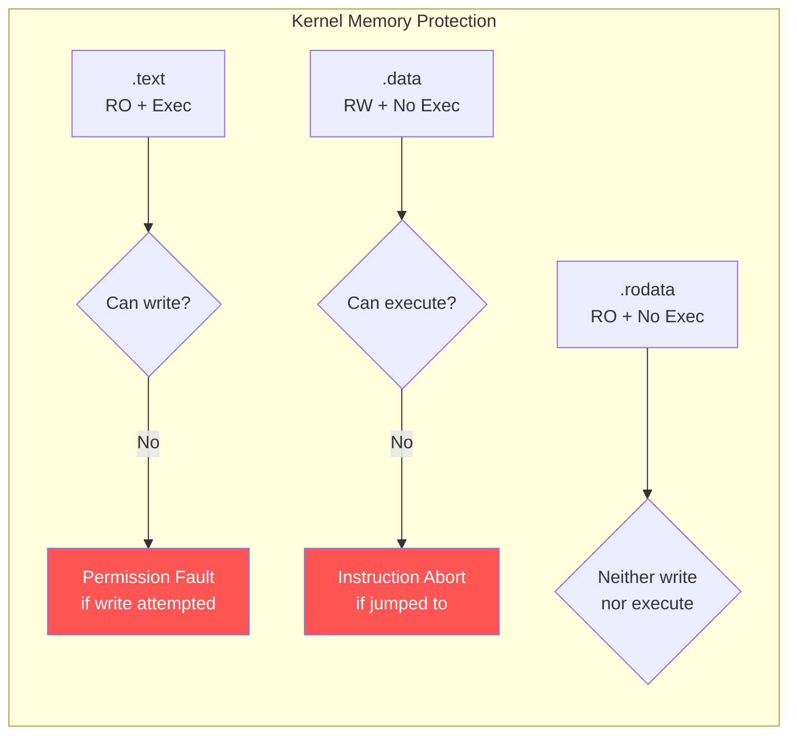

# Scenario 3: Permission Fault — Write to Read-Only Memory

## Symptom

```
[ 6789.345678] Unable to handle kernel write to read-only memory at virtual address ffff800010234560
[ 6789.345686] Mem abort info:
[ 6789.345688]   ESR = 0x000000009600004f
[ 6789.345691]   EC = 0x25: DABT (current EL), IL = 32 bits
[ 6789.345694]   SET = 0, FnV = 0
[ 6789.345696]   EA = 0, S1PTW = 0
[ 6789.345698]   FSC = 0x0f: level 3 permission fault
[ 6789.345703] Data abort info:
[ 6789.345705]   ISV = 0, ISS = 0x0000004f, ISS2 = 0x00000000
[ 6789.345707]   CM = 0, WnR = 1
[ 6789.345710] Internal error: Oops: 000000009600004f [#1] PREEMPT SMP
[ 6789.345715] CPU: 0 PID: 1567 Comm: insmod Tainted: G           O      6.8.0 #1
[ 6789.345722] pc : my_patch_func+0x28/0x80 [buggy_mod]
[ 6789.345728] lr : my_module_init+0x3c/0x70 [buggy_mod]
[ 6789.345735] Call trace:
[ 6789.345737]  my_patch_func+0x28/0x80 [buggy_mod]
[ 6789.345742]  my_module_init+0x3c/0x70 [buggy_mod]
[ 6789.345747]  do_one_initcall+0x50/0x300
[ 6789.345751]  do_init_module+0x60/0x220
[ 6789.345755]  load_module+0x1d58/0x2120
[ 6789.345760] Code: f9400261 91001021 d503201f aa0003e2 (b9000041)
[ 6789.345766]                                            ^^^^^^^^^^
[ 6789.345768]                                            STR w1, [x2] → write to RO page
[ 6789.345772] ---[ end trace 0000000000000000 ]---
```

### How to Recognize
- **`Unable to handle kernel write to read-only memory`**
- FSC = **`0x0D`/`0x0E`/`0x0F`** — **Permission fault** (level 1/2/3)
- `WnR = 1` — **Write** (not Read) that was denied
- Fault address is in **kernel text/rodata** region (valid but RO)
- The address IS mapped (unlike translation fault) — but permissions forbid the access

---

## Background: ARM64 Page Permissions

### Page Table Entry (PTE) Permission Bits
```
ARM64 Stage-1 PTE (Block/Page descriptor):
┌─────────────────────────────────────────────────────────┐
│ 63:52 │ 51:48 │ 47:12        │ 11:2       │ 1:0       │
│ Upper │ Res0  │ Output Addr  │ Lower Attr │ Valid+Type│
│ Attrs │       │ (phys page)  │            │           │
└─────────────────────────────────────────────────────────┘

Permission bits:
  AP[2:1] (bits 7:6):
    00 = EL1 R/W, EL0 none
    01 = EL1 R/W, EL0 R/W
    10 = EL1 RO,  EL0 none    ← kernel read-only!
    11 = EL1 RO,  EL0 RO

  PXN (bit 53): Privileged Execute Never
  UXN (bit 54): User Execute Never
  DBM (bit 51): Dirty Bit Modifier

  WXN (SCTLR_EL1 bit): Write implies eXecute Never
    → If a page is writable, it CANNOT be executable
    → Enforces W^X (Write XOR Execute)
```

### Kernel Memory Regions and Permissions
```
Region               Virtual Address Range          Permissions
──────               ─────────────────────          ───────────
.text (code)         ffff800010000000-...           RO + Executable
.rodata              ffff800010xxxxxx-...           RO + No Execute
.data                ffff800011xxxxxx-...           RW + No Execute
.bss                 ffff800011xxxxxx-...           RW + No Execute
vmalloc              ffff000000000000-...           RW (per mapping)
Linear map           ffff800000000000-...           RW (page_offset)
Module text          ffff800000000000-...           RO + Exec (module range)
Module data          ffff800000000000-...           RW + No Exec
```

### W^X (Write XOR Execute) Enforcement


---

## Code Flow: Permission Fault Path

```c
// arch/arm64/mm/fault.c

static const struct fault_info fault_info[] = {
    // ...
    { do_page_fault,    SIGSEGV, SEGV_ACCERR, "level 1 permission fault" },  // FSC 0x0D
    { do_page_fault,    SIGSEGV, SEGV_ACCERR, "level 2 permission fault" },  // FSC 0x0E
    { do_page_fault,    SIGSEGV, SEGV_ACCERR, "level 3 permission fault" },  // FSC 0x0F
};

// do_page_fault checks:
static int __kprobes do_page_fault(unsigned long far, unsigned long esr,
                                    struct pt_regs *regs)
{
    unsigned long addr = untagged_addr(far);

    if (!user_mode(regs)) {
        // Kernel mode fault
        if (is_write_abort(esr)) {
            // Write to RO page → no fixup possible for .text/.rodata
            if (!fixup_exception(regs))
                __do_kernel_fault(addr, esr, regs);
        }
    }
}

static void __do_kernel_fault(unsigned long addr, unsigned long esr,
                              struct pt_regs *regs)
{
    const char *msg;

    if (is_write_abort(esr) && is_permission_fault(esr))
        msg = "write to read-only memory";
    else
        msg = "paging request";

    pr_alert("Unable to handle kernel %s at virtual address %016lx\n",
             msg, addr);

    die("Oops", regs, esr);
}
```

---

## Common Causes

### 1. Attempting to Modify Kernel .text (Code Patching Gone Wrong)
```c
/* Trying to overwrite a function directly: */
void my_patch_func(void)
{
    unsigned int *target = (unsigned int *)some_kernel_func;
    *target = 0xd503201f;  // NOP instruction
    // → Permission fault! .text is mapped RO
}

/* CORRECT: use text_poke or set_memory_rw temporarily */
#include <linux/set_memory.h>
void my_patch_func(void)
{
    set_memory_rw((unsigned long)target, 1);  // Make page RW
    *target = 0xd503201f;
    set_memory_ro((unsigned long)target, 1);  // Restore RO
    flush_icache_range((unsigned long)target,
                       (unsigned long)target + 4);
}
```

### 2. Writing to const / .rodata Data
```c
static const char version[] = "1.0";

void update_version(void) {
    // version is in .rodata → mapped RO
    char *v = (char *)version;
    v[0] = '2';  // → Permission fault!
}
```

### 3. Writing Through Stale Pointer After set_memory_ro()
```c
void *buf = vmalloc(PAGE_SIZE);
// ... fill buffer ...

// Make it read-only (e.g., for security):
set_memory_ro((unsigned long)buf, 1);

// Later, forgetting it's RO:
memset(buf, 0, PAGE_SIZE);  // → Permission fault!
```

### 4. Direct Write to MMIO Region Mapped RO
```c
void __iomem *regs = ioremap(phys_addr, size);
// If ioremap sets the mapping as RO (unlikely, but possible
// with certain protection flags)...

writel(0x1, regs + CONTROL_REG);  // → Permission fault
```

### 5. Kernel Self-Protection: CONFIG_STRICT_KERNEL_RWX
```bash
# Modern kernels enforce:
CONFIG_STRICT_KERNEL_RWX=y    # .text = RO+Exec, .rodata = RO
CONFIG_STRICT_MODULE_RWX=y    # Module .text = RO+Exec after init

# Before CONFIG_STRICT_KERNEL_RWX: kernel .text was RW
# → easy to exploit (attacker could overwrite code)
# After: any write to .text → permission fault → Oops
```

### 6. Module .text After init Completes
```c
// Module text is marked RO after module_init runs:
// __init functions are in .init.text → freed after init
// Remaining .text → set to RO

// If a function pointer still points to an __init function
// after init → the memory may be freed/remapped → fault
```

---

## Debugging Steps

### Step 1: Check the Fault Type
```
FSC = 0x0f: level 3 permission fault
WnR = 1    → WRITE access that was denied

This is NOT a missing page (translation fault)
The page EXISTS but is mapped READ-ONLY
```

### Step 2: Identify What's at the Fault Address
```bash
# Check if address is in kernel .text or .rodata:
cat /proc/kallsyms | grep -i "ffff800010234"

# Or in crash tool:
crash> sym ffff800010234560
ffff800010234560 (r) my_readonly_data [my_module]

# (r) = read-only symbol
# (t) = text (code) symbol
# (d) = data symbol
# (b) = bss symbol
```

### Step 3: Decode the Faulting Instruction
```
Code: ... (b9000041)
Decode: STR w1, [x2]   → Store word from w1 to address in x2
                          x2 = ffff800010234560 (RO page)
                          → Permission fault!
```

### Step 4: Check Memory Protection State
```bash
# From crash tool:
crash> vtop ffff800010234560
# Shows: page table walk, permissions at each level
# Look for: AP bits, RO flag

# Or check kernel mapping:
crash> kmem -p ffff800010234560
# Shows page flags and protection
```

### Step 5: Verify Kernel Protection Config
```bash
# Is strict RWX enabled?
grep CONFIG_STRICT_KERNEL_RWX /boot/config-$(uname -r)
grep CONFIG_STRICT_MODULE_RWX /boot/config-$(uname -r)

# Check current .text permissions:
cat /sys/kernel/debug/kernel_page_tables
# Look for: kernel text region → should show "ro x"
```

---

## Fixes

| Cause | Fix |
|-------|-----|
| Writing to .text directly | Use `text_poke()` or kernel patching APIs |
| Writing to const data | Remove `const`; or copy to writable buffer |
| set_memory_ro then write | Track RO state; use set_memory_rw before write |
| Stale pointer to freed __init | Don't keep pointers to __init functions |
| Modifying function pointers in RO section | Use `__ro_after_init` correctly |

### Fix Example: Use __ro_after_init
```c
/* For data that should be writable during init but RO after: */

/* The pointer is set during init, then made read-only: */
static void (*my_callback)(void) __ro_after_init;

static int __init my_init(void)
{
    my_callback = real_callback;  // OK during init
    return 0;
}

// After init: my_callback page is marked RO
// Any later modification → permission fault (intentional protection)
```

### Fix Example: Safe Text Patching
```c
/* BEFORE: direct write to kernel text → Oops */
void patch_function(void *addr, u32 insn)
{
    *(u32 *)addr = insn;  // Permission fault!
}

/* AFTER: use kernel text patching API */
#include <asm/patching.h>

void patch_function(void *addr, u32 insn)
{
    aarch64_insn_write(addr, insn);
    // This internally:
    // 1. Maps a temporary RW alias of the RO page
    // 2. Writes the instruction through the alias
    // 3. Flushes I-cache
    // 4. Unmaps the alias
    // Original mapping stays RO → safe
}
```

---

## ARM64: PAN (Privileged Access Never)

Related protection — PAN prevents the kernel from accessing **user** pages:

```
pstate: 60400009 (nZCv daif +PAN ...)
                              ^^^^
                              PAN = 1 → kernel CANNOT read/write user memory

Without PAN: kernel could accidentally dereference user pointer
With PAN:    any user-address access from kernel → permission fault

Exception: copy_from_user / copy_to_user temporarily disable PAN
```

```c
// If a driver does this:
void bad_read(void __user *uptr) {
    char c = *(char *)uptr;  // → PAN permission fault!
    // Must use: get_user(c, uptr);
}
```

---

## Quick Reference

| Item | Value |
|------|-------|
| Message | `Unable to handle kernel write to read-only memory` |
| FSC | `0x0D`/`0x0E`/`0x0F` — permission fault (level 1/2/3) |
| WnR | `1` = write denied |
| ESR EC | `0x25` — DABT from current EL |
| Protection config | `CONFIG_STRICT_KERNEL_RWX=y` |
| .text permissions | RO + Executable |
| .rodata permissions | RO + No Execute |
| .data permissions | RW + No Execute |
| Text patching API | `aarch64_insn_write()` / `text_poke()` |
| RO after init | `__ro_after_init` annotation |
| PAN | Prevents kernel access to user pages |
| Key defense | W^X (Write XOR Execute) enforcement |
