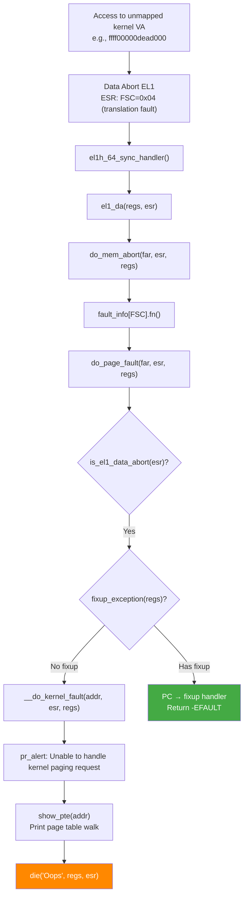

# Scenario 4: Bad Kernel Paging Request — Unmapped Kernel Address

## Symptom

```
[ 7890.456789] Unable to handle kernel paging request at virtual address ffff00000dead000
[ 7890.456795] Mem abort info:
[ 7890.456797]   ESR = 0x0000000096000004
[ 7890.456800]   EC = 0x25: DABT (current EL), IL = 32 bits
[ 7890.456803]   SET = 0, FnV = 0
[ 7890.456805]   EA = 0, S1PTW = 0
[ 7890.456807]   FSC = 0x04: level 0 translation fault
[ 7890.456812] Data abort info:
[ 7890.456814]   ISV = 0, ISS = 0x00000004, ISS2 = 0x00000000
[ 7890.456816]   CM = 0, WnR = 0
[ 7890.456820] swapper pgtable: 4k pages, 48-bit VAs, pgdp=0000000082070000
[ 7890.456825] [ffff00000dead000] pgd=0000000000000000, p4d=0000000000000000
[ 7890.456832] Internal error: Oops: 0000000096000004 [#1] PREEMPT SMP
[ 7890.456838] Modules linked in: buggy_mod(O) virtio_net ext4
[ 7890.456845] CPU: 2 PID: 3456 Comm: test_app Tainted: G           O      6.8.0 #1
[ 7890.456852] pc : my_read_data+0x38/0x90 [buggy_mod]
[ 7890.456858] lr : my_ioctl_handler+0x6c/0x100 [buggy_mod]
[ 7890.456864] sp : ffff80001567bc80
[ 7890.456867] x0 : ffff00000dead000  x1 : 0000000000000040
[ 7890.456872] ...
[ 7890.456880] Call trace:
[ 7890.456882]  my_read_data+0x38/0x90 [buggy_mod]
[ 7890.456887]  my_ioctl_handler+0x6c/0x100 [buggy_mod]
[ 7890.456892]  __arm64_sys_ioctl+0xa8/0xe0
[ 7890.456897]  invoke_syscall+0x50/0x120
[ 7890.456901]  el0_svc_common+0x48/0xf0
[ 7890.456905]  el0t_64_sync+0x1a0/0x1a4
[ 7890.456910] Code: f9400260 b4000080 f9402000 f9400001 (b9400020)
[ 7890.456916]                                            ^^^^^^^^^^
[ 7890.456918]                                            LDR w0,[x1] → x1=dead addr
[ 7890.456922] ---[ end trace 0000000000000000 ]---
```

### How to Recognize
- **`Unable to handle kernel paging request at virtual address`**
- FSC = **`0x04`/`0x05`/`0x06`/`0x07`** — **Translation fault** (level 0/1/2/3)
- Page table walk shows **`pgd=0000000000000000`** — entry is empty (unmapped)
- The virtual address is in **kernel space** but has **no page table mapping**
- NOT a permission fault (page doesn't exist at all)

---

## Background: Translation vs Permission Faults

### Fault Status Codes (FSC)
```
Translation faults (page/entry doesn't exist):
  0x04 = level 0 translation fault (PGD empty)
  0x05 = level 1 translation fault (PUD empty)
  0x06 = level 2 translation fault (PMD empty)
  0x07 = level 3 translation fault (PTE empty)

Permission faults (page exists, wrong permissions):
  0x0D = level 1 permission fault
  0x0E = level 2 permission fault
  0x0F = level 3 permission fault

Access flag faults (page exists, access flag not set):
  0x09 = level 1 access flag fault
  0x0A = level 2 access flag fault
  0x0B = level 3 access flag fault
```

### Page Table Walk
```
Virtual Address: ffff00000dead000
                 ↓
         ┌───────────┐
PGD ───→│ index [511]│──→ 0x0000000000000000  ← EMPTY!
         └───────────┘
                         Translation Fault: Level 0
                         The PGD entry for this VA is NULL
                         → No PUD/PMD/PTE exist → page is unmapped

[ffff00000dead000] pgd=0000000000000000, p4d=0000000000000000
                   ^^^^^^^^^^^^^^^^^^
                   PGD entry is 0 → walk stops immediately
```

### Kernel Virtual Address Map (ARM64 48-bit)
```
ffff000000000000 — ffffffffffffffff : Kernel space (256TB)
  ├─ ffff000000000000 : vmalloc / ioremap / module space
  │     ├─ Modules loaded here (module text + data)
  │     ├─ vmalloc allocations
  │     └─ ioremap mappings
  ├─ ffff800000000000 : Linear map (direct mapping of all RAM)
  │     ├─ ffff800010000000: kernel .text
  │     ├─ ffff800010xxxxxx: kernel .rodata, .data, .bss
  │     └─ All physical RAM mapped linearly
  └─ Gaps between regions → UNMAPPED → translation fault
```

---

## Code Flow: Translation Fault → Oops



### __do_kernel_fault()
```c
// arch/arm64/mm/fault.c

static void __do_kernel_fault(unsigned long addr, unsigned long esr,
                              struct pt_regs *regs)
{
    const char *msg;

    msg = "paging request";  // Generic translation fault

    pr_alert("Unable to handle kernel %s at virtual address %016lx\n",
             msg, addr);

    mem_abort_decode(esr);
    show_pte(addr);          // Walk page tables and print entries

    die("Oops", regs, esr);
}

static void show_pte(unsigned long addr)
{
    struct mm_struct *mm = &init_mm;  // Kernel page tables
    pgd_t *pgdp, pgd;
    p4d_t *p4dp, p4d;
    pud_t *pudp, pud;
    pmd_t *pmdp, pmd;
    pte_t *ptep, pte;

    pgdp = pgd_offset_k(addr);
    pgd = READ_ONCE(*pgdp);
    pr_alert("[%016lx] pgd=%016llx", addr, pgd_val(pgd));

    if (pgd_none(pgd) || pgd_bad(pgd))
        return;  // Stop walk — page doesn't exist

    // Continue through P4D → PUD → PMD → PTE...
}
```

---

## Common Causes

### 1. Accessing Freed vmalloc Memory
```c
void *buf;

static int __init my_init(void)
{
    buf = vmalloc(4096);
    // ... use buf ...
    vfree(buf);   // Memory freed → page table entries removed
    return 0;
}

static void my_later_function(void)
{
    memset(buf, 0, 4096);  // → paging request! vmalloc VA unmapped
    // vmalloc unmaps pages immediately on vfree()
    // Unlike kfree (SLAB), no grace period for use-after-free detection
}
```

### 2. Using Freed Module Memory
```c
static struct my_ops ops;

static int __init helper_init(void)
{
    ops.callback = some_other_module_func;
    return 0;
}

// If the other module is unloaded:
// - its text is freed → vmalloc pages unmapped
// - ops.callback now points to unmapped address
// - calling ops.callback() → paging request
```

### 3. Bogus Pointer / Uninitialized Pointer
```c
struct my_device {
    void *private_data;   // Never initialized!
};

void my_func(struct my_device *dev)
{
    // dev->private_data = 0xffff00000dead000 (stack garbage)
    struct my_priv *priv = dev->private_data;
    priv->value = 42;  // → paging request at garbage address
}
```

### 4. Accessing ioremap'd Region After iounmap
```c
void __iomem *regs;

static int my_probe(struct platform_device *pdev)
{
    regs = devm_ioremap_resource(&pdev->dev, res);
    return 0;
}

static void my_remove(struct platform_device *pdev)
{
    // devm_ automatically unmaps on remove
    // But if a workqueue is still running:
}

static void my_work_handler(struct work_struct *work)
{
    u32 val = readl(regs);  // → paging request! regs unmapped
}
```

### 5. Out-of-Bounds vmalloc Access
```c
void *buf = vmalloc(PAGE_SIZE);  // Maps exactly 1 page

// vmalloc has guard pages (unmapped pages between allocations)
char *p = (char *)buf + PAGE_SIZE;  // Beyond allocation
*p = 'x';  // → paging request! Hit the guard page
```

### 6. Stale Pointer After Module Reload
```c
/* Module A exports a symbol: */
void *shared_ptr;
EXPORT_SYMBOL(shared_ptr);

/* Module B uses it: */
extern void *shared_ptr;
void use_shared(void) {
    // If Module A reloaded → shared_ptr may be old address
    // Old module's vmalloc region is unmapped
    memcpy(shared_ptr, data, len);  // → paging request
}
```

---

## Debugging Steps

### Step 1: Identify the Fault Level
```
FSC = 0x04: level 0 translation fault
→ PGD entry is empty
→ Entire VA region is unmapped (not just one page)
→ Address is likely in a completely wrong region

FSC = 0x07: level 3 translation fault
→ PGD/PUD/PMD exist but PTE is empty
→ Specific page was unmapped (e.g., vfree, iounmap)
→ Address was likely valid at some point
```

### Step 2: Classify the Address
```bash
# In crash tool:
crash> kmem ffff00000dead000
      # Shows: nothing → address is not in any allocation

crash> vm ffff00000dead000
      # Shows: which vmalloc region this falls in (or none)

# Check vmalloc areas:
crash> list -o vm_struct.next -s vm_struct.addr,size,caller vmlist
```

### Step 3: Check for Use-After-Free Pattern
```bash
# Was this address previously allocated?
# Enable vmalloc debug:
CONFIG_DEBUG_PAGEALLOC=y     # Poisons freed pages
CONFIG_PAGE_OWNER=y          # Track who allocated each page

# Boot with:
vmalloc=debug    # Extra vmalloc checks
page_owner=on    # Page allocation tracking
```

### Step 4: Check Module Load/Unload History
```bash
dmesg | grep -E "(loading|unloading) module"
# See if a module was unloaded recently

# Check if fault address was in a module's address range:
cat /proc/modules
# Compare address with module base addresses
```

### Step 5: Examine the Page Table Walk
```
[ffff00000dead000] pgd=0000000000000000, p4d=0000000000000000
                   ^^^^^^^^^^^^^^^^^^^^^^^^^^^^^^^^^^^^^^^^
Key observations:
- pgd=0: Entire region unmapped → address never was valid here
- pgd=valid, pud=0: Region was partially mapped
- All entries valid but pte=0: Specific page unmapped → likely vfree/iounmap
```

### Step 6: Trace Allocation/Deallocation
```bash
# With KASAN:
CONFIG_KASAN=y
CONFIG_KASAN_VMALLOC=y       # KASAN for vmalloc regions

# KASAN will detect vmalloc use-after-free with more detail:
# BUG: KASAN: vmalloc-out-of-bounds / use-after-free
# Includes allocation and free stack traces
```

---

## vmalloc Guard Pages

```
vmalloc region layout:
┌──────────────────────────────────────────────────────┐
│  Guard   │  Allocation 1  │  Guard   │  Alloc 2     │
│  (unmapped) │  (N pages)   │ (unmapped) │ (M pages) │
│  1 page     │              │  1 page    │            │
└──────────────────────────────────────────────────────┘
     ↑                            ↑
     │                            │
     └── Access here → paging request (translation fault)

Guard pages:
- Inserted between vmalloc allocations
- NOT mapped in page tables (PTE = 0)
- Any access → immediate translation fault
- Detects buffer overflows in vmalloc space
```

---

## Fixes

| Cause | Fix |
|-------|-----|
| Use-after-free (vmalloc) | Set pointer to NULL after vfree; check before use |
| Uninitialized pointer | Initialize all pointers (= NULL); use `kzalloc` |
| Module unloaded | Use `try_module_get` / `module_put` for cross-module refs |
| ioremap after iounmap | Cancel work/timers before device removal |
| Out-of-bounds vmalloc | Bounds check; don't exceed allocation size |
| Stale function pointer | Use RCU for safe callback updates; set to NULL on unregister |

### Fix Example: Safe Module Callback
```c
/* BEFORE: stale callback after module unload */
static struct notifier_block my_nb = {
    .notifier_call = other_module_handler,  // From module B
};

/* AFTER: proper module reference counting */
static int call_callback(void)
{
    struct module *mod = find_module("module_b");
    if (!mod || !try_module_get(mod))
        return -ENOENT;  // Module not loaded

    other_module_handler(...);
    module_put(mod);
    return 0;
}
```

### Fix Example: Safe vmalloc Lifecycle
```c
/* BEFORE: use-after-free */
struct my_ctx {
    void *buf;
};

void cleanup(struct my_ctx *ctx) {
    vfree(ctx->buf);
    // ctx->buf still points to freed memory!
}

void later_use(struct my_ctx *ctx) {
    memset(ctx->buf, 0, 4096);  // Oops!
}

/* AFTER: NULL after free + check */
void cleanup(struct my_ctx *ctx) {
    vfree(ctx->buf);
    ctx->buf = NULL;  // Clear stale pointer
}

void later_use(struct my_ctx *ctx) {
    if (!ctx->buf)
        return;  // Safe: skip if freed
    memset(ctx->buf, 0, 4096);
}
```

---

## Quick Reference

| Item | Value |
|------|-------|
| Message | `Unable to handle kernel paging request` |
| FSC | `0x04`–`0x07` — translation fault (level 0–3) |
| ESR EC | `0x25` — DABT from current EL |
| PGD = 0 | Entire VA region never mapped |
| PTE = 0 | Specific page unmapped (freed/unmapped) |
| Guard pages | vmalloc inserts unmapped pages between allocations |
| Detection | `CONFIG_KASAN_VMALLOC=y`, `CONFIG_DEBUG_PAGEALLOC=y` |
| vmalloc debug | Boot with `vmalloc=debug` |
| Key handler | `__do_kernel_fault()` → `show_pte()` → `die()` |
| Common cause | use-after-free of vmalloc/ioremap memory |
| Defense | NULL pointers after free; reference count modules |
