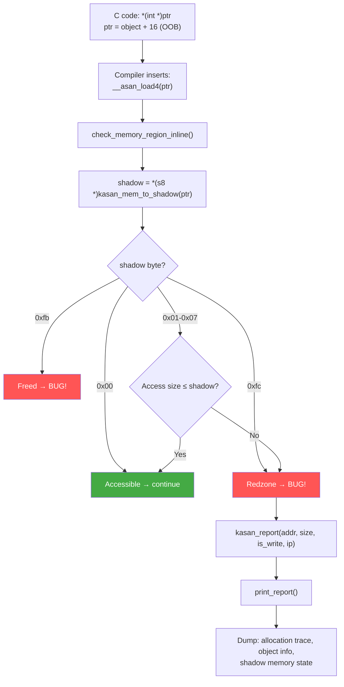

# Scenario 5: KASAN Slab Out-of-Bounds (slab-out-of-bounds)

## Symptom

```
[ 8901.567890] ==================================================================
[ 8901.567895] BUG: KASAN: slab-out-of-bounds in my_parse_data+0x88/0x120 [buggy_mod]
[ 8901.567903] Read of size 4 at addr ffff00001234a110 by task test_app/4567
[ 8901.567910]
[ 8901.567912] CPU: 1 PID: 4567 Comm: test_app Tainted: G           O      6.8.0 #1
[ 8901.567918] Call trace:
[ 8901.567920]  dump_backtrace+0x0/0x1e0
[ 8901.567924]  show_stack+0x20/0x30
[ 8901.567928]  dump_stack_lvl+0x60/0x80
[ 8901.567932]  print_report+0x174/0x500
[ 8901.567936]  kasan_report+0xac/0xe0
[ 8901.567940]  __asan_load4+0x78/0xa0
[ 8901.567944]  my_parse_data+0x88/0x120 [buggy_mod]
[ 8901.567949]  my_ioctl_handler+0x74/0x100 [buggy_mod]
[ 8901.567954]  __arm64_sys_ioctl+0xa8/0xe0
[ 8901.567958]  invoke_syscall+0x50/0x120
[ 8901.567962]  el0t_64_sync+0x1a0/0x1a4
[ 8901.567968]
[ 8901.567970] Allocated by task 4567:
[ 8901.567973]  kasan_save_stack+0x24/0x50
[ 8901.567977]  kasan_save_alloc_info+0x20/0x30
[ 8901.567981]  __kasan_kmalloc+0x88/0xa0
[ 8901.567985]  kmalloc_trace+0x44/0x60
[ 8901.567989]  my_alloc_buffer+0x30/0x60 [buggy_mod]
[ 8901.567993]  my_ioctl_handler+0x40/0x100 [buggy_mod]
[ 8901.567998]
[ 8901.568000] The buggy address belongs to the object at ffff00001234a100
[ 8901.568003]  which belongs to the cache kmalloc-16 of size 16
[ 8901.568006] The buggy address is located 0 bytes to the right of
[ 8901.568008]  allocated 16-byte region [ffff00001234a100, ffff00001234a110)
[ 8901.568014]
[ 8901.568016] Memory state around the buggy address:
[ 8901.568019]  ffff00001234a000: fb fb fb fb fb fb fb fb fb fb fb fb fb fb fb fb
[ 8901.568023]  ffff00001234a080: fc fc fc fc fc fc fc fc fc fc fc fc fc fc fc fc
[ 8901.568027] >ffff00001234a100: 00 00 fc fc fc fc fc fc fc fc fc fc fc fc fc fc
[ 8901.568031]                          ^^
[ 8901.568033]  ffff00001234a180: fb fb fb fb fb fb fb fb fb fb fb fb fb fb fb fb
[ 8901.568037]  ffff00001234a200: fc fc fc fc fc fc fc fc fc fc fc fc fc fc fc fc
[ 8901.568041] ==================================================================
```

### How to Recognize
- **`BUG: KASAN: slab-out-of-bounds`** — exact KASAN error type
- Reports **access size** (4 bytes), **direction** (Read/Write), **address**
- Shows **Allocated by** stack trace — who created the object
- Shows object cache (**kmalloc-16**) and exact region boundaries
- **Shadow memory** state printed at bottom (shadow byte meanings below)
- Requires `CONFIG_KASAN=y` at compile time

---

## Background: KASAN Architecture on ARM64

### What is KASAN?
```
KASAN = Kernel Address SANitizer
- Detects out-of-bounds access on heap (slab) allocations
- Detects use-after-free on slab allocations
- Compile-time instrumentation: every memory access is checked
- Shadow memory: 1 byte of shadow per 8 bytes of real memory
```

### KASAN Modes
```
CONFIG_KASAN_GENERIC=y   → Software KASAN (compiler instrumented)
                           Every load/store → __asan_loadN / __asan_storeN
                           ~2x slowdown, catches most bugs

CONFIG_KASAN_SW_TAGS=y   → Software Tag-Based (ARM64 only, uses TBI)
                           Top byte of pointer = tag
                           Memory tagged with matching tag
                           Mismatch → report

CONFIG_KASAN_HW_TAGS=y   → Hardware Tag-Based (ARM MTE)
                           Uses ARMv8.5 Memory Tagging Extension
                           Near-zero overhead, hardware enforced
```

### Shadow Memory Layout
```
For every 8 bytes of kernel memory → 1 byte of shadow memory

Real address:   ffff00001234a100
Shadow address: KASAN_SHADOW_OFFSET + (ffff00001234a100 >> 3)

Shadow byte values:
  0x00      = all 8 bytes accessible
  0x01-0x07 = only first N bytes accessible (partial)
  0xfc      = slab redzone (out-of-bounds area)
  0xfb      = freed slab object
  0xfe      = slab padding
  0xf1      = stack left redzone
  0xf2      = stack mid redzone
  0xf3      = stack right redzone
  0xf8      = stack after scope
  0xfa      = global redzone
  0xff      = shadow gap
```

### How Slab KASAN Works
```
When kmalloc(16) is called:
┌──────────────────────────────────────────────────────────────┐
│ Redzone │ Object (16 bytes) │ Redzone (padding to slab size)│
│  (fc)   │  (00 00)          │  (fc fc fc fc fc ...)         │
└──────────────────────────────────────────────────────────────┘
  Shadow:    fc fc 00 00 fc fc fc fc fc fc

  Object:     [ffff00001234a100, ffff00001234a110)  = 16 bytes
  Shadow[0]:  00 → bytes 0-7 accessible
  Shadow[1]:  00 → bytes 8-15 accessible
  Shadow[2]:  fc → bytes 16+ are REDZONE (out of bounds)

  Access at ffff00001234a110 → shadow = fc → KASAN REPORT!
```

---

## Code Flow: KASAN Detection



### kasan_report()
```c
// mm/kasan/report.c

void kasan_report(const void *addr, size_t size, bool is_write,
                  unsigned long ip)
{
    struct kasan_report_info info;

    info.type = KASAN_REPORT_ACCESS;
    info.access_addr = addr;
    info.access_size = size;
    info.is_write = is_write;
    info.ip = ip;

    start_report(&info, true);
    print_report(&info);     // The main output
    end_report(&info);
}

static void print_report(struct kasan_report_info *info)
{
    // "BUG: KASAN: slab-out-of-bounds in ..."
    print_error_description(info);

    // "Allocated by task N:" + stack trace
    print_address_description(info);

    // Shadow memory dump
    print_memory_metadata(info);
}
```

### Compiler Instrumentation
```c
/* What the compiler generates for every memory access: */

// Original C:
int value = *(int *)ptr;

// After KASAN instrumentation (simplified):
__asan_load4(ptr);              // Check shadow byte
int value = *(int *)ptr;        // Actual access

// __asan_load4:
void __asan_load4(unsigned long addr) {
    s8 shadow = *(s8 *)kasan_mem_to_shadow(addr);
    if (unlikely(shadow)) {
        if (shadow > 0 && (addr & 7) + 4 <= shadow)
            return;  // Partial access within valid range
        kasan_report(addr, 4, false, _RET_IP_);
    }
}
```

---

## Common Causes

### 1. Classic Off-by-One Buffer Overflow
```c
/* Allocate buffer for N items, but loop goes one past: */
int *buf = kmalloc(10 * sizeof(int), GFP_KERNEL);
// Allocated: 40 bytes → shadow: 00 00 00 00 00 (+ redzone fc fc...)

for (int i = 0; i <= 10; i++) {  // BUG: should be i < 10
    buf[i] = i;                   // buf[10] → 40 bytes past start
}                                 //         → slab-out-of-bounds!
```

### 2. Wrong Size in kmalloc
```c
struct my_large_struct {
    u32 id;
    char name[64];
    u32 flags;
    // Total: 72 bytes
};

// BUG: allocating wrong/smaller struct size
struct my_large_struct *obj = kmalloc(sizeof(struct my_small_struct),
                                      GFP_KERNEL);
// sizeof(my_small_struct) = 16 → kmalloc-16 cache
// obj->name[0] = 'x' → offset 4 → OK
// obj->flags = 0      → offset 68 → WAY past 16 bytes → OOB!
```

### 3. String Operations Without Bounds
```c
char *buf = kmalloc(16, GFP_KERNEL);

// User provides long input:
if (copy_from_user(buf, user_str, user_len)) // user_len=64
    return -EFAULT;
// Writes 64 bytes into 16-byte buffer → OOB write

// Also: strcpy, strcat without length limits
strcpy(buf, long_string);  // No bounds check → OOB
```

### 4. Array Index from Untrusted Input
```c
struct my_table {
    u32 entries[8];     // 32 bytes
};

struct my_table *tbl = kmalloc(sizeof(*tbl), GFP_KERNEL);

// idx from user/device without validation:
u32 idx = get_index_from_hardware();
tbl->entries[idx] = value;  // If idx >= 8 → OOB write!
```

### 5. Struct Size Mismatch After Refactoring
```c
/* Version 1: struct was 32 bytes */
struct my_obj_v1 {
    u32 a, b, c, d;
    u32 e, f, g, h;
};

/* Version 2: added new field → now 36 bytes */
struct my_obj_v2 {
    u32 a, b, c, d;
    u32 e, f, g, h;
    u32 new_field;       // Added in v2!
};

// But allocation code not updated:
struct my_obj_v2 *obj = kmalloc(32, GFP_KERNEL);  // Still old size!
obj->new_field = 42;  // → slab-out-of-bounds
```

---

## Reading the KASAN Report

### Decoding the Key Lines
```
BUG: KASAN: slab-out-of-bounds in my_parse_data+0x88/0x120 [buggy_mod]
              ^^^^^^^^^^^^^^^^^^    ^^^^^^^^^^^^^^^^^^^^^^^^^
              Error type            Where the bad access happened

Read of size 4 at addr ffff00001234a110 by task test_app/4567
^^^^           ^       ^^^^^^^^^^^^^^^^^
Read (not write) 4 bytes  The OOB address         Task that triggered it

The buggy address belongs to the object at ffff00001234a100
                                            ^^^^^^^^^^^^^^^^
                                            Object START address

which belongs to the cache kmalloc-16 of size 16
                           ^^^^^^^^^        ^^
                           Slab cache       Object size

The buggy address is located 0 bytes to the right of
 allocated 16-byte region [ffff00001234a100, ffff00001234a110)
                           ^^^^^^^^^^^^^^^^^^^^^^^^^^^^^^^^^^^^
 Access at a110, object ends at a110 → 0 bytes RIGHT of end → 1st OOB byte
```

### Reading Shadow Memory
```
>ffff00001234a100: 00 00 fc fc fc fc fc fc fc fc fc fc fc fc fc fc
                   ^^^^^ ^^^^^
                   |     |
                   |     fc = REDZONE (out of bounds)
                   00 00 = two groups of 8 bytes accessible = 16 bytes

Each shadow byte covers 8 bytes of real memory:
  Shadow[0] = 00 → bytes [a100, a108) = accessible
  Shadow[1] = 00 → bytes [a108, a110) = accessible
  Shadow[2] = fc → bytes [a110, a118) = REDZONE ← access here = BUG!
```

---

## Debugging Steps

### Step 1: Read the Report (Already Has Everything)
```
KASAN reports are the MOST informative kernel bug reports:
1. Exact function + offset where bug occurs
2. Stack trace of the BAD ACCESS
3. Stack trace of the ALLOCATION
4. Object size and cache name
5. Exact offset from object start/end
6. Shadow memory state

Most of the time, the report alone is sufficient to find the bug.
```

### Step 2: Calculate the Overrun
```
Object: [ffff00001234a100, ffff00001234a110) = 16 bytes
Access: ffff00001234a110, size 4
→ Accesses bytes [a110, a114)
→ 0 bytes past the end of a 16-byte object
→ Read 4 bytes starting at exactly the first OOB byte

Common patterns:
  "0 bytes to the right" → off-by-one, exact end+1
  "N bytes to the right" → bigger overrun, likely wrong size or index
  "N bytes to the left"  → underflow (rare, possible with negative index)
```

### Step 3: Match Allocation and Access
```
Allocation trace shows: my_alloc_buffer → kmalloc(16)
Access trace shows:     my_parse_data accesses byte 16

→ Check: is the allocation too small or the access too large?
→ In this case: kmalloc(16) but code reads a 4-byte int at offset 16
→ Should have been kmalloc(20) or more
```

### Step 4: Check for Variable-Length Objects
```c
/* Common pattern: variable-length struct with trailing array */
struct msg {
    u32 type;
    u32 len;
    u8 data[];     // Flexible array member
};

// Must allocate: sizeof(struct msg) + data_len
struct msg *m = kmalloc(sizeof(*m) + data_len, GFP_KERNEL);

// BUG if data_len is wrong or if code accesses beyond data_len
```

### Step 5: Reproduce with Full KASAN Config
```bash
CONFIG_KASAN=y
CONFIG_KASAN_GENERIC=y           # Software instrumentation
CONFIG_KASAN_INLINE=y            # Inline checks (faster)
CONFIG_KASAN_STACK=y             # Also check stack objects
CONFIG_KASAN_VMALLOC=y           # Also check vmalloc
CONFIG_SLUB_DEBUG=y              # Extra slab metadata
CONFIG_SLUB_DEBUG_ON=y           # Enable by default
```

---

## Fixes

| Cause | Fix |
|-------|-----|
| Off-by-one loop | Fix loop bound: `i < n` not `i <= n` |
| Wrong kmalloc size | Use `kmalloc(sizeof(*ptr), ...)` not `sizeof(struct wrong)` |
| Missing bounds check | Validate index/length before use |
| strcpy overflow | Use `strscpy(dst, src, size)` |
| copy_from_user overflow | Limit `len` to buffer size |
| Struct size mismatch | Always use `sizeof(*ptr)` for allocation |

### Fix Example: Correct Allocation Size
```c
/* BEFORE: wrong size */
struct my_obj *obj = kmalloc(sizeof(struct old_obj), GFP_KERNEL);

/* AFTER: always use sizeof(*ptr) */
struct my_obj *obj = kmalloc(sizeof(*obj), GFP_KERNEL);
// sizeof(*obj) always matches the actual struct, even after refactoring
```

### Fix Example: Bounded String Copy
```c
/* BEFORE: unbounded copy */
char *buf = kmalloc(16, GFP_KERNEL);
strcpy(buf, user_input);           // OOB if input > 15 chars

/* AFTER: bounded copy */
char *buf = kmalloc(16, GFP_KERNEL);
strscpy(buf, user_input, 16);      // Truncates at 15 + NUL
```

### Fix Example: Validate Array Index
```c
/* BEFORE: unchecked index */
tbl->entries[idx] = value;

/* AFTER: bounds check */
if (idx >= ARRAY_SIZE(tbl->entries)) {
    pr_err("index %u out of range\n", idx);
    return -EINVAL;
}
tbl->entries[idx] = value;
```

---

## KASAN Shadow Byte Reference

| Shadow Value | Meaning | Color in Report |
|-------------|---------|-----------------|
| `0x00` | All 8 bytes accessible | (no marker) |
| `0x01`–`0x07` | First N bytes accessible | (no marker) |
| `0xfc` | Slab redzone (OOB area) | Red — slab-out-of-bounds |
| `0xfb` | Freed slab object | Red — use-after-free |
| `0xfe` | Slab padding | |
| `0xf1` | Stack left redzone | |
| `0xf2` | Stack mid redzone | |
| `0xf3` | Stack right redzone | |
| `0xf8` | Stack use after scope | |
| `0xfa` | Global variable redzone | |
| `0xff` | Shadow gap (unmapped) | |

---

## Quick Reference

| Item | Value |
|------|-------|
| Report header | `BUG: KASAN: slab-out-of-bounds` |
| Required config | `CONFIG_KASAN=y` |
| Modes | Generic (SW), SW Tags (ARM64 TBI), HW Tags (MTE) |
| Shadow ratio | 1 byte shadow per 8 bytes memory |
| Instrumentation | `__asan_loadN` / `__asan_storeN` per access |
| Overhead | ~2x slowdown (Generic), ~1.5x (SW Tags), ~0% (HW Tags) |
| Redzone shadow | `0xfc` = slab redzone |
| Freed shadow | `0xfb` = freed slab object |
| Key function | `kasan_report()` → `print_report()` |
| Best practice | Use `sizeof(*ptr)` for allocation; `strscpy` for strings |
| Disable per-file | `KASAN_SANITIZE_file.o := n` in Makefile |
