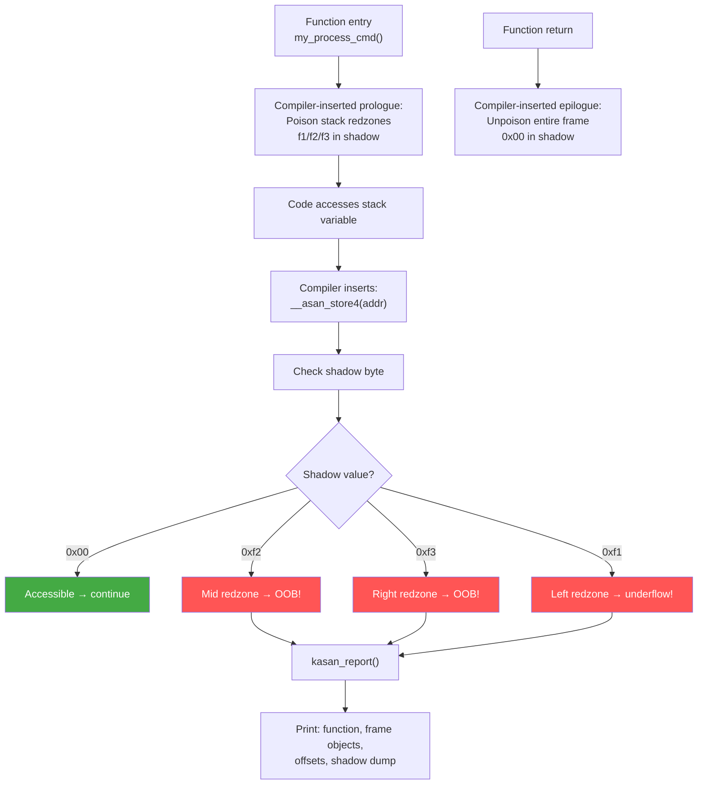

# Scenario 6: KASAN Stack Out-of-Bounds (stack-out-of-bounds)

## Symptom

```
[ 9012.678901] ==================================================================
[ 9012.678906] BUG: KASAN: stack-out-of-bounds in my_process_cmd+0xc4/0x180 [buggy_mod]
[ 9012.678914] Write of size 4 at addr ffff80001789bdf0 by task test_app/5678
[ 9012.678920]
[ 9012.678922] CPU: 3 PID: 5678 Comm: test_app Tainted: G           O      6.8.0 #1
[ 9012.678928] Call trace:
[ 9012.678930]  dump_backtrace+0x0/0x1e0
[ 9012.678934]  show_stack+0x20/0x30
[ 9012.678938]  dump_stack_lvl+0x60/0x80
[ 9012.678942]  print_report+0x174/0x500
[ 9012.678946]  kasan_report+0xac/0xe0
[ 9012.678950]  __asan_store4+0x78/0xa0
[ 9012.678954]  my_process_cmd+0xc4/0x180 [buggy_mod]
[ 9012.678959]  my_ioctl_handler+0x58/0xc0 [buggy_mod]
[ 9012.678964]  __arm64_sys_ioctl+0xa8/0xe0
[ 9012.678968]  invoke_syscall+0x50/0x120
[ 9012.678972]  el0t_64_sync+0x1a0/0x1a4
[ 9012.678978]
[ 9012.678980] addr ffff80001789bdf0 is located in stack of task test_app/5678 at offset 176 in frame:
[ 9012.678985]  my_process_cmd+0x0/0x180 [buggy_mod]
[ 9012.678990]
[ 9012.678992] this frame has 2 objects:
[ 9012.678994]  [32, 48) 'small_buf'        (size 16)
[ 9012.678998]  [96, 160) 'cmd_data'        (size 64)
[ 9012.679002]
[ 9012.679004] Memory state around the buggy address:
[ 9012.679007]  ffff80001789bd80: f1 f1 f1 f1 00 00 f2 f2 f2 f2 f2 f2 00 00 00 00
[ 9012.679011]  ffff80001789be00: 00 00 00 00 f3 f3 f3 f3 00 00 00 00 00 00 00 00
[ 9012.679015] >ffff80001789bde0: 00 00 f3 f3 f3 f3 00 00 00 00 00 00 00 00 00 00
[ 9012.679019]                       ^^
[ 9012.679021]  ffff80001789be60: 00 00 00 00 00 00 00 00 00 00 00 00 00 00 00 00
[ 9012.679025]  ffff80001789bee0: 00 00 00 00 00 00 00 00 00 00 00 00 00 00 00 00
[ 9012.679029] ==================================================================
```

### How to Recognize
- **`BUG: KASAN: stack-out-of-bounds`** — stack (not slab/heap)
- Reports the **stack frame** and **function** that owns the variable
- Lists **all objects in the frame** with their offsets and sizes
- Shadow memory uses **`f1`/`f2`/`f3`** markers (stack redzones)
- Address is on the **kernel stack** (`ffff8000...` in linear map)
- Requires `CONFIG_KASAN=y` **and** `CONFIG_KASAN_STACK=y`

---

## Background: Stack KASAN Instrumentation

### How Stack KASAN Works

```
Normal stack frame:
┌─────────────────────────────┐
│ return address / frame ptr  │
│ local_var_a  (16 bytes)     │
│ local_var_b  (64 bytes)     │
│ (padding)                   │
└─────────────────────────────┘

With KASAN stack instrumentation:
┌─────────────────────────────┐
│ Left redzone    (32 bytes)  │ shadow: f1 f1 f1 f1
│ local_var_a     (16 bytes)  │ shadow: 00 00
│ Mid redzone     (48 bytes)  │ shadow: f2 f2 f2 f2 f2 f2
│ local_var_b     (64 bytes)  │ shadow: 00 00 00 00 00 00 00 00
│ Right redzone   (32 bytes)  │ shadow: f3 f3 f3 f3
└─────────────────────────────┘

Redzones are POISONED in shadow memory:
- f1 = left redzone (before first variable)
- f2 = mid redzone (between variables)
- f3 = right redzone (after last variable)
- f8 = stack use after scope (variable out of scope)
```

### Compiler-Generated Prologue/Epilogue
```c
/* Original function: */
void my_process_cmd(struct my_device *dev, int cmd)
{
    char small_buf[16];
    struct cmd_data cmd_data;  // 64 bytes

    // ... use them ...
}

/* Compiler generates (conceptually): */
void my_process_cmd(struct my_device *dev, int cmd)
{
    // PROLOGUE: Poison redzones
    char __kasan_frame[32 + 16 + 48 + 64 + 32];
    //                  ^left ^var1 ^mid ^var2 ^right

    kasan_set_shadow(frame + 0,  32, 0xf1);  // left redzone
    kasan_set_shadow(frame + 32, 16, 0x00);  // small_buf accessible
    kasan_set_shadow(frame + 48, 48, 0xf2);  // mid redzone
    kasan_set_shadow(frame + 96, 64, 0x00);  // cmd_data accessible
    kasan_set_shadow(frame + 160, 32, 0xf3); // right redzone

    char *small_buf = frame + 32;
    struct cmd_data *cmd_data = frame + 96;

    // ... function body (every access checked) ...

    // EPILOGUE: Unpoison entire frame
    kasan_set_shadow(frame, sizeof(__kasan_frame), 0x00);
}
```

---

## Code Flow: Stack OOB Detection



---

## Common Causes

### 1. Buffer Overflow Between Stack Variables
```c
void my_process_cmd(struct my_device *dev, int cmd)
{
    char small_buf[16];
    struct cmd_data data;  // 64 bytes

    // BUG: writes 32 bytes into 16-byte buffer
    memcpy(small_buf, input_data, 32);
    // Bytes 16-31 overflow into mid redzone (f2)
    // → KASAN: stack-out-of-bounds
    // Without KASAN: overwrites cmd_data silently!
}
```

### 2. sprintf/snprintf Overflow
```c
void log_event(int type, const char *name)
{
    char buf[32];

    // name could be very long:
    sprintf(buf, "event_%d_%s_processed", type, name);
    // If name = "very_long_device_name_here"
    // → total string > 32 bytes → stack OOB
}
```

### 3. Array Index Out of Range on Stack Array
```c
void compute_table(int *indices, int count)
{
    int table[8];  // 32 bytes on stack

    for (int i = 0; i < count; i++) {
        // count from user input, not validated:
        table[indices[i]] = i;
        // If indices[i] >= 8 → stack OOB write!
    }
}
```

### 4. VLA (Variable Length Array) Miscalculation
```c
void process_items(int n_items)
{
    struct item items[n_items];  // VLA on stack
    // If n_items calculation is wrong → array too small

    for (int i = 0; i < actual_items; i++) {
        items[i] = parse_item(i);
        // If actual_items > n_items → OOB
    }
}
// NOTE: VLAs are discouraged in kernel (CONFIG_CC_NO_VLA)
```

### 5. Structure Copied to Undersized Stack Buffer
```c
void handle_request(struct big_request *req)
{
    struct small_header hdr;  // 16 bytes

    // BUG: copies entire request into header-sized buffer
    memcpy(&hdr, req, sizeof(*req));  // sizeof(*req) = 128!
    // → 112 bytes overflow past hdr → stack OOB
}
```

### 6. Use After Scope (f8 shadow)
```c
void my_func(int mode)
{
    int *ptr;

    if (mode == 1) {
        int local_var = 42;
        ptr = &local_var;
    }
    // local_var is now out of scope
    // With CONFIG_KASAN_STACK: shadow set to f8

    *ptr = 100;  // → stack-out-of-bounds (use after scope)
}
```

---

## Stack vs Slab KASAN: Comparison

| Aspect | Slab OOB | Stack OOB |
|--------|----------|-----------|
| Report type | `slab-out-of-bounds` | `stack-out-of-bounds` |
| Allocation trace | Shown (kmalloc caller) | N/A (compiler creates) |
| Frame info | N/A | Shows function + all objects |
| Shadow markers | `fc` (slab redzone) | `f1`/`f2`/`f3` (stack redzones) |
| Config required | `CONFIG_KASAN=y` | `CONFIG_KASAN=y` + `CONFIG_KASAN_STACK=y` |
| Overhead | Moderate | Higher (more instrumentation) |
| Freed marker | `fb` (use-after-free) | `f8` (use-after-scope) |
| Location | Heap (slab allocator) | Kernel stack (per-task) |

---

## Debugging Steps

### Step 1: Read the Frame Layout
```
this frame has 2 objects:
 [32, 48) 'small_buf'     (size 16)     ← offset 32-48 in frame
 [96, 160) 'cmd_data'     (size 64)     ← offset 96-160 in frame

addr is at offset 176 in frame
→ offset 176 is PAST cmd_data (which ends at 160)
→ 16 bytes past the last variable = right redzone (f3)
```

### Step 2: Identify the Overflowing Variable
```
If offset is between two objects → mid redzone overflow
  small_buf ends at 48, cmd_data starts at 96
  Access in [48, 96) → small_buf overflowed into mid redzone

If offset is past last object → right redzone overflow
  cmd_data ends at 160
  Access at 176 → cmd_data overflowed (or pointer past frame)

If offset is before first object → left redzone underflow
  small_buf starts at 32
  Access in [0, 32) → underflow before first variable
```

### Step 3: Check the Faulting Instruction
```
__asan_store4 → 4-byte WRITE that was caught

Look at the source code at my_process_cmd+0xc4:
  Which variable is being written to?
  Is it small_buf or cmd_data?
  What index/offset is being used?
```

### Step 4: Verify Buffer Sizes
```c
// Check: does the code assume a larger buffer than allocated?
// Common: struct definition changed but stack array size didn't

// Use objdump to see actual stack layout:
objdump -dS buggy_mod.ko | grep -A 50 "my_process_cmd"
// Look for SUB sp, sp, #N → total frame size
// Compare with expected size of local variables
```

### Step 5: Check for Implicit Stack Usage
```bash
# Kernel has limited stack size:
# ARM64: 16KB (THREAD_SIZE = 16384)
# Check stack usage per function:
objdump -d buggy_mod.ko | grep -B1 "sub.*sp.*sp"
# Or use compiler's -fstack-usage flag
```

---

## Stack Size Concerns on ARM64

```
ARM64 kernel stack: 16KB (4 pages)
                    ┌────────────────────┐ High address
                    │ thread_info        │
                    │ (at top of stack)  │
                    ├────────────────────┤
                    │                    │
                    │  Stack grows DOWN  │
                    │        ↓           │
                    │                    │
                    │  With KASAN:       │
                    │  redzones take     │
                    │  extra space!      │
                    │                    │
                    ├────────────────────┤
                    │ Stack guard page   │
                    │ (VMAP_STACK)       │
                    └────────────────────┘ Low address

KASAN redzones increase stack usage significantly:
- Each local variable gets 32-48 bytes of redzones
- Function with 5 local vars: ~200 extra bytes of redzones
- Deep call chains → stack overflow risk increases with KASAN
```

---

## Fixes

| Cause | Fix |
|-------|-----|
| Buffer overflow | Check size before memcpy/sprintf |
| sprintf overflow | Use snprintf with exact buffer size |
| Array index OOB | Validate index against array size |
| VLA miscalculation | Avoid VLAs; use fixed-size or kmalloc |
| Wrong memcpy size | Use sizeof(destination), not sizeof(source) |
| Use after scope | Don't take address of variables that go out of scope |

### Fix Example: Safe String Formatting
```c
/* BEFORE: unbounded sprintf */
void log_event(int type, const char *name)
{
    char buf[32];
    sprintf(buf, "event_%d_%s_processed", type, name);
}

/* AFTER: bounded snprintf */
void log_event(int type, const char *name)
{
    char buf[32];
    snprintf(buf, sizeof(buf), "event_%d_%s_processed", type, name);
    // Automatically truncates to 31 chars + NUL
}
```

### Fix Example: Safe memcpy with Size Check
```c
/* BEFORE: copies too much */
void handle_request(struct big_request *req)
{
    struct small_header hdr;
    memcpy(&hdr, req, sizeof(*req));  // Too big!
}

/* AFTER: copy only what fits */
void handle_request(struct big_request *req)
{
    struct small_header hdr;
    memcpy(&hdr, req, sizeof(hdr));  // sizeof(destination)!
}
```

### Fix Example: Move Large Buffers Off Stack
```c
/* BEFORE: large array on limited kernel stack */
void my_func(void)
{
    char big_buffer[4096];  // 4KB on 16KB stack = 25%!
    process(big_buffer, sizeof(big_buffer));
}

/* AFTER: allocate on heap */
void my_func(void)
{
    char *big_buffer = kmalloc(4096, GFP_KERNEL);
    if (!big_buffer)
        return;
    process(big_buffer, 4096);
    kfree(big_buffer);
}
```

---

## Quick Reference

| Item | Value |
|------|-------|
| Report header | `BUG: KASAN: stack-out-of-bounds` |
| Required config | `CONFIG_KASAN=y` + `CONFIG_KASAN_STACK=y` |
| Left redzone shadow | `0xf1` — before first variable |
| Mid redzone shadow | `0xf2` — between variables |
| Right redzone shadow | `0xf3` — after last variable |
| Use-after-scope shadow | `0xf8` — variable out of scope |
| ARM64 stack size | 16KB (`THREAD_SIZE`) |
| Stack guard | `CONFIG_VMAP_STACK=y` — guard page at bottom |
| Overhead | Significant — redzones consume extra stack space |
| Key info in report | Function name, all objects with offsets, offset of bad access |
| Avoid VLAs | `CONFIG_CC_NO_VLA=y` — compiler error on VLA use |
| Large buffers | Move to heap (`kmalloc`) if > 256 bytes |
