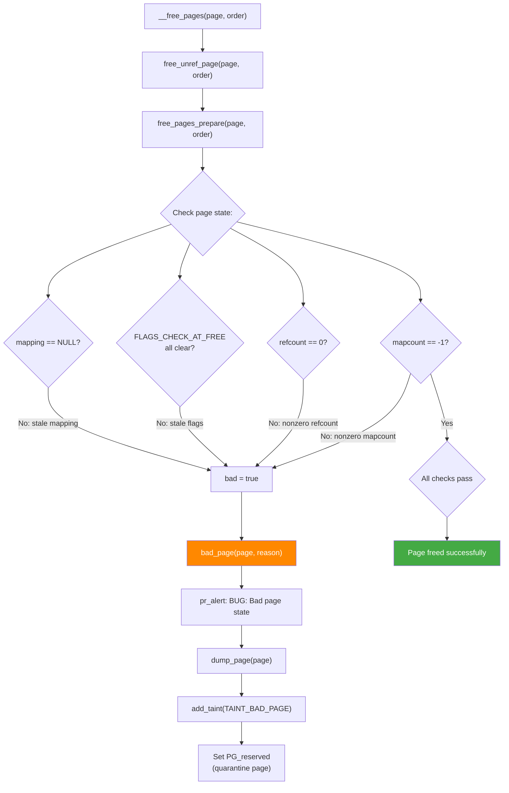

# Scenario 7: BUG: Bad Page State — Corrupted Page Flags

## Symptom

```
[ 1234.789012] BUG: Bad page state in process test_app  pfn:12345
[ 1234.789018] page:ffff7e000048d140 refcount:0 mapcount:-1 mapping:0000000000000000 index:0x0 pfn:0x12345
[ 1234.789026] flags: 0x4000000000000800(reserved|zone=1)
[ 1234.789032] raw: 4000000000000800 dead000000000100 dead000000000122 0000000000000000
[ 1234.789038] raw: 0000000000000000 0000000000000000 ffffffffffffffff 0000000000000000
[ 1234.789043] page dumped because: nonzero mapcount
[ 1234.789047] Modules linked in: buggy_mod(O) ext4 mbcache jbd2
[ 1234.789055] CPU: 2 PID: 6789 Comm: test_app Tainted: G    B      O      6.8.0 #1
[ 1234.789062] Call trace:
[ 1234.789064]  dump_backtrace+0x0/0x1e0
[ 1234.789068]  show_stack+0x20/0x30
[ 1234.789072]  dump_stack_lvl+0x60/0x80
[ 1234.789076]  bad_page+0x74/0x120
[ 1234.789080]  free_pages_prepare+0x1fc/0x340
[ 1234.789084]  free_unref_page+0x30/0xf0
[ 1234.789088]  __free_pages+0x40/0x60
[ 1234.789092]  my_release_buffer+0x48/0x80 [buggy_mod]
[ 1234.789097]  my_close+0x30/0x60 [buggy_mod]
[ 1234.789102]  __fput+0xdc/0x230
[ 1234.789106]  ____fput+0x14/0x20
[ 1234.789110]  task_work_run+0x6c/0xb0
[ 1234.789114]  do_exit+0x3b0/0x500
[ 1234.789118] Disabling lock debugging due to kernel taint
```

### How to Recognize
- **`BUG: Bad page state in process <name> pfn:<pfn>`**
- Prints **page struct fields**: refcount, mapcount, mapping, index, flags
- States **reason**: "nonzero mapcount", "PAGE_FLAGS_CHECK_AT_FREE", etc.
- Triggers from **`bad_page()`** function
- Adds **`B` taint flag** (bad page state detected)
- Usually occurs during page **freeing** (free_pages_prepare)

---

## Background: struct page and Page Flags

### struct page (simplified)
```c
// include/linux/mm_types.h
struct page {
    unsigned long flags;        // Page flags (PG_locked, PG_dirty, etc.)

    union {
        struct {
            // Used when page is in a mapping:
            struct list_head lru;       // LRU list linkage
            struct address_space *mapping; // Owner (file or anon)
            pgoff_t index;              // Offset within mapping
            unsigned long private;      // Filesystem-specific
        };
        struct {
            // Used for slab pages:
            struct kmem_cache *slab_cache;
            void *freelist;
            // ...
        };
        struct {
            // Used for compound (huge) pages:
            unsigned long compound_head;
            unsigned char compound_order;
            // ...
        };
    };

    atomic_t _refcount;         // Reference count
    atomic_t _mapcount;         // Number of PTEs mapping this page
    // ...
};
```

### Key Page Flags
```c
// include/linux/page-flags.h

PG_locked       // Page is locked (I/O in progress)
PG_referenced   // Recently accessed (LRU management)
PG_uptodate     // Page contents are valid
PG_dirty        // Page modified, needs writeback
PG_lru          // Page is on an LRU list
PG_active       // Page is on active LRU
PG_slab         // Page is used by slab allocator
PG_reserved     // Page is reserved (not for general allocation)
PG_private      // Page has private data
PG_writeback    // Page is being written back to disk
PG_head         // Head page of a compound page
PG_tail         // Tail page of a compound page
PG_swapbacked   // Page backed by swap
PG_mappedtodisk // Has blocks allocated on disk

// Flags checked at free time:
#define PAGE_FLAGS_CHECK_AT_FREE \
    (1UL << PG_lru   | 1UL << PG_locked  | 1UL << PG_private | \
     1UL << PG_active | 1UL << PG_dirty   | 1UL << PG_slab    | \
     1UL << PG_writeback | 1UL << PG_mlocked)
```

### Page State Invariants
```
When a page is FREED, these MUST be true:
├── refcount == 0 (or 1 → will be decremented)
├── mapcount == -1 (no PTE maps this page)
├── mapping == NULL (detached from file/anon mapping)
├── No LRU/locked/dirty/slab/writeback flags set
└── private == 0 (no filesystem metadata)

Violation of ANY of these → bad_page() → BUG: Bad page state
```

---

## Code Flow: Free → bad_page()



### free_pages_prepare() — The Gatekeeper
```c
// mm/page_alloc.c

static bool free_pages_prepare(struct page *page, unsigned int order)
{
    bool bad = false;

    // Check 1: mapcount must be -1 (unmapped)
    if (unlikely(page_mapcount(page) != 0)) {
        bad_page(page, "nonzero mapcount");
        bad = true;
    }

    // Check 2: refcount must be 0
    if (unlikely(page_ref_count(page) != 0)) {
        bad_page(page, "nonzero _refcount");
        bad = true;
    }

    // Check 3: certain flags must not be set
    if (unlikely(page->flags & PAGE_FLAGS_CHECK_AT_FREE)) {
        bad_page(page, "PAGE_FLAGS_CHECK_AT_FREE flag(s) set");
        bad = true;
    }

    // Check 4: mapping must be NULL
    if (unlikely(page->mapping != NULL)) {
        bad_page(page, "non-NULL mapping");
        bad = true;
    }

    if (bad)
        return false;  // Page quarantined, not actually freed

    // Page is clean → proceed with free
    page->flags &= ~PAGE_FLAGS_CHECK_AT_PREP;
    return true;
}
```

### bad_page() — The Reporter
```c
// mm/page_alloc.c

static void bad_page(struct page *page, const char *reason)
{
    static unsigned long resume;
    static unsigned long nr_shown;
    static unsigned long nr_unshown;

    // Rate limit: don't flood logs
    if (nr_shown < 60) {
        pr_alert("BUG: Bad page state in process %s  pfn:%05lx\n",
                 current->comm, page_to_pfn(page));
        dump_page(page, reason);
        dump_stack();
        nr_shown++;
    } else {
        nr_unshown++;
    }

    // Taint kernel
    add_taint(TAINT_BAD_PAGE, LOCKDEP_NOW_UNRELIABLE);

    // Quarantine: set PG_reserved so page is never reused
    __SetPageReserved(page);
    // This page is LEAKED — never returned to free pool
    // Better to leak a page than risk corrupting data
}
```

---

## Common Causes

### 1. Double Free of a Page
```c
struct page *page = alloc_page(GFP_KERNEL);

// First free: OK
__free_page(page);

// Second free: page is already freed
// → mapcount/refcount may be wrong → Bad page state
__free_page(page);
```

### 2. Freeing a Page That's Still Mapped
```c
struct page *page = alloc_page(GFP_KERNEL);
void *addr = page_address(page);

// Insert into process page tables via vm_insert_page or remap_pfn_range
vm_insert_page(vma, user_addr, page);
// Now mapcount > 0 (PTE exists)

// BUG: free page while it's still mapped
__free_page(page);
// → mapcount != -1 → Bad page state: "nonzero mapcount"
```

### 3. Freeing a Page with Active I/O
```c
struct page *page = alloc_page(GFP_KERNEL);

// Start async I/O:
SetPageLocked(page);
submit_bio(page);

// BUG: free before I/O completes
__free_page(page);
// → PG_locked is set → Bad page state: "PAGE_FLAGS_CHECK_AT_FREE"
```

### 4. Memory Corruption Overwrites page struct
```c
// page structs live in the memmap array (struct page[])
// If a buffer overflow corrupts a nearby page struct:

struct page *pages = pfn_to_page(some_pfn);
// Adjacent page struct metadata gets corrupted
// When that corrupted page is later freed → Bad page state

// Example: slab object overflows into page struct metadata
char *buf = kmalloc(32, GFP_KERNEL);
memset(buf, 0xFF, 128);  // Writes 96 bytes past allocation
// May corrupt page struct fields (flags, mapcount, etc.)
```

### 5. Incorrect Page Reference Counting
```c
struct page *page = alloc_page(GFP_KERNEL);
// refcount = 1

get_page(page);  // refcount = 2
get_page(page);  // refcount = 3

// Only do one put:
put_page(page);  // refcount = 2 → page NOT freed

// Later, try to free explicitly:
__free_page(page);  // refcount was 2, decremented to 1
                     // But still not 0 → "nonzero _refcount"
```

### 6. Freeing Page from Wrong Allocator
```c
// Page was allocated as part of a slab object (kmalloc)
void *obj = kmalloc(64, GFP_KERNEL);

// BUG: freeing the underlying page directly
struct page *page = virt_to_page(obj);
__free_page(page);
// → PG_slab flag is set → Bad page state
// Should use kfree(obj) instead
```

---

## Decoding the Page Dump

```
page:ffff7e000048d140 refcount:0 mapcount:-1 mapping:0000000000000000 index:0x0 pfn:0x12345
^^^^                  ^^^^^^^^^  ^^^^^^^^^^   ^^^^^^^^^^^^^^^^^^^^^^^^           ^^^^^^^^^^^^^
page struct address   ref count  PTE count    file/anon mapping                 physical frame#

flags: 0x4000000000000800(reserved|zone=1)
       ^^^^^^^^^^^^^^^^^^^^^^^^^^^^^^^^^^
       PG_reserved is set, zone = ZONE_NORMAL (1)

raw: 4000000000000800 dead000000000100 dead000000000122 0000000000000000
     ^flags           ^lru.next        ^lru.prev        ^mapping

     "dead" in lru pointers → LIST_POISON values
     → page was removed from a list (or was never on one)

raw: 0000000000000000 0000000000000000 ffffffffffffffff 0000000000000000
     ^index           ^private         ^_mapcount(-1)   ^_refcount(0)
```

### Common "reason" Strings
```
"nonzero mapcount"           → page still mapped in PTEs
"nonzero _refcount"          → someone still holds a reference
"PAGE_FLAGS_CHECK_AT_FREE"   → stale flags (locked/dirty/slab/etc.)
"non-NULL mapping"           → still associated with file/address_space
"non-NULL private"           → filesystem metadata not cleaned up
"corrupted page flags"       → flags have impossible combination
```

---

## Debugging Steps

### Step 1: Identify the Reason
```
page dumped because: nonzero mapcount
                     ^^^^^^^^^^^^^^^^^
This tells you WHY it's bad:
- "nonzero mapcount" → page still mapped, need to find who maps it
- "nonzero _refcount" → extra reference, need to find who holds it
- "PAGE_FLAGS_CHECK_AT_FREE" → which flags? Check the flags line
```

### Step 2: Check the Call Stack
```
free_pages_prepare+0x1fc/0x340
free_unref_page+0x30/0xf0
__free_pages+0x40/0x60
my_release_buffer+0x48/0x80 [buggy_mod]
                ^^^^^^^^^^^^^^^^^^^^^^
This shows WHO is freeing the page.
→ Look at my_release_buffer: is it freeing too early?
   Is the page still in use elsewhere?
```

### Step 3: Enable Page Owner Tracking
```bash
# Track who allocated each page:
CONFIG_PAGE_OWNER=y
# Boot with: page_owner=on

# After bug occurs, check allocation history:
cat /sys/kernel/debug/page_owner
# Shows allocation stack trace for every page

# In crash tool:
crash> page_owner <pfn>
```

### Step 4: Check for Double Free
```bash
CONFIG_DEBUG_PAGEALLOC=y
# Unmaps pages on free → immediate fault on use-after-free
# Detects double-free with poison pattern check

# Boot with:
debug_pagealloc=on
```

### Step 5: Check mapcount and refcount History
```bash
# With crash tool:
crash> struct page ffff7e000048d140
       # Shows all fields of the page struct

crash> page -f 0x12345
       # Shows page flags decoded

# Check: who has this page mapped?
crash> search -p ffff7e000048d140
       # Find PTEs pointing to this physical page
```

### Step 6: Look for Memory Corruption
```bash
# If flags are completely garbled:
CONFIG_KASAN=y               # Detect heap overflows
CONFIG_SLUB_DEBUG=y           # Red zones around slab objects
CONFIG_DEBUG_PAGE_REF=y       # Trace every get_page/put_page

# Check if nearby slab objects overflowed:
CONFIG_SLUB_DEBUG_ON=y
# Boot with: slub_debug=FZPU
# F = sanity checks
# Z = red zoning
# P = poisoning
# U = user tracking
```

---

## Page Quarantine

```
When bad_page() is triggered:
1. Page is marked PG_reserved
2. Page is NEVER returned to the free pool
3. Page is effectively LEAKED (memory lost permanently)

WHY: Reusing a corrupted page could:
- Corrupt file data
- Corrupt other process memory
- Cause cascading failures

Better to lose 4KB than risk data corruption.

Monitoring:
- Taint flag 'B' is set → visible in Oops, /proc/sys/kernel/tainted
- Counter: /proc/vmstat → nr_bad_pages (if available)
- If many pages are quarantined → system will eventually OOM
```

---

## Fixes

| Cause | Fix |
|-------|-----|
| Double free | Track free state; set pointer to NULL after free |
| Free while mapped | Unmap from all PTEs before freeing |
| Free during I/O | Wait for I/O completion; clear PG_locked |
| Memory corruption | Fix the buffer overflow (KASAN helps find it) |
| Refcount imbalance | Audit get_page/put_page pairs |
| Wrong allocator free | Match alloc/free: kmalloc→kfree, alloc_page→__free_page |

### Fix Example: Unmap Before Free
```c
/* BEFORE: free while still mapped */
void my_release(struct my_device *dev)
{
    __free_page(dev->shared_page);  // Still mapped in user VMA!
}

/* AFTER: unmap first, then free */
void my_release(struct my_device *dev)
{
    // Ensure page is unmapped from all user PTEs:
    unmap_mapping_range(dev->inode->i_mapping, 0, PAGE_SIZE, 1);

    // Now safe to free:
    if (page_mapcount(dev->shared_page) == 0)
        __free_page(dev->shared_page);
    else
        WARN(1, "page still mapped, leaking\n");
}
```

### Fix Example: Proper Reference Counting
```c
/* BEFORE: mismatched get/put */
void my_use_page(struct page *page) {
    get_page(page);
    process(page);
    // Forgot put_page → refcount leak
}

/* AFTER: balanced get/put */
void my_use_page(struct page *page) {
    get_page(page);
    process(page);
    put_page(page);  // Balance the get_page
}
```

---

## Quick Reference

| Item | Value |
|------|-------|
| Message | `BUG: Bad page state in process <name> pfn:<pfn>` |
| Function | `bad_page()` in `mm/page_alloc.c` |
| Caller | `free_pages_prepare()` — checks page before freeing |
| Taint flag | `B` (Bad page state) |
| Quarantine | Page marked `PG_reserved`, never reused |
| Checked at free | mapcount, refcount, flags, mapping, private |
| Expected state | mapcount=-1, refcount=0, no stale flags |
| Rate limit | First 60 occurrences printed, rest counted |
| Debug config | `CONFIG_DEBUG_PAGEALLOC=y`, `CONFIG_PAGE_OWNER=y` |
| Refcount debug | `CONFIG_DEBUG_PAGE_REF=y` — traces every get/put |
| SLUB debug | `slub_debug=FZPU` boot param |
