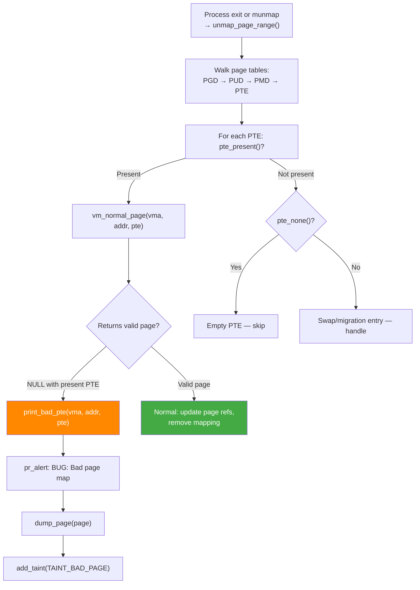

# Scenario 8: BUG: Bad Page Map — Corrupted Page Table Entries

## Symptom

```
[ 2345.890123] BUG: Bad page map in process test_app  pte:800000012345e747 pmd:0000000087654003
[ 2345.890130] page:ffff7e000048d178 refcount:2 mapcount:0 mapping:ffff0000a1b2c300 index:0x7f
[ 2345.890138] aops:ext4_da_aops [ext4] ino:12345 dentry name:"data.bin"
[ 2345.890145] flags: 0x4000000000020068(uptodate|lru|active|mappedtodisk|zone=1)
[ 2345.890152] addr:0000007f80100000 vm_flags:00100073 anon_vma:0000000000000000 mapping:ffff0000a1b2c300 index:7f
[ 2345.890160] file:/mnt/data/data.bin fault_type:0x0
[ 2345.890165] CPU: 1 PID: 7890 Comm: test_app Tainted: G           O      6.8.0 #1
[ 2345.890172] Call trace:
[ 2345.890174]  dump_backtrace+0x0/0x1e0
[ 2345.890178]  show_stack+0x20/0x30
[ 2345.890182]  dump_stack_lvl+0x60/0x80
[ 2345.890186]  print_bad_pte+0x1a0/0x1f0
[ 2345.890190]  vm_normal_page+0x80/0xc0
[ 2345.890194]  unmap_page_range+0x2c4/0x7a0
[ 2345.890198]  unmap_vmas+0x84/0x110
[ 2345.890202]  exit_mmap+0xa0/0x1c0
[ 2345.890206]  __mmput+0x4c/0x120
[ 2345.890210]  do_exit+0x324/0x500
[ 2345.890214]  do_group_exit+0x34/0x80
[ 2345.890218]  __arm64_sys_exit_group+0x1c/0x20
[ 2345.890222]  invoke_syscall+0x50/0x120
[ 2345.890226]  el0t_64_sync+0x1a0/0x1a4
```

### How to Recognize
- **`BUG: Bad page map in process <name>`** — specifically page TABLE issue
- Shows **PTE value** and **PMD value** in the header
- Prints page struct info + VMA info (file, flags, address range)
- Triggers from **`print_bad_pte()`** function
- Usually occurs during **munmap / exit_mmap / fork** (page table walks)
- Different from "Bad page state" — this is about PTE entries, not page struct

---

## Background: Bad Page Map vs Bad Page State

```
Bad Page STATE (Scenario 7):
  → page struct fields are wrong (mapcount, flags, etc.)
  → Detected during PAGE FREEING
  → Problem is with the struct page metadata

Bad Page MAP (this scenario):
  → Page Table Entry (PTE) is wrong/corrupt/inconsistent
  → Detected during PAGE TABLE WALKING (unmap, fork, etc.)
  → Problem is with the PTE pointing to the page

Example:
  PTE says "page is present and writable"
  But vm_normal_page() says "this PTE doesn't map a valid page"
  → Mismatch → Bad page map
```

### PTE Format (ARM64)
```
ARM64 PTE (Stage-1, 4KB pages):
┌──────────────────────────────────────────────────────────┐
│63   │54│53│52│51│50│ 49:12            │11:2      │1 │0  │
│nG/SW│PXN│UXN│CT│DBM│GP│ Output Address │AttrIndx  │AF│V  │
│     │   │   │  │   │  │ (bits 47:12)  │ AP/SH/AF │  │   │
└──────────────────────────────────────────────────────────┘

Valid PTE: bit[0] = 1, bits[1:0] = 0b11 (page descriptor)
           Output address = physical page frame

Invalid/corrupt PTE indicators:
- Valid bit = 1 but output address = 0 or garbage
- PFN points to non-existent physical memory
- PTE has reserved bits set
- PTE flags inconsistent with VMA flags
```

---

## Code Flow: PTE Validation



### vm_normal_page() — The Validator
```c
// mm/memory.c

struct page *vm_normal_page(struct vm_area_struct *vma,
                            unsigned long addr, pte_t pte)
{
    unsigned long pfn = pte_pfn(pte);

    // Special mappings (I/O, VM_PFNMAP) — not normal pages
    if (vma->vm_flags & (VM_PFNMAP | VM_MIXEDMAP)) {
        if (/* pfn in expected range */)
            return NULL;  // OK — special mapping
    }

    // Check: is this PFN valid physical memory?
    if (!pfn_valid(pfn)) {
        print_bad_pte(vma, addr, pte);  // BAD!
        return NULL;
    }

    // Everything looks good:
    return pfn_to_page(pfn);
}
```

### print_bad_pte()
```c
// mm/memory.c

static void print_bad_pte(struct vm_area_struct *vma,
                          unsigned long addr, pte_t pte,
                          struct page *page)
{
    pgd_t *pgd = pgd_offset(vma->vm_mm, addr);
    p4d_t *p4d = p4d_offset(pgd, addr);
    pud_t *pud = pud_offset(p4d, addr);
    pmd_t *pmd = pmd_offset(pud, addr);

    pr_alert("BUG: Bad page map in process %s  pte:%08llx pmd:%08llx\n",
             current->comm, (long long)pte_val(pte),
             (long long)pmd_val(*pmd));

    if (page)
        dump_page(page, "bad pte");

    // Print VMA info:
    pr_alert("addr:%px vm_flags:%08lx anon_vma:%px mapping:%px index:%lx\n",
             (void *)addr, vma->vm_flags, vma->anon_vma,
             vma->vm_file ? vma->vm_file->f_mapping : NULL,
             vma->vm_pgoff + ((addr - vma->vm_start) >> PAGE_SHIFT));

    if (vma->vm_file)
        pr_alert("file:%pD fault_type:%x\n", vma->vm_file, 0);

    dump_stack();
    add_taint(TAINT_BAD_PAGE, LOCKDEP_STILL_OK);
}
```

---

## Common Causes

### 1. PTE Corruption by Stray Write
```c
/* A buffer overflow corrupts a page table page: */
// Page table pages are regular pages in kernel memory
// If a nearby slab object overflows:

char *buf = kmalloc(64, GFP_KERNEL);
// If buf happens to be near a page table page in memory:
memset(buf, 0xFF, 256);  // Overflow!
// → Corrupts PTE entries in the adjacent page table page
// → Next page table walk finds garbled PTEs → Bad page map
```

### 2. Race Condition in Page Table Updates
```c
/* Two CPUs modify the same PTE without proper locking: */

// CPU 0:                        // CPU 1:
pte_t old = *ptep;               pte_t old = *ptep;
pte_t new = pte_mkdirty(old);    pte_t new = pte_mkwrite(old);
set_pte(ptep, new);              set_pte(ptep, new);
                                 // CPU 1 overwrites CPU 0's update
// → PTE may be in inconsistent state

// CORRECT: use pte_lock (spinlock in page table page)
spin_lock(pte_lockptr(mm, pmd));
// ... modify PTE ...
spin_unlock(pte_lockptr(mm, pmd));
```

### 3. PFN Points to Non-RAM Region
```c
/* remap_pfn_range used incorrectly: */
int my_mmap(struct file *file, struct vm_area_struct *vma)
{
    unsigned long pfn = 0xDEAD;  // Not valid physical RAM!

    // This creates PTEs pointing to non-existent memory:
    remap_pfn_range(vma, vma->vm_start, pfn, PAGE_SIZE,
                    vma->vm_page_prot);

    // If VM_PFNMAP is not set on the VMA:
    // → vm_normal_page tries pfn_to_page(0xDEAD)
    // → pfn_valid(0xDEAD) = false
    // → Bad page map!

    // MUST set: vma->vm_flags |= VM_PFNMAP;
    return 0;
}
```

### 4. Stale PTE After Page Migration
```c
/* Page migration moves physical page but misses a PTE: */
// Normally: migration code walks ALL PTEs mapping a page
// If a PTE is missed → it still points to old physical location
// Old location may be:
//   - Freed → PFN invalid or reused for different page
//   - Reused by slab → PFN valid but page type is wrong
// → vm_normal_page sees inconsistency → Bad page map
```

### 5. Hardware Error (ECC/Memory Bit Flip)
```
A bit flip in a page table page (stored in RAM):
- PTE output address changes → now points to wrong page
- PTE flags change → permission/type mismatch
- Single-bit ECC errors may be corrected silently
- Multi-bit errors → garbled PTE → Bad page map

Check: dmesg for MCE/EDAC errors
       /sys/devices/system/edac/mc/*/ce_count
```

### 6. DMA to Page Table Pages
```c
/* Incorrectly setting up DMA to kernel memory: */
// If DMA engine writes to page table pages
// (because of wrong DMA address or scatter-gather list):

dma_addr_t dma_addr = dma_map_single(dev, buf, len, DMA_FROM_DEVICE);
// If buf points to or near a page table page → DMA corrupts PTEs
// → Bad page map on next page table walk
```

---

## Decoding the PTE Value

```
pte:800000012345e747
    ^^^^^^^^^^^^^^^^

Binary: 1000 0000 0000 0000 0000 0001 0010 0011 0100 0101 1110 0111 0100 0111

Bit[0]  = 1 → Valid
Bit[1]  = 1 → Page descriptor (not block)
Bit[6]  = 1 → AP[1] = 1 → user accessible
Bit[7]  = 0 → AP[2] = 0 → read-write
Bit[10] = 1 → AF = 1 → accessed
Bits[47:12] = 0x12345e → PFN = 0x12345e

PFN 0x12345e → Physical address = 0x12345e000

Is PFN valid? Check against physical memory map
If no RAM at this address → pfn_valid() = false → Bad page map
```

---

## Debugging Steps

### Step 1: Analyze the PTE
```bash
# Decode the raw PTE value:
pte = 0x800000012345e747

# Extract PFN:
pfn = (pte >> 12) & 0xFFFFFFFFF  # bits 47:12

# Check if PFN is valid:
crash> kmem -p <pfn>
# If no output → PFN doesn't correspond to valid RAM

# Or check memblock:
crash> memblock
# Compare PFN against physical memory ranges
```

### Step 2: Check the VMA
```
addr:0000007f80100000 vm_flags:00100073
     ^^^^^^^^^^^^^^^^          ^^^^^^^^
     User virtual address      Decode flags:
                               VM_READ | VM_WRITE | VM_EXEC (0x7)
                               VM_MAYREAD|WRITE|EXEC (0x70)
                               VM_DENYWRITE (0x100000)? (file mapping)

file:/mnt/data/data.bin
     ^^^^^^^^^^^^^^^^^^
     This is a file-backed mapping (mmap of a file)

If vm_flags has VM_PFNMAP → PTEs are expected to be "special"
If NOT VM_PFNMAP → PTEs must point to valid struct page → else bad
```

### Step 3: Check for Memory Corruption
```bash
# Enable page table integrity checks:
CONFIG_DEBUG_VM_PGTABLE=y     # Page table self-tests at boot

# Enable PTE debugging:
CONFIG_PTDUMP=y               # /sys/kernel/debug/kernel_page_tables
CONFIG_GENERIC_PTDUMP=y

# Check for slab corruption near page table pages:
CONFIG_SLUB_DEBUG=y
# slub_debug=FZPU
```

### Step 4: Timing — When Did It Break?
```bash
# The corruption may have happened long before detection:
# Bad page map is only noticed when PTEs are WALKED (unmap, fork, etc.)

# Timeline:
# 1. PTE corrupted (by buffer overflow, DMA, hw error)
# 2. ... time passes (maybe minutes/hours) ...
# 3. Process exits → exit_mmap → unmap_page_range
# 4. Walks PTEs → finds corrupt PTE → Bad page map

# To catch corruption earlier:
# Enable periodic PTE validation (not a standard feature)
# Use CONFIG_DEBUG_PAGEALLOC and frequent memory pressure
```

### Step 5: Check Hardware
```bash
# If you see Bad page map with no obvious software cause:
# Check for hardware memory errors:

dmesg | grep -i "edac\|mce\|hardware error\|corrected error"
cat /sys/devices/system/edac/mc/*/ce_count   # Corrected errors
cat /sys/devices/system/edac/mc/*/ue_count   # Uncorrected errors

# Run memory test:
memtester 1G 5    # Userspace memory test
# Or boot with memtest86+
```

---

## Fixes

| Cause | Fix |
|-------|-----|
| PTE corruption | Fix buffer overflow that corrupted PT page |
| Missing VM_PFNMAP | Set `VM_PFNMAP` in mmap handler for I/O mappings |
| Race in PTE update | Use proper PTE locking (`pte_lockptr`) |
| Invalid PFN | Validate PFN before creating mapping |
| Hardware error | Replace faulty RAM; enable ECC |
| DMA corruption | Fix DMA mapping; use IOMMU |

### Fix Example: Set VM_PFNMAP for I/O Mappings
```c
/* BEFORE: remap_pfn_range without VM_PFNMAP */
int my_mmap(struct file *file, struct vm_area_struct *vma)
{
    return remap_pfn_range(vma, vma->vm_start, io_pfn,
                           vma->vm_end - vma->vm_start,
                           vma->vm_page_prot);
    // → vm_normal_page won't recognize these PTEs → Bad page map
}

/* AFTER: mark VMA as PFN mapping */
int my_mmap(struct file *file, struct vm_area_struct *vma)
{
    vm_flags_set(vma, VM_IO | VM_PFNMAP | VM_DONTEXPAND);
    vma->vm_page_prot = pgprot_noncached(vma->vm_page_prot);

    return remap_pfn_range(vma, vma->vm_start, io_pfn,
                           vma->vm_end - vma->vm_start,
                           vma->vm_page_prot);
}
```

### Fix Example: Validate PFN Before Mapping
```c
/* BEFORE: no PFN validation */
int map_user_page(struct vm_area_struct *vma, unsigned long pfn)
{
    return remap_pfn_range(vma, vma->vm_start, pfn, PAGE_SIZE,
                           vma->vm_page_prot);
}

/* AFTER: validate PFN first */
int map_user_page(struct vm_area_struct *vma, unsigned long pfn)
{
    if (!pfn_valid(pfn)) {
        pr_err("invalid pfn %lx\n", pfn);
        return -EINVAL;
    }

    struct page *page = pfn_to_page(pfn);
    return vm_insert_page(vma, vma->vm_start, page);
    // vm_insert_page handles refcounting properly
}
```

---

## Quick Reference

| Item | Value |
|------|-------|
| Message | `BUG: Bad page map in process <name>` |
| Function | `print_bad_pte()` in `mm/memory.c` |
| Validator | `vm_normal_page()` — checks PTE → page validity |
| Trigger | Page table walk during unmap/fork/exit |
| Taint flag | `B` (Bad page state) |
| Key check | `pfn_valid(pte_pfn(pte))` — is PFN real RAM? |
| VM_PFNMAP | Flag for I/O mappings — skips vm_normal_page validation |
| PTE extraction | `pfn = (pte >> 12) & 0xFFFFFFFFF` (bits 47:12) |
| Debug config | `CONFIG_DEBUG_VM_PGTABLE=y` |
| Common cause | Buffer overflow corrupting page table page |
| Hardware cause | ECC error in RAM holding page table |
| vs Bad Page State | Map = PTE problem, State = page struct problem |
