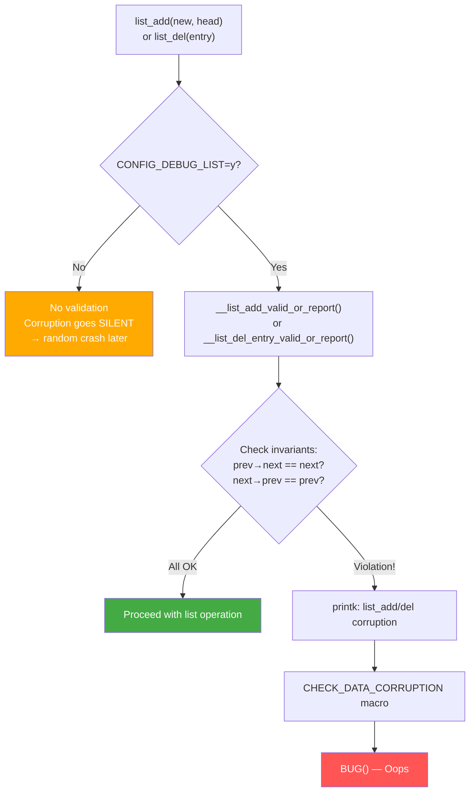

# Scenario 9: List Corruption — list_add / list_del Corruption Detected

## Symptom

```
[ 3456.901234] list_add corruption. prev->next should be next (ffff00001234a008), but was ffff00001234b110. (prev=ffff00001234c220).
[ 3456.901242] ------------[ cut here ]------------
[ 3456.901245] kernel BUG at lib/list_debug.c:33!
[ 3456.901250] Internal error: Oops - BUG: 00000000f2000800 [#1] PREEMPT SMP
[ 3456.901256] Modules linked in: buggy_mod(O) xfs dm_crypt
[ 3456.901263] CPU: 0 PID: 8901 Comm: worker_thread Tainted: G           O      6.8.0 #1
[ 3456.901270] pc : __list_add_valid_or_report+0x4c/0xb0
[ 3456.901276] lr : __list_add_valid_or_report+0x4c/0xb0
[ 3456.901282] Call trace:
[ 3456.901284]  __list_add_valid_or_report+0x4c/0xb0
[ 3456.901288]  my_enqueue_work+0x58/0xa0 [buggy_mod]
[ 3456.901293]  my_submit_request+0x84/0x100 [buggy_mod]
[ 3456.901298]  my_ioctl_handler+0x6c/0xc0 [buggy_mod]
[ 3456.901303]  __arm64_sys_ioctl+0xa8/0xe0
[ 3456.901307]  invoke_syscall+0x50/0x120
[ 3456.901311]  el0t_64_sync+0x1a0/0x1a4
[ 3456.901315] Code: ... (d4210000)
[ 3456.901320]                       BRK #0x800 (BUG)
[ 3456.901324] ---[ end trace 0000000000000000 ]---
```

### Other Variants
```
list_add corruption. next->prev should be prev (X), but was Y. (next=Z).
list_del corruption, ffff00001234a008->next is LIST_POISON1 (dead000000000100)
list_del corruption. prev->next should be ffff00001234a008, but was ffff00001234b110
```

### How to Recognize
- **`list_add corruption`** or **`list_del corruption`** in message
- **`kernel BUG at lib/list_debug.c`** — assertion in list debug code
- Shows the **three pointers** involved (new entry, prev, next)
- Requires `CONFIG_DEBUG_LIST=y` (otherwise corruption goes undetected)
- BRK #0x800 (BUG instruction) — same as Scenario 2, but in list code

---

## Background: Linux Linked Lists

### struct list_head
```c
// include/linux/list.h

struct list_head {
    struct list_head *next;
    struct list_head *prev;
};

// Circular doubly-linked list:
//
//     ┌──────────┐     ┌──────────┐     ┌──────────┐
//     │   HEAD   │────→│  Node A  │────→│  Node B  │────→ (back to HEAD)
//     │          │←────│          │←────│          │←────
//     └──────────┘     └──────────┘     └──────────┘
//
// Invariant: node->next->prev == node
// Invariant: node->prev->next == node
// If either invariant is violated → list is CORRUPT
```

### Normal list_add
```c
// Add 'new' between 'prev' and 'next':
static inline void __list_add(struct list_head *new,
                               struct list_head *prev,
                               struct list_head *next)
{
    next->prev = new;
    new->next = next;
    new->prev = prev;
    WRITE_ONCE(prev->next, new);
}

// Result:
//   prev ──→ new ──→ next
//   prev ←── new ←── next
```

### Debug-Enabled Validation
```c
// lib/list_debug.c (CONFIG_DEBUG_LIST=y)

bool __list_add_valid_or_report(struct list_head *new,
                                struct list_head *prev,
                                struct list_head *next)
{
    // Check 1: next->prev should point to prev (intact chain)
    if (CHECK_DATA_CORRUPTION(next->prev != prev,
            "list_add corruption. next->prev should be prev (%px), "
            "but was %px. (next=%px).\n",
            prev, next->prev, next))
        return false;

    // Check 2: prev->next should point to next (intact chain)
    if (CHECK_DATA_CORRUPTION(prev->next != next,
            "list_add corruption. prev->next should be next (%px), "
            "but was %px. (prev=%px).\n",
            next, prev->next, prev))
        return false;

    // Check 3: new should not already be in a list
    if (CHECK_DATA_CORRUPTION(new == prev || new == next,
            "list_add double add: new=%px, prev=%px, next=%px.\n",
            new, prev, next))
        return false;

    return true;
}

bool __list_del_entry_valid_or_report(struct list_head *entry)
{
    struct list_head *prev = entry->prev;
    struct list_head *next = entry->next;

    // Check 1: not already removed (LIST_POISON)
    if (CHECK_DATA_CORRUPTION(next == LIST_POISON1,
            "list_del corruption, %px->next is LIST_POISON1\n", entry))
        return false;

    // Check 2: prev->next should be entry
    if (CHECK_DATA_CORRUPTION(prev->next != entry,
            "list_del corruption. prev->next should be %px, "
            "but was %px.\n", entry, prev->next))
        return false;

    // Check 3: next->prev should be entry
    if (CHECK_DATA_CORRUPTION(next->prev != entry,
            "list_del corruption. next->prev should be %px, "
            "but was %px.\n", entry, next->prev))
        return false;

    return true;
}
```

---

## Code Flow: List Corruption Detection



### LIST_POISON Values
```c
// include/linux/poison.h

#define LIST_POISON1  ((void *) 0x100 + POISON_POINTER_DELTA)
#define LIST_POISON2  ((void *) 0x200 + POISON_POINTER_DELTA)

// ARM64: POISON_POINTER_DELTA = dead000000000000
// LIST_POISON1 = 0xdead000000000100
// LIST_POISON2 = 0xdead000000000200

// After list_del(), entry's pointers are set to POISON:
static inline void list_del(struct list_head *entry)
{
    __list_del_entry(entry);
    entry->next = LIST_POISON1;  // 0xdead000000000100
    entry->prev = LIST_POISON2;  // 0xdead000000000200
}

// If list_del is called again on same entry:
// entry->next == LIST_POISON1 → "list_del corruption, ->next is LIST_POISON1"
```

---

## Common Causes

### 1. Concurrent List Access Without Locking
```c
static LIST_HEAD(my_work_queue);
// NO LOCK protecting the list!

// Thread A:
void add_work(struct work_item *item) {
    list_add_tail(&item->list, &my_work_queue);  // No lock!
}

// Thread B:
void process_work(void) {
    struct work_item *item;
    list_for_each_entry(item, &my_work_queue, list) {
        list_del(&item->list);  // No lock!
        process(item);
    }
}

// Race: Thread A inserts while Thread B deletes
// → list pointers become inconsistent → corruption
```

### 2. Double list_del (Use-After-Free on List Entry)
```c
void remove_item(struct my_item *item) {
    list_del(&item->list);  // First removal: OK
}

// Called again by another code path:
void cleanup_item(struct my_item *item) {
    list_del(&item->list);  // SECOND removal!
    // → entry->next == LIST_POISON1
    // → "list_del corruption, ->next is LIST_POISON1"
}
```

### 3. list_add on Already-Listed Entry
```c
struct my_item *item = kmalloc(sizeof(*item), GFP_KERNEL);
INIT_LIST_HEAD(&item->list);

list_add(&item->list, &my_list);  // Added to my_list

// BUG: add to ANOTHER list without removing from first:
list_add(&item->list, &other_list);
// → list_add double add: item is already in my_list
// → corrupts my_list (prev/next bypass item)
```

### 4. Memory Corruption Overwriting list_head
```c
struct my_item {
    char name[16];
    struct list_head list;  // At offset 16
    int value;
};

struct my_item *item = kmalloc(sizeof(*item), GFP_KERNEL);
list_add(&item->list, &my_list);

// Buffer overflow in name:
strcpy(item->name, "this_is_way_too_long_for_16_bytes");
// Overflows into list.next and list.prev!
// → next list operation finds garbled pointers → corruption
```

### 5. Use-After-Free: List Entry in Freed Memory
```c
struct my_item *item = kmalloc(sizeof(*item), GFP_KERNEL);
list_add(&item->list, &my_list);

kfree(item);  // Freed but NOT removed from list!

// Later: iterate the list:
struct my_item *pos;
list_for_each_entry(pos, &my_list, list) {
    // pos points to freed memory
    // pos->list.next may be slab poison (0x6b6b6b6b...)
    // → corruption on next iteration
}
```

### 6. Uninitialized list_head
```c
struct my_item *item = kmalloc(sizeof(*item), GFP_KERNEL);
// FORGOT: INIT_LIST_HEAD(&item->list);
// item->list.next and .prev contain garbage

list_add(&item->list, &my_list);
// __list_add_valid checks: is new == prev or new == next?
// May pass or fail depending on garbage values
// Even if it passes: list is now corrupt
```

---

## Debugging Steps

### Step 1: Decode the Error Message
```
list_add corruption. prev->next should be next (ffff00001234a008),
                     but was ffff00001234b110. (prev=ffff00001234c220).

Translation:
  We're adding a new entry between prev and next.
  prev = ffff00001234c220
  Expected: prev->next = ffff00001234a008 (next)
  Actual:   prev->next = ffff00001234b110 (something else!)

  → The link between prev and next is BROKEN
  → Something modified prev->next without proper list operation
  → Could be: concurrent access, memory corruption, or stale pointer
```

### Step 2: Identify the Objects
```bash
# In crash tool, identify what each address belongs to:
crash> kmem ffff00001234c220
# Shows: which slab cache/object this address is in
# → identifies the "prev" object type

crash> kmem ffff00001234b110
# Shows: what "prev->next" actually points to
# → may be a freed object, wrong type, or corruption

crash> struct list_head ffff00001234c220
# Shows: next and prev pointer values
```

### Step 3: Check for Locking
```c
// Look at the code adding/removing from the list:
// my_enqueue_work+0x58 — is there a lock?

void my_enqueue_work(struct my_work *work) {
    // Is there a spin_lock/mutex_lock before list_add?
    // If not → concurrent access is likely the cause

    spin_lock(&my_lock);         // MUST protect list
    list_add_tail(&work->list, &work_queue);
    spin_unlock(&my_lock);
}
```

### Step 4: Enable List Debugging
```bash
CONFIG_DEBUG_LIST=y          # Validates list operations
CONFIG_BUG_ON_DATA_CORRUPTION=y  # BUG instead of WARN

# Without CONFIG_DEBUG_LIST:
# - list corruption goes UNDETECTED
# - Results in random crashes later (NULL deref, infinite loop, etc.)
# - Much harder to debug
```

### Step 5: Check for Use-After-Free
```bash
CONFIG_KASAN=y              # Detect use-after-free
CONFIG_SLUB_DEBUG=y          # Poison freed memory

# SLUB poisoning:
# After kfree(): memory filled with 0x6b
# If list pointers = 0x6b6b6b6b6b6b6b6b → use-after-free!

# Boot with:
slub_debug=P    # Poison on free
```

### Step 6: Trace List Operations
```bash
# If you can reproduce, add debug tracing:
# In your module:
#define MY_LIST_ADD(new, head) do { \
    pr_debug("list_add %px to %px at %s:%d\n", \
             new, head, __FILE__, __LINE__); \
    list_add(new, head); \
} while (0)
```

---

## List Corruption Without CONFIG_DEBUG_LIST

```
Without CONFIG_DEBUG_LIST:
- No validation on list_add/list_del
- Corrupted lists cause DIFFERENT symptoms:

1. Infinite loop in list_for_each:
   → If corruption creates a cycle
   → Soft lockup or RCU stall

2. NULL pointer dereference:
   → If next/prev is NULL (freed/zeroed memory)
   → Oops at random location

3. Wild pointer dereference:
   → If next/prev points to wrong memory
   → Random crash, data corruption

4. Silent data loss:
   → Items dropped from list without trace
   → No crash, but functionality broken

CONFIG_DEBUG_LIST catches corruption AT THE POINT OF OCCURRENCE
rather than at some random later crash. Always enable it in debug builds.
```

---

## Fixes

| Cause | Fix |
|-------|-----|
| No locking | Protect list with spinlock or mutex |
| Double list_del | Use `list_del_init()` — safe to call twice |
| Add without remove | `list_del()` from old list before `list_add()` to new |
| Use-after-free | Remove from list BEFORE kfree |
| Uninitialized | Always `INIT_LIST_HEAD()` or use `LIST_HEAD_INIT()` |
| Buffer overflow | Fix overflow; add padding/bounds checks |

### Fix Example: Safe Deletion with list_del_init
```c
/* BEFORE: double-del crashes */
void remove_item(struct my_item *item) {
    list_del(&item->list);  // Pointers set to LIST_POISON
}
// If called again → BUG (LIST_POISON detected)

/* AFTER: list_del_init is idempotent */
void remove_item(struct my_item *item) {
    list_del_init(&item->list);  // Pointers set to SELF
    // list_del_init: entry->next = entry; entry->prev = entry;
    // If called again → safe (removes from "list of 1" = no-op)
}
```

### Fix Example: Proper Locking
```c
/* BEFORE: no lock */
void add_work(struct work_item *item) {
    list_add_tail(&item->list, &work_queue);
}

void drain_work(void) {
    struct work_item *item, *tmp;
    list_for_each_entry_safe(item, tmp, &work_queue, list) {
        list_del(&item->list);
        process(item);
    }
}

/* AFTER: spinlock protection */
static DEFINE_SPINLOCK(work_lock);

void add_work(struct work_item *item) {
    unsigned long flags;
    spin_lock_irqsave(&work_lock, flags);
    list_add_tail(&item->list, &work_queue);
    spin_unlock_irqrestore(&work_lock, flags);
}

void drain_work(void) {
    struct work_item *item, *tmp;
    unsigned long flags;
    spin_lock_irqsave(&work_lock, flags);
    list_for_each_entry_safe(item, tmp, &work_queue, list) {
        list_del_init(&item->list);
        spin_unlock_irqrestore(&work_lock, flags);
        process(item);  // Don't hold lock during processing
        spin_lock_irqsave(&work_lock, flags);
    }
    spin_unlock_irqrestore(&work_lock, flags);
}
```

### Fix Example: Remove From List Before Free
```c
/* BEFORE: free without removing → use-after-free on list */
void destroy_item(struct my_item *item) {
    kfree(item);  // list entry freed but still in list!
}

/* AFTER: remove then free */
void destroy_item(struct my_item *item) {
    spin_lock(&my_lock);
    list_del_init(&item->list);  // Remove from list first
    spin_unlock(&my_lock);
    kfree(item);                 // Now safe to free
}
```

---

## Quick Reference

| Item | Value |
|------|-------|
| Message | `list_add corruption` or `list_del corruption` |
| Source | `lib/list_debug.c` |
| BUG at | `__list_add_valid_or_report()` or `__list_del_entry_valid_or_report()` |
| Required config | `CONFIG_DEBUG_LIST=y` |
| LIST_POISON1 | `0xdead000000000100` (ARM64) |
| LIST_POISON2 | `0xdead000000000200` (ARM64) |
| Key invariant | `node->next->prev == node` AND `node->prev->next == node` |
| Safe delete | `list_del_init()` — idempotent, safe to call twice |
| SLUB poison | `0x6b` pattern in freed memory |
| Common cause #1 | Missing lock on concurrent list access |
| Common cause #2 | Use-after-free (kfree before list_del) |
| Without DEBUG_LIST | Corruption causes random later crash instead of immediate BUG |
